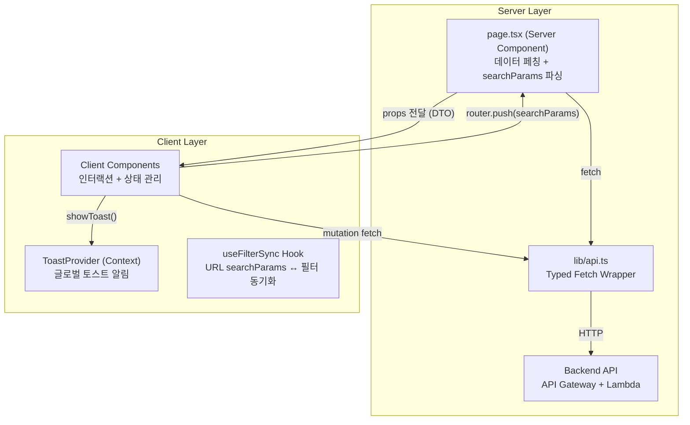
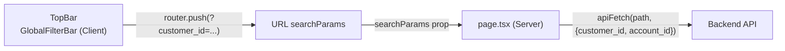

# 설계 문서: Alarm Manager 프론트엔드 기능 구현

## 개요

현재 Alarm Manager 프론트엔드는 5개 페이지(Dashboard, Resources, Resource Detail, Alarms, Settings)의 UI가 mock 데이터 기반으로 구현되어 있다. 이 설계 문서는 mock 데이터를 실제 백엔드 API로 교체하고, 글로벌 필터 연동, 서버사이드 페이지네이션, 벌크 액션, 토스트 알림, 에러/로딩 상태 등 17개 요구사항의 세부 기능을 구현하기 위한 기술 설계를 정의한다.

핵심 설계 원칙:
- Next.js App Router의 Server Component 우선 전략 (steering rules 준수)
- `'use client'` 경계를 leaf 노드로 밀어내기
- 파일 200줄 제한 준수 — 큰 컴포넌트는 역할별 분리
- TDD (Red → Green → Refactor) 사이클 준수
- URL searchParams 기반 상태 관리로 SSR 친화적 필터링

## 아키텍처

### 데이터 흐름 아키텍처



### Server/Client Component 분리 전략

각 페이지는 다음 패턴을 따른다:

```
app/{page}/page.tsx          — Server Component (데이터 페칭, searchParams 파싱)
  └─ components/{page}/      — Client Components (인터랙션)
       ├─ {Page}Content.tsx  — 페이지 메인 클라이언트 컴포넌트
       ├─ {Feature}Table.tsx — 테이블 (정렬, 선택, 페이지네이션)
       └─ {Feature}Modal.tsx — 모달 (벌크 액션, 폼)
```

| 페이지 | Server Component 역할 | Client Component 역할 |
|--------|----------------------|----------------------|
| Dashboard | 통계 + 최근 알람 fetch → props 전달 | 검색, 새로고침 버튼 |
| Resources | 리소스 목록 fetch (필터/페이지네이션) → props 전달 | 체크박스 선택, 벌크 액션 모달, 토글, 정렬 |
| Resource Detail | 리소스 메타 + 알람 설정 + 이벤트 fetch → props 전달 | 임계치 편집, 저장, 커스텀 메트릭 추가 |
| Alarms | 알람 목록 fetch (필터/페이지네이션) → props 전달 | 필터 탭, 검색, 페이지네이션 |
| Settings | 고객사/어카운트/임계치 fetch → props 전달 | CRUD 폼, 연결 테스트, 탭 전환 |

### 설계 결정 근거

| 결정 | 근거 |
|------|------|
| URL searchParams 기반 필터 | SSR 호환, 북마크/공유 가능, Server Component에서 직접 파싱 가능. Context 대비 새로고침 시 상태 유지 |
| Server Component에서 데이터 페칭 | Next.js steering rule 3-1 준수. API Route 불필요, 직접 백엔드 호출 |
| Client Component에서 mutation | 토글, 저장, 벌크 액션 등 사용자 인터랙션 후 API 호출은 Client Component에서 직접 수행 |
| ToastProvider (React Context) | 어떤 컴포넌트에서든 `useToast()` 호출로 토스트 트리거. layout.tsx에 Provider 배치 |
| fast-check (PBT) | 이미 devDependencies에 설치됨. TypeScript 네이티브 지원 |


## 컴포넌트 및 인터페이스

### API 클라이언트 모듈 (`lib/api.ts`)

typed fetch wrapper로 모든 백엔드 API 호출을 중앙 관리한다.

```typescript
// lib/api.ts — 핵심 구조
const API_BASE_URL = process.env.NEXT_PUBLIC_API_BASE_URL ?? "http://localhost:8000";

interface ApiError {
  status: number;
  code: string;
  message: string;
}

interface ApiResult<T> {
  data: T | null;
  error: ApiError | null;
}

// 서버 사이드 fetch (Server Component용)
async function apiFetch<T>(path: string, options?: RequestInit): Promise<T>

// 글로벌 필터 파라미터 자동 주입
function buildFilterParams(filters: GlobalFilterParams): URLSearchParams

// 페이지네이션 응답 타입
interface PaginatedResponse<T> {
  items: T[];
  total: number;
  page: number;
  page_size: number;
}
```

API 클라이언트 설계 원칙:
- `apiFetch<T>()`: 제네릭 타입으로 응답 타입 안전성 보장
- HTTP 에러 시 `ApiError` 객체를 throw (status, code, message 포함)
- `NEXT_PUBLIC_API_BASE_URL` 환경 변수로 base URL 설정
- Server Component에서는 직접 호출, Client Component에서는 Route Handler 또는 직접 호출

### 글로벌 필터 시스템

URL searchParams 기반으로 구현하여 SSR과 호환한다.

```
URL 구조: /resources?customer_id=acme&account_id=123&service=EC2&page=1&page_size=25&sort=name&order=asc
```



GlobalFilterBar 컴포넌트 (`components/layout/GlobalFilterBar.tsx`):
- 3개 캐스케이딩 드롭다운: Customer → Account → Service
- Customer 선택 시 Account 목록을 해당 Customer 소속으로 필터링
- 선택 변경 시 `router.push()` 로 URL searchParams 업데이트
- 초기 렌더링 시 백엔드에서 Customer/Account 목록 fetch

### 공통 UI 컴포넌트

| 컴포넌트 | 경로 | 역할 |
|----------|------|------|
| `Skeleton` | `components/shared/Skeleton.tsx` | 로딩 플레이스홀더 (카드, 테이블 행, 텍스트 변형) |
| `ErrorPanel` | `components/shared/ErrorPanel.tsx` | 인라인 에러 메시지 + Retry 버튼 |
| `Toast` / `ToastProvider` | `components/shared/Toast.tsx` | 토스트 알림 (success/error/warning/info) |
| `Pagination` | `components/shared/Pagination.tsx` | 서버사이드 페이지네이션 컨트롤 |
| `LoadingButton` | `components/shared/LoadingButton.tsx` | mutation 중 스피너 표시 + disabled |
| `ConfirmDialog` | `components/shared/ConfirmDialog.tsx` | 삭제 등 위험 액션 확인 모달 |
| `SeverityBadge` | `components/shared/SeverityBadge.tsx` | SEV-1~SEV-5 아웃라인 뱃지 |
| `SourceBadge` | `components/shared/SourceBadge.tsx` | System/Customer/Custom 출처 뱃지 |

### 페이지별 컴포넌트 구조

#### Dashboard (`app/dashboard/`)

```
page.tsx (Server) — fetchDashboardStats() + fetchRecentAlarms()
  ├─ components/dashboard/DashboardContent.tsx (Client) — 새로고침 버튼
  ├─ components/dashboard/StatCardGrid.tsx — 통계 카드 4개
  └─ components/dashboard/RecentAlarmsTable.tsx (Client) — 검색, 페이지네이션
```

#### Resources (`app/resources/`)

```
page.tsx (Server) — fetchResources(searchParams)
  ├─ components/resources/ResourcesContent.tsx (Client) — 필터, 검색, 정렬 상태
  ├─ components/resources/ResourceTable.tsx (Client) — 체크박스, 토글, 행 클릭
  ├─ components/resources/BulkActionBar.tsx (Client) — 선택 카운트, Enable/Disable 버튼
  ├─ components/resources/EnableModal.tsx (Client) — 메트릭 설정 + 커스텀 메트릭
  └─ components/resources/DisableModal.tsx (Client) — 비활성화 확인
```

#### Resource Detail (`app/resources/[id]/`)

```
page.tsx (Server) — fetchResource(id) + fetchAlarmConfigs(id) + fetchEvents(id)
  ├─ components/resources/ResourceHeader.tsx — 메타데이터 표시
  ├─ components/resources/AlarmConfigTable.tsx (Client) — 임계치 편집, 토글
  ├─ components/resources/CustomMetricForm.tsx (Client) — 커스텀 메트릭 추가
  └─ components/resources/ResourceEvents.tsx — 최근 이벤트 목록
```

#### Alarms (`app/alarms/`)

```
page.tsx (Server) — fetchAlarms(searchParams)
  ├─ components/alarms/AlarmsContent.tsx (Client) — 필터 탭, 검색
  ├─ components/alarms/AlarmSummaryCards.tsx — 상태별 카운트
  └─ components/alarms/AlarmTable.tsx (Client) — 테이블 + 페이지네이션
```

#### Settings (`app/settings/`)

```
page.tsx (Server) — fetchCustomers() + fetchAccounts()
  ├─ components/settings/CustomerSection.tsx (Client) — 고객사 CRUD
  ├─ components/settings/AccountSection.tsx (Client) — 어카운트 CRUD + 연결 테스트
  └─ components/settings/ThresholdSection.tsx (Client) — 리소스 유형 탭 + 임계치 편집
```

### 토스트 알림 시스템

```typescript
// components/shared/Toast.tsx
interface ToastItem {
  id: string;
  variant: "success" | "error" | "warning" | "info";
  message: string;
  duration?: number; // 기본 5000ms
}

// ToastProvider: layout.tsx에 배치
// useToast(): { showToast(variant, message) } 반환
// 렌더링: fixed top-right, 수직 스택, 5초 후 자동 dismiss, X 버튼으로 수동 dismiss
```

### 벌크 액션 상태 관리

벌크 액션 모달은 Client Component 내부 `useState`로 관리한다:

```
1. ResourceTable: selected (Set<string>) 상태 관리
2. BulkActionBar: selected.size > 0 일 때 표시
3. EnableModal/DisableModal: 모달 open/close + 메트릭 설정 상태
4. API 호출 후: Toast 표시 + selected 초기화 + router.refresh()
```

mutation 진행 중 상태:
- 모달 내 submit 버튼에 LoadingButton 사용 (disabled + spinner)
- 완료 시 Toast 표시 (성공/부분실패/실패)
- `router.refresh()`로 Server Component 데이터 재페칭


## 데이터 모델

### API 요청/응답 타입 (`types/api.ts`)

기존 `types/index.ts`의 도메인 타입을 확장하여 API 통신용 타입을 정의한다.

```typescript
// 글로벌 필터 파라미터
interface GlobalFilterParams {
  customer_id?: string;
  account_id?: string;
  service?: string;
}

// 페이지네이션 파라미터
interface PaginationParams {
  page: number;
  page_size: number;
  sort?: string;
  order?: "asc" | "desc";
}

// 페이지네이션 응답
interface PaginatedResponse<T> {
  items: T[];
  total: number;
  page: number;
  page_size: number;
}

// Dashboard 통계
interface DashboardStats {
  monitored_count: number;
  active_alarms: number;
  unmonitored_count: number;
  account_count: number;
}

// 리소스 목록 필터
interface ResourceListParams extends GlobalFilterParams, PaginationParams {
  resource_type?: string;
  search?: string;
  monitoring?: boolean;
}

// 알람 목록 필터
interface AlarmListParams extends GlobalFilterParams, PaginationParams {
  state?: "ALL" | "ALARM" | "INSUFFICIENT" | "OK" | "OFF";
  search?: string;
}

// 벌크 모니터링 요청
interface BulkMonitoringRequest {
  resource_ids: string[];
  action: "enable" | "disable";
  thresholds?: Record<string, number>;
  custom_metrics?: CustomMetricConfig[];
}

// 벌크 작업 응답
interface BulkOperationResponse {
  job_id: string;
  total: number;
  status: "pending";
}

// 작업 상태 조회 응답
interface JobStatus {
  job_id: string;
  status: "pending" | "in_progress" | "completed" | "partial_failure" | "failed";
  total_count: number;
  completed_count: number;
  failed_count: number;
  results: JobResult[];
}

interface JobResult {
  resource_id: string;
  status: "success" | "failed";
  error?: string;
}

// 커스텀 메트릭 설정
interface CustomMetricConfig {
  metric_name: string;
  namespace: string;
  threshold: number;
  unit: string;
  direction: ">" | "<";
}

// 알람 설정 저장 요청
interface SaveAlarmConfigRequest {
  configs: AlarmConfigUpdate[];
}

interface AlarmConfigUpdate {
  metric_key: string;
  threshold: number;
  monitoring: boolean;
}

// 고객사 생성 요청
interface CreateCustomerRequest {
  name: string;
  code: string;
}

// 어카운트 생성 요청
interface CreateAccountRequest {
  account_id: string;
  role_arn: string;
  name: string;
  customer_id: string;
}

// 연결 테스트 응답
interface ConnectionTestResult {
  status: "connected" | "failed";
  message: string;
  tested_at: string;
}

// 임계치 오버라이드
interface ThresholdOverride {
  metric_key: string;
  system_default: number;
  customer_override: number | null;
  unit: string;
  direction: ">" | "<";
}

// 동기화 결과
interface SyncResult {
  discovered: number;
  updated: number;
  removed: number;
}

// CSV 내보내기 — 바이너리 응답 (Blob)
// CloudWatch 메트릭 목록
interface AvailableMetric {
  metric_name: string;
  namespace: string;
}
```

### API 엔드포인트 매핑

| 요구사항 | Method | Path | 요청 타입 | 응답 타입 |
|----------|--------|------|----------|----------|
| Req 1,3 | GET | `/api/dashboard/stats` | GlobalFilterParams | DashboardStats |
| Req 3 | GET | `/api/dashboard/recent-alarms` | GlobalFilterParams + PaginationParams | PaginatedResponse\<RecentAlarm\> |
| Req 4 | GET | `/api/resources` | ResourceListParams | PaginatedResponse\<Resource\> |
| Req 5 | POST | `/api/resources/sync` | GlobalFilterParams | SyncResult |
| Req 6 | POST | `/api/bulk/monitoring` | BulkMonitoringRequest | BulkOperationResponse |
| Req 7 | GET | `/api/resources/{id}` | — | Resource |
| Req 7 | GET | `/api/resources/{id}/alarms` | — | AlarmConfig[] |
| Req 7 | GET | `/api/resources/{id}/events` | — | RecentAlarm[] |
| Req 8 | PUT | `/api/resources/{id}/alarms` | SaveAlarmConfigRequest | JobStatus |
| Req 9 | GET | `/api/resources/{id}/metrics` | — | AvailableMetric[] |
| Req 10 | GET | `/api/alarms` | AlarmListParams | PaginatedResponse\<Alarm\> |
| Req 10 | GET | `/api/alarms/summary` | GlobalFilterParams | AlarmSummary |
| Req 11 | GET/POST | `/api/customers` | CreateCustomerRequest | Customer |
| Req 11 | DELETE | `/api/customers/{id}` | — | — |
| Req 12 | GET/POST | `/api/accounts` | CreateAccountRequest | Account |
| Req 12 | POST | `/api/accounts/{id}/test` | — | ConnectionTestResult |
| Req 13 | GET | `/api/thresholds/{type}` | GlobalFilterParams | ThresholdOverride[] |
| Req 13 | PUT | `/api/thresholds/{type}` | ThresholdOverride[] | — |
| Req 16 | PUT | `/api/resources/{id}/monitoring` | { monitoring: boolean } | JobStatus |
| Req 17 | GET | `/api/resources/export` | ResourceListParams | Blob (CSV) |
| Req 17 | GET | `/api/alarms/export` | AlarmListParams | Blob (CSV) |


## Correctness Properties

*A property is a characteristic or behavior that should hold true across all valid executions of a system — essentially, a formal statement about what the system should do. Properties serve as the bridge between human-readable specifications and machine-verifiable correctness guarantees.*

### Property 1: API 에러 응답 구조화

*For any* HTTP 에러 상태 코드(400~599)에 대해, `apiFetch`가 throw하는 에러 객체는 반드시 `status` (number), `code` (string), `message` (string) 필드를 포함해야 한다.

**Validates: Requirements 1.2**

### Property 2: 글로벌 필터 API 전파

*For any* 글로벌 필터 조합(customer_id, account_id, service)에 대해, `buildFilterParams()`가 생성하는 URLSearchParams는 비어있지 않은 모든 필터 값을 쿼리 파라미터로 포함해야 하며, 빈 값은 제외해야 한다.

**Validates: Requirements 1.3, 2.4, 4.3, 10.3, 10.4**

### Property 3: 캐스케이딩 어카운트 필터링

*For any* 고객사 ID와 어카운트 목록에 대해, 고객사를 선택하면 어카운트 드롭다운에는 해당 고객사의 `customer_id`와 일치하는 어카운트만 표시되어야 한다.

**Validates: Requirements 2.2**

### Property 4: 필터 URL 라운드트립

*For any* 필터 상태(customer_id, account_id, service, page, page_size)에 대해, 필터 값을 URL searchParams로 직렬화한 후 다시 파싱하면 원래 필터 상태와 동일해야 한다.

**Validates: Requirements 2.3**

### Property 5: 페이지네이션 파라미터 정합성

*For any* 페이지 번호(≥1)와 페이지 크기(25, 50, 100)에 대해, API 요청의 쿼리 파라미터에 올바른 `page`와 `page_size` 값이 포함되어야 하며, `page_size`는 허용된 값(25, 50, 100) 중 하나여야 한다.

**Validates: Requirements 4.2, 10.2**

### Property 6: 정렬 파라미터 전파

*For any* 정렬 가능한 컬럼명과 정렬 방향(asc, desc)에 대해, 컬럼 헤더 클릭 시 API 요청에 `sort`와 `order` 파라미터가 포함되어야 한다.

**Validates: Requirements 4.4**

### Property 7: 동기화 결과 토스트 메시지 정합성

*For any* 동기화 결과(discovered, updated, removed 각각 ≥ 0)에 대해, 성공 토스트 메시지는 세 가지 카운트를 모두 포함해야 한다.

**Validates: Requirements 5.3**

### Property 8: 벌크 요청 리소스 ID 완전성

*For any* 선택된 리소스 ID 집합(1개 이상)에 대해, 벌크 enable/disable API 요청의 `resource_ids` 배열은 선택된 모든 ID를 포함해야 하며, 선택되지 않은 ID는 포함하지 않아야 한다.

**Validates: Requirements 6.1, 6.2**

### Property 9: 벌크 결과 토스트 메시지 정합성

*For any* 벌크 작업 결과(total, completed, failed, failed_ids)에 대해, 전체 성공 시 success 토스트에 처리 건수가 포함되어야 하고, 부분 실패 시 warning 토스트에 실패한 리소스 ID 목록이 포함되어야 한다.

**Validates: Requirements 6.4, 6.5**

### Property 10: Severity 뱃지 색상 매핑

*For any* Severity 레벨(SEV-1 ~ SEV-5)에 대해, `SeverityBadge` 컴포넌트는 해당 레벨에 지정된 아웃라인 색상 클래스를 렌더링해야 한다.

**Validates: Requirements 7.6**

### Property 11: Source 뱃지 색상 매핑

*For any* Source 타입(System, Customer, Custom)에 대해, `SourceBadge` 컴포넌트는 해당 타입에 지정된 색상 클래스를 렌더링해야 한다.

**Validates: Requirements 7.7**

### Property 12: 미저장 변경 감지

*For any* 알람 설정 폼 상태(saved values, current values)에 대해, 현재 값이 저장된 값과 하나라도 다르면 unsaved indicator가 표시되어야 하고, 모든 값이 동일하면 숨겨져야 한다.

**Validates: Requirements 8.1**

### Property 13: 기본값 리셋 라운드트립

*For any* 수정된 임계치 값 집합에 대해, "Reset to Defaults" 실행 후 모든 임계치 값은 시스템 기본값과 동일해야 한다.

**Validates: Requirements 8.6**

### Property 14: 커스텀 메트릭 표시 형식

*For any* CloudWatch 메트릭(metric_name, namespace)에 대해, 자동완성 드롭다운의 표시 텍스트는 `"{metric_name} ({namespace})"` 형식이어야 한다.

**Validates: Requirements 9.2**

### Property 15: 커스텀 메트릭 검증 표시기

*For any* 메트릭명과 CloudWatch 존재 여부(boolean)에 대해, 존재하면 초록색 검증 표시기를, 존재하지 않으면 앰버색 경고 표시기를 렌더링해야 한다.

**Validates: Requirements 9.4, 9.5**

### Property 16: 토스트 변형별 색상 매핑

*For any* 토스트 변형(success, error, warning, info)에 대해, 렌더링된 토스트는 해당 변형에 지정된 색상 클래스(green, red, amber, blue)를 포함해야 한다.

**Validates: Requirements 14.2**

### Property 17: 에러 패널 구조 일관성

*For any* API 에러 메시지에 대해, `ErrorPanel` 컴포넌트는 에러 메시지 텍스트와 "Retry" 버튼을 모두 렌더링해야 한다.

**Validates: Requirements 15.2**

### Property 18: 모니터링 토글 실패 시 롤백

*For any* 리소스의 모니터링 상태(true/false)에 대해, 토글 API 호출이 실패하면 토글 상태는 원래 값으로 복원되어야 한다.

**Validates: Requirements 16.4**

### Property 19: CSV 내보내기 필터 전파

*For any* 현재 적용된 필터 파라미터 조합에 대해, CSV 내보내기 요청은 해당 필터 파라미터를 모두 포함해야 한다.

**Validates: Requirements 17.1, 17.2**

### Property 20: CSV 파일명 형식

*For any* 내보내기 유형("resources" 또는 "alarms")과 날짜에 대해, 다운로드 파일명은 `"{type}_{YYYY-MM-DD}.csv"` 형식이어야 한다.

**Validates: Requirements 17.3**

### Property 21: 임계치 계층 활성 레벨 표시

*For any* 메트릭의 시스템 기본값과 고객사 오버라이드 값 조합에 대해, 고객사 오버라이드가 존재하면(null이 아니면) "Customer" 레벨이 활성으로 표시되어야 하고, 존재하지 않으면 "System" 레벨이 활성으로 표시되어야 한다.

**Validates: Requirements 13.4**


## 에러 처리

### API 클라이언트 에러 처리 (`lib/api.ts`)

```typescript
class ApiError extends Error {
  constructor(
    public status: number,
    public code: string,
    message: string,
  ) {
    super(message);
    this.name = "ApiError";
  }
}

async function apiFetch<T>(path: string, options?: RequestInit): Promise<T> {
  const url = `${API_BASE_URL}${path}`;
  let res: Response;
  try {
    res = await fetch(url, {
      ...options,
      headers: { "Content-Type": "application/json", ...options?.headers },
    });
  } catch {
    throw new ApiError(0, "NETWORK_ERROR", "네트워크 연결을 확인해주세요");
  }
  if (!res.ok) {
    const body = await res.json().catch(() => ({}));
    throw new ApiError(
      res.status,
      body.code ?? "UNKNOWN",
      body.message ?? `요청 실패 (${res.status})`,
    );
  }
  return res.json();
}
```

### 에러 유형별 처리 전략

| 에러 유형 | 감지 방법 | UI 처리 |
|----------|----------|---------|
| 네트워크 에러 | `fetch` catch (status=0) | 영구 에러 토스트: "네트워크 연결을 확인해주세요" |
| 4xx 클라이언트 에러 | `res.status >= 400 && < 500` | 인라인 에러 메시지 (폼 아래 또는 ErrorPanel) |
| 5xx 서버 에러 | `res.status >= 500` | 에러 토스트 + ErrorPanel with Retry 버튼 |
| 데이터 페칭 실패 (Server Component) | `apiFetch` throw in page.tsx | `error.tsx` 에러 바운더리 또는 Suspense fallback |
| Mutation 실패 (Client Component) | try/catch in event handler | 에러 토스트 + 상태 롤백 (토글 등) |
| 벌크 작업 부분 실패 | `job.status === "partial_failure"` | 경고 토스트 + 실패 리소스 ID 목록 |

### 페이지별 에러 바운더리

각 주요 라우트에 `error.tsx`를 배치하여 Server Component 데이터 페칭 실패를 처리한다:

```
app/dashboard/error.tsx
app/resources/error.tsx
app/resources/[id]/error.tsx
app/alarms/error.tsx
app/settings/error.tsx
```

`error.tsx`는 `'use client'` 컴포넌트로, `reset()` 함수를 호출하여 재시도를 구현한다.

### 로딩 상태 처리

각 라우트에 `loading.tsx`를 배치하여 Suspense 기반 로딩 상태를 구현한다:

```
app/dashboard/loading.tsx  — StatCard 스켈레톤 4개 + 테이블 스켈레톤
app/resources/loading.tsx  — 필터 바 스켈레톤 + 테이블 스켈레톤
app/resources/[id]/loading.tsx — 헤더 스켈레톤 + 알람 테이블 스켈레톤
app/alarms/loading.tsx     — 요약 카드 스켈레톤 + 테이블 스켈레톤
app/settings/loading.tsx   — 고객사/어카운트 섹션 스켈레톤
```

### Mutation 중 UI 상태

모든 mutation 버튼은 `LoadingButton` 컴포넌트를 사용한다:
- `isLoading` prop이 true이면: 버튼 disabled + 내부 스피너 표시
- 완료 후: 성공 시 Toast + 데이터 갱신, 실패 시 Toast + 상태 롤백

## 테스팅 전략

### 테스트 구조

이 프로젝트는 단위 테스트와 속성 기반 테스트(Property-Based Testing) 두 가지 접근을 병행한다.

- **단위 테스트**: 특정 예시, 엣지 케이스, 에러 조건 검증
- **속성 기반 테스트**: 모든 유효한 입력에 대해 보편적 속성 검증 (최소 100회 반복)

단위 테스트를 과도하게 작성하지 않는다 — 속성 기반 테스트가 다양한 입력을 커버하므로, 단위 테스트는 구체적 예시와 엣지 케이스에 집중한다.

### 테스트 도구

| 레이어 | 도구 | 대상 |
|--------|------|------|
| 컴포넌트 단위 테스트 | Vitest + React Testing Library | 공유 컴포넌트 (Badge, Toast, ErrorPanel, Skeleton 등) |
| 속성 기반 테스트 | Vitest + fast-check | 순수 함수 + 컴포넌트 렌더링 속성 |
| 통합 테스트 | Vitest + fetch mock | 페이지 레벨 데이터 흐름, API 연동 |
| E2E 테스트 | Playwright | 주요 사용자 시나리오 |

### 속성 기반 테스트 설정

- 라이브러리: `fast-check` (이미 devDependencies에 설치됨)
- 각 속성 테스트는 최소 **100회 반복** 실행 (`numRuns: 100`)
- 각 테스트에 설계 문서 속성 참조 태그를 주석으로 포함
- 태그 형식: `// Feature: alarm-manager-frontend-features, Property {N}: {title}`
- 각 correctness property는 **단일 속성 기반 테스트**로 구현

### 속성별 테스트 매핑

| Property | 테스트 파일 | 핵심 생성기 |
|----------|-----------|-----------|
| 1 (API 에러 구조화) | `lib/__tests__/api.test.ts` | `fc.integer({min:400, max:599})` |
| 2 (글로벌 필터 전파) | `lib/__tests__/api.test.ts` | `fc.record({customer_id: fc.option(fc.string()), account_id: fc.option(fc.string())})` |
| 3 (캐스케이딩 필터) | `components/layout/__tests__/GlobalFilterBar.test.tsx` | `fc.array(fc.record({account_id: fc.string(), customer_id: fc.string()}))` |
| 4 (필터 URL 라운드트립) | `lib/__tests__/filterParams.test.ts` | `fc.record({customer_id: fc.string(), page: fc.nat()})` |
| 5 (페이지네이션 정합성) | `lib/__tests__/pagination.test.ts` | `fc.record({page: fc.integer({min:1}), page_size: fc.constantFrom(25,50,100)})` |
| 6 (정렬 파라미터) | `lib/__tests__/sort.test.ts` | `fc.record({sort: fc.constantFrom("name","type","account"), order: fc.constantFrom("asc","desc")})` |
| 7 (동기화 토스트) | `components/resources/__tests__/syncToast.test.ts` | `fc.record({discovered: fc.nat(), updated: fc.nat(), removed: fc.nat()})` |
| 8 (벌크 요청 완전성) | `components/resources/__tests__/bulkAction.test.ts` | `fc.uniqueArray(fc.string({minLength:1}), {minLength:1})` |
| 9 (벌크 결과 토스트) | `components/resources/__tests__/bulkToast.test.ts` | `fc.record({total: fc.nat({min:1}), completed: fc.nat(), failed: fc.nat()})` |
| 10 (Severity 뱃지) | `components/shared/__tests__/SeverityBadge.test.tsx` | `fc.constantFrom("SEV-1","SEV-2","SEV-3","SEV-4","SEV-5")` |
| 11 (Source 뱃지) | `components/shared/__tests__/SourceBadge.test.tsx` | `fc.constantFrom("System","Customer","Custom")` |
| 12 (미저장 변경 감지) | `lib/__tests__/dirtyCheck.test.ts` | `fc.record({saved: fc.integer(), current: fc.integer()})` |
| 13 (기본값 리셋) | `lib/__tests__/resetDefaults.test.ts` | `fc.array(fc.record({key: fc.string(), value: fc.integer(), default: fc.integer()}))` |
| 14 (메트릭 표시 형식) | `lib/__tests__/formatMetric.test.ts` | `fc.record({metric_name: fc.string({minLength:1}), namespace: fc.string({minLength:1})})` |
| 15 (메트릭 검증 표시기) | `components/resources/__tests__/MetricValidation.test.tsx` | `fc.record({name: fc.string(), exists: fc.boolean()})` |
| 16 (토스트 변형 색상) | `components/shared/__tests__/Toast.test.tsx` | `fc.constantFrom("success","error","warning","info")` |
| 17 (에러 패널 구조) | `components/shared/__tests__/ErrorPanel.test.tsx` | `fc.string({minLength:1})` |
| 18 (토글 롤백) | `hooks/__tests__/useMonitoringToggle.test.ts` | `fc.boolean()` |
| 19 (CSV 필터 전파) | `lib/__tests__/exportCsv.test.ts` | `fc.record({customer_id: fc.option(fc.string()), state: fc.option(fc.string())})` |
| 20 (CSV 파일명) | `lib/__tests__/exportFilename.test.ts` | `fc.record({type: fc.constantFrom("resources","alarms"), date: fc.date()})` |
| 21 (임계치 활성 레벨) | `components/settings/__tests__/ThresholdLevel.test.tsx` | `fc.record({system: fc.integer(), override: fc.option(fc.integer())})` |

### 단위 테스트 대상 (예시 및 엣지 케이스)

- Skeleton 컴포넌트 렌더링 변형 (card, table-row, text)
- Toast 자동 dismiss (5초 타이머)
- Toast 수동 dismiss (X 버튼 클릭)
- ConfirmDialog 확인/취소 콜백
- LoadingButton disabled 상태
- Pagination 컴포넌트 (첫 페이지에서 이전 버튼 disabled, 마지막 페이지에서 다음 버튼 disabled)
- GlobalFilterBar 초기 로딩 (Customer/Account 목록 fetch)
- 네트워크 에러 시 영구 토스트 표시
- 빈 검색 결과 시 "결과 없음" 메시지
- 벌크 액션 바 표시/숨김 (선택 0개 vs 1개 이상)
- 혼합 리소스 타입 선택 시 경고 메시지

### TDD 사이클 준수

모든 구현은 Red → Green → Refactor 사이클을 따른다:

1. **Red**: 실패하는 테스트 작성 (한국어 describe/it 블록)
2. **Green**: 테스트를 통과시키는 최소 코드 작성
3. **Refactor**: 테스트 통과 상태에서 코드 정돈 (200줄 제한 준수)

테스트 실행: `npm test` (vitest run)

