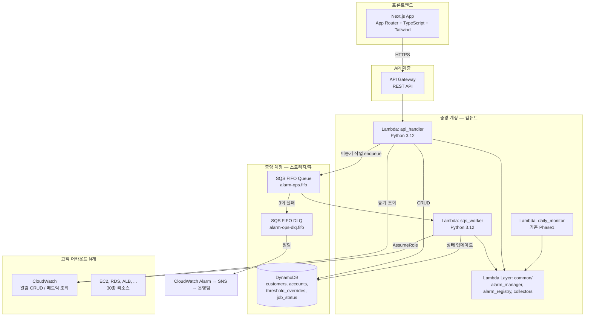
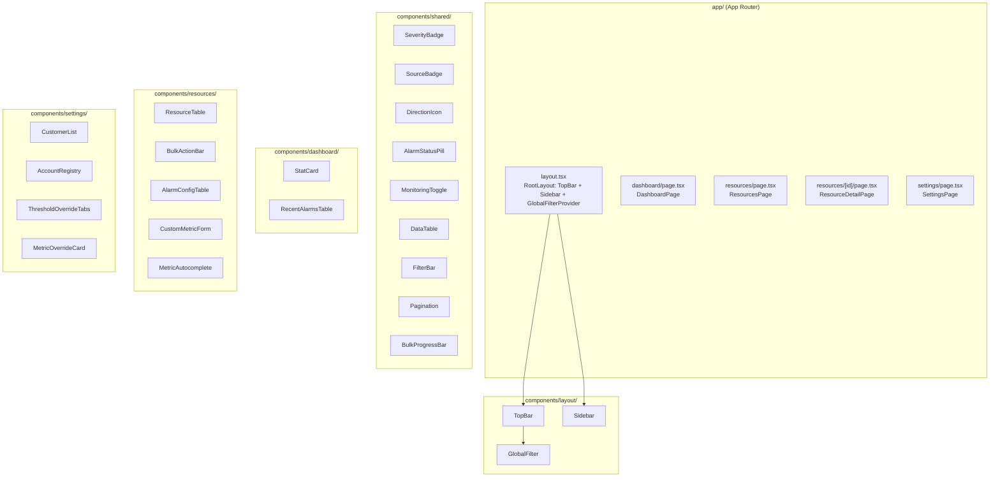

# 설계 문서: Alarm Manager 프론트엔드 (MVP)

## 개요

Phase1 백엔드(Python Lambda 기반 알람 자동 생성/동기화 엔진) 위에 웹 UI를 구축하여,
인프라 엔지니어가 태그 수동 관리 대신 브라우저에서 리소스 조회, 모니터링 토글, 알람 임계치 설정, 벌크 작업을 수행할 수 있도록 한다.

- 프론트엔드: Next.js (App Router) + TypeScript + Tailwind CSS
- 백엔드 API: API Gateway + Lambda(api_handler, Python) → 기존 Phase1 alarm_manager 함수 호출
- 큐: SQS FIFO (벌크 작업 및 비동기 알람 CRUD)
- 데이터베이스: DynamoDB (고객사/어카운트/임계치 오버라이드/작업 상태)
- 인프라: CloudFormation (Phase1과 일관성 유지, SAM 미사용)
- 인증: MVP에서는 스킵 (향후 SSO 연동 슬롯 예약)

30종 AWS 리소스 유형을 지원하며, 중앙 계정 패턴(AssumeRole)으로 다수의 고객 어카운트를 관리한다.

## 아키텍처

### 전체 시스템 아키텍처



### 요청 흐름

1. **동기 조회** (리소스 목록, 알람 상태, 메트릭 자동완성): UI → API Gateway → api_handler → AssumeRole → 고객 어카운트 CloudWatch/EC2/RDS API → 응답
2. **비동기 변경** (알람 생성/수정/삭제, 벌크 작업): UI → API Gateway → api_handler → SQS FIFO enqueue + DynamoDB job 생성 → 즉시 job_id 반환 → UI polling → sqs_worker가 처리 → DynamoDB 상태 업데이트
3. **일일 동기화** (기존 Phase1): EventBridge Scheduler → daily_monitor → 전체 어카운트 순회 → 알람 동기화 (안전망)

### 설계 결정 근거

| 결정 | 근거 |
|------|------|
| Next.js App Router | 파일 기반 라우팅, 서버 컴포넌트로 초기 로딩 최적화, API Route로 BFF 패턴 가능 |
| SQS FIFO (비동기) | 벌크 작업 시 Lambda 동시 실행 제한 회피, 리소스별 순서 보장(MessageGroupId), DLQ로 실패 보존 |
| DynamoDB | 서버리스, Phase1 CloudFormation과 일관, 고객사/어카운트 메타데이터 + 작업 상태 추적에 적합 |
| 인증 스킵 (MVP) | 내부 도구로 시작, 향후 SSO 연동 슬롯만 예약 |


## 컴포넌트 및 인터페이스

### 프론트엔드 컴포넌트 계층



### 프론트엔드 주요 모듈

| 모듈 | 경로 | 역할 |
|------|------|------|
| API 클라이언트 | `lib/api.ts` | Backend API 호출 래퍼 (fetch + 에러 핸들링 + 재시도) |
| 타입 정의 | `types/` | Resource, Alarm, Customer, Account, Job 등 TypeScript 인터페이스 |
| 상태 관리 | `hooks/useGlobalFilter.ts` | 글로벌 필터(고객사/어카운트) Context + hook |
| 폴링 | `hooks/useJobPolling.ts` | 벌크 작업 진행 상태 polling hook |
| 상수 | `lib/constants.ts` | 리소스 유형 카테고리, Severity 색상, 메트릭 표시 정보 |

### 백엔드 API 엔드포인트 설계

#### 리소스 관련

| Method | Path | 설명 | 응답 |
|--------|------|------|------|
| GET | `/api/resources` | 리소스 목록 조회 (필터/페이지네이션) | `{ items: Resource[], total: number, page: number }` |
| GET | `/api/resources/{id}` | 리소스 상세 + 알람 설정 | `{ resource: Resource, alarms: AlarmConfig[] }` |
| PUT | `/api/resources/{id}/monitoring` | 모니터링 ON/OFF 토글 | `{ job_id: string }` (비동기) |
| PUT | `/api/resources/{id}/alarms` | 알람 임계치 저장 | `{ job_id: string }` (비동기) |
| GET | `/api/resources/{id}/metrics` | CloudWatch list_metrics 프록시 (자동완성) | `{ metrics: MetricInfo[] }` |
| POST | `/api/resources/{id}/custom-alarms` | 커스텀 메트릭 알람 추가 | `{ job_id: string }` (비동기) |
| GET | `/api/resources/export` | CSV 내보내기 | CSV 파일 |
| POST | `/api/resources/sync` | 리소스 동기화 트리거 | `{ job_id: string }` |

#### 벌크 작업

| Method | Path | 설명 | 응답 |
|--------|------|------|------|
| POST | `/api/bulk/monitoring` | 벌크 모니터링 ON/OFF | `{ job_id: string }` |
| POST | `/api/bulk/alarms` | 벌크 알람 설정 | `{ job_id: string }` |
| GET | `/api/jobs/{job_id}` | 작업 진행 상태 조회 | `{ status, total, completed, failed, results[] }` |
| GET | `/api/jobs` | 작업 이력 목록 | `{ items: Job[] }` |

#### 설정 관련

| Method | Path | 설명 |
|--------|------|------|
| GET/POST | `/api/customers` | 고객사 목록 조회 / 추가 |
| PUT/DELETE | `/api/customers/{id}` | 고객사 수정 / 삭제 |
| GET/POST | `/api/accounts` | 어카운트 목록 조회 / 추가 |
| PUT/DELETE | `/api/accounts/{id}` | 어카운트 수정 / 삭제 |
| POST | `/api/accounts/{id}/test-connection` | AssumeRole 연결 테스트 |
| GET/PUT | `/api/thresholds/{resource_type}` | 리소스 유형별 임계치 오버라이드 조회/저장 |

#### 대시보드

| Method | Path | 설명 |
|--------|------|------|
| GET | `/api/dashboard/stats` | 통계 카드 데이터 (모니터링 수, 활성 알람, 미모니터링, 어카운트 수) |
| GET | `/api/dashboard/recent-alarms` | 최근 알람 트리거 (최근 10건) |

### 백엔드 Lambda 구조

```
api_handler/
├── lambda_handler.py          # API Gateway 이벤트 라우팅
├── routes/
│   ├── resources.py           # 리소스 CRUD
│   ├── alarms.py              # 알람 설정 변경 (SQS enqueue)
│   ├── bulk.py                # 벌크 작업 (SQS enqueue)
│   ├── jobs.py                # 작업 상태 조회 (DynamoDB)
│   ├── customers.py           # 고객사 CRUD (DynamoDB)
│   ├── accounts.py            # 어카운트 CRUD (DynamoDB)
│   ├── thresholds.py          # 임계치 오버라이드 (DynamoDB)
│   └── dashboard.py           # 대시보드 집계
├── services/
│   ├── resource_service.py    # AssumeRole + 리소스 수집 (기존 collectors 활용)
│   ├── alarm_service.py       # 알람 조회/설정 (기존 alarm_manager 활용)
│   └── sqs_service.py         # SQS FIFO enqueue 헬퍼
└── utils/
    ├── response.py            # API Gateway 응답 포맷
    └── validators.py          # 입력 검증

sqs_worker/
└── lambda_handler.py          # SQS FIFO 이벤트 처리 → alarm_manager 호출 → DynamoDB 상태 업데이트
```

api_handler는 기존 `common/` Lambda Layer를 공유하여 `alarm_manager.py`, `alarm_registry.py`, `collectors/` 모듈을 직접 호출한다.


## 데이터 모델

### DynamoDB 테이블 스키마

#### 1. customers 테이블

고객사 정보를 관리한다.

| 속성 | 타입 | 키 | 설명 |
|------|------|-----|------|
| customer_id | S | PK | 고객사 고유 코드 (예: "acme-corp") |
| name | S | | 고객사 표시명 |
| provider | S | | 클라우드 제공자 (기본값: "aws", 향후 확장 대비) |
| created_at | S | | ISO 8601 생성 시각 |
| updated_at | S | | ISO 8601 수정 시각 |

#### 2. accounts 테이블

AWS 어카운트 등록 정보를 관리한다.

| 속성 | 타입 | 키 | 설명 |
|------|------|-----|------|
| account_id | S | PK | AWS 어카운트 ID (12자리) |
| customer_id | S | GSI-PK | 연결된 고객사 코드 |
| name | S | | 어카운트 표시명 |
| role_arn | S | | AssumeRole 대상 IAM Role ARN |
| regions | L | | 모니터링 대상 리전 목록 (예: ["us-east-1", "ap-northeast-2"]) |
| connection_status | S | | "connected" / "failed" / "untested" |
| last_tested_at | S | | 마지막 연결 테스트 시각 |
| created_at | S | | ISO 8601 |

GSI: `customer_id-index` (customer_id = PK) — 고객사별 어카운트 조회용

#### 3. threshold_overrides 테이블

고객사별 리소스 유형 기본 임계치 오버라이드를 관리한다.

| 속성 | 타입 | 키 | 설명 |
|------|------|-----|------|
| pk | S | PK | `{customer_id}#{resource_type}` (예: "acme-corp#EC2") |
| metric_key | S | SK | 메트릭 키 (예: "CPU", "FreeMemoryGB") |
| threshold_value | N | | 오버라이드 임계치 값 |
| updated_by | S | | 변경자 (향후 인증 연동 시 사용) |
| updated_at | S | | ISO 8601 |

복합 키 설계로 `customer_id#resource_type`을 PK, `metric_key`를 SK로 사용하여 고객사+리소스유형별 전체 오버라이드를 단일 Query로 조회한다.

#### 4. job_status 테이블

비동기 작업(벌크 작업, 알람 CRUD)의 진행 상태를 추적한다.

| 속성 | 타입 | 키 | 설명 |
|------|------|-----|------|
| job_id | S | PK | UUID v4 |
| job_type | S | | "bulk_monitoring" / "bulk_alarms" / "single_alarm" / "sync" |
| status | S | | "pending" / "in_progress" / "completed" / "partial_failure" / "failed" |
| total_count | N | | 전체 작업 수 |
| completed_count | N | | 완료 수 |
| failed_count | N | | 실패 수 |
| results | L | | 개별 결과 목록 `[{ resource_id, status, error? }]` |
| created_at | S | | ISO 8601 |
| updated_at | S | | ISO 8601 |
| ttl | N | | TTL (30일 후 자동 삭제) |

GSI: `status-created_at-index` (status = PK, created_at = SK) — 작업 이력 조회용

### SQS FIFO 메시지 포맷

```json
{
  "job_id": "uuid-v4",
  "action": "create_alarms | update_alarms | delete_alarms | toggle_monitoring",
  "account_id": "123456789012",
  "resource_id": "i-1234567890abcdef0",
  "resource_type": "EC2",
  "customer_id": "acme-corp",
  "payload": {
    "monitoring": true,
    "thresholds": { "CPU": 90, "Memory": 85 },
    "custom_metrics": []
  }
}
```

- **MessageGroupId**: `{account_id}:{resource_id}` — 같은 리소스에 대한 작업 순서 보장
- **MessageDeduplicationId**: `{job_id}:{resource_id}` — 중복 방지
- **VisibilityTimeout**: 300초 (Lambda timeout과 동일)
- **MaxReceiveCount**: 3 (3회 실패 시 DLQ로 이동)

### 임계치 조회 우선순위

api_handler에서 리소스별 알람 설정을 반환할 때, 다음 우선순위로 임계치를 결정하고 Source_Badge를 함께 반환한다:

```
1. 리소스별 태그 (Threshold_*) → Source: "Custom" (보라색)
2. 고객사 오버라이드 (DynamoDB threshold_overrides) → Source: "Customer" (파란색)
3. 환경 변수 (DEFAULT_{METRIC}_THRESHOLD)
4. 시스템 하드코딩 기본값 (HARDCODED_DEFAULTS) → Source: "System" (회색)
```

### 프론트엔드 TypeScript 인터페이스

```typescript
interface Resource {
  id: string;
  name: string;
  type: string;              // "EC2" | "RDS" | ... (30종)
  account_id: string;
  customer_id: string;
  region: string;
  provider: string;          // "aws" (향후 확장 대비)
  monitoring: boolean;
  active_alarms: AlarmSummary[];
  tags: Record<string, string>;
}

interface AlarmConfig {
  metric_key: string;        // "CPU", "FreeMemoryGB" 등
  metric_name: string;       // CloudWatch 메트릭명 "CPUUtilization"
  namespace: string;
  threshold: number;
  unit: string;
  direction: ">" | "<";      // GreaterThan / LessThan
  severity: string;          // "SEV-1" ~ "SEV-5"
  source: "System" | "Customer" | "Custom";
  state: "OK" | "ALARM" | "INSUFFICIENT_DATA" | "OFF";
  current_value: number | null;
  monitoring: boolean;       // 개별 메트릭 모니터링 토글
  mount_path?: string;       // EC2 Disk 전용
}

interface AlarmSummary {
  count: number;
  severity: string;          // 최고 심각도
}

interface Customer {
  customer_id: string;
  name: string;
  provider: string;
  account_count: number;
}

interface Account {
  account_id: string;
  customer_id: string;
  name: string;
  role_arn: string;
  regions: string[];
  connection_status: "connected" | "failed" | "untested";
}

interface ThresholdOverride {
  customer_id: string;
  resource_type: string;
  metric_key: string;
  threshold_value: number;
}

interface Job {
  job_id: string;
  job_type: string;
  status: "pending" | "in_progress" | "completed" | "partial_failure" | "failed";
  total_count: number;
  completed_count: number;
  failed_count: number;
  created_at: string;
}
```


## Correctness Properties

*A property is a characteristic or behavior that should hold true across all valid executions of a system — essentially, a formal statement about what the system should do. Properties serve as the bridge between human-readable specifications and machine-verifiable correctness guarantees.*

### Property 1: 글로벌 필터 전파

*For any* 글로벌 필터 조합(고객사, 어카운트, 서비스)에 대해, 필터가 변경되면 모든 데이터 조회 API 호출에 해당 필터 파라미터가 포함되어야 하며, 응답 데이터는 선택된 필터 범위 내의 항목만 포함해야 한다.

**Validates: Requirements 1.4, 2.5**

### Property 2: 리소스 유형 카테고리 매핑 일관성

*For any* 리소스 유형(30종)에 대해, 해당 유형은 정확히 하나의 Resource_Type_Category(Compute, Database, Network, Storage, Application, Security)에 속해야 하며, SUPPORTED_RESOURCE_TYPES의 모든 유형이 카테고리 매핑에 포함되어야 한다.

**Validates: Requirements 3.2**

### Property 3: Alarm Registry 기반 메트릭 테이블 일관성

*For any* 리소스 유형에 대해, Resource Detail 페이지의 알람 설정 테이블과 Settings 페이지의 메트릭 카드 목록은 `alarm_registry._get_alarm_defs(resource_type)`가 반환하는 알람 정의와 정확히 일치해야 한다. 각 메트릭의 metric_key, metric_name, comparison 방향이 alarm_registry 데이터와 동일해야 한다.

**Validates: Requirements 5.1, 9.1, 9.2**

### Property 4: Severity 뱃지 렌더링 및 조회 일관성

*For any* 메트릭 키에 대해, Severity_Badge는 `_DEFAULT_SEVERITY` dict에서 조회한 등급을 표시해야 하며, dict에 정의되지 않은 메트릭은 SEV-5로 폴백해야 한다. 각 등급(SEV-1~SEV-5)은 지정된 아웃라인 색상으로 렌더링되어야 한다.

**Validates: Requirements 2.4, 3.4, 5.4, 11.1, 11.2, 11.3**

### Property 5: Direction Icon과 비교 방향 매칭

*For any* 알람 설정 행에 대해, Direction_Icon은 해당 메트릭의 comparison 필드와 일치해야 한다. `GreaterThan*` 비교는 ▲(빨간/주황), `LessThan*` 비교는 ▼(파란)으로 표시되어야 한다.

**Validates: Requirements 5.3, 14.3**

### Property 6: Source Badge와 임계치 출처 매칭

*For any* 알람 설정 행에 대해, Source_Badge는 실제 임계치 출처와 일치해야 한다. 리소스 태그 기반이면 "Custom"(보라), 고객사 오버라이드면 "Customer"(파란), 시스템 기본값이면 "System"(회색)으로 표시되어야 한다.

**Validates: Requirements 5.5, 14.2**

### Property 7: 알람 상태 색상 코드 매칭

*For any* 알람 상태(OK, ALARM, INSUFFICIENT_DATA, OFF)에 대해, AlarmStatusPill은 지정된 색상(초록, 빨간, 앰버, 회색)으로 렌더링되어야 한다.

**Validates: Requirements 5.6, 14.1**

### Property 8: 임계치 조회 우선순위

*For any* 리소스와 메트릭 조합에 대해, 임계치 값은 다음 우선순위로 결정되어야 한다: (1) 리소스별 태그 > (2) 고객사 오버라이드(DynamoDB) > (3) 환경 변수 > (4) 시스템 하드코딩 기본값. 상위 우선순위 값이 존재하면 하위 값은 무시되어야 한다.

**Validates: Requirements 10.7**

### Property 9: 모니터링 토글 라운드트립

*For any* 리소스에 대해, 모니터링을 OFF로 전환한 후 다시 ON으로 전환하면, 알람 설정 테이블에 정의된 메트릭에 대해 알람이 복원되어야 한다. OFF 상태에서는 해당 리소스의 모든 알람이 비활성화되어야 한다.

**Validates: Requirements 4.3, 4.4**

### Property 10: EC2 Disk 마운트 경로별 행 생성

*For any* EC2 리소스에 대해, Disk 메트릭이 여러 마운트 경로를 가지면 각 경로별로 개별 행이 생성되어야 하며, 각 행의 마운트 경로가 고유해야 한다.

**Validates: Requirements 5.7**

### Property 11: 미저장 변경 감지

*For any* 알람 설정 폼 상태에 대해, 현재 폼 값이 저장된 값과 하나라도 다르면 미저장 변경 표시기가 표시되어야 하고, 모든 값이 동일하면 표시기가 숨겨져야 한다.

**Validates: Requirements 5.9**

### Property 12: 커스텀 메트릭 자동완성 필터링

*For any* CloudWatch list_metrics API 응답에 대해, 자동완성 드롭다운은 해당 리소스 유형의 하드코딩 메트릭(`_HARDCODED_METRIC_KEYS`)을 제외한 메트릭만 표시해야 하며, 각 항목은 "MetricName (Namespace)" 형식이어야 한다.

**Validates: Requirements 6.3, 10.5**

### Property 13: 커스텀 메트릭 검증 표시기

*For any* 입력된 메트릭명에 대해, CloudWatch에 해당 메트릭이 존재하면 초록색 검증 표시기(✅)를, 존재하지 않으면 앰버색 경고 표시기(⚠️)를 표시해야 한다.

**Validates: Requirements 6.5, 6.6**

### Property 14: 고객사 삭제 시 연결 어카운트 경고

*For any* 고객사에 대해, 연결된 어카운트가 1개 이상 존재하면 삭제 시도 시 확인 경고가 표시되어야 하며, 연결된 어카운트가 0개이면 경고 없이 삭제가 진행되어야 한다.

**Validates: Requirements 7.5**

### Property 15: 임계치 오버라이드 라운드트립

*For any* 고객사, 리소스 유형, 메트릭 키 조합에 대해, 오버라이드 값을 저장한 후 조회하면 동일한 값이 반환되어야 한다.

**Validates: Requirements 9.5**

### Property 16: 비동기 작업 상태 추적

*For any* 벌크 작업에 대해, N개의 리소스를 대상으로 작업을 실행하면 즉시 job_id가 반환되어야 하고, 작업 진행 중 상태 조회 시 completed_count + failed_count ≤ total_count이어야 하며, 최종 상태에서 completed_count + failed_count = total_count이어야 한다.

**Validates: Requirements 10.11, 12.2, 12.3, 12.5**

### Property 17: 알람 생성 시 태그 및 AlarmActions 설정

*For any* 알람 생성 요청에 대해, 생성된 CloudWatch 알람은 (1) AlarmActions에 SNS 토픽 ARN이 포함되어야 하고, (2) 알람 태그에 Severity 값과 ManagedBy=AlarmManager가 설정되어야 하며, (3) AlarmDescription JSON에 customer_id와 account_id가 포함되어야 한다.

**Validates: Requirements 13.3, 15.2, 15.3**

### Property 18: API 에러 시 사용자 피드백

*For any* Backend API 호출 실패(4xx, 5xx, 네트워크 에러)에 대해, UI는 에러 메시지를 표시하고 재시도 옵션을 제공해야 한다.

**Validates: Requirements 10.6**

### Property 19: 벌크 액션 바 조건부 표시

*For any* 리소스 선택 상태에 대해, 1개 이상의 리소스가 선택되면 벌크 액션 바가 표시되어야 하고, 선택이 0개이면 숨겨져야 한다.

**Validates: Requirements 3.5, 12.1**

### Property 20: 리소스 데이터 모델 provider 필드

*For any* API가 반환하는 리소스 객체에 대해, provider 필드가 존재해야 하며 기본값은 "aws"여야 한다.

**Validates: Requirements 13.1**


## 에러 처리

### 프론트엔드 에러 처리

| 에러 유형 | 처리 방식 |
|----------|----------|
| API 네트워크 에러 | 토스트 알림 + "재시도" 버튼. 자동 재시도 없음 (사용자 의도 확인) |
| API 4xx (클라이언트 에러) | 인라인 에러 메시지 표시 (예: "유효하지 않은 임계치 값") |
| API 5xx (서버 에러) | 토스트 알림 + "재시도" 버튼 + "지원팀 문의" 링크 |
| API 타임아웃 | "요청 시간 초과" 토스트 + 재시도 옵션 |
| 벌크 작업 부분 실패 | 성공/실패 요약 모달 (실패 건 목록 + DLQ 이동 안내) |
| 폼 유효성 검증 | 인라인 필드별 에러 메시지 (빨간 테두리 + 에러 텍스트) |
| 페이지 로딩 실패 | 에러 바운더리 + "새로고침" 버튼 |

### 프론트엔드 에러 처리 구현

```typescript
// lib/api.ts — API 클라이언트 에러 래퍼
class ApiError extends Error {
  constructor(
    public status: number,
    public code: string,
    message: string,
  ) {
    super(message);
  }
}

async function apiFetch<T>(path: string, options?: RequestInit): Promise<T> {
  const res = await fetch(`${API_BASE_URL}${path}`, {
    ...options,
    headers: { "Content-Type": "application/json", ...options?.headers },
  });
  if (!res.ok) {
    const body = await res.json().catch(() => ({}));
    throw new ApiError(res.status, body.code ?? "UNKNOWN", body.message ?? "요청 실패");
  }
  return res.json();
}
```

### 백엔드 에러 처리

| 에러 유형 | HTTP 코드 | 처리 방식 |
|----------|----------|----------|
| 리소스 미발견 | 404 | `{ "code": "RESOURCE_NOT_FOUND", "message": "..." }` |
| 유효성 검증 실패 | 400 | `{ "code": "VALIDATION_ERROR", "message": "...", "details": [...] }` |
| AssumeRole 실패 | 502 | `{ "code": "ASSUME_ROLE_FAILED", "message": "..." }` |
| CloudWatch API 에러 | 502 | `{ "code": "AWS_API_ERROR", "message": "..." }` |
| DynamoDB 에러 | 500 | `{ "code": "INTERNAL_ERROR", "message": "..." }` |
| SQS enqueue 실패 | 500 | `{ "code": "QUEUE_ERROR", "message": "..." }` |
| 요청 제한 초과 | 429 | `{ "code": "THROTTLED", "message": "..." }` |

### SQS Worker 에러 처리

```
메시지 처리 실패 → SQS 자동 재시도 (VisibilityTimeout 후)
  → 3회 실패 (MaxReceiveCount) → DLQ로 이동
  → DLQ 메시지 수 > 0 → CloudWatch Alarm → SNS → 운영팀 알림
  → daily_sync가 다음 실행 시 보정 (안전망)
```

Worker Lambda에서 개별 메시지 처리 시:
- `ClientError` catch → DynamoDB job_status에 실패 기록 + 로그
- 부분 성공 시 처리된 항목까지 DynamoDB 업데이트 후 예외 전파 (SQS 재시도)

## 테스팅 전략

### 테스트 구조

이 프로젝트는 **단위 테스트**와 **속성 기반 테스트(Property-Based Testing)** 두 가지 접근을 병행한다.

- **단위 테스트**: 특정 예시, 엣지 케이스, 에러 조건 검증
- **속성 기반 테스트**: 모든 유효한 입력에 대해 보편적 속성 검증

### 프론트엔드 테스트

| 레이어 | 도구 | 대상 |
|--------|------|------|
| 컴포넌트 단위 테스트 | Vitest + React Testing Library | SeverityBadge, SourceBadge, DirectionIcon, AlarmStatusPill, MonitoringToggle 등 공유 컴포넌트 |
| 속성 기반 테스트 | Vitest + fast-check | 컴포넌트 렌더링 속성 (Property 2~7, 10~14, 18~20) |
| 통합 테스트 | Vitest + MSW (Mock Service Worker) | 페이지 레벨 데이터 흐름, API 연동, 글로벌 필터 전파 |
| E2E 테스트 | Playwright | 주요 사용자 시나리오 (리소스 조회 → 알람 설정 → 저장) |

### 백엔드 테스트

| 레이어 | 도구 | 대상 |
|--------|------|------|
| 단위 테스트 | pytest + moto | api_handler 라우트 핸들러, 서비스 레이어, DynamoDB CRUD |
| 속성 기반 테스트 | pytest + hypothesis | 임계치 우선순위 (Property 8), 알람 생성 태그 (Property 17), 작업 상태 추적 (Property 16) |
| 통합 테스트 | pytest + moto | SQS FIFO → Worker → DynamoDB 전체 흐름 |

### 속성 기반 테스트 설정

- **프론트엔드**: fast-check 라이브러리 사용 (TypeScript 네이티브)
- **백엔드**: hypothesis 라이브러리 사용 (기존 Phase1 테스트와 일관)
- 각 속성 테스트는 최소 **100회 반복** 실행
- 각 테스트에 설계 문서 속성 참조 태그 포함

```typescript
// 프론트엔드 속성 테스트 태그 형식
// Feature: alarm-manager-frontend, Property 4: Severity 뱃지 렌더링 및 조회 일관성
```

```python
# 백엔드 속성 테스트 태그 형식
# Feature: alarm-manager-frontend, Property 8: 임계치 조회 우선순위
```

### 속성별 테스트 매핑

| Property | 테스트 위치 | 라이브러리 | 핵심 생성기 |
|----------|-----------|-----------|-----------|
| 1 (글로벌 필터 전파) | frontend | fast-check | `fc.record({ customer_id, account_id })` |
| 2 (리소스 유형 카테고리) | frontend | fast-check | `fc.constantFrom(...SUPPORTED_RESOURCE_TYPES)` |
| 3 (Alarm Registry 일관성) | frontend + backend | fast-check / hypothesis | `fc.constantFrom(...resourceTypes)` |
| 4 (Severity 뱃지) | frontend | fast-check | `fc.constantFrom(...metricKeys)` |
| 5 (Direction Icon) | frontend | fast-check | `fc.record({ comparison: fc.constantFrom("GreaterThan*", "LessThan*") })` |
| 6 (Source Badge) | frontend | fast-check | `fc.constantFrom("System", "Customer", "Custom")` |
| 7 (알람 상태 색상) | frontend | fast-check | `fc.constantFrom("OK", "ALARM", "INSUFFICIENT_DATA", "OFF")` |
| 8 (임계치 우선순위) | backend | hypothesis | `st.fixed_dictionaries({ tag, override, env, default })` |
| 9 (모니터링 토글) | backend | hypothesis | `st.from_type(Resource)` |
| 10 (EC2 Disk 경로) | frontend | fast-check | `fc.array(fc.string(), { minLength: 1, maxLength: 10 })` |
| 11 (미저장 변경 감지) | frontend | fast-check | `fc.record({ saved, current })` |
| 12 (자동완성 필터링) | frontend + backend | fast-check / hypothesis | `fc.array(fc.record({ metricName, namespace }))` |
| 13 (메트릭 검증 표시기) | frontend | fast-check | `fc.record({ metricName, existsInCW: fc.boolean() })` |
| 14 (고객사 삭제 경고) | frontend | fast-check | `fc.record({ accountCount: fc.nat() })` |
| 15 (오버라이드 라운드트립) | backend | hypothesis | `st.fixed_dictionaries({ customer_id, resource_type, metric_key, value })` |
| 16 (작업 상태 추적) | backend | hypothesis | `st.integers(min_value=1, max_value=100)` |
| 17 (알람 생성 태그) | backend | hypothesis | `st.from_type(AlarmConfig)` |
| 18 (API 에러 피드백) | frontend | fast-check | `fc.constantFrom(400, 404, 500, 502, 503)` |
| 19 (벌크 액션 바) | frontend | fast-check | `fc.array(fc.string(), { minLength: 0, maxLength: 50 })` |
| 20 (provider 필드) | backend | hypothesis | `st.from_type(Resource)` |

### 단위 테스트 대상 (예시 및 엣지 케이스)

- 레이아웃 렌더링: 사이드바 항목, 상단 바 요소 (Requirements 1.1, 1.2, 1.3, 1.6)
- 대시보드 통계 카드 렌더링 (Requirement 2.1, 2.3)
- 리소스 테이블 컬럼 렌더링 (Requirement 3.3)
- 커스텀 메트릭 폼 표시/숨김 (Requirement 6.1, 6.2, 6.4)
- 고객사/어카운트 CRUD 폼 (Requirements 7.1~7.4, 8.1~8.3, 8.5)
- 연결 테스트 API 호출 (Requirement 8.4)
- CSV 내보내기, 페이지네이션, 동기화 버튼 (Requirements 3.7~3.10)
- 벌크 알람 설정 폼 (Requirement 12.4)
- 작업 이력 조회 (Requirement 12.6)
- 알림 채널 UI 부재 확인 (Requirement 15.1)
- 모노스페이스 폰트 적용 (Requirement 14.4)

## CloudFormation 리소스

MVP에 필요한 추가 CloudFormation 리소스:

| 리소스 | 타입 | 설명 |
|--------|------|------|
| ApiGateway | AWS::ApiGateway::RestApi | REST API 엔드포인트 |
| ApiHandlerFunction | AWS::Lambda::Function | api_handler Lambda |
| SqsWorkerFunction | AWS::Lambda::Function | SQS FIFO 처리 Worker Lambda |
| AlarmOpsFifoQueue | AWS::SQS::Queue | alarm-ops.fifo (FIFO, ContentBasedDeduplication: false) |
| AlarmOpsDlqQueue | AWS::SQS::Queue | alarm-ops-dlq.fifo (DLQ) |
| CustomersTable | AWS::DynamoDB::Table | 고객사 정보 |
| AccountsTable | AWS::DynamoDB::Table | 어카운트 등록 정보 (GSI: customer_id-index) |
| ThresholdOverridesTable | AWS::DynamoDB::Table | 임계치 오버라이드 (복합 키) |
| JobStatusTable | AWS::DynamoDB::Table | 작업 상태 추적 (GSI: status-created_at-index, TTL 활성화) |
| DlqAlarm | AWS::CloudWatch::Alarm | DLQ 메시지 수 > 0 알람 |
| SqsEventSourceMapping | AWS::Lambda::EventSourceMapping | SQS FIFO → Worker Lambda 트리거 |

기존 Phase1 리소스(CommonLayer, DailyMonitorFunction, SNS Topics 등)는 그대로 유지하며, api_handler와 sqs_worker가 CommonLayer를 공유한다.
