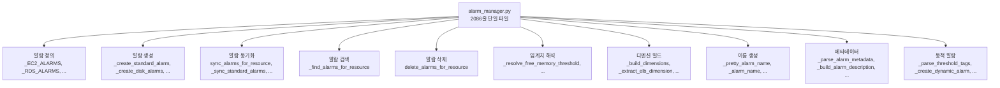
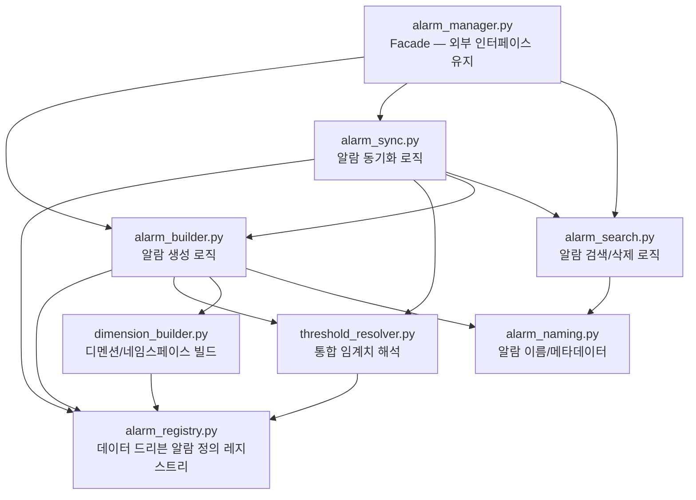
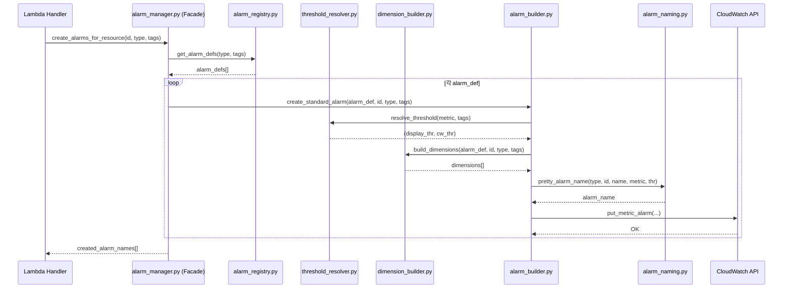
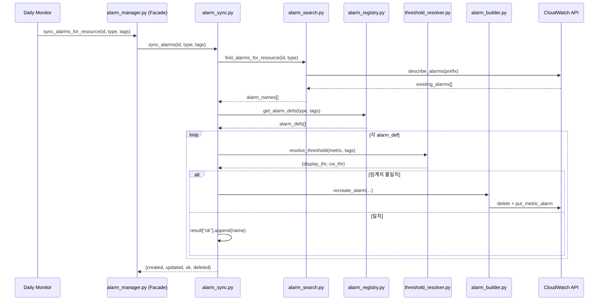

# Design Document: alarm-manager-modularize

## Overview

`alarm_manager.py`가 2086줄로 비대해져 알람 정의, 생성, 동기화, 삭제, 검색, 임계치 해석, 디멘션 빌드, 이름 생성 등 모든 책임이 단일 파일에 집중되어 있다. 새 리소스 타입 추가 시 테스트의 하드코딩 개수를 수동 업데이트해야 하고, `_create_standard_alarm()`, `_sync_standard_alarms()`, `_create_single_alarm()`, `_recreate_standard_alarm()` 4개 함수에 FreeMemoryGB/FreeLocalStorageGB 분기가 중복된다.

이 리팩터링은 alarm_manager.py를 책임별 모듈로 분리하고, 알람 정의를 데이터 드리븐 레지스트리로 전환하며, 중복 임계치 해석 로직을 통합 패턴으로 추출한다. 외부 인터페이스 시그니처는 변경하지 않으며, 기존 607개 테스트 전부 통과를 보장한다.

## Architecture

### 현재 구조 (Before)



### 목표 구조 (After)



## Sequence Diagrams

### 알람 생성 흐름 (After)



### 알람 동기화 흐름 (After)



## Components and Interfaces

### Component 1: alarm_registry.py — 데이터 드리븐 알람 정의 레지스트리

**Purpose**: 모든 리소스 유형별 알람 정의를 단일 레지스트리로 관리. 현재 `_EC2_ALARMS`, `_RDS_ALARMS`, `_ALB_ALARMS`, `_NLB_ALARMS`, `_TG_ALARMS`, `_AURORA_RDS_ALARMS`, `_DOCDB_ALARMS` 7개 리스트 + `_HARDCODED_METRIC_KEYS`, `_NAMESPACE_MAP`, `_DIMENSION_KEY_MAP`, `_METRIC_DISPLAY`, `_metric_name_to_key()` 매핑이 모두 이 모듈로 이동한다.

**Interface**:
```python
# 알람 정의 조회 (기존 _get_alarm_defs 시그니처 유지)
def get_alarm_defs(resource_type: str, resource_tags: dict | None = None) -> list[dict]: ...

# 하드코딩 메트릭 키 집합 (기존 _get_hardcoded_metric_keys)
def get_hardcoded_metric_keys(resource_type: str, resource_tags: dict | None = None) -> set[str]: ...

# CW metric_name → 내부 키 변환 (기존 _metric_name_to_key)
def metric_name_to_key(metric_name: str) -> str: ...

# 메트릭 표시 정보 조회
def get_metric_display(metric: str) -> tuple[str, str, str]: ...

# 네임스페이스 목록 조회
def get_namespace_list(resource_type: str) -> list[str]: ...

# 디멘션 키 조회
def get_dimension_key(resource_type: str) -> str: ...

# 레지스트리 데이터 (dict 기반, 테스트에서 직접 참조 가능)
ALARM_REGISTRY: dict[str, list[dict]]
METRIC_DISPLAY: dict[str, tuple[str, str, str]]
HARDCODED_METRIC_KEYS: dict[str, set[str]]
NAMESPACE_MAP: dict[str, list[str]]
DIMENSION_KEY_MAP: dict[str, str]
```

**Responsibilities**:
- 리소스 유형별 알람 정의 데이터 보유 (dict 리스트)
- Aurora 변형별 동적 알람 정의 빌드 (`_get_aurora_alarm_defs` 로직)
- TG NLB 제외 메트릭 필터링
- `_HARDCODED_METRIC_KEYS`, `_NAMESPACE_MAP`, `_DIMENSION_KEY_MAP` 매핑 보유
- `_METRIC_DISPLAY` 매핑 보유
- `_metric_name_to_key()` 변환 함수 보유

### Component 2: threshold_resolver.py — 통합 임계치 해석

**Purpose**: FreeMemoryGB/FreeLocalStorageGB 퍼센트 기반 임계치 해석 중복을 제거하고, 모든 임계치 해석을 단일 진입점으로 통합한다. 현재 4개 함수(`_create_standard_alarm`, `_sync_standard_alarms`, `_create_single_alarm`, `_recreate_standard_alarm`)에 반복되는 if/elif 분기를 제거한다.

**Interface**:
```python
def resolve_threshold(
    alarm_def: dict,
    resource_tags: dict,
) -> tuple[float, float]:
    """알람 정의와 태그 기반으로 (display_threshold, cw_threshold) 반환.

    FreeMemoryGB → _resolve_free_memory_threshold
    FreeLocalStorageGB → _resolve_free_local_storage_threshold
    transform_threshold 있는 메트릭 → transform 적용
    그 외 → get_threshold() 직접 사용
    """
    ...

# 기존 함수도 유지 (내부 호출용)
def resolve_free_memory_threshold(resource_tags: dict) -> tuple[float, float]: ...
def resolve_free_local_storage_threshold(resource_tags: dict) -> tuple[float, float]: ...
```

**Responsibilities**:
- FreeMemoryGB 퍼센트/절대값 3단계 폴백 해석
- FreeLocalStorageGB 퍼센트/절대값 3단계 폴백 해석
- `transform_threshold` lambda 적용 (GB→bytes 등)
- 일반 메트릭 `get_threshold()` 위임
- 단일 `resolve_threshold(alarm_def, tags)` 진입점으로 4곳 중복 제거

### Component 3: dimension_builder.py — 디멘션/네임스페이스 빌드

**Purpose**: CloudWatch 디멘션 구성과 네임스페이스 해석을 전담. 현재 `_build_dimensions()`, `_extract_elb_dimension()`, `_resolve_tg_namespace()`, `_resolve_metric_dimensions()`, `_select_best_dimensions()`, `_get_disk_dimensions()` 함수가 이동한다.

**Interface**:
```python
def build_dimensions(alarm_def: dict, resource_id: str, resource_type: str, resource_tags: dict) -> list[dict]: ...
def extract_elb_dimension(elb_arn: str) -> str: ...
def resolve_tg_namespace(alarm_def: dict, resource_tags: dict) -> str: ...
def resolve_metric_dimensions(resource_id: str, metric_name: str, resource_type: str) -> tuple[str, list[dict]] | None: ...
def select_best_dimensions(metrics: list[dict], primary_dim_key: str) -> list[dict]: ...
def get_disk_dimensions(instance_id: str, extra_paths: set[str] | None = None) -> list[list[dict]]: ...
```

**Responsibilities**:
- TG 복합 디멘션 (TargetGroup + LoadBalancer) 빌드
- ALB/NLB/EC2/RDS 단일 디멘션 빌드
- ELB ARN → 디멘션 값 추출
- TG 네임스페이스 동적 결정 (ALB vs NLB)
- 동적 알람용 `list_metrics` API 디멘션 해석
- CWAgent Disk 디멘션 조회

### Component 4: alarm_naming.py — 알람 이름/메타데이터

**Purpose**: 알람 이름 생성, 메타데이터 빌드/파싱, Short ID 추출을 전담. 현재 `_pretty_alarm_name()`, `_alarm_name()`, `_build_alarm_description()`, `_parse_alarm_metadata()`, `_shorten_elb_resource_id()` 함수가 이동한다.

**Interface**:
```python
def pretty_alarm_name(resource_type: str, resource_id: str, resource_name: str, metric: str, threshold: float) -> str: ...
def legacy_alarm_name(resource_id: str, metric: str) -> str: ...
def build_alarm_description(resource_type: str, resource_id: str, metric_key: str, human_prefix: str = "") -> str: ...
def parse_alarm_metadata(description: str) -> dict | None: ...
def shorten_elb_resource_id(resource_id: str, resource_type: str) -> str: ...
```

**Responsibilities**:
- 새 포맷 알람 이름 생성 (255자 truncation 포함)
- 레거시 알람 이름 생성 (삭제 호환용)
- AlarmDescription JSON 메타데이터 빌드/파싱
- ALB/NLB/TG ARN → Short ID 추출

### Component 5: alarm_builder.py — 알람 생성 로직

**Purpose**: CloudWatch `put_metric_alarm` 호출을 담당하는 알람 생성 전담 모듈. 현재 `_create_standard_alarm()`, `_create_disk_alarms()`, `_create_dynamic_alarm()`, `_create_single_alarm()`, `_recreate_alarm_by_name()`, `_recreate_standard_alarm()`, `_recreate_disk_alarm()` 함수가 이동한다.

**Interface**:
```python
def create_standard_alarm(alarm_def: dict, resource_id: str, resource_type: str, resource_tags: dict, cw, sns_arn: str) -> str | None: ...
def create_disk_alarms(resource_id: str, resource_type: str, resource_name: str, resource_tags: dict, alarm_def: dict, cw, sns_arn: str) -> list[str]: ...
def create_dynamic_alarm(resource_id: str, resource_type: str, resource_name: str, metric_name: str, threshold: float, cw, sns_arn: str, created: list[str], comparison: str = "GreaterThanThreshold") -> None: ...
def create_single_alarm(metric: str, resource_id: str, resource_type: str, resource_tags: dict) -> None: ...
def recreate_alarm_by_name(alarm_name: str, resource_id: str, resource_type: str, resource_tags: dict) -> None: ...
```

**Responsibilities**:
- 표준 알람 생성 (`put_metric_alarm` 호출)
- Disk 알람 생성 (CWAgent 디멘션 동적 조회)
- 동적 태그 알람 생성
- 단일 알람 재생성 (동기화용)
- `threshold_resolver.resolve_threshold()` 호출로 중복 분기 제거

### Component 6: alarm_search.py — 알람 검색/삭제 로직

**Purpose**: CloudWatch 알람 검색과 삭제를 전담. 현재 `_find_alarms_for_resource()`, `_delete_all_alarms_for_resource()`, `_describe_alarms_batch()`, `_delete_alarm_names()` 함수가 이동한다.

**Interface**:
```python
def find_alarms_for_resource(resource_id: str, resource_type: str = "") -> list[str]: ...
def delete_all_alarms_for_resource(resource_id: str, resource_type: str = "") -> list[str]: ...
def describe_alarms_batch(alarm_names: list[str]) -> dict[str, dict]: ...
def delete_alarm_names(cw, alarm_names: list[str]) -> None: ...
```

**Responsibilities**:
- 레거시 + 새 포맷 알람 검색 (prefix 기반, 풀스캔 금지)
- ALB/NLB/TG Short_ID + Full_ARN suffix 호환 검색
- 알람 배치 삭제 (100개씩)
- 알람 배치 describe

### Component 7: alarm_sync.py — 알람 동기화 로직

**Purpose**: Daily Monitor용 알람 동기화를 전담. 현재 `_sync_standard_alarms()`, `_sync_disk_alarms()`, `_sync_off_hardcoded()`, `_sync_dynamic_alarms()`, `_apply_sync_changes()` 함수가 이동한다.

**Interface**:
```python
def sync_alarms(resource_id: str, resource_type: str, resource_tags: dict) -> dict: ...
```

**Responsibilities**:
- 하드코딩 메트릭 동기화 (임계치 비교 → 재생성)
- Disk 알람 동기화
- 동적 알람 동기화 (생성/삭제/업데이트)
- off 태그 알람 삭제
- 동기화 결과 적용

### Component 8: alarm_manager.py — Facade (외부 인터페이스)

**Purpose**: 기존 외부 인터페이스 시그니처를 유지하는 Facade. 내부 모듈에 위임만 한다.

**Interface** (변경 없음):
```python
def create_alarms_for_resource(resource_id: str, resource_type: str, resource_tags: dict) -> list[str]: ...
def delete_alarms_for_resource(resource_id: str, resource_type: str) -> list[str]: ...
def sync_alarms_for_resource(resource_id: str, resource_type: str, resource_tags: dict) -> dict: ...
```

**Responsibilities**:
- 외부 호출자에게 동일한 import 경로 제공
- 내부 모듈 조합/위임
- 기존 `from common.alarm_manager import ...` 호환성 유지를 위한 re-export

## Data Models

### AlarmDef (알람 정의 레코드)

```python
# alarm_registry.py 내부 데이터 구조 (기존과 동일한 dict 형태 유지)
AlarmDef = {
    "metric": str,           # 내부 메트릭 키 (예: "CPU", "FreeMemoryGB")
    "namespace": str,        # CloudWatch 네임스페이스 (예: "AWS/EC2")
    "metric_name": str,      # CloudWatch 메트릭 이름 (예: "CPUUtilization")
    "dimension_key": str,    # 기본 디멘션 키 (예: "InstanceId")
    "stat": str,             # 통계 (예: "Average", "Sum", "Maximum")
    "comparison": str,       # 비교 연산자 (예: "GreaterThanThreshold")
    "period": int,           # 평가 주기 (초)
    "evaluation_periods": int,
    # 선택적 필드
    "transform_threshold": Callable | None,  # 임계치 변환 함수 (예: GB→bytes)
    "dynamic_dimensions": bool | None,       # Disk 등 동적 디멘션 여부
    "extra_dimensions": list[dict] | None,   # 추가 디멘션
}
```

**Validation Rules**:
- `metric`은 비어있지 않은 문자열
- `namespace`는 `AWS/` 또는 `CWAgent` 접두사
- `stat`은 `Average`, `Sum`, `Maximum`, `Minimum` 중 하나
- `comparison`은 `GreaterThanThreshold` 또는 `LessThanThreshold`
- `period` > 0, `evaluation_periods` > 0

### 모듈 간 의존성 매트릭스

| 모듈 | 의존하는 모듈 |
|------|-------------|
| alarm_registry.py | (없음 — 순수 데이터) |
| threshold_resolver.py | alarm_registry, common.tag_resolver |
| dimension_builder.py | alarm_registry, alarm_naming (extract_elb_dimension) |
| alarm_naming.py | alarm_registry (METRIC_DISPLAY) |
| alarm_builder.py | alarm_registry, threshold_resolver, dimension_builder, alarm_naming |
| alarm_search.py | alarm_naming (shorten_elb_resource_id) |
| alarm_sync.py | alarm_registry, threshold_resolver, alarm_builder, alarm_search |
| alarm_manager.py | alarm_builder, alarm_search, alarm_sync, alarm_registry |

순환 의존성 없음을 보장한다.

## Key Functions with Formal Specifications

### resolve_threshold()

```python
def resolve_threshold(alarm_def: dict, resource_tags: dict) -> tuple[float, float]:
    """통합 임계치 해석 — 4곳 중복 분기를 단일 함수로 통합."""
```

**Preconditions:**
- `alarm_def`는 유효한 AlarmDef dict (최소 `metric` 키 포함)
- `resource_tags`는 dict (빈 dict 허용)

**Postconditions:**
- 반환값 `(display_thr, cw_thr)` 모두 유한한 양수
- `metric == "FreeMemoryGB"` → `resolve_free_memory_threshold()` 결과와 동일
- `metric == "FreeLocalStorageGB"` → `resolve_free_local_storage_threshold()` 결과와 동일
- `transform_threshold` 존재 시 → `cw_thr == transform(display_thr)`
- 그 외 → `display_thr == cw_thr == get_threshold(tags, metric)`
- 입력 dict에 대한 side effect 없음

**Loop Invariants:** N/A

### get_alarm_defs()

```python
def get_alarm_defs(resource_type: str, resource_tags: dict | None = None) -> list[dict]:
    """레지스트리에서 리소스 유형별 알람 정의 목록 반환."""
```

**Preconditions:**
- `resource_type`은 SUPPORTED_RESOURCE_TYPES 중 하나 또는 임의 문자열
- `resource_tags`는 dict 또는 None

**Postconditions:**
- 지원하지 않는 resource_type → 빈 리스트 반환
- 반환된 각 dict는 유효한 AlarmDef 구조
- TG + `_lb_type=="network"` → RequestCountPerTarget, TGResponseTime 제외
- TG + `_target_type=="alb"` → 빈 리스트
- AuroraRDS → resource_tags 기반 동적 빌드 (Serverless v2 vs Provisioned)
- 원본 레지스트리 데이터 변경 없음 (방어적 복사 또는 필터링)

**Loop Invariants:** N/A

## Algorithmic Pseudocode

### 알고리즘 1: resolve_threshold — 통합 임계치 해석

```pascal
ALGORITHM resolve_threshold(alarm_def, resource_tags)
INPUT: alarm_def (AlarmDef dict), resource_tags (dict)
OUTPUT: (display_threshold, cw_threshold) 튜플

BEGIN
  metric ← alarm_def["metric"]

  CASE metric OF
    "FreeMemoryGB":
      RETURN resolve_free_memory_threshold(resource_tags)

    "FreeLocalStorageGB":
      RETURN resolve_free_local_storage_threshold(resource_tags)

    OTHERWISE:
      display_thr ← get_threshold(resource_tags, metric)
      transform ← alarm_def.get("transform_threshold")
      IF transform IS NOT NULL THEN
        cw_thr ← transform(display_thr)
      ELSE
        cw_thr ← display_thr
      END IF
      RETURN (display_thr, cw_thr)
  END CASE
END
```

**Preconditions:**
- alarm_def는 유효한 AlarmDef dict
- resource_tags는 dict (빈 dict 허용)

**Postconditions:**
- 반환값 (display_thr, cw_thr) 모두 유한한 양수
- 기존 4곳의 if/elif 분기와 동일한 결과

**Loop Invariants:** N/A

### 알고리즘 2: Facade create_alarms_for_resource — 알람 생성 오케스트레이션

```pascal
ALGORITHM create_alarms_for_resource(resource_id, resource_type, resource_tags)
INPUT: resource_id (str), resource_type (str), resource_tags (dict)
OUTPUT: created_alarm_names (list[str])

BEGIN
  cw ← get_cw_client()
  sns_arn ← get_sns_alert_arn()
  alarm_defs ← registry.get_alarm_defs(resource_type, resource_tags)
  created ← []

  // 기존 알람 삭제 (레거시 + 새 포맷)
  search.delete_all_alarms_for_resource(resource_id, resource_type)

  FOR EACH alarm_def IN alarm_defs DO
    IF alarm_def.dynamic_dimensions AND alarm_def.metric = "Disk" THEN
      disk_names ← builder.create_disk_alarms(...)
      created.extend(disk_names)
    ELSE
      IF is_threshold_off(resource_tags, alarm_def.metric) THEN
        CONTINUE
      END IF
      name ← builder.create_standard_alarm(alarm_def, resource_id, resource_type, resource_tags, cw, sns_arn)
      IF name IS NOT NULL THEN
        created.append(name)
      END IF
    END IF
  END FOR

  // 동적 태그 알람 생성
  dynamic_metrics ← registry_parse_threshold_tags(resource_tags, resource_type)
  FOR EACH (metric_name, threshold, comparison) IN dynamic_metrics DO
    builder.create_dynamic_alarm(resource_id, resource_type, ..., created)
  END FOR

  RETURN created
END
```

**Preconditions:**
- resource_type은 SUPPORTED_RESOURCE_TYPES 중 하나
- resource_tags에 "Monitoring": "on" 포함

**Postconditions:**
- 반환된 알람 이름 목록은 실제 CloudWatch에 생성된 알람과 1:1 대응
- 기존 알람은 모두 삭제 후 재생성됨

**Loop Invariants:**
- created 리스트에는 성공적으로 생성된 알람 이름만 포함

### 알고리즘 3: Re-export 호환성 전략

```pascal
ALGORITHM re_export_compatibility
INPUT: 기존 테스트/외부 코드의 import 경로
OUTPUT: 모든 기존 import가 동작하는 alarm_manager.py

BEGIN
  // alarm_manager.py에서 내부 모듈의 public 심볼을 re-export
  // 기존: from common.alarm_manager import _get_alarm_defs
  // 리팩터링 후에도 동일하게 동작

  FROM common.alarm_registry IMPORT (
    get_alarm_defs AS _get_alarm_defs,
    HARDCODED_METRIC_KEYS AS _HARDCODED_METRIC_KEYS,
    METRIC_DISPLAY AS _METRIC_DISPLAY,
    metric_name_to_key AS _metric_name_to_key,
    NAMESPACE_MAP AS _NAMESPACE_MAP,
    DIMENSION_KEY_MAP AS _DIMENSION_KEY_MAP,
    ...
  )
  FROM common.alarm_naming IMPORT (
    pretty_alarm_name AS _pretty_alarm_name,
    legacy_alarm_name AS _alarm_name,
    build_alarm_description AS _build_alarm_description,
    parse_alarm_metadata AS _parse_alarm_metadata,
    shorten_elb_resource_id AS _shorten_elb_resource_id,
    ...
  )
  FROM common.dimension_builder IMPORT (
    build_dimensions AS _build_dimensions,
    extract_elb_dimension AS _extract_elb_dimension,
    resolve_tg_namespace AS _resolve_tg_namespace,
    resolve_metric_dimensions AS _resolve_metric_dimensions,
    select_best_dimensions AS _select_best_dimensions,
    ...
  )
  FROM common.threshold_resolver IMPORT (
    resolve_free_memory_threshold AS _resolve_free_memory_threshold,
    resolve_free_local_storage_threshold AS _resolve_free_local_storage_threshold,
    ...
  )
  FROM common.alarm_builder IMPORT (
    create_standard_alarm AS _create_standard_alarm,
    create_dynamic_alarm AS _create_dynamic_alarm,
    create_single_alarm AS _create_single_alarm,
    ...
  )
  FROM common.alarm_search IMPORT (
    find_alarms_for_resource AS _find_alarms_for_resource,
    ...
  )

  // _parse_threshold_tags는 alarm_manager.py에 남거나 registry로 이동
  // _get_cw_client는 각 모듈에서 독립적으로 정의 (lru_cache 싱글턴)
END
```

**Preconditions:**
- 모든 내부 모듈이 올바르게 구현됨

**Postconditions:**
- `from common.alarm_manager import X` 형태의 기존 import 전부 동작
- 607개 테스트 전부 통과 (import 경로 변경 없음)

**Loop Invariants:** N/A

### 알고리즘 4: 테스트 자동 참조 — 레지스트리 기반 기대값

```pascal
ALGORITHM test_auto_reference_registry
INPUT: resource_type (str)
OUTPUT: expected_alarm_count, expected_metric_keys

BEGIN
  // 기존 방식 (하드코딩):
  //   _EXPECTED_ALARM_COUNTS = {"EC2": 4, "RDS": 7, "ALB": 5, ...}
  //   새 메트릭 추가 시 수동 업데이트 필요

  // 새 방식 (레지스트리 참조):
  alarm_defs ← registry.get_alarm_defs(resource_type)
  expected_count ← len(alarm_defs)
  expected_keys ← {d["metric"] FOR d IN alarm_defs}

  RETURN (expected_count, expected_keys)
END
```

**Preconditions:**
- alarm_registry 모듈이 로드됨

**Postconditions:**
- 새 메트릭 추가 시 테스트 코드 수정 불필요
- 레지스트리 데이터가 single source of truth

**Loop Invariants:** N/A

## Example Usage

### 리팩터링 전: 4곳 중복 FreeMemoryGB 분기

```python
# _create_standard_alarm() 내부
if metric == "FreeMemoryGB":
    threshold, cw_threshold = _resolve_free_memory_threshold(resource_tags)
elif metric == "FreeLocalStorageGB":
    threshold, cw_threshold = _resolve_free_local_storage_threshold(resource_tags)
else:
    threshold = get_threshold(resource_tags, metric)
    transform = alarm_def.get("transform_threshold")
    cw_threshold = transform(threshold) if transform else threshold

# _sync_standard_alarms() 내부 — 동일 분기 반복
# _create_single_alarm() 내부 — 동일 분기 반복
# _recreate_standard_alarm() 내부 — 동일 분기 반복
```

### 리팩터링 후: 단일 호출

```python
# alarm_builder.py 또는 alarm_sync.py 내부
from common.threshold_resolver import resolve_threshold

threshold, cw_threshold = resolve_threshold(alarm_def, resource_tags)
# FreeMemoryGB, FreeLocalStorageGB, transform_threshold, 일반 메트릭 모두 처리
```

### 리팩터링 전: 테스트 하드코딩 개수

```python
# tests/test_pbt_dynamic_alarm_preservation.py
_EXPECTED_ALARM_COUNTS = {
    "EC2": 4,   # 새 메트릭 추가 시 수동 업데이트 필요
    "RDS": 7,   # 6→7 수동 변경
    "ALB": 5,   # 3→5 수동 변경
    ...
}
```

### 리팩터링 후: 레지스트리 자동 참조

```python
# tests/test_pbt_dynamic_alarm_preservation.py
from common.alarm_registry import get_alarm_defs

def _expected_alarm_count(resource_type: str) -> int:
    return len(get_alarm_defs(resource_type))

def _expected_metric_keys(resource_type: str) -> set[str]:
    return {d["metric"] for d in get_alarm_defs(resource_type)}
```

## Correctness Properties

### Property 1: 외부 인터페이스 동등성 (Behavioral Equivalence)

∀ resource_id, resource_type, resource_tags:
  리팩터링 전 `create_alarms_for_resource(id, type, tags)` 반환값 ==
  리팩터링 후 `create_alarms_for_resource(id, type, tags)` 반환값

동일하게 `delete_alarms_for_resource`, `sync_alarms_for_resource`에도 적용.

### Property 2: 레지스트리 완전성 (Registry Completeness)

∀ resource_type ∈ SUPPORTED_RESOURCE_TYPES:
  `get_alarm_defs(resource_type)` 반환 메트릭 집합 ==
  리팩터링 전 `_get_alarm_defs(resource_type)` 반환 메트릭 집합

### Property 3: 임계치 해석 동등성 (Threshold Resolution Equivalence)

∀ alarm_def, resource_tags:
  `resolve_threshold(alarm_def, tags)` ==
  기존 4곳 if/elif 분기의 결과

### Property 4: Import 호환성 (Import Compatibility)

∀ 기존 테스트 파일의 `from common.alarm_manager import X`:
  리팩터링 후에도 동일한 import가 성공하고 동일한 객체를 참조

### Property 5: 테스트 자동 참조 (Test Auto-Reference)

∀ resource_type:
  `len(get_alarm_defs(resource_type))` == 해당 타입의 실제 알람 생성 개수
  (새 메트릭 추가 시 테스트 코드 수정 불필요)

### Property 6: 순환 의존성 없음 (No Circular Dependencies)

모듈 의존성 그래프가 DAG (Directed Acyclic Graph)를 형성.
`alarm_registry` → `threshold_resolver` → `dimension_builder` → `alarm_builder` → `alarm_sync` → `alarm_manager` 방향으로만 의존.

## Error Handling

### Error Scenario 1: CloudWatch API 실패

**Condition**: `put_metric_alarm`, `describe_alarms`, `delete_alarms` 호출 시 `ClientError` 발생
**Response**: `logger.error()` 로깅 후 해당 알람 스킵, 나머지 알람 처리 계속
**Recovery**: 다음 동기화 주기에서 재시도 (Daily Monitor)

### Error Scenario 2: 잘못된 임계치 태그

**Condition**: `Threshold_FreeMemoryPct` 값이 비숫자이거나 범위 초과 (0 < pct < 100)
**Response**: `logger.warning()` 로깅 후 GB 절대값 폴백
**Recovery**: 사용자가 태그 수정 후 다음 동기화에서 반영

### Error Scenario 3: 순환 import

**Condition**: 모듈 분리 시 순환 의존성 발생
**Response**: 설계 단계에서 의존성 매트릭스로 사전 방지
**Recovery**: 순환 발생 시 공통 모듈로 추출하여 해소

## Testing Strategy

### Unit Testing Approach

각 새 모듈에 대해 독립적인 단위 테스트를 작성한다:

- `tests/test_alarm_registry.py`: 레지스트리 데이터 완전성, `get_alarm_defs()` 반환값 검증
- `tests/test_threshold_resolver.py`: `resolve_threshold()` 통합 함수의 모든 분기 검증
- `tests/test_dimension_builder.py`: 디멘션 빌드 로직 검증
- `tests/test_alarm_naming.py`: 알람 이름 생성/파싱 검증

기존 `tests/test_alarm_manager.py` (3458줄)는 수정하지 않고 그대로 통과시킨다.
re-export를 통해 기존 import 경로가 유지되므로 테스트 코드 변경 불필요.

### Property-Based Testing Approach

**Property Test Library**: hypothesis

기존 PBT 테스트 파일들은 수정 없이 통과해야 한다:
- `test_pbt_dynamic_alarm_preservation.py`
- `test_pbt_expand_alb_rds_metrics.py`
- `test_pbt_tg_alarm_lb_type_split.py`
- `test_pbt_freemem_pct_threshold_preservation.py`
- `test_pbt_free_local_storage_pct_threshold_preservation.py`

새 PBT 추가:
- `test_pbt_registry_completeness.py`: Property 2 (레지스트리 완전성) 검증
- `test_pbt_threshold_equivalence.py`: Property 3 (임계치 해석 동등성) 검증

### Integration Testing Approach

리팩터링 완료 후 전체 테스트 스위트 실행:
```bash
pytest tests/ --tb=short -q
```
607개 테스트 전부 통과 확인. 실패 시 re-export 누락 또는 모듈 분리 오류.

### 회귀 테스트 전략

1. 리팩터링 전 전체 테스트 실행 → 기준선 확보
2. 각 모듈 추출 단계마다 전체 테스트 실행
3. 최종 리팩터링 완료 후 전체 테스트 실행
4. 단계별 실패 시 즉시 롤백 후 원인 분석

## Performance Considerations

- `_get_cw_client()` 싱글턴 패턴은 각 모듈에서 독립적으로 유지 (동일 boto3 클라이언트 재사용)
- 모듈 분리로 인한 import 오버헤드는 Lambda cold start 시 1회만 발생 (무시 가능)
- 알람 정의 레지스트리는 모듈 로드 시 1회 초기화 (런타임 조회 비용 없음)
- `get_alarm_defs()` 호출 빈도는 기존과 동일 (추가 호출 없음)

## Security Considerations

- 기존 보안 모델 변경 없음 (IAM 권한, SNS 토픽 ARN 등)
- 새 모듈에서도 `botocore.exceptions.ClientError`만 catch (거버넌스 §4)
- 태그 값 검증 로직은 기존과 동일하게 유지

## Dependencies

- 외부 의존성 변경 없음 (boto3, botocore만 사용)
- 내부 의존성: `common.tag_resolver` (기존과 동일)
- 새 모듈 간 의존성은 DAG 구조로 순환 없음

## 리팩터링 실행 전략

### Phase 1: 바닥부터 추출 (의존성 없는 모듈 먼저)

1. `alarm_registry.py` 추출 — 순수 데이터, 의존성 없음
2. `alarm_naming.py` 추출 — alarm_registry만 의존
3. `threshold_resolver.py` 추출 — alarm_registry, tag_resolver만 의존
4. `dimension_builder.py` 추출 — alarm_registry, alarm_naming만 의존

### Phase 2: 로직 모듈 추출

5. `alarm_search.py` 추출 — alarm_naming만 의존
6. `alarm_builder.py` 추출 — 위 모듈들 의존
7. `alarm_sync.py` 추출 — 위 모듈들 의존

### Phase 3: Facade 전환 + 호환성

8. `alarm_manager.py`를 Facade로 전환 — re-export + 위임
9. 전체 테스트 실행 → 607개 통과 확인

### 각 단계 체크리스트

- [ ] 모듈 생성 + 함수 이동
- [ ] alarm_manager.py에서 re-export 추가
- [ ] 전체 테스트 실행 (pytest tests/ -q)
- [ ] 실패 시 즉시 롤백

## 파일 크기 예상

| 모듈 | 예상 줄 수 | 주요 내용 |
|------|----------|----------|
| alarm_registry.py | ~450 | 알람 정의 데이터 + 매핑 테이블 + get_alarm_defs |
| alarm_naming.py | ~150 | 이름 생성 + 메타데이터 + Short ID |
| threshold_resolver.py | ~120 | resolve_threshold + FreeMemory/FreeLocalStorage |
| dimension_builder.py | ~180 | 디멘션 빌드 + ELB 추출 + list_metrics |
| alarm_search.py | ~120 | 검색 + 삭제 + describe batch |
| alarm_builder.py | ~300 | 표준/Disk/동적 알람 생성 + 재생성 |
| alarm_sync.py | ~250 | 동기화 로직 전체 |
| alarm_manager.py (Facade) | ~80 | re-export + 3개 public 함수 위임 |
| **합계** | ~1650 | 기존 2086줄 대비 ~20% 감소 (중복 제거) |
