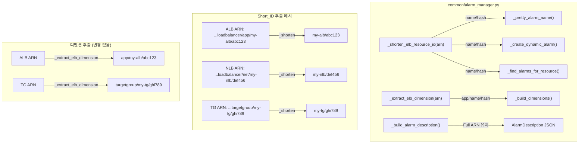

# Design Document: Alarm Name Short ID

## Overview

ALB/NLB/TG 리소스의 알람 이름 suffix `({resource_id})`에 전체 ARN 대신 짧은 식별자(Short_ID)를 사용하도록 변경한다.

현재 문제:
- TG ARN 예시: `arn:aws:elasticloadbalancing:us-east-1:949501913924:targetgroup/lb-tg-TestA-W92AEI92L2RJ/a53c5a4b6dcac9c5`
- 이 전체 ARN이 suffix에 들어가면 알람 이름이 불필요하게 길어지고, 255자 제한 내에서 label/metric 정보가 truncate될 가능성이 높아진다.

해결 방안:
- `_shorten_elb_resource_id()` 함수를 추가하여 ARN에서 `{name}/{hash}` 부분만 추출
- `_pretty_alarm_name()`과 `_create_dynamic_alarm()`에서 ALB/NLB/TG일 때 Short_ID를 suffix에 사용
- `_find_alarms_for_resource()`에서 새 Short_ID suffix와 레거시 Full_ARN suffix 모두 검색
- `AlarmDescription` 메타데이터의 `resource_id`는 항상 Full_ARN 유지 (매칭/역추적용)

변경 범위는 `common/alarm_manager.py` 내부에 한정되며, 새 모듈이나 외부 인터페이스 변경은 없다.

## Architecture

변경은 `alarm_manager.py` 내부의 알람 이름 생성과 검색 로직에만 영향을 준다.



### Short_ID vs Dimension 값 비교

| 리소스 | ARN | Short_ID (`_shorten_elb_resource_id`) | Dimension (`_extract_elb_dimension`) |
|--------|-----|---------------------------------------|--------------------------------------|
| ALB | `...loadbalancer/app/my-alb/abc123` | `my-alb/abc123` | `app/my-alb/abc123` |
| NLB | `...loadbalancer/net/my-nlb/def456` | `my-nlb/def456` | `net/my-nlb/def456` |
| TG | `...targetgroup/my-tg/ghi789` | `my-tg/ghi789` | `targetgroup/my-tg/ghi789` |

두 함수는 목적이 다르므로 독립적으로 유지한다:
- `_shorten_elb_resource_id()`: 알람 이름 가독성을 위한 짧은 식별자
- `_extract_elb_dimension()`: CloudWatch API가 요구하는 정확한 디멘션 값

## Components and Interfaces

### 1. 새 함수: `_shorten_elb_resource_id(resource_id: str, resource_type: str) -> str`

ALB/NLB/TG ARN에서 `{name}/{hash}` 부분만 추출한다.

```python
def _shorten_elb_resource_id(resource_id: str, resource_type: str) -> str:
    """ALB/NLB/TG ARN에서 짧은 식별자(name/hash)를 추출.

    - ALB: arn:...loadbalancer/app/{name}/{hash} → {name}/{hash}
    - NLB: arn:...loadbalancer/net/{name}/{hash} → {name}/{hash}
    - TG:  arn:...targetgroup/{name}/{hash}      → {name}/{hash}
    - EC2/RDS 또는 ARN이 아닌 입력: 그대로 반환 (방어적 처리)
    """
```

설계 결정:
- `resource_type` 파라미터를 받아 ALB/NLB/TG일 때만 변환 수행. EC2/RDS는 무변환.
- ARN 파싱 실패 시 원본 문자열 그대로 반환 (방어적 처리).
- 멱등성 보장: 이미 Short_ID 형태인 입력에 다시 적용해도 동일 결과.

### 2. 변경: `_pretty_alarm_name()`

suffix 생성 부분에서 `_shorten_elb_resource_id()` 호출을 추가한다.

```python
# 변경 전
suffix = f"({resource_id})"

# 변경 후
short_id = _shorten_elb_resource_id(resource_id, resource_type)
suffix = f"({short_id})"
```

`_pretty_alarm_name()`의 시그니처에 이미 `resource_type`이 있으므로 추가 파라미터 불필요.

### 3. 변경: `_create_dynamic_alarm()`

동적 태그 알람의 suffix도 동일하게 Short_ID를 사용한다.

```python
# 변경 전
suffix = f"({resource_id})"

# 변경 후
short_id = _shorten_elb_resource_id(resource_id, resource_type)
suffix = f"({short_id})"
```

`_create_dynamic_alarm()`에 `resource_type` 파라미터가 이미 존재하므로 추가 파라미터 불필요.

### 4. 변경: `_find_alarms_for_resource()`

새 Short_ID suffix와 레거시 Full_ARN suffix 모두 검색하도록 확장한다.

```python
# 변경 전
suffix = f"({resource_id})"

# 변경 후
short_id = _shorten_elb_resource_id(resource_id, resource_type)
suffixes = {f"({short_id})"}
if short_id != resource_id:
    suffixes.add(f"({resource_id})")  # 레거시 호환

def _collect(prefix: str, filter_suffix: bool = False) -> None:
    # ...
    if filter_suffix and not any(name.endswith(s) for s in suffixes):
        continue
```

`seen` set으로 중복 제거는 기존 로직 그대로 유지.

### 5. 변경 없음: `_build_alarm_description()`

`resource_id` 파라미터에 항상 Full_ARN이 전달되므로 변경 불필요. 호출부에서 Short_ID가 아닌 원본 `resource_id`를 전달하는 것을 유지한다.

## Data Models

### Short_ID 포맷

| 리소스 유형 | ARN 패턴 | Short_ID |
|------------|----------|----------|
| ALB | `arn:aws:elasticloadbalancing:{region}:{account}:loadbalancer/app/{name}/{hash}` | `{name}/{hash}` |
| NLB | `arn:aws:elasticloadbalancing:{region}:{account}:loadbalancer/net/{name}/{hash}` | `{name}/{hash}` |
| TG | `arn:aws:elasticloadbalancing:{region}:{account}:targetgroup/{name}/{hash}` | `{name}/{hash}` |
| EC2 | `i-0fd4bf757020d3714` | `i-0fd4bf757020d3714` (변환 없음) |
| RDS | `my-database` | `my-database` (변환 없음) |

### 알람 이름 변경 예시

변경 전 (TG):
```
[TG] my-service HealthyHostCount <2 (arn:aws:elasticloadbalancing:us-east-1:949501913924:targetgroup/lb-tg-TestA-W92AEI92L2RJ/a53c5a4b6dcac9c5)
```

변경 후 (TG):
```
[TG] my-service HealthyHostCount <2 (lb-tg-TestA-W92AEI92L2RJ/a53c5a4b6dcac9c5)
```

### AlarmDescription (변경 없음)

```json
{"metric_key":"HealthyHostCount","resource_id":"arn:aws:elasticloadbalancing:us-east-1:949501913924:targetgroup/lb-tg-TestA-W92AEI92L2RJ/a53c5a4b6dcac9c5","resource_type":"TG"}
```

`resource_id` 필드에는 항상 Full_ARN이 저장된다.


## Correctness Properties

*A property is a characteristic or behavior that should hold true across all valid executions of a system — essentially, a formal statement about what the system should do. Properties serve as the bridge between human-readable specifications and machine-verifiable correctness guarantees.*

### Property 1: ALB/NLB/TG Short_ID 추출 정확성

*For any* 유효한 ALB/NLB/TG ARN (`arn:aws:elasticloadbalancing:{region}:{account}:loadbalancer/app/{name}/{hash}`, `loadbalancer/net/{name}/{hash}`, `targetgroup/{name}/{hash}`)에 대해, `_shorten_elb_resource_id()`는 `{name}/{hash}` 형태의 문자열을 반환해야 하며, 이 결과에는 `arn:`, `loadbalancer/`, `app/`, `net/`, `targetgroup/` 접두사가 포함되지 않아야 한다.

**Validates: Requirements 1.1, 1.2, 1.3**

### Property 2: EC2/RDS 무변환

*For any* EC2 instance ID (`i-` 접두사) 또는 RDS identifier에 대해, `_shorten_elb_resource_id()`는 입력값을 그대로 반환해야 한다.

**Validates: Requirements 1.4**

### Property 3: 알람 이름 Short_ID suffix

*For any* `resource_type` ∈ `{ALB, NLB, TG}`와 유효한 ARN, resource_name, metric, threshold 조합에 대해, `_pretty_alarm_name()`이 반환하는 알람 이름은 `({short_id})`로 끝나야 하며, 여기서 `short_id`는 `_shorten_elb_resource_id(resource_id, resource_type)`의 반환값과 동일해야 한다.

**Validates: Requirements 2.1, 2.4**

### Property 4: 255자 제한 (ALB/NLB/TG 포함)

*For any* `resource_type` ∈ `{EC2, RDS, ALB, NLB, TG}`와 임의의 resource_id, resource_name, metric, threshold 조합에 대해, `_pretty_alarm_name()`이 반환하는 알람 이름은 항상 255자 이하여야 한다.

**Validates: Requirements 2.3**

### Property 5: 검색 결과 중복 없음

*For any* resource_id와 resource_type에 대해, `_find_alarms_for_resource()`가 반환하는 알람 이름 리스트에는 중복된 이름이 없어야 한다.

**Validates: Requirements 3.3**

### Property 6: AlarmDescription에 Full_ARN 유지

*For any* ALB/NLB/TG ARN에 대해 `_build_alarm_description()`에 전달되는 `resource_id`는 항상 원본 Full_ARN이어야 하며, 생성된 AlarmDescription JSON을 `_parse_alarm_metadata()`로 파싱하면 `resource_id` 필드에 원본 Full_ARN이 포함되어야 한다.

**Validates: Requirements 4.1**

### Property 7: Short_ID 추출 멱등성

*For any* 유효한 ALB/NLB/TG ARN에 대해, `_shorten_elb_resource_id()`를 한 번 적용한 결과에 다시 적용하면 동일한 결과를 반환해야 한다: `f(f(x)) == f(x)`.

**Validates: Requirements 5.3**

### Property 8: Short_ID와 Dimension 값 차이

*For any* 유효한 ALB/NLB ARN에 대해, `_shorten_elb_resource_id()`의 결과는 `_extract_elb_dimension()`의 결과와 달라야 한다 (Short_ID는 `name/hash`, Dimension은 `app/name/hash` 또는 `net/name/hash`).

**Validates: Requirements 5.2**

## Error Handling

### `_shorten_elb_resource_id()`

- ARN 파싱 실패 (예상 패턴 불일치): 원본 문자열 그대로 반환. 에러 로그 없음 (방어적 처리).
- `resource_type`이 ALB/NLB/TG가 아닌 경우: 원본 문자열 그대로 반환.
- 빈 문자열 입력: 빈 문자열 그대로 반환.

### `_find_alarms_for_resource()` 변경

- Short_ID suffix와 Full_ARN suffix 모두 검색 실패: 빈 리스트 반환 (기존 동작 유지).
- CloudWatch API 에러: `ClientError` catch + 로그, 해당 prefix 검색 skip (기존 동작 유지).

### 마이그레이션 시나리오

- 레거시 Full_ARN suffix 알람만 존재: `_find_alarms_for_resource()`가 Full_ARN suffix로 검색하여 정상 발견. `sync_alarms_for_resource()` 실행 시 삭제 후 Short_ID suffix로 재생성.
- 새 Short_ID suffix 알람만 존재: Short_ID suffix로 검색하여 정상 발견.
- 혼재 상태: 두 suffix 모두 검색하여 중복 없이 합산. `seen` set으로 중복 제거.

## Testing Strategy

### Property-Based Testing (hypothesis)

PBT 라이브러리: `hypothesis` (>=6.100, 프로젝트 기존 사용 중)

각 property test는 최소 100회 반복 실행하며, 설계 문서의 property를 참조하는 태그를 포함한다.

태그 형식: `Feature: alarm-name-short-id, Property {number}: {property_text}`

각 correctness property는 단일 property-based test로 구현한다:

| Property | 테스트 파일 | 전략 |
|----------|------------|------|
| Property 1 | `tests/test_pbt_short_id.py` | 랜덤 ALB/NLB/TG ARN 생성 → `_shorten_elb_resource_id()` 결과가 `{name}/{hash}` 패턴이고 접두사 미포함 검증 |
| Property 2 | `tests/test_pbt_short_id.py` | 랜덤 EC2 ID / RDS identifier 생성 → 입력 == 출력 검증 |
| Property 3 | `tests/test_pbt_short_id.py` | 랜덤 ALB/NLB/TG ARN + metric + threshold → `_pretty_alarm_name()` 결과가 `({short_id})`로 끝나는지 검증 |
| Property 4 | `tests/test_pbt_alarm_name_constraint.py` (기존 확장) | ALB/NLB/TG ARN을 포함한 전략 추가, 255자 제한 검증 |
| Property 5 | `tests/test_pbt_short_id.py` | moto 기반 알람 생성 후 `_find_alarms_for_resource()` 결과에 중복 없음 검증 |
| Property 6 | `tests/test_pbt_short_id.py` | 랜덤 ARN → `_build_alarm_description()` → `_parse_alarm_metadata()` 라운드트립, `resource_id` == 원본 ARN 검증 |
| Property 7 | `tests/test_pbt_short_id.py` | 랜덤 ARN → `f(f(x)) == f(x)` 멱등성 검증 |
| Property 8 | `tests/test_pbt_short_id.py` | 랜덤 ALB/NLB ARN → `_shorten_elb_resource_id()` != `_extract_elb_dimension()` 검증 |

### Unit Testing

단위 테스트는 구체적 예시, 엣지 케이스, 에러 조건에 집중한다:

| 테스트 파일 | 주요 테스트 케이스 |
|------------|-------------------|
| `tests/test_alarm_manager.py` | `_shorten_elb_resource_id()` 구체적 ARN 예시, ARN이 아닌 입력 방어적 처리, 빈 문자열 |
| `tests/test_alarm_manager.py` | `_pretty_alarm_name()` ALB/NLB/TG suffix 변경 확인, EC2/RDS 기존 동작 유지 |
| `tests/test_alarm_manager.py` | `_find_alarms_for_resource()` 레거시+새 포맷 혼재 검색, 중복 제거 (moto 기반) |
| `tests/test_alarm_manager.py` | `_build_alarm_description()` Full_ARN 유지 확인 |

### TDD 사이클

코딩 거버넌스 §8에 따라 레드-그린-리팩터링 사이클을 준수한다:
1. `_shorten_elb_resource_id()` 테스트 먼저 작성 → 함수 구현
2. `_pretty_alarm_name()` suffix 변경 테스트 → 구현 수정
3. `_create_dynamic_alarm()` suffix 변경 테스트 → 구현 수정
4. `_find_alarms_for_resource()` 호환성 테스트 → 검색 로직 확장
5. 전체 PBT 실행으로 회귀 확인
