# Design Document: Aurora RDS Monitoring

## Overview

This feature adds Aurora RDS as a new monitored resource type (`"AuroraRDS"`) to the AWS Monitoring Engine. Aurora instances share the `AWS/RDS` CloudWatch namespace and the same RDS lifecycle APIs as regular RDS, but expose Aurora-specific metrics (`FreeLocalStorage`, `AuroraReplicaLagMaximum`). The design extends existing modules rather than creating new ones — the RDS collector gains Aurora classification logic, the alarm manager gains `_AURORA_RDS_ALARMS`, and the daily monitor / remediation handler gain `"AuroraRDS"` routing.

Key design decisions:
- **Extend, don't fork**: Aurora collection lives inside `common/collectors/rds.py` because both types use `describe_db_instances` and the same tag/ARN APIs. A separate `aurora_rds.py` collector module would duplicate 90% of the RDS collector code.
- **Engine substring match**: Classification uses `"aurora" in engine.lower()` to cover `aurora`, `aurora-mysql`, `aurora-postgresql`, and future variants.
- **Shared dimension key**: Both RDS and AuroraRDS use `DBInstanceIdentifier` as the CloudWatch dimension, so `_build_dimensions()` needs no changes.
- **Remediation Handler resolution**: Since CloudTrail RDS events don't carry the Engine field, the handler must call `describe_db_instances` to determine Aurora vs. regular RDS at event time.

## Architecture

```mermaid
flowchart TD
    subgraph Collector["common/collectors/rds.py"]
        A[describe_db_instances paginator] --> B{Engine contains 'aurora'?}
        B -- Yes --> C["ResourceInfo(type='AuroraRDS')"]
        B -- No --> D["ResourceInfo(type='RDS')"]
    end

    subgraph AlarmManager["common/alarm_manager.py"]
        E["_get_alarm_defs('AuroraRDS')"] --> F["_AURORA_RDS_ALARMS"]
        E2["_get_alarm_defs('RDS')"] --> F2["_RDS_ALARMS"]
    end

    subgraph DailyMonitor["daily_monitor/lambda_handler.py"]
        G[_COLLECTOR_MODULES includes rds_collector] --> H[iterate resources]
        H --> I{resource.type}
        I -- AuroraRDS --> J[sync_alarms + get_aurora_metrics]
        I -- RDS --> K[sync_alarms + get_rds_metrics]
        L["_cleanup_orphan_alarms()"] --> M["alive_checkers['AuroraRDS'] = _find_alive_rds_instances"]
    end

    subgraph RemediationHandler["remediation_handler/lambda_handler.py"]
        N[parse_cloudtrail_event] --> O{RDS event?}
        O -- Yes --> P[describe_db_instances → check Engine]
        P --> Q{Aurora?}
        Q -- Yes --> R["resource_type = 'AuroraRDS'"]
        Q -- No --> S["resource_type = 'RDS'"]
    end
```



## Components and Interfaces

### 1. RDS Collector Extension (`common/collectors/rds.py`)

**Modified function: `collect_monitored_resources()`**
- After fetching each DB instance, inspect `db["Engine"]`.
- If `"aurora" in engine.lower()` → set `type="AuroraRDS"`, else `type="RDS"`.
- Skip logic (deleting/deleted status) and Monitoring=on tag check remain unchanged.

**New function: `get_aurora_metrics(db_instance_id, resource_tags=None)`**
- Queries 5 CloudWatch metrics from `AWS/RDS` with dimension `DBInstanceIdentifier`:
  - `CPUUtilization` → `"CPU"`
  - `FreeableMemory` (bytes→GB) → `"FreeMemoryGB"`
  - `DatabaseConnections` → `"Connections"`
  - `FreeLocalStorage` (bytes→GB) → `"FreeLocalStorageGB"`
  - `AuroraReplicaLagMaximum` (raw μs) → `"ReplicaLag"`
- Uses existing `_collect_metric()` helper and `query_metric()` from base.
- Returns `dict[str, float] | None` (None if all metrics empty).

**Existing `get_metrics()` unchanged** — continues to serve regular RDS.

### 2. Alarm Manager Extension (`common/alarm_manager.py`)

**New constant: `_AURORA_RDS_ALARMS`**
```python
_AURORA_RDS_ALARMS = [
    {"metric": "CPU", "namespace": "AWS/RDS", "metric_name": "CPUUtilization",
     "dimension_key": "DBInstanceIdentifier", "stat": "Average",
     "comparison": "GreaterThanThreshold", "period": 300, "evaluation_periods": 1},
    {"metric": "FreeMemoryGB", "namespace": "AWS/RDS", "metric_name": "FreeableMemory",
     "dimension_key": "DBInstanceIdentifier", "stat": "Average",
     "comparison": "LessThanThreshold", "period": 300, "evaluation_periods": 1,
     "transform_threshold": lambda gb: gb * 1073741824},
    {"metric": "Connections", "namespace": "AWS/RDS", "metric_name": "DatabaseConnections",
     "dimension_key": "DBInstanceIdentifier", "stat": "Average",
     "comparison": "GreaterThanThreshold", "period": 300, "evaluation_periods": 1},
    {"metric": "FreeLocalStorageGB", "namespace": "AWS/RDS", "metric_name": "FreeLocalStorage",
     "dimension_key": "DBInstanceIdentifier", "stat": "Average",
     "comparison": "LessThanThreshold", "period": 300, "evaluation_periods": 1,
     "transform_threshold": lambda gb: gb * 1073741824},
    {"metric": "ReplicaLag", "namespace": "AWS/RDS", "metric_name": "AuroraReplicaLagMaximum",
     "dimension_key": "DBInstanceIdentifier", "stat": "Maximum",
     "comparison": "GreaterThanThreshold", "period": 300, "evaluation_periods": 1},
]
```

**Modified: `_get_alarm_defs()`** — add `elif resource_type == "AuroraRDS": return _AURORA_RDS_ALARMS`.

**Modified: `_METRIC_DISPLAY`** — add entries:
- `"FreeLocalStorageGB": ("FreeLocalStorage", "<", "GB")`
- `"ReplicaLag": ("AuroraReplicaLagMaximum", ">", "μs")`

**Modified: `_HARDCODED_METRIC_KEYS`** — add `"AuroraRDS": {"CPU", "FreeMemoryGB", "Connections", "FreeLocalStorageGB", "ReplicaLag"}`.

**Modified: `_NAMESPACE_MAP`** — add `"AuroraRDS": ["AWS/RDS"]`.

**Modified: `_DIMENSION_KEY_MAP`** — add `"AuroraRDS": "DBInstanceIdentifier"`.

**Modified: `_metric_name_to_key()`** — add mappings:
- `"FreeLocalStorage": "FreeLocalStorageGB"`
- `"AuroraReplicaLagMaximum": "ReplicaLag"`

**Modified: `_find_alarms_for_resource()`** — add `"AuroraRDS"` to the default `type_prefixes` fallback list.

**`_build_dimensions()`** — no changes needed; the `else` branch already handles `{"Name": dim_key, "Value": resource_id}` which works for AuroraRDS with `DBInstanceIdentifier`.

### 3. Common Constants (`common/__init__.py`)

- Add `"AuroraRDS"` to `SUPPORTED_RESOURCE_TYPES`.
- Add to `HARDCODED_DEFAULTS`:
  - `"FreeLocalStorageGB": 10.0`
  - `"ReplicaLag": 2000000.0`
- Update TypedDict comments for `ResourceInfo`, `AlertMessage`, `RemediationAlertMessage`, `LifecycleAlertMessage` to include `"AuroraRDS"`.

### 4. Daily Monitor Integration (`daily_monitor/lambda_handler.py`)

**Modified: `_COLLECTOR_MODULES`** — no change needed. The `rds_collector` module already in the list now returns both RDS and AuroraRDS resources. The daily monitor iterates by `resource["type"]` which routes to the correct alarm defs.

**Modified: `_process_resource()`** — add AuroraRDS metric collection routing:
```python
if resource_type == "AuroraRDS":
    metrics = collector_mod.get_aurora_metrics(resource_id, resource_tags)
```

**Modified: `_cleanup_orphan_alarms()`** — add to `alive_checkers`:
```python
"AuroraRDS": _find_alive_rds_instances,
```

**Modified: `_classify_alarm()`** — already handles `[AuroraRDS]` prefix via the `_NEW_FORMAT_RE` regex `^\[(\w+)\]\s.*\((.+)\)$` which captures any word characters in brackets. No code change needed.

**Modified: `_process_resource()` threshold comparison** — add `"FreeLocalStorageGB"` to the "less-than" comparison set alongside `"FreeMemoryGB"` and `"FreeStorageGB"`.

### 5. Remediation Handler (`remediation_handler/lambda_handler.py`)

**New helper: `_resolve_rds_aurora_type(db_instance_id)`**
- Calls `describe_db_instances(DBInstanceIdentifier=db_instance_id)`.
- Returns `"AuroraRDS"` if Engine contains `"aurora"`, else `"RDS"`.
- On API error, falls back to `"RDS"` with warning log.

**Modified: `parse_cloudtrail_event()`**
- After extracting `resource_type == "RDS"` from `_API_MAP`, call `_resolve_rds_aurora_type()` to refine to `"AuroraRDS"` when applicable.

**Modified: `_execute_remediation()`**
- Add `"AuroraRDS"` case that calls `rds.stop_db_instance()` (same as RDS).

**Modified: `get_resource_tags()` in `tag_resolver.py`**
- Add `"AuroraRDS"` to the RDS branch: `elif resource_type in ("RDS", "AuroraRDS"):`.

### 6. Tag Resolver (`common/tag_resolver.py`)

**Modified: `get_resource_tags()`** — treat `"AuroraRDS"` same as `"RDS"` for tag retrieval (both use `describe_db_instances` + `list_tags_for_resource`).

## Data Models

### Aurora Alarm Definition Schema

Each entry in `_AURORA_RDS_ALARMS` follows the existing alarm definition dict structure:

| Field | Type | Description |
|-------|------|-------------|
| `metric` | `str` | Internal metric key (e.g., `"FreeLocalStorageGB"`) |
| `namespace` | `str` | Always `"AWS/RDS"` for Aurora |
| `metric_name` | `str` | CloudWatch metric name (e.g., `"FreeLocalStorage"`) |
| `dimension_key` | `str` | Always `"DBInstanceIdentifier"` |
| `stat` | `str` | `"Average"` or `"Maximum"` |
| `comparison` | `str` | `"GreaterThanThreshold"` or `"LessThanThreshold"` |
| `period` | `int` | `300` (5 minutes) |
| `evaluation_periods` | `int` | `1` |
| `transform_threshold` | `callable \| None` | GB→bytes converter for memory/storage metrics |

### HARDCODED_DEFAULTS Additions

| Key | Value | Unit | Description |
|-----|-------|------|-------------|
| `FreeLocalStorageGB` | `10.0` | GB | Aurora local storage free space minimum |
| `ReplicaLag` | `2000000.0` | μs | Aurora replica lag maximum (2 seconds) |

### ResourceInfo Type Extension

The `type` field of `ResourceInfo` TypedDict gains `"AuroraRDS"` as a valid value. Same for `AlertMessage.resource_type`, `RemediationAlertMessage.resource_type`, and `LifecycleAlertMessage.resource_type`.


## Correctness Properties

*A property is a characteristic or behavior that should hold true across all valid executions of a system — essentially, a formal statement about what the system should do. Properties serve as the bridge between human-readable specifications and machine-verifiable correctness guarantees.*

### Property 1: Engine-based Aurora Classification

*For any* DB instance with an engine string, the collector SHALL classify it as `"AuroraRDS"` if and only if the engine string contains the substring `"aurora"` (case-insensitive); otherwise it SHALL classify it as `"RDS"`.

**Validates: Requirements 1.1, 1.2, 1.3**

### Property 2: Bytes-to-GB Conversion Consistency

*For any* positive byte value returned by CloudWatch for FreeableMemory or FreeLocalStorage, the collector's bytes-to-GB conversion SHALL produce a value equal to `bytes_value / 1073741824`, and the alarm manager's `transform_threshold` SHALL produce the inverse: `gb_value * 1073741824`. Composing both transformations (GB → bytes → GB) SHALL return the original GB value.

**Validates: Requirements 2.4, 2.6, 4.2, 4.3**

### Property 3: Aurora Alarm Name Prefix and Metadata

*For any* AuroraRDS resource ID and any metric from the `_AURORA_RDS_ALARMS` definitions, the generated alarm name SHALL start with `"[AuroraRDS] "` and the `AlarmDescription` JSON metadata SHALL contain `"resource_type":"AuroraRDS"`.

**Validates: Requirements 5.1, 5.2**

### Property 4: Alarm Classification from Name Prefix

*For any* alarm name matching the pattern `[AuroraRDS] ... (db_instance_id)`, the `_classify_alarm()` function SHALL extract `"AuroraRDS"` as the resource type and the correct `db_instance_id` from the parenthesized suffix.

**Validates: Requirements 7.2**

### Property 5: Alarm Search Prefix and Suffix

*For any* AuroraRDS `db_instance_id`, searching for alarms with `_find_alarms_for_resource(db_instance_id, "AuroraRDS")` SHALL use prefix `"[AuroraRDS] "` and filter results by suffix `"({db_instance_id})"`. When no `resource_type` is specified, the search SHALL include `"[AuroraRDS] "` in the default prefix list.

**Validates: Requirements 8.1, 8.2**

### Property 6: RDS CloudTrail Event Aurora Resolution

*For any* RDS CloudTrail event (CreateDBInstance, DeleteDBInstance, ModifyDBInstance, AddTagsToResource, RemoveTagsFromResource) targeting a DB instance whose Engine field contains `"aurora"`, the remediation handler SHALL resolve the resource type to `"AuroraRDS"`. For events targeting non-Aurora engines, it SHALL resolve to `"RDS"`.

**Validates: Requirements 9.1, 9.2, 9.3, 9.4**

### Property 7: Tag-Based Threshold Override for AuroraRDS

*For any* AuroraRDS metric key in `{"CPU", "FreeMemoryGB", "FreeLocalStorageGB", "ReplicaLag", "Connections"}` and any valid positive numeric `Threshold_*` tag value, the alarm manager SHALL use the tag value as the alarm threshold instead of the `HARDCODED_DEFAULTS` value. The created alarm's CloudWatch threshold SHALL equal `transform_threshold(tag_value)` when a transform exists, or `tag_value` directly otherwise.

**Validates: Requirements 10.1, 10.2, 10.3, 10.4, 10.5**

## Error Handling

| Scenario | Handling | Log Level |
|----------|----------|-----------|
| `describe_db_instances` API failure in collector | Raise `ClientError` (caller handles) | `error` |
| `describe_db_instances` failure in remediation handler Aurora resolution | Fall back to `"RDS"` resource type | `warning` |
| Individual Aurora metric has no CloudWatch data | Skip metric, continue with others | `info` |
| All Aurora metrics have no data | Return `None` from `get_aurora_metrics()` | `info` |
| `list_tags_for_resource` failure for Aurora instance | Return empty dict (existing behavior) | `error` |
| Invalid `Threshold_*` tag value (non-numeric, negative, zero) | Skip tag, use fallback threshold | `warning` |
| Orphan alarm deletion failure | Log error, continue with remaining alarms | `error` |
| `put_metric_alarm` failure for Aurora alarm | Log error, skip that alarm, continue | `error` |

Error handling follows existing patterns (governance §4): catch `ClientError` only at AWS API boundaries, use `logger.error()` with `%s` formatting, never swallow exceptions silently.

## Testing Strategy

### Unit Tests (`tests/test_collectors.py`, `tests/test_alarm_manager.py`)

Unit tests use `moto` for AWS service mocking and verify specific examples:

- **Collector classification**: Create mock RDS instances with engines `"aurora-mysql"`, `"aurora-postgresql"`, `"mysql"`, `"postgres"` — verify correct type assignment.
- **Aurora metric collection**: Mock CloudWatch with known datapoints — verify `get_aurora_metrics()` returns correct keys and converted values.
- **Alarm definitions**: Verify `_get_alarm_defs("AuroraRDS")` returns 5 definitions with correct metric names, namespaces, and configurations.
- **Alarm creation**: Create alarms for an AuroraRDS instance — verify alarm names, descriptions, dimensions, and thresholds.
- **Orphan cleanup**: Create AuroraRDS alarms, delete the DB instance, run cleanup — verify alarms are deleted.
- **Remediation handler**: Mock CloudTrail events for Aurora instances — verify resource type resolution.
- **HARDCODED_DEFAULTS**: Verify `FreeLocalStorageGB` and `ReplicaLag` entries exist with correct values.
- **Edge cases**: Deleting/deleted Aurora instances skipped, all-metrics-empty returns None, API errors handled gracefully.

### Property-Based Tests (`tests/test_pbt_aurora_rds.py`)

Property-based tests use `hypothesis` (minimum 100 iterations per test) to verify universal properties:

Each test is tagged with: **Feature: aurora-rds-monitoring, Property {N}: {title}**

- **Property 1 test**: Generate random engine strings (with and without "aurora" substring in various cases). Verify classification matches the substring check invariant.
- **Property 2 test**: Generate random positive floats. Verify `transform_threshold(value / BYTES_PER_GB) ≈ value` (round-trip within floating-point tolerance).
- **Property 3 test**: Generate random valid DB instance IDs and pick random metrics from `_AURORA_RDS_ALARMS`. Verify alarm name prefix and description metadata.
- **Property 4 test**: Generate random AuroraRDS alarm names matching the `[AuroraRDS] ... (id)` pattern. Verify `_classify_alarm()` extracts correct type and ID.
- **Property 5 test**: Generate random DB instance IDs. Verify `_find_alarms_for_resource()` searches with correct prefix/suffix for AuroraRDS.
- **Property 6 test**: Generate random DB instance IDs and random Aurora/non-Aurora engine strings. Mock `describe_db_instances` to return the engine. Verify resolution produces correct resource type.
- **Property 7 test**: Generate random positive threshold values for each AuroraRDS metric. Verify `get_threshold()` returns the tag value when present, and that `transform_threshold` (when applicable) produces the correct CloudWatch threshold.

### Test Configuration

- PBT library: `hypothesis` (>=6.100)
- Minimum iterations: 100 per property (`@settings(max_examples=100)`)
- Test file naming: `tests/test_pbt_aurora_rds.py` (governance §8)
- AWS mocking: `moto` decorators for integration-level property tests
- Each property test references its design document property number in a comment tag
