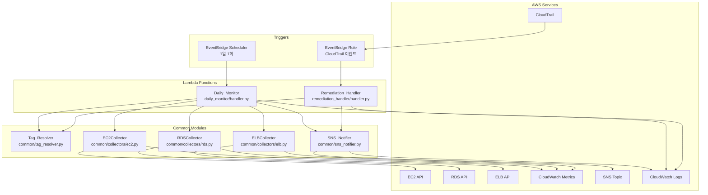

# Design Document: AWS Monitoring Engine

## Overview

AWS Monitoring Engine은 EC2, RDS, ELB 리소스를 대상으로 하는 Headless 서버리스 모니터링 자동화 엔진이다.
UI나 DB 없이 AWS 태그(Tags)만을 기준으로 동작하며, EventBridge Scheduler + Lambda(Python) 조합으로 구성된다.

핵심 기능은 세 가지다:
1. **정기 모니터링**: 1일 1회 `Monitoring=on` 태그 리소스의 메트릭을 수집하고 임계치 초과 시 SNS 알림 발송
2. **태그 기반 동적 임계치**: 리소스 태그 → 환경 변수 순으로 임계치를 조회하는 Tag_Resolver
3. **무단 변경 감지 및 Auto-Remediation**: CloudTrail 이벤트 기반 실시간 감지 후 자동 복구

단일 `template.yaml`(SAM)으로 전체 인프라를 배포하며, 향후 DB/UI 확장을 고려한 모듈화 구조를 갖는다.

---

## Architecture

### 전체 아키텍처 다이어그램



### 데이터 흐름

**Daily Monitor 흐름:**
```
EventBridge Scheduler
  → Daily_Monitor.handler()
    → EC2Collector.collect() / RDSCollector.collect() / ELBCollector.collect()
      → Tag_Resolver.get_threshold(resource_id, metric)
      → metric > threshold → SNS_Notifier.send_alert()
```

**Remediation Handler 흐름 (스펙 변경):**
```
CloudTrail Modify API Event
  → EventBridge Rule
    → Remediation_Handler.handler()
      → parse_event(event)
      → Tag_Resolver.has_monitoring_tag(resource_id)
      → Auto_Remediation(resource_type, resource_id)
      → SNS_Notifier.send_remediation_alert()
```

**Remediation Handler 흐름 (리소스 삭제):**
```
CloudTrail Delete API Event (TerminateInstances, DeleteDBInstance, DeleteLoadBalancer)
  → EventBridge Rule
    → Remediation_Handler.handler()
      → parse_event(event) → event_category = "DELETE"
      → Tag_Resolver.has_monitoring_tag(resource_id)
      → (태그 있으면) SNS_Notifier.send_lifecycle_alert("RESOURCE_DELETED")
```

**Remediation Handler 흐름 (태그 변경):**
```
CloudTrail Tag API Event (CreateTags, DeleteTags)
  → EventBridge Rule
    → Remediation_Handler.handler()
      → parse_event(event) → event_category = "TAG_CHANGE"
      → Monitoring=on 태그 제거 → SNS_Notifier.send_lifecycle_alert("MONITORING_REMOVED")
      → Monitoring=on 태그 추가 → CloudWatch Logs 기록 ("모니터링 대상에 추가됨")
```

---

## Components and Interfaces

### 디렉터리 구조

```
aws-monitoring-engine/
├── template.yaml                    # SAM 배포 템플릿
├── daily_monitor/
│   └── handler.py                   # Daily_Monitor Lambda 핸들러
├── remediation_handler/
│   └── handler.py                   # Remediation_Handler Lambda 핸들러
└── common/
    ├── tag_resolver.py              # Tag_Resolver 모듈
    ├── sns_notifier.py              # SNS_Notifier 모듈
    └── collectors/
        ├── ec2.py                   # EC2Collector
        ├── rds.py                   # RDSCollector
        └── elb.py                   # ELBCollector
```

### Tag_Resolver (`common/tag_resolver.py`)

태그 → 환경 변수 순으로 설정값을 조회하는 모듈. 향후 DB 교체를 고려한 인터페이스 제공.

```python
# 시스템 하드코딩 기본값 (최종 폴백)
HARDCODED_DEFAULTS = {
    "CPU": 80.0,
    "Memory": 80.0,
    "Connections": 100.0,
}

def get_threshold(resource_tags: dict, metric_name: str) -> float:
    """
    리소스 태그에서 임계치를 조회.
    조회 우선순위: 태그 값 → 환경 변수 기본값 → 시스템 하드코딩 기본값.
    어떤 경우에도 유효한 양의 숫자를 반환하며, 절대 None을 반환하거나 예외를 발생시키지 않는다.
    metric_name: 'CPU' | 'Memory' | 'Connections'
    """

def has_monitoring_tag(resource_tags: dict) -> bool:
    """Monitoring=on 태그 존재 여부 반환"""

def get_resource_tags(resource_id: str, resource_type: str) -> dict:
    """AWS API를 통해 리소스 태그 조회"""
```

**설계 결정**:
- `get_threshold`는 태그 딕셔너리를 직접 받아 AWS API 의존성을 분리한다. 단위 테스트 시 AWS API 호출 없이 태그 딕셔너리만으로 테스트 가능하다.
- `get_threshold`는 3단계 폴백 체인(태그 → 환경 변수 → 하드코딩 기본값)을 통해 어떤 상황에서도 유효한 양의 숫자를 반환한다. 이는 시스템 안정성을 보장하기 위한 핵심 설계 원칙이다.

**폴백 로직 상세:**
```python
def get_threshold(resource_tags: dict, metric_name: str) -> float:
    # 1단계: 태그에서 조회
    tag_key = f"Threshold_{metric_name}"
    tag_value = resource_tags.get(tag_key)
    if tag_value is not None:
        try:
            val = float(tag_value)
            if val > 0:
                return val
        except (ValueError, TypeError):
            pass  # 무효 태그 → 다음 단계로

    # 2단계: 환경 변수에서 조회
    env_key = f"DEFAULT_{metric_name.upper()}_THRESHOLD"
    env_value = os.environ.get(env_key)
    if env_value is not None:
        try:
            val = float(env_value)
            if val > 0:
                return val
        except (ValueError, TypeError):
            pass  # 무효 환경 변수 → 다음 단계로

    # 3단계: 시스템 하드코딩 기본값 (최종 폴백)
    return HARDCODED_DEFAULTS[metric_name]
```

### SNS_Notifier (`common/sns_notifier.py`)

```python
def send_alert(resource_id: str, resource_type: str, metric_name: str,
               current_value: float, threshold: float) -> None:
    """임계치 초과 알림 발송. 실패 시 CloudWatch Logs에 기록하고 예외를 삼킨다."""

def send_remediation_alert(resource_id: str, resource_type: str,
                           change_summary: str, action_taken: str) -> None:
    """Auto-Remediation 완료 알림 발송."""

def send_lifecycle_alert(resource_id: str, resource_type: str,
                         event_type: str, message: str) -> None:
    """리소스 생명주기 변경 알림 발송. event_type: 'RESOURCE_DELETED' | 'MONITORING_REMOVED'"""

def send_error_alert(context: str, error: Exception) -> None:
    """운영 오류 알림 발송."""
```

### EC2Collector (`common/collectors/ec2.py`)

```python
def collect_monitored_resources() -> list[dict]:
    """Monitoring=on 태그가 있는 EC2 인스턴스 목록 반환. 삭제/종료된 인스턴스는 제외하고 로그 기록."""

def get_metrics(instance_id: str) -> dict[str, float] | None:
    """CloudWatch에서 CPU, Memory 메트릭 조회. 데이터 없거나 InsufficientData이면 None 반환."""
```

### RDSCollector / ELBCollector

EC2Collector와 동일한 인터페이스 패턴을 따른다:
- `collect_monitored_resources() -> list[dict]` (삭제/종료된 리소스 제외, 로그 기록)
- `get_metrics(resource_id: str) -> dict[str, float] | None` (데이터 없으면 None 반환)

RDS는 CPU, Connections 메트릭, ELB는 RequestCount, HealthyHostCount 메트릭을 수집한다.

### Lambda 핸들러

핸들러는 비즈니스 로직 없이 공통 모듈 호출만 담당한다:

```python
# daily_monitor/handler.py
def handler(event, context):
    for collector in [EC2Collector, RDSCollector, ELBCollector]:
        resources = collector.collect_monitored_resources()  # 삭제/종료된 리소스는 이미 제외됨
        for resource in resources:
            metrics = collector.get_metrics(resource['id'])
            if metrics is None:
                logger.info(f"Skipping {resource['id']}: no metric data or InsufficientData")
                continue
            for metric_name, value in metrics.items():
                threshold = tag_resolver.get_threshold(resource['tags'], metric_name)
                if value > threshold:
                    sns_notifier.send_alert(...)
```

```python
# remediation_handler/handler.py
def handler(event, context):
    resource_id, resource_type, change_summary, event_category = parse_cloudtrail_event(event)
    # event_category: "MODIFY" | "DELETE" | "TAG_CHANGE"

    if event_category == "TAG_CHANGE":
        handle_tag_change(event, resource_id, resource_type)
        return

    tags = tag_resolver.get_resource_tags(resource_id, resource_type)

    if event_category == "DELETE":
        if tag_resolver.has_monitoring_tag(tags):
            sns_notifier.send_lifecycle_alert(resource_id, resource_type,
                "RESOURCE_DELETED", "Monitoring=on 리소스가 삭제됨")
        return

    # event_category == "MODIFY"
    if not tag_resolver.has_monitoring_tag(tags):
        return
    perform_remediation(resource_type, resource_id)
    sns_notifier.send_remediation_alert(...)

def handle_tag_change(event, resource_id, resource_type):
    tag_key, tag_value, action = parse_tag_change(event)
    if tag_key != "Monitoring":
        return
    if action == "DELETE" or (action == "CREATE" and tag_value != "on"):
        # Monitoring 태그 제거됨
        sns_notifier.send_lifecycle_alert(resource_id, resource_type,
            "MONITORING_REMOVED", "모니터링 대상에서 제외됨")
    elif action == "CREATE" and tag_value == "on":
        # Monitoring=on 태그 추가됨
        logger.info(f"모니터링 대상에 추가됨: {resource_id} ({resource_type})")
```

---

## Data Models

### ResourceInfo

수집된 리소스 정보를 담는 딕셔너리 구조:

```python
ResourceInfo = {
    "id": str,           # 리소스 ID (예: "i-1234567890abcdef0")
    "type": str,         # "EC2" | "RDS" | "ELB"
    "tags": dict,        # {"Monitoring": "on", "Threshold_CPU": "90", ...}
    "region": str,       # AWS 리전
}
```

### AlertMessage

SNS로 발송되는 알림 메시지 JSON 구조:

```python
AlertMessage = {
    "alert_type": str,       # "THRESHOLD_EXCEEDED" | "REMEDIATION_PERFORMED" | "ERROR"
    "resource_id": str,
    "resource_type": str,    # "EC2" | "RDS" | "ELB"
    "metric_name": str,      # "CPU" | "Memory" | "Connections" 등
    "current_value": float,
    "threshold": float,
    "timestamp": str,        # ISO 8601
    "message": str,          # 사람이 읽을 수 있는 요약
}
```

### RemediationAlertMessage

```python
RemediationAlertMessage = {
    "alert_type": "REMEDIATION_PERFORMED",
    "resource_id": str,
    "resource_type": str,
    "change_summary": str,   # 감지된 변경 내용 요약
    "action_taken": str,     # "STOPPED" | "DELETED"
    "timestamp": str,
}
```

### ThresholdConfig

Tag_Resolver가 반환하는 임계치 설정:

```python
ThresholdConfig = {
    "value": float,          # 임계치 값 (양의 숫자)
    "source": str,           # "tag" | "env" | "default"
    "metric_name": str,
}
```

### LifecycleAlertMessage

```python
LifecycleAlertMessage = {
    "alert_type": str,       # "RESOURCE_DELETED" | "MONITORING_REMOVED"
    "resource_id": str,
    "resource_type": str,    # "EC2" | "RDS" | "ELB"
    "message": str,          # 사람이 읽을 수 있는 요약
    "timestamp": str,        # ISO 8601
}
```

### CloudTrail 이벤트 파싱 대상 API

| 리소스 | 이벤트 카테고리 | 감지 대상 API |
|--------|----------------|--------------|
| EC2    | 스펙 변경 | `ModifyInstanceAttribute`, `ModifyInstanceType` |
| RDS    | 스펙 변경 | `ModifyDBInstance` |
| ELB    | 스펙 변경 | `ModifyLoadBalancerAttributes`, `ModifyListener` |
| EC2    | 리소스 삭제 | `TerminateInstances` |
| RDS    | 리소스 삭제 | `DeleteDBInstance` |
| ELB    | 리소스 삭제 | `DeleteLoadBalancer` |
| 공통   | 태그 변경 | `CreateTags`, `DeleteTags` |

---

## Correctness Properties


*A property is a characteristic or behavior that should hold true across all valid executions of a system — essentially, a formal statement about what the system should do. Properties serve as the bridge between human-readable specifications and machine-verifiable correctness guarantees.*

### Property 1: 수집 결과 필터링 정확성

*For any* EC2/RDS/ELB 리소스 목록(Monitoring=on 태그 있는 것과 없는 것 혼합)에 대해, 각 Collector의 `collect_monitored_resources()`가 반환하는 목록은 반드시 `Monitoring=on` 태그를 가진 리소스만 포함해야 하며, `Monitoring=on` 태그가 있는 리소스는 하나도 누락되어서는 안 된다.

**Validates: Requirements 1.1, 1.2**

### Property 2: 태그 임계치 우선 적용

*For any* 유효한 양의 숫자 값을 가진 `Threshold_CPU`, `Threshold_Memory`, `Threshold_Connections` 태그가 있는 리소스에 대해, `Tag_Resolver.get_threshold()`는 환경 변수 기본값이 아닌 해당 태그 값을 반환해야 한다.

**Validates: Requirements 2.1**

### Property 3: 환경 변수 기본값 폴백

*For any* 임계치 태그가 없는 리소스와 임의의 환경 변수 기본값 설정에 대해, `Tag_Resolver.get_threshold()`는 해당 환경 변수에 설정된 기본값을 반환해야 한다.

**Validates: Requirements 2.2**

### Property 4: 잘못된 임계치 태그 무효 처리

*For any* 유효하지 않은 임계치 태그 값(음수, 0, 비숫자 문자열, 빈 문자열 등)을 가진 리소스에 대해, `Tag_Resolver.get_threshold()`는 해당 태그를 무시하고 환경 변수 기본값을 반환해야 한다.

**Validates: Requirements 2.3**

### Property 5: 삭제된 리소스 수집 제외

*For any* `Monitoring=on` 태그가 있었으나 이미 삭제되었거나 존재하지 않는 리소스에 대해, Daily_Monitor는 해당 리소스를 수집 대상에서 제외해야 하며, 제외 사실을 CloudWatch Logs에 기록해야 한다.

**Validates: Requirements 1.5**

### Property 6: InsufficientData 메트릭 알림 건너뛰기

*For any* CloudWatch 메트릭 조회 결과 데이터가 없거나 InsufficientData 상태인 리소스에 대해, Daily_Monitor는 해당 리소스의 임계치 비교 및 알림 발송을 수행하지 않아야 하며, 건너뛴 사실을 CloudWatch Logs에 기록해야 한다.

**Validates: Requirements 3.5**

### Property 7: 임계치 초과 알림 메시지 완전성

*For any* 임계치를 초과한 리소스 메트릭에 대해, `SNS_Notifier.send_alert()`가 발송하는 JSON 메시지는 `resource_id`, `resource_type`, `metric_name`, `current_value`, `threshold` 필드를 모두 포함해야 하며, 유효한 JSON으로 파싱 가능해야 한다.

**Validates: Requirements 3.1, 3.2**

### Property 8: 복수 리소스 개별 알림 발송

*For any* N개(N ≥ 1)의 임계치 초과 리소스 목록에 대해, Daily_Monitor 실행 결과 정확히 N개의 SNS 알림이 발송되어야 한다.

**Validates: Requirements 3.3**

### Property 9: Monitoring 태그 기반 Remediation 필터링

*For any* CloudTrail 변경 이벤트에 대해, `Monitoring=on` 태그가 없는 리소스는 remediation 액션이 수행되지 않아야 하며, `Monitoring=on` 태그가 있는 리소스는 반드시 remediation 액션이 수행되어야 한다.

**Validates: Requirements 4.2, 4.3**

### Property 10: 리소스 유형별 Remediation 액션 정확성

*For any* `Monitoring=on` 태그가 있는 리소스에 대해, Remediation_Handler가 수행하는 액션은 리소스 유형에 따라 EC2→stop, RDS→stop, ELB→delete 규칙을 항상 준수해야 한다.

**Validates: Requirements 5.1**

### Property 11: Remediation 완료 알림 메시지 완전성

*For any* 완료된 Auto-Remediation에 대해, `SNS_Notifier.send_remediation_alert()`가 발송하는 메시지는 `resource_id`, `resource_type`, `change_summary`, `action_taken` 필드를 모두 포함해야 한다.

**Validates: Requirements 5.2**

### Property 12: Remediation 사전 로그 기록

*For any* remediation 수행 전, Remediation_Handler는 `resource_id`, 변경 이벤트 요약, 수행 예정 액션을 CloudWatch Logs에 기록해야 하며, 이 로그는 실제 remediation 액션 호출보다 먼저 기록되어야 한다.

**Validates: Requirements 5.4**

### Property 13: Tag_Resolver 절대 유효값 반환 보장

*For any* 리소스에 대해, `Tag_Resolver.get_threshold()`는 항상 유효한 양의 숫자(> 0)를 반환해야 하며, 절대 None을 반환하거나 예외를 발생시키지 않아야 한다. 태그 값과 환경 변수 기본값 모두 사용할 수 없는 경우에도 시스템 하드코딩 기본값(CPU: 80, Memory: 80, Connections: 100)을 반환해야 한다.

**Validates: Requirements 2.5**

### Property 14: 리소스 삭제 이벤트 알림 정확성

*For any* `Monitoring=on` 태그가 있는 리소스의 삭제 이벤트(TerminateInstances, DeleteDBInstance, DeleteLoadBalancer)에 대해, Remediation_Handler는 "Monitoring=on 리소스가 삭제됨" 내용을 포함한 SNS 알림을 발송해야 하며, `Monitoring=on` 태그가 없는 리소스의 삭제 이벤트는 무시해야 한다.

**Validates: Requirements 8.1, 8.2, 8.3**

### Property 15: 태그 제거 시 알림 발송

*For any* `DeleteTags` 이벤트에서 `Monitoring=on` 태그가 제거된 경우, Remediation_Handler는 "모니터링 대상에서 제외됨" 내용을 포함한 SNS 알림을 발송해야 한다.

**Validates: Requirements 8.5**

### Property 16: 태그 추가 시 로그 기록

*For any* `CreateTags` 이벤트에서 `Monitoring=on` 태그가 추가된 경우, Remediation_Handler는 "모니터링 대상에 추가됨" 내용을 CloudWatch Logs에 기록해야 하며, SNS 알림은 발송하지 않아야 한다.

**Validates: Requirements 8.6**

---

## Error Handling

### 오류 처리 원칙

1. **격리(Isolation)**: 단일 리소스 처리 실패가 전체 실행을 중단시키지 않는다.
2. **가시성(Visibility)**: 모든 오류는 CloudWatch Logs에 기록된다.
3. **알림(Notification)**: 운영 오류(AWS API 실패, remediation 실패)는 SNS를 통해 즉시 알림.
4. **계속 진행(Continue)**: SNS 발송 실패는 로그만 기록하고 나머지 처리를 계속한다.

### 오류 유형별 처리

| 오류 유형 | 처리 방식 | 알림 |
|-----------|-----------|------|
| AWS API 호출 실패 (수집) | 로그 기록 후 SNS 오류 알림 | O |
| 삭제/종료된 리소스 수집 | 수집 대상에서 제외, 로그 기록 | X |
| CloudWatch 메트릭 데이터 없음/InsufficientData | 임계치 비교 건너뛰기, 로그 기록 | X |
| 임계치 태그 값 무효 | 기본값으로 폴백, 로그 기록 | X |
| 환경 변수 기본값 무효/미설정 | 시스템 하드코딩 기본값으로 폴백, 로그 기록 | X |
| SNS 발송 실패 | 로그 기록, 나머지 리소스 계속 처리 | X |
| CloudTrail 이벤트 파싱 실패 | 로그 기록 후 SNS 오류 알림 | O |
| 삭제/태그 변경 이벤트 파싱 실패 | 로그 기록 후 SNS 오류 알림 | O |
| Auto-Remediation 실패 | 로그 기록 후 SNS 즉시 알림 | O |

### 오류 처리 패턴

```python
# 리소스별 격리 패턴 (Daily_Monitor)
for resource in resources:
    try:
        metrics = collector.get_metrics(resource['id'])
        if metrics is None:
            logger.info(f"Skipping {resource['id']}: no metric data or InsufficientData")
            continue
        # ... 임계치 비교 및 알림
    except Exception as e:
        logger.error(f"Failed to process {resource['id']}: {e}")
        sns_notifier.send_error_alert(f"metric collection for {resource['id']}", e)
        continue  # 다음 리소스 처리 계속

# SNS 발송 실패 격리 패턴 (SNS_Notifier)
def send_alert(...):
    try:
        sns_client.publish(...)
    except Exception as e:
        logger.error(f"SNS publish failed: {e}")
        # 예외를 삼키고 호출자에게 전파하지 않음
```

---

## Testing Strategy

### 이중 테스트 접근법

단위 테스트와 속성 기반 테스트를 함께 사용하여 포괄적인 커버리지를 달성한다.

- **단위 테스트**: 특정 예시, 엣지 케이스, 오류 조건 검증
- **속성 기반 테스트**: 임의 입력에 대한 보편적 속성 검증 (최소 100회 반복)

### 속성 기반 테스트 라이브러리

Python의 **Hypothesis** 라이브러리를 사용한다.

```
pip install hypothesis pytest
```

### 속성 기반 테스트 구성

각 속성 테스트는 최소 100회 반복 실행하며, 설계 문서의 속성을 참조하는 태그를 포함한다.

```python
from hypothesis import given, settings, HealthCheck
from hypothesis import strategies as st

# 태그 형식: Feature: aws-monitoring-engine, Property 1: 수집 결과 필터링 정확성
@settings(max_examples=100, suppress_health_check=[HealthCheck.too_slow])
@given(st.lists(st.fixed_dictionaries({
    "id": st.text(min_size=1),
    "tags": st.dictionaries(st.text(), st.text()),
})))
def test_property_1_collection_filter(resources):
    """Feature: aws-monitoring-engine, Property 1: 수집 결과 필터링 정확성"""
    ...
```

### 속성 테스트 목록

| 속성 | 테스트 파일 | 전략 |
|------|------------|------|
| P1: 수집 필터링 | `tests/test_collectors.py` | 임의 리소스 목록 생성 |
| P2: 태그 임계치 우선 | `tests/test_tag_resolver.py` | 임의 양의 숫자 태그 값 |
| P3: 환경변수 기본값 | `tests/test_tag_resolver.py` | 임의 환경변수 값 |
| P4: 잘못된 임계치 처리 | `tests/test_tag_resolver.py` | 잘못된 값 생성 전략 |
| P5: 삭제된 리소스 제외 | `tests/test_collectors.py` | 삭제/종료 상태 리소스 포함 목록 |
| P6: InsufficientData 건너뛰기 | `tests/test_daily_monitor.py` | 메트릭 데이터 없음/InsufficientData 시나리오 |
| P7: 알림 메시지 완전성 | `tests/test_sns_notifier.py` | 임의 메트릭 값 |
| P8: 복수 리소스 알림 | `tests/test_daily_monitor.py` | 임의 크기 리소스 목록 |
| P9: Monitoring 태그 필터 | `tests/test_remediation.py` | 태그 있음/없음 리소스 |
| P10: 리소스 유형별 액션 | `tests/test_remediation.py` | EC2/RDS/ELB 유형 |
| P11: Remediation 알림 완전성 | `tests/test_sns_notifier.py` | 임의 remediation 결과 |
| P12: Remediation 사전 로그 | `tests/test_remediation.py` | 임의 변경 이벤트 |
| P13: Tag_Resolver 절대 유효값 반환 | `tests/test_tag_resolver.py` | 임의 태그/환경변수 조합 (무효값 포함) |
| P14: 리소스 삭제 이벤트 알림 | `tests/test_remediation.py` | 삭제 이벤트 + Monitoring 태그 유무 |
| P15: 태그 제거 시 알림 | `tests/test_remediation.py` | DeleteTags 이벤트 + Monitoring 태그 |
| P16: 태그 추가 시 로그 | `tests/test_remediation.py` | CreateTags 이벤트 + Monitoring 태그 |

### 단위 테스트 목록

단위 테스트는 구체적인 예시와 엣지 케이스에 집중한다:

- **1.3 엣지 케이스**: 수집 대상 0개일 때 SNS 알림 미발송 확인
- **1.4 예시**: AWS API 오류 시 로그 + SNS 알림 발송 확인
- **1.5 예시**: 삭제/종료된 리소스가 수집 대상에서 제외되고 로그 기록 확인
- **3.4 예시**: SNS 발송 실패 시 나머지 리소스 처리 계속 확인
- **3.5 예시**: InsufficientData 메트릭 리소스에 대해 알림 미발송 및 로그 기록 확인
- **4.4 예시**: 잘못된 CloudTrail 이벤트 파싱 오류 처리 확인
- **5.3 예시**: Remediation 실패 시 즉시 SNS 알림 확인
- **7.1 예시**: SAM 템플릿에 필수 리소스 정의 확인
- **7.2 예시**: SAM 템플릿 파라미터로 임계치 재정의 가능 확인
- **8.7 예시**: 삭제/태그 변경 이벤트 파싱 오류 시 로그 + SNS 알림 발송 확인

### 테스트 디렉터리 구조

```
aws-monitoring-engine/
└── tests/
    ├── conftest.py              # 공통 픽스처 (boto3 모킹)
    ├── test_tag_resolver.py     # P2, P3, P4 속성 테스트
    ├── test_collectors.py       # P1 속성 테스트
    ├── test_sns_notifier.py     # P5, P9 속성 테스트
    ├── test_daily_monitor.py    # P6 속성 테스트
    └── test_remediation.py      # P7, P8, P10 속성 테스트
```

### Mocking 전략

AWS API 호출은 `unittest.mock` 또는 `moto` 라이브러리로 모킹한다:

```python
# boto3 클라이언트 모킹 예시
from unittest.mock import patch, MagicMock

@patch('common.collectors.ec2.boto3.client')
def test_collect_monitored_resources(mock_boto3):
    mock_ec2 = MagicMock()
    mock_boto3.return_value = mock_ec2
    mock_ec2.describe_instances.return_value = {...}
    ...
```
