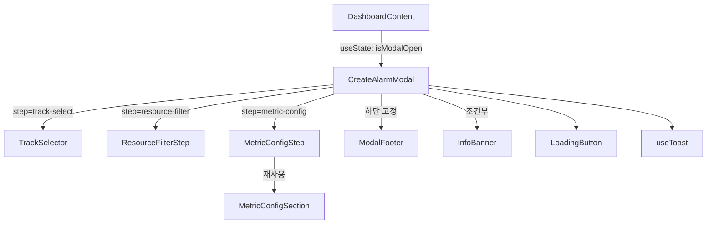
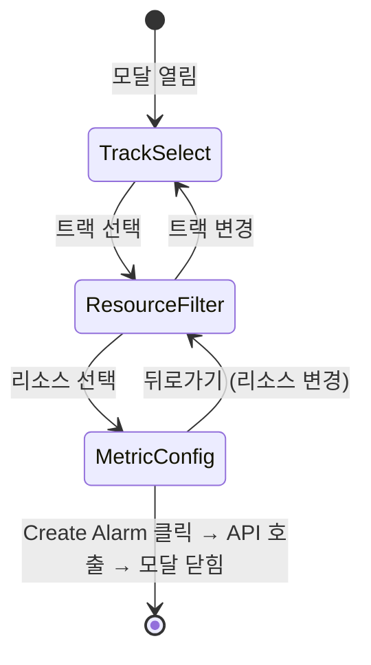
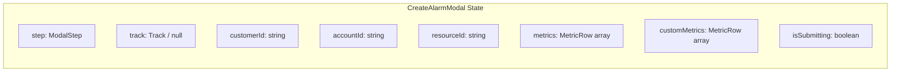

# Design Document: Create Alarm Modal

## Overview

Dashboard의 "Create Alarm" 버튼을 통해 열리는 멀티스텝 모달을 구현한다. 모달은 3단계 위저드 형태로 동작한다:

1. **트랙 선택** (TrackSelector) — 커스텀 알람 추가(트랙 1) vs 새 모니터링 설정(트랙 2)
2. **리소스 필터** (ResourceFilterStep) — 고객사 → 어카운트 → 리소스 캐스케이딩 선택
3. **메트릭 설정** (MetricConfigStep) — 트랙별 메트릭 구성 + 알람 생성

기존 `MetricConfigSection`, `LoadingButton`, `Toast` 컴포넌트를 재사용하며, 파일 200줄 제한을 준수하기 위해 모달을 4개 서브 컴포넌트로 분리한다.

모든 상태는 `CreateAlarmModal` 컨테이너에서 관리하고, 서브 컴포넌트에 props로 전달하는 lifting state up 패턴을 사용한다.

## Architecture

### 컴포넌트 계층 구조



### 상태 관리 전략

모든 상태는 `CreateAlarmModal` 내부 `useState`로 관리한다 (Local State). 전역 상태 불필요.



### 렌더링 전략

- `CreateAlarmModal`은 `'use client'` Client Component (useState, 이벤트 핸들러 사용)
- 모든 서브 컴포넌트도 `'use client'` (부모가 Client Component이므로)
- `DashboardContent`에서 `useState`로 모달 open/close 관리
- 데이터는 `mock-data.ts`에서 직접 import (Server Component 데이터 페칭 불필요)


## Components and Interfaces

### 1. CreateAlarmModal

모달 컨테이너. 스텝 라우팅 + 전체 상태 관리.

```typescript
interface CreateAlarmModalProps {
  open: boolean;
  onClose: () => void;
}

// 내부 상태
type ModalStep = "track-select" | "resource-filter" | "metric-config";
type Track = 1 | 2;

interface ModalState {
  step: ModalStep;
  track: Track | null;
  customerId: string;
  accountId: string;
  resourceId: string;
}
```

**책임:**
- 오버레이 + 모달 컨테이너 렌더링
- step에 따른 서브 컴포넌트 조건부 렌더링
- 닫기(X) / Cancel 시 전체 상태 초기화
- Create Alarm 버튼 클릭 시 mock API 호출 + Toast 표시

### 2. TrackSelector

트랙 1/2 선택 카드 UI.

```typescript
interface TrackSelectorProps {
  selectedTrack: Track | null;
  onSelectTrack: (track: Track) => void;
}
```

**책임:**
- 두 개의 선택 카드 렌더링 (커스텀 알람 추가 / 새 모니터링 설정)
- 선택 상태 시각적 피드백 (border highlight)
- 카드 클릭 시 `onSelectTrack` 콜백 호출

### 3. ResourceFilterStep

고객사 → 어카운트 → 리소스 캐스케이딩 드롭다운.

```typescript
interface ResourceFilterStepProps {
  track: Track;
  customerId: string;
  accountId: string;
  resourceId: string;
  onCustomerChange: (id: string) => void;
  onAccountChange: (id: string) => void;
  onResourceChange: (id: string) => void;
}
```

**책임:**
- MOCK_CUSTOMERS → MOCK_ACCOUNTS → MOCK_RESOURCES 캐스케이딩 필터링
- 트랙에 따른 리소스 필터링 (트랙 1: monitoring=true, 트랙 2: monitoring=false)
- 상위 드롭다운 변경 시 하위 선택 초기화 (부모에서 처리)
- 빈 상태 안내 메시지 표시

### 4. MetricConfigStep

트랙별 메트릭 설정 UI. 기존 `MetricConfigSection` 재사용.

```typescript
interface MetricConfigStepProps {
  track: Track;
  resourceType: string;
  // 트랙 2: 기본 메트릭 상태
  metrics: MetricRow[];
  setMetrics: React.Dispatch<React.SetStateAction<MetricRow[]>>;
  // 공통: 커스텀 메트릭 상태
  customMetrics: MetricRow[];
  setCustomMetrics: React.Dispatch<React.SetStateAction<MetricRow[]>>;
  // 커스텀 메트릭 추가 UI 상태
  showCustom: boolean;
  setShowCustom: (v: boolean) => void;
  selectedCwMetric: string;
  setSelectedCwMetric: (v: string) => void;
  customThreshold: number;
  setCustomThreshold: (v: number) => void;
  customUnit: string;
  setCustomUnit: (v: string) => void;
}
```

**책임:**
- 트랙 1: AVAILABLE_CW_METRICS 드롭다운 + 임계치/단위/방향 입력만 표시
- 트랙 2: MetricConfigSection 재사용 (기본 메트릭 테이블 + 커스텀 메트릭 추가)
- 빈 메트릭 안내 메시지 표시

### 5. InfoBanner

SNS 토픽 안내 배너.

```typescript
interface InfoBannerProps {
  message: string;
}
```

### 6. ModalFooter

Cancel + Create Alarm 버튼. `LoadingButton` 재사용.

```typescript
interface ModalFooterProps {
  onCancel: () => void;
  onSubmit: () => void;
  isSubmitting: boolean;
  isSubmitDisabled: boolean;
}
```


## Data Models

### 모달 내부 상태 흐름



### 데이터 소스 매핑

| 데이터 | 소스 | 용도 |
|--------|------|------|
| MOCK_CUSTOMERS | `lib/mock-data.ts` | 고객사 드롭다운 |
| MOCK_ACCOUNTS | `lib/mock-data.ts` | 어카운트 드롭다운 (customer_id 필터) |
| MOCK_RESOURCES | `lib/mock-data.ts` | 리소스 드롭다운 (account_id + monitoring 필터) |
| METRICS_BY_TYPE | `MetricConfigSection.tsx` | 트랙 2 기본 메트릭 |
| AVAILABLE_CW_METRICS | `MetricConfigSection.tsx` | 커스텀 메트릭 드롭다운 |

### 캐스케이딩 필터 로직

```typescript
// 어카운트 필터링
const filteredAccounts = MOCK_ACCOUNTS.filter(a => a.customer_id === customerId);

// 리소스 필터링 (트랙에 따라 monitoring 상태 분기)
const filteredResources = MOCK_RESOURCES.filter(r =>
  r.account === accountId &&
  (track === 1 ? r.monitoring === true : r.monitoring === false)
);
```

### Create Alarm 요청 페이로드

```typescript
// 트랙 1: 커스텀 알람 추가
interface Track1Payload {
  resource_id: string;
  custom_metrics: CustomMetricConfig[];
}

// 트랙 2: 모니터링 활성화 + 알람 생성
interface Track2Payload {
  resource_id: string;
  action: "enable";
  default_metrics: MetricRow[];  // enabled=true인 것만
  custom_metrics: CustomMetricConfig[];
}
```

### Submit 버튼 활성화 조건

| 트랙 | 활성화 조건 |
|------|------------|
| 트랙 1 | 커스텀 메트릭이 1개 이상 선택되고 임계치가 설정됨 |
| 트랙 2 | 기본 메트릭 중 1개 이상 enabled이거나 커스텀 메트릭이 1개 이상 존재 |


## Correctness Properties

*A property is a characteristic or behavior that should hold true across all valid executions of a system — essentially, a formal statement about what the system should do. Properties serve as the bridge between human-readable specifications and machine-verifiable correctness guarantees.*

### Property 1: 모달 재오픈 시 초기 상태 복원

*For any* 모달 내부 상태 조합(step, track, customerId, accountId, resourceId, metrics, customMetrics)에서 모달을 닫고 다시 열면, 모달은 항상 초기 상태(step="track-select", track=null, 모든 선택값 빈 문자열, metrics/customMetrics 빈 배열)로 표시되어야 한다.

**Validates: Requirements 1.4**

### Property 2: 트랙 변경 시 하위 상태 전체 초기화

*For any* 하위 상태 조합(customerId, accountId, resourceId, metrics, customMetrics)이 설정된 상태에서 트랙을 변경하면, 모든 하위 상태(customerId, accountId, resourceId, metrics, customMetrics)가 초기값으로 리셋되어야 한다.

**Validates: Requirements 2.4**

### Property 3: 캐스케이딩 초기화

*For any* 캐스케이딩 필터 상태에서, 상위 드롭다운(고객사 또는 어카운트)을 변경하면 해당 레벨 아래의 모든 선택값이 초기화되어야 한다. 즉, 고객사 변경 시 accountId와 resourceId가 초기화되고, 어카운트 변경 시 resourceId가 초기화된다.

**Validates: Requirements 3.3, 3.6**

### Property 4: 어카운트 필터링 정확성

*For any* 고객사 선택에 대해, 어카운트 드롭다운에 표시되는 모든 어카운트의 customer_id는 선택된 고객사의 customer_id와 일치해야 하며, 해당 customer_id를 가진 모든 어카운트가 빠짐없이 표시되어야 한다.

**Validates: Requirements 3.2**

### Property 5: 트랙별 리소스 필터링 정확성

*For any* 트랙(1 또는 2)과 어카운트 선택에 대해, 리소스 드롭다운에 표시되는 모든 리소스는 (1) 선택된 account_id와 일치하고 (2) 트랙 1이면 monitoring=true, 트랙 2이면 monitoring=false인 리소스만 포함해야 하며, 조건을 만족하는 모든 리소스가 빠짐없이 표시되어야 한다.

**Validates: Requirements 3.4, 3.5**

### Property 6: 리소스 타입별 메트릭 매핑 정확성

*For any* 리소스 타입에 대해, 트랙 1에서는 AVAILABLE_CW_METRICS[type]의 메트릭이 커스텀 메트릭 드롭다운에 표시되고, 트랙 2에서는 METRICS_BY_TYPE[type]의 메트릭이 기본 메트릭 테이블에 표시되어야 한다.

**Validates: Requirements 4.1, 5.1**

### Property 7: 메트릭 행 상태 무결성

*For any* 기본 메트릭 행에 대해, enabled=false이면 해당 행의 임계치 input이 disabled 상태이고, enabled=true이면 임의의 숫자 값을 입력했을 때 해당 메트릭의 threshold가 입력값과 즉시 일치해야 한다.

**Validates: Requirements 5.3, 5.4**

### Property 8: 커스텀 메트릭 드롭다운 필터링

*For any* 커스텀 메트릭 부분집합이 이미 추가된 상태에서, "추가" 드롭다운에 표시되는 메트릭은 AVAILABLE_CW_METRICS에서 이미 추가된 메트릭을 제외한 나머지와 정확히 일치해야 한다.

**Validates: Requirements 5.6**

### Property 9: Submit 버튼 활성화 조건 정합성

*For any* 트랙과 메트릭 상태 조합에 대해, submit 버튼의 활성화 여부는 다음 조건과 동치여야 한다: 트랙 1이면 커스텀 메트릭이 1개 이상 존재, 트랙 2이면 기본 메트릭 중 1개 이상 enabled이거나 커스텀 메트릭이 1개 이상 존재.

**Validates: Requirements 7.1, 7.2, 8.1, 8.2**


## Error Handling

### API 호출 에러

| 시나리오 | 처리 방식 |
|----------|----------|
| mock API 호출 성공 | success Toast 표시 → 모달 닫기 → 상태 초기화 |
| mock API 호출 실패 | error Toast 표시 → 모달 유지 → 사용자가 재시도 가능 |
| API 호출 중 | LoadingButton으로 로딩 상태 표시 + 중복 클릭 방지 |

### 빈 상태 처리

| 시나리오 | 표시 메시지 |
|----------|------------|
| 트랙 1 + 해당 어카운트에 monitoring=true 리소스 없음 | "모니터링 중인 리소스가 없습니다" |
| 트랙 2 + 해당 어카운트에 monitoring=false 리소스 없음 | "미모니터링 리소스가 없습니다" |
| 선택한 고객사에 어카운트 없음 | "어카운트가 없습니다" |
| 리소스 타입에 AVAILABLE_CW_METRICS 비어있음 | "이 리소스 타입에 사용 가능한 추가 CloudWatch 메트릭이 없습니다" |

### 상태 초기화 전략

모달 닫기(X, Cancel, API 성공) 시 모든 내부 상태를 초기값으로 리셋하는 `resetState()` 함수를 사용한다. 이를 통해 모달 재오픈 시 항상 깨끗한 상태를 보장한다.

## Testing Strategy

### 테스트 프레임워크

- Unit/Integration: Jest + React Testing Library
- Property-Based Testing: fast-check
- E2E: Playwright (핵심 플로우만)

### 단위 테스트 (Example-Based)

| 테스트 대상 | 테스트 내용 | 관련 요구사항 |
|------------|------------|-------------|
| CreateAlarmModal | 모달 열기/닫기, X 버튼, Cancel 버튼 | 1.1, 1.2, 1.3 |
| TrackSelector | 트랙 카드 렌더링, 클릭 시 선택 상태 | 2.1, 2.2, 2.3 |
| ResourceFilterStep | 고객사 목록 표시, 리소스 선택 시 다음 스텝 전환 | 3.1, 3.7 |
| MetricConfigStep | 메트릭 선택 시 입력 필드 표시, 숫자 입력, 방향 옵션 | 4.2, 4.3, 4.4, 4.5 |
| MetricConfigStep | 기본 메트릭 테이블 구조, 커스텀 메트릭 추가/삭제 | 5.2, 5.5, 5.7, 5.8 |
| InfoBanner | 리소스 선택 시 배너 표시 | 6.1 |
| ModalFooter | API 호출 성공/실패 시 Toast + 모달 상태, 로딩 상태 | 7.3~7.6, 8.3~8.6 |
| ResourceFilterStep | 빈 상태 메시지 표시 | 9.1~9.4 |

### Property-Based 테스트 (fast-check)

각 property 테스트는 최소 100회 반복 실행한다.

| Property | 테스트 전략 | Tag |
|----------|------------|-----|
| Property 1 | 임의의 ModalState 생성 → close → reopen → 초기 상태 검증 | Feature: create-alarm-modal, Property 1: 모달 재오픈 시 초기 상태 복원 |
| Property 2 | 임의의 하위 상태 설정 → 트랙 변경 → 하위 상태 초기화 검증 | Feature: create-alarm-modal, Property 2: 트랙 변경 시 하위 상태 전체 초기화 |
| Property 3 | 임의의 필터 상태 → 상위 변경 → 하위 초기화 검증 | Feature: create-alarm-modal, Property 3: 캐스케이딩 초기화 |
| Property 4 | 임의의 customer_id → 필터링된 accounts 검증 | Feature: create-alarm-modal, Property 4: 어카운트 필터링 정확성 |
| Property 5 | 임의의 (track, account_id) → 필터링된 resources 검증 | Feature: create-alarm-modal, Property 5: 트랙별 리소스 필터링 정확성 |
| Property 6 | 임의의 resource_type → 메트릭 매핑 검증 | Feature: create-alarm-modal, Property 6: 리소스 타입별 메트릭 매핑 정확성 |
| Property 7 | 임의의 MetricRow + enabled 토글 → disabled/threshold 검증 | Feature: create-alarm-modal, Property 7: 메트릭 행 상태 무결성 |
| Property 8 | 임의의 추가된 메트릭 부분집합 → 드롭다운 필터링 검증 | Feature: create-alarm-modal, Property 8: 커스텀 메트릭 드롭다운 필터링 |
| Property 9 | 임의의 (track, metrics enabled 상태, customMetrics 개수) → submit 활성화 검증 | Feature: create-alarm-modal, Property 9: Submit 버튼 활성화 조건 정합성 |

### 테스트 설명 언어

TDD 규칙에 따라 모든 `describe`, `it` 블록의 설명은 한국어로 작성한다.

### 필터링 로직 분리

캐스케이딩 필터 로직(`filterAccounts`, `filterResources`)과 submit 활성화 조건(`isSubmitEnabled`)은 순수 함수로 분리하여 컴포넌트 외부에서 단독 테스트 가능하게 한다. 이를 통해 property-based 테스트를 React 렌더링 없이 실행할 수 있다.

```typescript
// lib/alarm-modal-utils.ts (순수 함수)
export function filterAccounts(accounts: Account[], customerId: string): Account[];
export function filterResources(resources: Resource[], accountId: string, track: Track): Resource[];
export function isSubmitEnabled(track: Track, metrics: MetricRow[], customMetrics: MetricRow[]): boolean;
```

