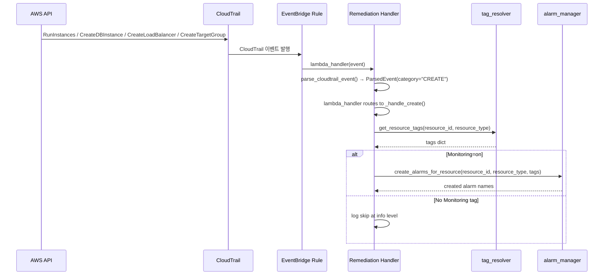
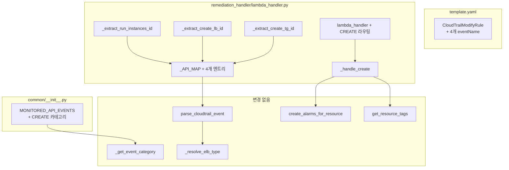

# Design Document: create-event-alarm-trigger

## Overview

AWS 리소스(EC2, RDS, ALB, NLB, TG)가 새로 생성될 때 CloudTrail CREATE 이벤트를 감지하여 Remediation_Handler가 즉시 알람을 자동 생성하는 기능을 추가한다.

현재 시스템은 MODIFY/DELETE/TAG_CHANGE 이벤트만 처리하며, 리소스 생성 시점에는 Daily_Monitor가 다음 스케줄(매일 00:00 UTC)에 실행될 때까지 알람이 생성되지 않는다. 이 기능은 CREATE 카테고리를 추가하여 리소스 생성 직후 `Monitoring=on` 태그가 있으면 즉시 알람을 생성한다.

### 변경 범위 요약

| 파일 | 변경 내용 |
|------|----------|
| `common/__init__.py` | `MONITORED_API_EVENTS`에 `"CREATE"` 카테고리 추가 |
| `template.yaml` | EventBridge 규칙 `eventName` 필터에 4개 CREATE 이벤트 추가 |
| `remediation_handler/lambda_handler.py` | `_API_MAP` 확장, CREATE용 ID 추출 함수 4개, `_handle_create()` 핸들러, `lambda_handler()` 라우팅 |

### 핵심 설계 결정

1. **responseElements에서 ID 추출**: `RunInstances`, `CreateLoadBalancer`, `CreateTargetGroup`은 리소스 ID가 AWS에 의해 생성 시점에 할당되므로 `requestParameters`가 아닌 `responseElements`에서 추출해야 한다. `CreateDBInstance`만 `requestParameters.dBInstanceIdentifier`에서 추출한다 (사용자가 직접 지정).
2. **멱등성 보장**: `create_alarms_for_resource()`는 내부적으로 기존 알람을 삭제 후 재생성하므로, CREATE 이벤트와 TAG_CHANGE 이벤트가 동시에 처리되어도 최종 알람 상태는 동일하다.
3. **기존 코드 재사용**: `_handle_create()`는 기존 TAG_CHANGE의 Monitoring=on 처리 로직과 동일한 패턴(`get_resource_tags` → `has_monitoring_tag` → `create_alarms_for_resource`)을 따른다.

## Architecture

### 이벤트 흐름



### 변경 영향 범위



### 핵심 설계 원칙

1. **최소 변경**: 기존 `parse_cloudtrail_event()`, `_get_event_category()`, `_resolve_elb_type()` 등 핵심 함수는 수정하지 않는다. `_API_MAP`과 `MONITORED_API_EVENTS`에 데이터를 추가하면 기존 파싱 로직이 자동으로 CREATE 이벤트를 처리한다.
2. **responseElements 전달**: CREATE 이벤트는 `responseElements`에서 ID를 추출해야 하므로, `parse_cloudtrail_event()`에서 `responseElements`도 함께 전달하도록 한다. ID 추출 함수의 시그니처를 `(params: dict) -> Optional[str]`에서 변경하지 않고, CREATE 이벤트용 추출 함수는 `responseElements`를 인자로 받도록 `_API_MAP`의 매핑 방식을 확장한다.
3. **거버넌스 준수**: 함수 복잡도 제한(§3), 에러 처리(§4), 로깅(§9), 코드 중복 금지(§10) 규칙을 따른다.

## Components and Interfaces

### 1. `common/__init__.py` — MONITORED_API_EVENTS 확장

```python
MONITORED_API_EVENTS: dict[str, list[str]] = {
    # ... 기존 MODIFY, DELETE, TAG_CHANGE 유지 ...
    "CREATE": [
        "RunInstances",
        "CreateDBInstance",
        "CreateLoadBalancer",
        "CreateTargetGroup",
    ],
}
```

기존 `_get_event_category()` 함수는 `MONITORED_API_EVENTS`를 순회하므로 코드 변경 없이 CREATE 카테고리를 자동 인식한다.

### 2. `template.yaml` — EventBridge 규칙 확장

`CloudTrailModifyRule`의 `eventName` 필터에 4개 이벤트를 추가한다:

```yaml
detail:
  eventName:
    # ... 기존 MODIFY/DELETE/TAG_CHANGE 이벤트 유지 ...
    - RunInstances
    - CreateDBInstance
    - CreateLoadBalancer
    - CreateTargetGroup
```

기존 이벤트 필터는 변경하지 않는다.

### 3. `remediation_handler/lambda_handler.py` — CREATE용 ID 추출 함수

CREATE 이벤트는 `responseElements`에서 리소스 ID를 추출해야 한다. 기존 MODIFY/DELETE/TAG_CHANGE 이벤트의 추출 함수는 `requestParameters`를 인자로 받지만, CREATE 이벤트용 함수는 `responseElements`를 인자로 받는다.

`parse_cloudtrail_event()`에서 CREATE 이벤트인 경우 `detail.responseElements`를 추출 함수에 전달하도록 분기한다.

```python
def _extract_run_instances_id(resp: dict) -> Optional[str]:
    """RunInstances: responseElements.instancesSet.items[0].instanceId"""
    items = resp.get("instancesSet", {}).get("items", [])
    return items[0].get("instanceId") if items else None

def _extract_create_db_id(params: dict) -> Optional[str]:
    """CreateDBInstance: requestParameters.dBInstanceIdentifier"""
    return params.get("dBInstanceIdentifier")

def _extract_create_lb_id(resp: dict) -> Optional[str]:
    """CreateLoadBalancer: responseElements.loadBalancers[0].loadBalancerArn"""
    lbs = resp.get("loadBalancers", [])
    return lbs[0].get("loadBalancerArn") if lbs else None

def _extract_create_tg_id(resp: dict) -> Optional[str]:
    """CreateTargetGroup: responseElements.targetGroups[0].targetGroupArn"""
    tgs = resp.get("targetGroups", [])
    return tgs[0].get("targetGroupArn") if tgs else None
```

### 4. `remediation_handler/lambda_handler.py` — _API_MAP 확장

```python
_API_MAP: dict[str, tuple[str, callable]] = {
    # ... 기존 MODIFY/DELETE/TAG_CHANGE 엔트리 유지 ...
    # CREATE
    "RunInstances":         ("EC2", _extract_run_instances_id),
    "CreateDBInstance":     ("RDS", _extract_create_db_id),
    "CreateLoadBalancer":   ("ELB", _extract_create_lb_id),
    "CreateTargetGroup":    ("TG",  _extract_create_tg_id),
}
```

`CreateLoadBalancer`는 `resource_type="ELB"`로 매핑하고, 기존 `_resolve_elb_type()`이 ARN 패턴(`/app/` → ALB, `/net/` → NLB)으로 세분화한다.

`CreateTargetGroup`은 `resource_type="TG"`로 직접 매핑한다 (TG ARN에는 `/app/`이나 `/net/` 패턴이 없으므로 `_resolve_elb_type()`을 거치지 않아야 한다).

### 5. `remediation_handler/lambda_handler.py` — parse_cloudtrail_event 수정

CREATE 이벤트의 ID 추출을 위해 `responseElements`를 추출 함수에 전달하는 분기를 추가한다:

```python
def parse_cloudtrail_event(event: dict) -> ParsedEvent:
    # ... 기존 코드 ...
    resource_type, id_extractor = _API_MAP[event_name]
    
    # CREATE 이벤트: responseElements에서 ID 추출 (RunInstances, CreateLoadBalancer, CreateTargetGroup)
    # CreateDBInstance만 requestParameters에서 추출
    event_category = _get_event_category(event_name)
    if event_category == "CREATE" and event_name != "CreateDBInstance":
        response_elements = detail.get("responseElements") or {}
        resource_id = id_extractor(response_elements)
    else:
        resource_id = id_extractor(request_params)
    # ... 나머지 기존 코드 ...
```

### 6. `remediation_handler/lambda_handler.py` — _handle_create 핸들러

```python
def _handle_create(parsed: ParsedEvent) -> None:
    """
    CREATE 이벤트: Monitoring=on 태그 있으면 알람 즉시 생성.
    """
    tags = get_resource_tags(parsed.resource_id, parsed.resource_type)
    if not tags:
        logger.warning(
            "get_resource_tags returned empty for newly created %s %s: skipping alarm creation",
            parsed.resource_type, parsed.resource_id,
        )
        return

    if not has_monitoring_tag(tags):
        logger.info(
            "Skipping alarm creation for %s %s: no Monitoring=on tag",
            parsed.resource_type, parsed.resource_id,
        )
        return

    created = create_alarms_for_resource(
        parsed.resource_id, parsed.resource_type, tags,
    )
    logger.info(
        "Created alarms for newly created %s %s: %s",
        parsed.resource_type, parsed.resource_id, created,
    )
```

### 7. `remediation_handler/lambda_handler.py` — lambda_handler 라우팅 추가

```python
def lambda_handler(event, context):
    # ... 기존 코드 ...
    if parsed.event_category == "MODIFY":
        _handle_modify(parsed)
    elif parsed.event_category == "DELETE":
        _handle_delete(parsed)
    elif parsed.event_category == "TAG_CHANGE":
        _handle_tag_change(parsed)
    elif parsed.event_category == "CREATE":
        _handle_create(parsed)
    else:
        logger.warning("Unknown event_category: %s", parsed.event_category)
    # ... 나머지 기존 코드 ...
```

## Data Models

### ParsedEvent (변경 없음)

기존 `ParsedEvent` 데이터 클래스는 변경하지 않는다. `event_category` 필드에 `"CREATE"` 값이 추가될 뿐이다.

```python
@dataclass
class ParsedEvent:
    resource_id: str
    resource_type: str          # "EC2" | "RDS" | "ALB" | "NLB" | "TG"
    event_name: str             # 원본 API 이름
    event_category: str         # "MODIFY" | "DELETE" | "TAG_CHANGE" | "CREATE"
    change_summary: str
    request_params: dict
```

### CREATE 이벤트별 CloudTrail 구조

| API | ID 소스 | 추출 경로 | resource_type |
|-----|---------|----------|---------------|
| `RunInstances` | responseElements | `instancesSet.items[0].instanceId` | EC2 |
| `CreateDBInstance` | requestParameters | `dBInstanceIdentifier` | RDS |
| `CreateLoadBalancer` | responseElements | `loadBalancers[0].loadBalancerArn` | ELB → ALB/NLB |
| `CreateTargetGroup` | responseElements | `targetGroups[0].targetGroupArn` | TG |

### MONITORED_API_EVENTS 확장 후 전체 구조

```python
MONITORED_API_EVENTS = {
    "MODIFY": ["ModifyInstanceAttribute", "ModifyInstanceType", "ModifyDBInstance",
               "ModifyLoadBalancerAttributes", "ModifyListener"],
    "DELETE": ["TerminateInstances", "DeleteDBInstance", "DeleteLoadBalancer"],
    "TAG_CHANGE": ["CreateTags", "DeleteTags", "AddTagsToResource",
                   "RemoveTagsFromResource", "AddTags", "RemoveTags"],
    "CREATE": ["RunInstances", "CreateDBInstance", "CreateLoadBalancer",
               "CreateTargetGroup"],
}
```

## Correctness Properties

*A property is a characteristic or behavior that should hold true across all valid executions of a system — essentially, a formal statement about what the system should do. Properties serve as the bridge between human-readable specifications and machine-verifiable correctness guarantees.*

### Property 1: CREATE 이벤트 파싱 정확성 (CREATE Event Parsing Accuracy)

*For any* CREATE 이벤트 유형(RunInstances, CreateDBInstance, CreateLoadBalancer, CreateTargetGroup)과 *for any* 유효한 리소스 ID, 해당 이벤트의 CloudTrail 구조를 `parse_cloudtrail_event()`에 전달하면 반환된 `ParsedEvent`의 `resource_id`가 입력한 리소스 ID와 일치하고, `resource_type`이 올바른 유형(EC2, RDS, ALB/NLB, TG)이며, `event_category`가 `"CREATE"`여야 한다.

- RunInstances: `responseElements.instancesSet.items[0].instanceId` → EC2
- CreateDBInstance: `requestParameters.dBInstanceIdentifier` → RDS
- CreateLoadBalancer: `responseElements.loadBalancers[0].loadBalancerArn` → ALB 또는 NLB (ARN 패턴 기반)
- CreateTargetGroup: `responseElements.targetGroups[0].targetGroupArn` → TG

**Validates: Requirements 1.2, 3.1, 3.2, 3.3, 3.4, 3.6, 6.1**

### Property 2: Monitoring 태그 기반 알람 생성 게이팅 (Monitoring Tag Gates Alarm Creation)

*For any* CREATE 이벤트와 *for any* 리소스 ID/타입 조합에 대해, `_handle_create()`는 `Monitoring=on` 태그가 있을 때만 `create_alarms_for_resource()`를 호출해야 하며, 태그가 없거나 다른 값이면 호출하지 않아야 한다.

**Validates: Requirements 4.1, 4.2, 4.3**

### Property 3: CREATE와 TAG_CHANGE 이벤트 간 멱등성 (CREATE-TAG_CHANGE Idempotency)

*For any* 리소스에 대해, CREATE 이벤트 처리 후 TAG_CHANGE(Monitoring=on) 이벤트를 처리하거나, 그 반대 순서로 처리하거나, 어느 한쪽만 처리해도 최종 알람 상태는 동일해야 한다. 이는 양쪽 경로 모두 동일한 `create_alarms_for_resource()` 함수를 사용하고, 이 함수가 기존 알람을 삭제 후 재생성하는 멱등 동작을 수행하기 때문이다.

**Validates: Requirements 5.1, 5.2, 5.3**

### Property 4: CREATE 이벤트 라우팅 및 정상 응답 (CREATE Event Routing and Response)

*For any* CREATE 카테고리 이벤트에 대해, `lambda_handler()`는 `_handle_create()`로 라우팅하고 `{"status": "ok"}`를 반환해야 한다. 처리 중 예외가 발생하면 `{"status": "error"}`를 반환해야 한다.

**Validates: Requirements 7.1, 7.2, 7.3**

## Error Handling

이 기능은 기존 Remediation_Handler의 에러 처리 패턴을 그대로 따른다.

| 상황 | 처리 | 비고 |
|------|------|------|
| `parse_cloudtrail_event` 실패 (필수 필드 누락) | `ValueError` raise → `lambda_handler`에서 catch → `send_error_alert` + `{"status": "parse_error"}` | 기존 패턴 동일 |
| `get_resource_tags` 빈 딕셔너리 반환 | `logger.warning` + 알람 생성 스킵 | 새로 생성된 리소스의 태그 전파 지연 가능 |
| `create_alarms_for_resource` 내부 `ClientError` | `alarm_manager` 내부에서 `logger.error` + 개별 알람 스킵 | 기존 패턴 동일 |
| `_handle_create` 내부 예외 | `lambda_handler`의 최상위 `except Exception`에서 catch → `{"status": "error"}` | 기존 패턴 동일 |
| RunInstances `responseElements` 누락 | `ValueError("Cannot extract resource_id")` | 기존 패턴 동일 |
| CreateLoadBalancer/CreateTargetGroup `responseElements` 누락 | `ValueError("Cannot extract resource_id")` | 기존 패턴 동일 |

### 태그 전파 지연 (Eventual Consistency)

AWS 리소스 생성 직후 태그 API 호출 시 태그가 아직 전파되지 않았을 수 있다. 이 경우 `get_resource_tags()`가 빈 딕셔너리를 반환하고 알람 생성이 스킵된다. 이후 TAG_CHANGE 이벤트(CreateTags/AddTags 등)가 발생하면 기존 TAG_CHANGE 로직이 알람을 생성하므로 최종적으로 알람이 누락되지 않는다.

## Testing Strategy

### 단위 테스트 (Unit Tests)

`tests/test_remediation_handler.py`에 추가할 테스트:

1. **MONITORED_API_EVENTS 구조 검증**: CREATE 키 존재 + 4개 이벤트 포함 + 기존 카테고리 보존
2. **CREATE 이벤트 파싱**: 각 CREATE 이벤트별 `parse_cloudtrail_event()` 정상 파싱 확인
3. **ID 추출 함수**: `_extract_run_instances_id`, `_extract_create_db_id`, `_extract_create_lb_id`, `_extract_create_tg_id` 개별 테스트
4. **에러 케이스**: responseElements 누락, 빈 리스트 등 ValueError 발생 확인
5. **_handle_create 라우팅**: CREATE 이벤트 → `_handle_create` 호출 확인
6. **Monitoring=on 알람 생성**: CREATE + Monitoring=on → `create_alarms_for_resource` 호출
7. **Monitoring 없음 스킵**: CREATE + 태그 없음 → 알람 생성 미호출
8. **빈 태그 경고**: `get_resource_tags` 빈 반환 → warning 로그 + 스킵
9. **ALB/NLB 타입 판별**: CreateLoadBalancer ARN 패턴별 resource_type 확인
10. **EventBridge 규칙 검증**: template.yaml에 4개 CREATE 이벤트 포함 확인

### Property-Based Tests (Hypothesis)

거버넌스 §8에 따라 `hypothesis` 라이브러리를 사용한다. 각 테스트는 최소 100회 반복 실행한다.

| PBT 파일 | Property | 설명 |
|----------|----------|------|
| `tests/test_pbt_create_event.py` | Property 1 | CREATE 이벤트 파싱 정확성 — 랜덤 리소스 ID + 4개 이벤트 유형에 대해 parse_cloudtrail_event가 올바른 ParsedEvent를 반환하는지 검증 |
| `tests/test_pbt_create_event.py` | Property 2 | Monitoring 태그 게이팅 — 랜덤 리소스 ID/타입 + Monitoring 태그 유무에 따라 create_alarms_for_resource 호출 여부 검증 |
| `tests/test_pbt_create_event.py` | Property 3 | CREATE-TAG_CHANGE 멱등성 — 랜덤 리소스에 대해 CREATE→TAG_CHANGE, TAG_CHANGE→CREATE, 단독 처리 모두 동일한 create_alarms_for_resource 호출 검증 |
| `tests/test_pbt_create_event.py` | Property 4 | CREATE 라우팅 및 응답 — 랜덤 CREATE 이벤트에 대해 lambda_handler가 {"status": "ok"} 반환 검증 |

각 PBT 테스트에는 다음 태그 주석을 포함한다:
```python
# Feature: create-event-alarm-trigger, Property {N}: {property_text}
```

### TDD 사이클 (거버넌스 §8)

다음 순서로 구현한다:

1. **Red**: `common/__init__.py`의 CREATE 카테고리 테스트 작성 → 실패
2. **Green**: `MONITORED_API_EVENTS`에 CREATE 추가 → 통과
3. **Red**: ID 추출 함수 + 파싱 테스트 작성 → 실패
4. **Green**: 추출 함수 + `_API_MAP` + `parse_cloudtrail_event` 수정 → 통과
5. **Red**: `_handle_create` + 라우팅 테스트 작성 → 실패
6. **Green**: `_handle_create` + `lambda_handler` 라우팅 추가 → 통과
7. **Red**: PBT 테스트 작성 → 실패
8. **Green**: 필요 시 구현 보완 → 통과
9. **Refactor**: 코드 정리 + 전체 테스트 재실행
10. **마지막**: `template.yaml` EventBridge 규칙 업데이트 (인프라 변경)
