# Design Document: DocumentDB Monitoring

## Overview

이 기능은 DocumentDB(DocDB)를 새로운 모니터링 리소스 타입(`"DocDB"`)으로 AWS Monitoring Engine에 추가한다. DocumentDB는 MongoDB 호환 문서 데이터베이스로, RDS와 동일한 `describe_db_instances` API를 사용하지만 CloudWatch 네임스페이스는 `AWS/DocDB`를 사용한다. 디멘션은 인스턴스 레벨(`DBInstanceIdentifier`)로 RDS와 동일한 구조이다.

주요 설계 결정:
- **별도 Collector 모듈**: `common/collectors/docdb.py`를 새로 생성한다. RDS Collector(`rds.py`)는 이미 Aurora 분류 로직이 포함되어 복잡하므로, DocDB를 추가하면 단일 책임 원칙을 위반한다. 별도 모듈로 분리하되 `base.py`의 `query_metric()` 유틸리티를 재사용한다.
- **Engine 정확 매칭**: `engine == "docdb"` 정확 매칭을 사용한다. Aurora의 `"aurora" in engine.lower()` 부분 매칭과 달리, DocumentDB는 Engine 값이 정확히 `"docdb"`이므로 오분류 위험이 없다.
- **네임스페이스 분리**: DocumentDB는 `AWS/DocDB` 네임스페이스를 사용하므로 RDS(`AWS/RDS`)와 자연스럽게 구분된다.
- **CloudTrail API 공유**: DocumentDB는 RDS와 동일한 CloudTrail API(`CreateDBInstance`, `DeleteDBInstance`, `ModifyDBInstance`, `AddTagsToResource`, `RemoveTagsFromResource`)를 사용하므로 `MONITORED_API_EVENTS`에 추가 등록이 불필요하다. Remediation Handler의 `_resolve_rds_aurora_type()` 함수를 확장하여 Engine `"docdb"` 판별을 추가한다.
- **공유 디멘션 키**: DocDB도 `DBInstanceIdentifier`를 디멘션 키로 사용하므로 `_build_dimensions()`의 기존 `else` 분기가 그대로 동작한다.
- **Remediation 지원**: DocDB 인스턴스에 대한 Auto-Remediation은 `stop_db_instance()` API를 사용한다 (RDS와 동일).

## Architecture

```mermaid
flowchart TD
    subgraph DocDBCollector["common/collectors/docdb.py (NEW)"]
        A[describe_db_instances paginator] --> B{Engine == 'docdb'?}
        B -- Yes --> C["ResourceInfo(type='DocDB')"]
        B -- No --> D[Skip]
    end

    subgraph AlarmManager["common/alarm_manager.py"]
        E["_get_alarm_defs('DocDB')"] --> F["_DOCDB_ALARMS"]
    end

    subgraph DailyMonitor["daily_monitor/lambda_handler.py"]
        G[_COLLECTOR_MODULES includes docdb_collector] --> H[iterate resources]
        H --> I{resource.type == 'DocDB'?}
        I -- Yes --> J[sync_alarms + get_metrics]
        L["_cleanup_orphan_alarms()"] --> M["alive_checkers['DocDB'] = _find_alive_rds_instances"]
    end

    subgraph RemediationHandler["remediation_handler/lambda_handler.py"]
        N[parse_cloudtrail_event] --> O{RDS event?}
        O -- Yes --> P[describe_db_instances → check Engine]
        P --> Q{Engine == 'docdb'?}
        Q -- Yes --> R["resource_type = 'DocDB'"]
        Q -- No --> S[기존 RDS/Aurora 분기]
    end
```



## Components and Interfaces

### 1. DocDB Collector (`common/collectors/docdb.py`) — NEW

**`collect_monitored_resources()`**
- `describe_db_instances` paginator로 전체 DB 인스턴스를 순회한다.
- `Engine == "docdb"` 인 인스턴스만 필터링한다 (다른 엔진은 skip).
- `DBInstanceStatus`가 `"deleting"` 또는 `"deleted"`이면 skip + info 로그.
- `Monitoring=on` 태그(대소문자 무관) 확인 후 `ResourceInfo(type="DocDB")`로 반환.
- `list_tags_for_resource`로 태그 조회 (RDS Collector의 `_get_tags()` 패턴 재사용).

**`get_metrics(db_instance_id, resource_tags=None)`**
- 네임스페이스 `AWS/DocDB`, 디멘션 `DBInstanceIdentifier`로 6개 메트릭 조회:
  - `CPUUtilization` → `"CPU"` (변환 없음)
  - `FreeableMemory` (bytes→GB) → `"FreeMemoryGB"`
  - `FreeLocalStorage` (bytes→GB) → `"FreeLocalStorageGB"`
  - `DatabaseConnections` → `"Connections"` (변환 없음)
  - `ReadLatency` → `"ReadLatency"` (초 단위, 변환 없음)
  - `WriteLatency` → `"WriteLatency"` (초 단위, 변환 없음)
- `base.py`의 `query_metric()` 유틸리티 사용.
- 개별 메트릭 데이터 없으면 skip + info 로그. 모두 없으면 `None` 반환.

### 2. Alarm Manager Extension (`common/alarm_manager.py`)

**새 상수: `_DOCDB_ALARMS`**
```python
_DOCDB_ALARMS = [
    {"metric": "CPU", "namespace": "AWS/DocDB", "metric_name": "CPUUtilization",
     "dimension_key": "DBInstanceIdentifier", "stat": "Average",
     "comparison": "GreaterThanThreshold", "period": 300, "evaluation_periods": 1},
    {"metric": "FreeMemoryGB", "namespace": "AWS/DocDB", "metric_name": "FreeableMemory",
     "dimension_key": "DBInstanceIdentifier", "stat": "Average",
     "comparison": "LessThanThreshold", "period": 300, "evaluation_periods": 1,
     "transform_threshold": lambda gb: gb * 1073741824},
    {"metric": "FreeLocalStorageGB", "namespace": "AWS/DocDB", "metric_name": "FreeLocalStorage",
     "dimension_key": "DBInstanceIdentifier", "stat": "Average",
     "comparison": "LessThanThreshold", "period": 300, "evaluation_periods": 1,
     "transform_threshold": lambda gb: gb * 1073741824},
    {"metric": "Connections", "namespace": "AWS/DocDB", "metric_name": "DatabaseConnections",
     "dimension_key": "DBInstanceIdentifier", "stat": "Average",
     "comparison": "GreaterThanThreshold", "period": 300, "evaluation_periods": 1},
    {"metric": "ReadLatency", "namespace": "AWS/DocDB", "metric_name": "ReadLatency",
     "dimension_key": "DBInstanceIdentifier", "stat": "Average",
     "comparison": "GreaterThanThreshold", "period": 300, "evaluation_periods": 1},
    {"metric": "WriteLatency", "namespace": "AWS/DocDB", "metric_name": "WriteLatency",
     "dimension_key": "DBInstanceIdentifier", "stat": "Average",
     "comparison": "GreaterThanThreshold", "period": 300, "evaluation_periods": 1},
]
```

**수정: `_get_alarm_defs()`** — `elif resource_type == "DocDB": return _DOCDB_ALARMS` 추가.

**수정: `_HARDCODED_METRIC_KEYS`** — `"DocDB": {"CPU", "FreeMemoryGB", "FreeLocalStorageGB", "Connections", "ReadLatency", "WriteLatency"}` 추가.

**수정: `_NAMESPACE_MAP`** — `"DocDB": ["AWS/DocDB"]` 추가.

**수정: `_DIMENSION_KEY_MAP`** — `"DocDB": "DBInstanceIdentifier"` 추가.

**수정: `_find_alarms_for_resource()`** — 기본 `type_prefixes` 폴백 목록에 `"DocDB"` 추가.

**`_build_dimensions()`** — 변경 불필요. 기존 `else` 분기가 `{"Name": dim_key, "Value": resource_id}` 형태로 DocDB에도 동작.

**`_METRIC_DISPLAY`** — DocDB 메트릭은 기존 RDS 메트릭과 동일한 표시 이름을 사용하므로 추가 불필요 (CPU, FreeMemoryGB, FreeLocalStorageGB, Connections, ReadLatency, WriteLatency 모두 이미 등록됨).

**`_metric_name_to_key()`** — DocDB의 CW metric_name은 RDS와 동일하므로 추가 매핑 불필요 (CPUUtilization→CPU, FreeableMemory→FreeMemoryGB, FreeLocalStorage→FreeLocalStorageGB, DatabaseConnections→Connections, ReadLatency→ReadLatency, WriteLatency→WriteLatency 모두 이미 등록됨).

### 3. Common Constants (`common/__init__.py`)

- `SUPPORTED_RESOURCE_TYPES`에 `"DocDB"` 추가.
- `HARDCODED_DEFAULTS`: DocDB 메트릭은 기존 키를 공유하므로 추가 항목 불필요 (`CPU`, `FreeMemoryGB`, `FreeLocalStorageGB`, `Connections`, `ReadLatency`, `WriteLatency` 모두 이미 존재).
- TypedDict 주석 업데이트: `ResourceInfo`, `AlertMessage`, `RemediationAlertMessage`, `LifecycleAlertMessage`의 `type`/`resource_type` 필드 주석에 `"DocDB"` 추가.

### 4. Daily Monitor Integration (`daily_monitor/lambda_handler.py`)

**수정: `_COLLECTOR_MODULES`** — `docdb_collector` 모듈 추가:
```python
from common.collectors import docdb as docdb_collector
_COLLECTOR_MODULES = [ec2_collector, rds_collector, elb_collector, docdb_collector]
```

**수정: `_process_resource()`** — DocDB 메트릭 수집 라우팅. DocDB는 `get_metrics()`를 사용하므로 기존 `else` 분기에서 자동 처리됨. 별도 분기 불필요.

**수정: `_cleanup_orphan_alarms()`** — `alive_checkers`에 추가:
```python
"DocDB": _find_alive_rds_instances,
```
DocumentDB 인스턴스도 `describe_db_instances` API로 존재 확인 가능하므로 기존 `_find_alive_rds_instances()` 함수를 재사용한다.

**`_classify_alarm()`** — 변경 불필요. 기존 `_NEW_FORMAT_RE` 정규식 `^\[(\w+)\]\s.*\((.+)\)$`이 `[DocDB]` 접두사를 자동 캡처.

**`_process_resource()` 임계치 비교** — `"FreeLocalStorageGB"`는 이미 "낮을수록 위험" 비교 세트에 포함되어 있으므로 변경 불필요.

### 5. Remediation Handler (`remediation_handler/lambda_handler.py`)

**수정: `_resolve_rds_aurora_type()`** — Engine `"docdb"` 판별 추가:
```python
def _resolve_rds_aurora_type(db_instance_id: str) -> tuple[str, bool]:
    try:
        rds = boto3.client("rds")
        resp = rds.describe_db_instances(DBInstanceIdentifier=db_instance_id)
        engine = resp["DBInstances"][0].get("Engine", "")
        if engine.lower() == "docdb":
            return ("DocDB", False)
        if "aurora" in engine.lower():
            return ("AuroraRDS", False)
        return ("RDS", False)
    except ClientError as e:
        logger.warning(...)
        return ("RDS", True)
```

**수정: `_execute_remediation()`** — `"DocDB"` 케이스 추가:
```python
if resource_type == "DocDB":
    rds = boto3.client("rds")
    rds.stop_db_instance(DBInstanceIdentifier=resource_id)
    return "STOPPED"
```

**수정: `_remediation_action_name()`** — `"DocDB": "STOPPED"` 매핑 추가.

### 6. Tag Resolver (`common/tag_resolver.py`)

**수정: `get_resource_tags()`** — `"DocDB"`를 RDS 분기에 추가:
```python
elif resource_type in ("RDS", "AuroraRDS", "DocDB"):
    return _get_rds_tags(resource_id)
```

## Data Models

### DocDB Alarm Definition Schema

`_DOCDB_ALARMS`의 각 항목은 기존 알람 정의 dict 구조를 따른다:

| Field | Type | Description |
|-------|------|-------------|
| `metric` | `str` | 내부 메트릭 키 (예: `"FreeMemoryGB"`) |
| `namespace` | `str` | `"AWS/DocDB"` |
| `metric_name` | `str` | CloudWatch 메트릭 이름 (예: `"FreeableMemory"`) |
| `dimension_key` | `str` | `"DBInstanceIdentifier"` |
| `stat` | `str` | `"Average"` |
| `comparison` | `str` | `"GreaterThanThreshold"` 또는 `"LessThanThreshold"` |
| `period` | `int` | `300` (5분) |
| `evaluation_periods` | `int` | `1` |
| `transform_threshold` | `callable \| None` | GB→bytes 변환기 (메모리/스토리지 메트릭) |

### DocDB 태그-메트릭 매핑 테이블 (§12)

| 태그 키 | 내부 metric key | CW metric_name | Namespace | 기본 임계치 | 단위 | 변환 |
|---------|----------------|----------------|-----------|-----------|------|------|
| Threshold_CPU | CPU | CPUUtilization | AWS/DocDB | 80 | % | - |
| Threshold_FreeMemoryGB | FreeMemoryGB | FreeableMemory | AWS/DocDB | 2 | GB | GB→bytes |
| Threshold_FreeLocalStorageGB | FreeLocalStorageGB | FreeLocalStorage | AWS/DocDB | 10 | GB | GB→bytes |
| Threshold_Connections | Connections | DatabaseConnections | AWS/DocDB | 100 | Count | - |
| Threshold_ReadLatency | ReadLatency | ReadLatency | AWS/DocDB | 0.02 | Seconds | - |
| Threshold_WriteLatency | WriteLatency | WriteLatency | AWS/DocDB | 0.02 | Seconds | - |

### SUPPORTED_RESOURCE_TYPES 확장

```python
SUPPORTED_RESOURCE_TYPES = ["EC2", "RDS", "ALB", "NLB", "TG", "AuroraRDS", "DocDB"]
```

### ResourceInfo Type Extension

`type` 필드에 `"DocDB"`가 유효한 값으로 추가된다. `AlertMessage.resource_type`, `RemediationAlertMessage.resource_type`, `LifecycleAlertMessage.resource_type`도 동일.


## Correctness Properties

*A property is a characteristic or behavior that should hold true across all valid executions of a system — essentially, a formal statement about what the system should do. Properties serve as the bridge between human-readable specifications and machine-verifiable correctness guarantees.*

### Property 1: Engine-based DocDB Classification

*For any* DB instance returned by `describe_db_instances`, the DocDB Collector SHALL include it in the resource list with `type="DocDB"` if and only if the Engine field equals `"docdb"` (case-insensitive). Instances with engines `"aurora"`, `"aurora-mysql"`, `"aurora-postgresql"`, `"mysql"`, `"postgres"` 등은 제외되어야 한다.

**Validates: Requirements 1.1, 1.2, 1.5**

### Property 2: Bytes-to-GB Conversion Round Trip

*For any* positive float value representing GB, the alarm manager's `transform_threshold` (`gb * 1073741824`) and the collector's bytes-to-GB conversion (`bytes / 1073741824`) SHALL be inverses. Composing both (GB → bytes → GB) SHALL return the original GB value within floating-point tolerance.

**Validates: Requirements 2.2, 2.3, 3.4, 3.5**

### Property 3: DocDB Alarm Definition Correctness

*For any* alarm definition in `_DOCDB_ALARMS`, the `namespace` SHALL be `"AWS/DocDB"`, the `dimension_key` SHALL be `"DBInstanceIdentifier"`, and the `metric` key SHALL be one of `{"CPU", "FreeMemoryGB", "FreeLocalStorageGB", "Connections", "ReadLatency", "WriteLatency"}`. Memory/storage 메트릭(`FreeMemoryGB`, `FreeLocalStorageGB`)은 `"LessThanThreshold"` 비교를, 나머지는 `"GreaterThanThreshold"` 비교를 사용해야 한다.

**Validates: Requirements 3.3, 3.4, 3.5, 3.6, 3.7, 3.8, 5.3**

### Property 4: DocDB Alarm Name Prefix and Metadata

*For any* DocDB resource ID and any metric from `_DOCDB_ALARMS`, the generated alarm name SHALL start with `"[DocDB] "` and the `AlarmDescription` JSON metadata SHALL contain `"resource_type":"DocDB"`.

**Validates: Requirements 5.1, 5.2**

### Property 5: Alarm Classification from Name Prefix

*For any* alarm name matching the pattern `[DocDB] ... (db_instance_id)`, the `_classify_alarm()` function SHALL extract `"DocDB"` as the resource type and the correct `db_instance_id` from the parenthesized suffix.

**Validates: Requirements 8.2**

### Property 6: Alarm Search Prefix and Suffix

*For any* DocDB `db_instance_id`, searching for alarms with `_find_alarms_for_resource(db_instance_id, "DocDB")` SHALL use prefix `"[DocDB] "` and filter results by suffix `"({db_instance_id})"`. When no `resource_type` is specified, the search SHALL include `"[DocDB] "` in the default prefix list.

**Validates: Requirements 6.4, 9.1, 9.2**

### Property 7: CloudTrail Engine Resolution

*For any* RDS CloudTrail event (CreateDBInstance, DeleteDBInstance, ModifyDBInstance, AddTagsToResource, RemoveTagsFromResource) targeting a DB instance whose Engine field equals `"docdb"`, the remediation handler SHALL resolve the resource type to `"DocDB"`. For events targeting Aurora engines, it SHALL resolve to `"AuroraRDS"`. For other engines, it SHALL resolve to `"RDS"`.

**Validates: Requirements 10.1, 10.2, 10.3, 10.4, 10.5**

### Property 8: Tag-Based Threshold Override for DocDB

*For any* DocDB metric key in `{"CPU", "FreeMemoryGB", "FreeLocalStorageGB", "Connections", "ReadLatency", "WriteLatency"}` and any valid positive numeric `Threshold_*` tag value, the alarm manager SHALL use the tag value as the alarm threshold instead of the `HARDCODED_DEFAULTS` value. The created alarm's CloudWatch threshold SHALL equal `transform_threshold(tag_value)` when a transform exists, or `tag_value` directly otherwise.

**Validates: Requirements 11.1, 11.2, 11.3, 11.4, 11.5, 11.6**

### Property 9: Remediation Execution for DocDB

*For any* DocDB resource ID, `_execute_remediation("DocDB", resource_id)` SHALL call `stop_db_instance(DBInstanceIdentifier=resource_id)` and return `"STOPPED"`. `_remediation_action_name("DocDB")` SHALL return `"STOPPED"`.

**Validates: Requirements 14.1, 14.2, 14.3**

### Property 10: Tag Resolver DocDB Support

*For any* DocDB resource ID, `get_resource_tags(resource_id, "DocDB")` SHALL use the same RDS tag retrieval path (`describe_db_instances` + `list_tags_for_resource`) as `get_resource_tags(resource_id, "RDS")`.

**Validates: Requirements 15.1**

## Error Handling

| Scenario | Handling | Log Level |
|----------|----------|-----------|
| `describe_db_instances` API 실패 (Collector) | `ClientError` raise (호출자가 처리) | `error` |
| `describe_db_instances` 실패 (Remediation Handler Engine 판별) | `"RDS"`로 폴백 | `warning` |
| 개별 DocDB 메트릭에 CloudWatch 데이터 없음 | 해당 메트릭 skip, 나머지 계속 | `info` |
| 모든 DocDB 메트릭에 데이터 없음 | `get_metrics()`에서 `None` 반환 | `info` |
| `list_tags_for_resource` 실패 | 빈 dict 반환 (기존 동작) | `error` |
| 유효하지 않은 `Threshold_*` 태그 값 (비숫자, 음수, 0) | 태그 skip, 폴백 임계치 사용 | `warning` |
| 고아 알람 삭제 실패 | 에러 로그, 나머지 알람 계속 처리 | `error` |
| `put_metric_alarm` 실패 | 에러 로그, 해당 알람 skip, 계속 | `error` |

에러 처리는 기존 패턴을 따른다 (거버넌스 §4): AWS API 경계에서 `ClientError`만 catch, `logger.error()` + `%s` 포맷 사용, 예외를 조용히 삼키지 않음.

## Testing Strategy

### Unit Tests (`tests/test_collectors.py`, `tests/test_alarm_manager.py`, `tests/test_remediation_handler.py`)

Unit tests는 `moto`로 AWS 서비스를 모킹하고 구체적 예시를 검증한다:

- **Collector 분류**: Engine `"docdb"`, `"aurora-mysql"`, `"mysql"`, `"postgres"` 등 다양한 엔진의 mock DB 인스턴스 생성 → DocDB Collector가 `"docdb"` 엔진만 수집하는지 검증
- **메트릭 수집**: CloudWatch에 알려진 데이터포인트 mock → `get_metrics()`가 올바른 키와 변환된 값을 반환하는지 검증
- **알람 정의**: `_get_alarm_defs("DocDB")`가 6개 정의를 올바른 메트릭 이름, 네임스페이스, 구성으로 반환하는지 검증
- **알람 생성**: DocDB 인스턴스에 알람 생성 → 알람 이름, 설명, 디멘션, 임계치 검증
- **고아 정리**: DocDB 알람 생성 후 DB 인스턴스 삭제 → 정리 실행 → 알람 삭제 검증
- **Remediation Handler**: DocDB 인스턴스 대상 CloudTrail 이벤트 mock → 리소스 타입 판별 검증
- **HARDCODED_DEFAULTS**: DocDB가 사용하는 기존 키(`CPU`, `FreeMemoryGB` 등)가 올바른 값으로 존재하는지 검증
- **Edge cases**: deleting/deleted 상태 인스턴스 skip, 모든 메트릭 데이터 없음 시 None 반환, API 에러 처리

### Property-Based Tests (`tests/test_pbt_docdb_monitoring.py`)

Property-based tests는 `hypothesis` (최소 100 iterations)로 보편적 속성을 검증한다:

각 테스트는 다음 태그를 포함한다: **Feature: docdb-monitoring, Property {N}: {title}**

- **Property 1 test**: 랜덤 엔진 문자열 생성 ("docdb" 포함/미포함). 분류 결과가 엔진 매칭 불변식과 일치하는지 검증.
- **Property 2 test**: 랜덤 양의 float 생성. `transform_threshold(value / BYTES_PER_GB) ≈ value` (부동소수점 허용 오차 내 round-trip) 검증.
- **Property 3 test**: `_DOCDB_ALARMS`의 모든 정의에 대해 namespace, dimension_key, comparison 방향이 올바른지 검증.
- **Property 4 test**: 랜덤 유효 DB 인스턴스 ID와 `_DOCDB_ALARMS`의 랜덤 메트릭 선택. 알람 이름 접두사와 설명 메타데이터 검증.
- **Property 5 test**: `[DocDB] ... (id)` 패턴의 랜덤 알람 이름 생성. `_classify_alarm()`이 올바른 타입과 ID를 추출하는지 검증.
- **Property 6 test**: 랜덤 DB 인스턴스 ID 생성. `_find_alarms_for_resource()`가 DocDB에 대해 올바른 prefix/suffix로 검색하는지 검증.
- **Property 7 test**: 랜덤 DB 인스턴스 ID와 랜덤 엔진 문자열 ("docdb", "aurora-*", "mysql" 등) 생성. `describe_db_instances` mock 후 resolution이 올바른 리소스 타입을 반환하는지 검증.
- **Property 8 test**: DocDB 메트릭별 랜덤 양의 임계치 값 생성. `get_threshold()`가 태그 값을 반환하고, `transform_threshold` 적용 시 올바른 CloudWatch 임계치를 생성하는지 검증.
- **Property 9 test**: 랜덤 DocDB 리소스 ID 생성. `_execute_remediation("DocDB", id)`가 `stop_db_instance`를 호출하고 `"STOPPED"`를 반환하는지 검증.
- **Property 10 test**: 랜덤 DocDB 리소스 ID 생성. `get_resource_tags(id, "DocDB")`가 RDS 태그 조회 경로를 사용하는지 검증.

### Test Configuration

- PBT 라이브러리: `hypothesis` (>=6.100)
- 최소 iterations: 100 per property (`@settings(max_examples=100)`)
- 테스트 파일 네이밍: `tests/test_pbt_docdb_monitoring.py` (거버넌스 §8)
- AWS 모킹: `moto` 데코레이터 (통합 레벨 property tests)
- 각 property test는 설계 문서의 property 번호를 주석 태그로 참조
