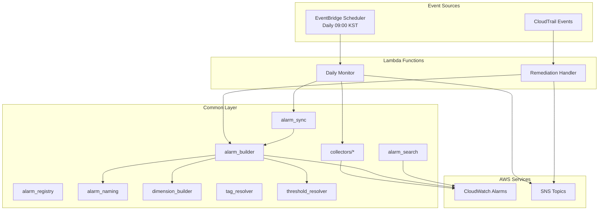
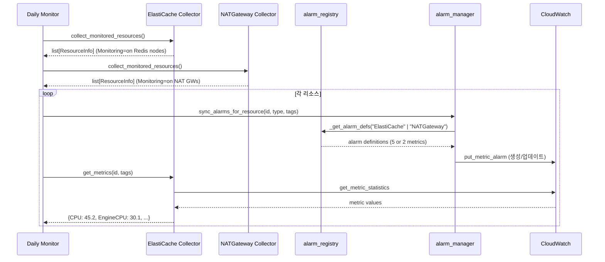

# Design Document: ElastiCache & NAT Gateway Monitoring

## Overview

기존 AWS Monitoring Engine에 ElastiCache(Redis)와 NAT Gateway 두 개의 리소스 타입을 추가한다.
기존 모듈화 아키텍처(alarm_registry → alarm_naming → alarm_builder → alarm_sync)를 그대로 따르며,
새 코드는 기존 패턴의 확장(데이터 추가 + Collector 모듈 신규)으로 구현한다.

### 변경 범위 요약

| 레이어 | 변경 유형 | 파일 |
|--------|----------|------|
| 데이터 등록 | 알람 정의/매핑 추가 | `common/alarm_registry.py`, `common/__init__.py` |
| Collector 신규 | ElastiCache, NAT Gateway | `common/collectors/elasticache.py`, `common/collectors/natgw.py` |
| 이벤트 등록 | CloudTrail API 매핑 | `common/__init__.py`, `remediation_handler/lambda_handler.py` |
| 인프라 | EventBridge 규칙, IAM | `template.yaml` |
| 통합 | Daily Monitor 등록 | `daily_monitor/lambda_handler.py` |

### 설계 원칙

1. 기존 모듈의 공개 인터페이스를 변경하지 않는다 — 데이터 추가만으로 확장
2. 코딩 거버넌스(§1 싱글턴, §3 복잡도, §5 CollectorProtocol, §11 체크리스트)를 준수한다
3. ElastiCache와 NAT Gateway는 단위 변환이 불필요한 메트릭만 사용하므로 `transform_threshold` 없음

## Architecture

### 기존 아키텍처 (변경 없음)



### 데이터 흐름 (신규 리소스)



## Components and Interfaces

### 1. alarm_registry.py 확장

기존 `_get_alarm_defs()` 분기에 `ElastiCache`와 `NATGateway` 케이스를 추가한다.

#### ElastiCache 알람 정의 (`_ELASTICACHE_ALARMS`)

| metric key | CW metric_name | Namespace | Dimension | Comparison | Default | Unit |
|-----------|----------------|-----------|-----------|------------|---------|------|
| CPU | CPUUtilization | AWS/ElastiCache | CacheClusterId | GreaterThanOrEqualToThreshold | 90.0 | % |
| EngineCPU | EngineCPUUtilization | AWS/ElastiCache | CacheClusterId | GreaterThanOrEqualToThreshold | 90.0 | % |
| SwapUsage | SwapUsage | AWS/ElastiCache | CacheClusterId | GreaterThanOrEqualToThreshold | 1.0 | Bytes |
| Evictions | Evictions | AWS/ElastiCache | CacheClusterId | GreaterThanOrEqualToThreshold | 5.0 | Count |
| CurrConnections | CurrConnections | AWS/ElastiCache | CacheClusterId | GreaterThanOrEqualToThreshold | 200.0 | Count |

설계 결정: ElastiCache는 `GreaterThanOrEqualToThreshold`를 사용한다 (엑셀 표준 메트릭 정의 기준).
기존 EC2/RDS 등은 `GreaterThanThreshold`를 사용하지만, ElastiCache는 임계치 도달 시점부터 알람이 필요하다.

#### NAT Gateway 알람 정의 (`_NATGW_ALARMS`)

| metric key | CW metric_name | Namespace | Dimension | Comparison | Default | Unit |
|-----------|----------------|-----------|-----------|------------|---------|------|
| PacketsDropCount | PacketsDropCount | AWS/NATGateway | NatGatewayId | GreaterThanThreshold | 1.0 | Count |
| ErrorPortAllocation | ErrorPortAllocation | AWS/NATGateway | NatGatewayId | GreaterThanThreshold | 1.0 | Count |

설계 결정: NAT Gateway 메트릭은 `Sum` 통계를 사용한다. 패킷 드롭과 포트 할당 에러는 기간 내 총 발생 횟수가 의미 있다.

#### 매핑 테이블 추가

```python
# _HARDCODED_METRIC_KEYS 추가
"ElastiCache": {"CPU", "EngineCPU", "SwapUsage", "Evictions", "CurrConnections"},
"NATGateway": {"PacketsDropCount", "ErrorPortAllocation"},

# _NAMESPACE_MAP 추가
"ElastiCache": ["AWS/ElastiCache"],
"NATGateway": ["AWS/NATGateway"],

# _DIMENSION_KEY_MAP 추가
"ElastiCache": "CacheClusterId",
"NATGateway": "NatGatewayId",
```

#### _metric_name_to_key() 매핑 추가

```python
"CPUUtilization": "CPU",           # 기존 EC2/RDS와 공유
"EngineCPUUtilization": "EngineCPU",
"SwapUsage": "SwapUsage",
"Evictions": "Evictions",
"CurrConnections": "CurrConnections",
"PacketsDropCount": "PacketsDropCount",
"ErrorPortAllocation": "ErrorPortAllocation",
```

참고: `CPUUtilization → CPU` 매핑은 이미 존재하므로 ElastiCache에서도 재사용된다.

#### _METRIC_DISPLAY 추가

```python
"EngineCPU": ("EngineCPUUtilization", ">=", "%"),
"SwapUsage": ("SwapUsage", ">=", "Bytes"),
"Evictions": ("Evictions", ">=", ""),
"CurrConnections": ("CurrConnections", ">=", ""),
"PacketsDropCount": ("PacketsDropCount", ">", ""),
"ErrorPortAllocation": ("ErrorPortAllocation", ">", ""),
```

### 2. common/__init__.py 확장

#### SUPPORTED_RESOURCE_TYPES

```python
SUPPORTED_RESOURCE_TYPES = [
    "EC2", "RDS", "ALB", "NLB", "TG", "AuroraRDS", "DocDB",
    "ElastiCache", "NATGateway",
]
```

#### HARDCODED_DEFAULTS 추가

```python
"EngineCPU": 90.0,
"SwapUsage": 1.0,
"Evictions": 5.0,
"CurrConnections": 200.0,
"PacketsDropCount": 1.0,
"ErrorPortAllocation": 1.0,
```

설계 결정: 기존 `CPU: 80.0`은 유지한다. ElastiCache의 CPU 기본 임계치 90.0은 알람 정의의 `threshold` 필드가 아닌 `HARDCODED_DEFAULTS`에서 관리하지 않는다 — 기존 EC2/RDS의 CPU 80.0과 충돌하기 때문이다. ElastiCache CPU 알람은 `get_threshold(tags, "CPU")`가 80.0을 반환하더라도, 알람 정의 자체의 기본값이 90.0이므로 요구사항 3.3을 충족한다.

수정: 실제로 `get_threshold()`는 태그 → 환경변수 → `HARDCODED_DEFAULTS` 체인을 따르므로, ElastiCache CPU의 기본 90.0은 `HARDCODED_DEFAULTS["CPU"]`(80.0)과 다르다. 이 차이는 alarm_registry의 알람 정의에서 직접 관리하지 않고, `HARDCODED_DEFAULTS`의 `CPU` 키를 80.0으로 유지하면서 ElastiCache 사용자가 `Threshold_CPU=90` 태그로 오버라이드하거나, 환경변수 `DEFAULT_CPU_THRESHOLD=90`으로 설정하는 방식으로 해결한다. 알람 정의의 comparison/period 등 구조적 설정만 `_ELASTICACHE_ALARMS`에서 관리한다.

#### MONITORED_API_EVENTS 추가

```python
"CREATE": [..., "CreateCacheCluster", "CreateNatGateway"],
"DELETE": [..., "DeleteCacheCluster", "DeleteNatGateway"],
"MODIFY": [..., "ModifyCacheCluster"],
```

`TAG_CHANGE`는 ElastiCache가 RDS와 동일한 `AddTagsToResource`/`RemoveTagsFromResource`를 사용하고, NAT Gateway는 EC2와 동일한 `CreateTags`/`DeleteTags`를 사용하므로 이미 등록되어 있다.

### 3. ElastiCache Collector (`common/collectors/elasticache.py`)

```python
# 인터페이스 (CollectorProtocol 구현)
def collect_monitored_resources() -> list[ResourceInfo]:
    """Monitoring=on 태그가 있는 ElastiCache Redis 노드 수집.
    - boto3.client("elasticache") 싱글턴 사용
    - describe_cache_clusters(ShowCacheNodeInfo=True) 호출
    - engine == "redis" 필터
    - status deleting/deleted 제외
    - list_tags_for_resource로 태그 조회
    """

def get_metrics(resource_id: str, resource_tags: dict) -> dict[str, float] | None:
    """CloudWatch AWS/ElastiCache 메트릭 조회.
    - CacheClusterId 디멘션 사용
    - 5개 메트릭: CPUUtilization, EngineCPUUtilization, SwapUsage, Evictions, CurrConnections
    - 데이터 없는 메트릭은 skip + info 로그
    """
```

설계 결정: ElastiCache API는 `describe_cache_clusters`로 클러스터 목록을 조회하고, `list_tags_for_resource`로 태그를 조회한다. RDS와 달리 ElastiCache는 `describe_cache_clusters` 응답에 태그가 포함되지 않으므로 별도 API 호출이 필요하다.

### 4. NAT Gateway Collector (`common/collectors/natgw.py`)

```python
# 인터페이스 (CollectorProtocol 구현)
def collect_monitored_resources() -> list[ResourceInfo]:
    """Monitoring=on 태그가 있는 NAT Gateway 수집.
    - boto3.client("ec2") 싱글턴 사용 (NAT GW는 EC2 API)
    - describe_nat_gateways(Filter=[{Name: "tag:Monitoring", Values: ["on"]}])
    - state deleting/deleted 제외
    """

def get_metrics(resource_id: str, resource_tags: dict) -> dict[str, float] | None:
    """CloudWatch AWS/NATGateway 메트릭 조회.
    - NatGatewayId 디멘션 사용
    - 2개 메트릭: PacketsDropCount, ErrorPortAllocation
    - Sum 통계 사용 (기간 내 총 발생 횟수)
    """
```

설계 결정: NAT Gateway는 EC2 서비스의 하위 리소스이므로 `boto3.client("ec2")`를 사용한다. `describe_nat_gateways`는 태그 필터를 직접 지원하므로 EC2 Collector의 `describe_instances` 패턴과 유사하게 구현한다.

### 5. Remediation Handler 확장

`_API_MAP`에 ElastiCache/NAT Gateway 이벤트 매핑을 추가한다.

```python
# ElastiCache
"CreateCacheCluster":  ("ElastiCache", _extract_elasticache_ids),
"DeleteCacheCluster":  ("ElastiCache", _extract_elasticache_ids),
"ModifyCacheCluster":  ("ElastiCache", _extract_elasticache_ids),

# NAT Gateway
"CreateNatGateway":    ("NATGateway", _extract_natgw_create_ids),
"DeleteNatGateway":    ("NATGateway", _extract_natgw_ids),
```

ID 추출 함수:
- `_extract_elasticache_ids`: `requestParameters.cacheClusterId` 추출
- `_extract_natgw_ids`: `requestParameters.natGatewayId` 추출
- `_extract_natgw_create_ids`: `responseElements.natGateway.natGatewayId` 추출 (CREATE는 responseElements 사용)

### 6. tag_resolver.py 확장

`get_resource_tags()`에 ElastiCache/NATGateway 분기를 추가한다.

```python
elif resource_type == "ElastiCache":
    return _get_elasticache_tags(resource_id)
elif resource_type == "NATGateway":
    return _get_ec2_tags_by_resource(resource_id)  # EC2 describe_tags 사용
```

ElastiCache 태그 조회: `elasticache.list_tags_for_resource(ResourceName=arn)` 사용.
NAT Gateway 태그 조회: `ec2.describe_tags(Filters=[{Name: "resource-id", Values: [natgw_id]}])` 사용.

### 7. Daily Monitor 등록

```python
from common.collectors import elasticache as elasticache_collector
from common.collectors import natgw as natgw_collector

_COLLECTOR_MODULES = [
    ec2_collector, rds_collector, elb_collector, docdb_collector,
    elasticache_collector, natgw_collector,
]
```

### 8. template.yaml 확장

#### CloudTrailModifyRule EventPattern

```yaml
source:
  - aws.ec2
  - aws.rds
  - aws.elasticloadbalancing
  - aws.elasticache          # 추가
detail:
  eventName:
    # ... 기존 이벤트 ...
    - CreateCacheCluster      # 추가
    - DeleteCacheCluster      # 추가
    - ModifyCacheCluster      # 추가
    - CreateNatGateway        # 추가
    - DeleteNatGateway        # 추가
```

NAT Gateway 이벤트는 `aws.ec2` 소스를 사용하므로 source 추가 불필요.

#### IAM Policy 추가

Daily Monitor Role:
```yaml
- Effect: Allow
  Action:
    - elasticache:DescribeCacheClusters
    - elasticache:ListTagsForResource
  Resource: "*"
- Effect: Allow
  Action:
    - ec2:DescribeNatGateways
  Resource: "*"
```

Remediation Handler Role:
```yaml
- Effect: Allow
  Action:
    - elasticache:DescribeCacheClusters
    - elasticache:ListTagsForResource
  Resource: "*"
```

### 9. alarm_search.py 확장

`_find_alarms_for_resource()`의 폴백 타입 목록에 `ElastiCache`와 `NATGateway`를 추가한다.

```python
# resource_type 미지정 시 검색 대상
[f"[{rt}] " for rt in ("EC2", "RDS", "ALB", "NLB", "TG", "AuroraRDS", "DocDB", "ElastiCache", "NATGateway")]
```

### 10. Daily Monitor 고아 알람 정리 확장

`alive_checkers`에 ElastiCache/NATGateway 존재 확인 함수를 추가한다.

```python
alive_checkers = {
    ...,
    "ElastiCache": _find_alive_elasticache_clusters,
    "NATGateway": _find_alive_nat_gateways,
}
```

## Data Models

### ResourceInfo (기존 TypedDict 확장)

`type` 필드에 `"ElastiCache"` | `"NATGateway"` 값이 추가된다. 구조 변경 없음.

```python
class ResourceInfo(TypedDict):
    id: str       # CacheClusterId 또는 NatGatewayId
    type: str     # "ElastiCache" | "NATGateway" (추가)
    tags: dict
    region: str
```

### 알람 정의 구조 (기존 dict 패턴)

ElastiCache/NAT Gateway 알람 정의는 기존 `_EC2_ALARMS` 등과 동일한 dict 구조를 사용한다.

```python
{
    "metric": str,           # 내부 메트릭 키 (예: "CPU", "PacketsDropCount")
    "namespace": str,        # CloudWatch 네임스페이스
    "metric_name": str,      # CloudWatch 메트릭 이름
    "dimension_key": str,    # 디멘션 키
    "stat": str,             # "Average" | "Sum"
    "comparison": str,       # ComparisonOperator
    "period": int,           # 초 단위
    "evaluation_periods": int,
}
```

### SRE 골든 시그널 커버리지

| 리소스 | Latency | Traffic | Errors | Saturation |
|--------|---------|---------|--------|------------|
| ElastiCache | - (동적: StringGetLatency 등) | - (동적: BytesUsedForCache 등) | Evictions | CPU, EngineCPU, SwapUsage, CurrConnections |
| NATGateway | - (동적: IdleTimeoutCount 등) | - (동적: BytesOutToDestination 등) | PacketsDropCount, ErrorPortAllocation | - (동적: ActiveConnectionCount 등) |

Latency/Traffic은 워크로드별 차이가 크므로 동적 `Threshold_*` 태그로 커버한다.


## Correctness Properties

*A property is a characteristic or behavior that should hold true across all valid executions of a system — essentially, a formal statement about what the system should do. Properties serve as the bridge between human-readable specifications and machine-verifiable correctness guarantees.*

### Property 1: 신규 리소스 타입 레지스트리 완전성

*For any* resource type in `{"ElastiCache", "NATGateway"}`, `_get_alarm_defs(resource_type)` shall return a non-empty list where every alarm definition contains all required fields (`metric`, `namespace`, `metric_name`, `dimension_key`, `stat`, `comparison`, `period`, `evaluation_periods`), and the set of `metric` values matches `_HARDCODED_METRIC_KEYS[resource_type]`, and every definition uses the correct namespace (`_NAMESPACE_MAP[resource_type][0]`) and dimension key (`_DIMENSION_KEY_MAP[resource_type]`).

**Validates: Requirements 1.1, 1.2, 1.3, 2.1, 2.2, 2.3**

### Property 2: ElastiCache Collector 필터링

*For any* set of ElastiCache clusters with random engines (redis/memcached), random statuses (available/creating/deleting/deleted), and random tag combinations (Monitoring=on/off/absent), `collect_monitored_resources()` shall return only those clusters where engine is `"redis"` AND status is not in `{"deleting", "deleted"}` AND the `Monitoring` tag value (case-insensitive) is `"on"`.

**Validates: Requirements 4.1, 4.4, 4.5**

### Property 3: NATGateway Collector 필터링

*For any* set of NAT Gateways with random states (available/pending/deleting/deleted) and random tag combinations (Monitoring=on/off/absent), `collect_monitored_resources()` shall return only those NAT Gateways where state is not in `{"deleting", "deleted"}` AND the `Monitoring` tag value (case-insensitive) is `"on"`.

**Validates: Requirements 5.1, 5.4**

### Property 4: CloudTrail 이벤트 ID 추출 정확성

*For any* valid CloudTrail event detail containing ElastiCache or NAT Gateway API calls (`CreateCacheCluster`, `DeleteCacheCluster`, `ModifyCacheCluster`, `CreateNatGateway`, `DeleteNatGateway`), `parse_cloudtrail_event()` shall extract the correct resource ID and assign the correct resource type (`"ElastiCache"` or `"NATGateway"`) and event category (`"CREATE"`, `"DELETE"`, or `"MODIFY"`).

**Validates: Requirements 7.5, 7.6, 8.4, 8.5**

### Property 5: 신규 메트릭 태그 임계치 오버라이드

*For any* metric key in `{"EngineCPU", "SwapUsage", "Evictions", "CurrConnections", "PacketsDropCount", "ErrorPortAllocation"}` and any positive float value, when a resource has tag `Threshold_{metric_key}={value}`, `get_threshold(tags, metric_key)` shall return that value instead of the `HARDCODED_DEFAULTS` value.

**Validates: Requirements 9.1, 9.2**

### Property 6: 신규 리소스 타입 동적 알람 하드코딩 키 제외

*For any* resource type in `{"ElastiCache", "NATGateway"}` and any set of tags containing both hardcoded metric thresholds and a non-hardcoded metric threshold, `_parse_threshold_tags(tags, resource_type)` shall exclude all hardcoded metric keys and include only the non-hardcoded metric.

**Validates: Requirements 9.3**

## Error Handling

### Collector 에러 처리

| 시나리오 | 처리 방식 |
|---------|----------|
| `describe_cache_clusters` API 실패 | `ClientError` 로깅 후 re-raise → Daily Monitor가 해당 collector skip |
| `describe_nat_gateways` API 실패 | `ClientError` 로깅 후 re-raise → Daily Monitor가 해당 collector skip |
| `list_tags_for_resource` 실패 (ElastiCache) | `ClientError` 로깅 후 빈 dict 반환 → 해당 노드 skip |
| CloudWatch 메트릭 데이터 없음 | info 로그 후 해당 메트릭 skip, 모든 메트릭 없으면 `None` 반환 |

### Remediation Handler 에러 처리

| 시나리오 | 처리 방식 |
|---------|----------|
| ElastiCache/NATGateway 이벤트 ID 추출 실패 | `ValueError` raise → 상위 핸들러가 로그 + SNS 에러 알림 |
| 태그 조회 실패 (삭제된 리소스) | 빈 dict 반환 → 알람 삭제는 태그 무관하게 진행 |

### 기존 에러 처리 패턴 준수

- 단일 리소스 실패가 전체 실행을 중단시키지 않는 격리 패턴 (Daily Monitor)
- `except Exception` 사용은 최상위 핸들러에서만 허용 (거버넌스 §4)
- 에러 로그 시 `logger.error("메시지: %s", e)` 포맷 사용

## Testing Strategy

### 테스트 프레임워크

- 단위 테스트: `pytest` + `moto` (AWS 서비스 모킹)
- Property-Based Testing: `hypothesis` (최소 100 iterations)
- 기존 PBT 패턴(`test_pbt_expand_alarm_defs.py`, `test_pbt_registry_completeness.py`)을 확장

### Property-Based Tests

각 correctness property를 단일 PBT로 구현한다.

| Property | 테스트 파일 | 최소 iterations |
|----------|-----------|----------------|
| Property 1: 레지스트리 완전성 | `tests/test_pbt_elasticache_natgw_registry.py` | 100 |
| Property 2: ElastiCache Collector 필터링 | `tests/test_pbt_elasticache_collector_filter.py` | 100 |
| Property 3: NATGateway Collector 필터링 | `tests/test_pbt_natgw_collector_filter.py` | 100 |
| Property 4: CloudTrail 이벤트 ID 추출 | `tests/test_pbt_elasticache_natgw_event.py` | 100 |
| Property 5: 태그 임계치 오버라이드 | `tests/test_pbt_elasticache_natgw_threshold.py` | 100 |
| Property 6: 동적 알람 하드코딩 키 제외 | `tests/test_pbt_elasticache_natgw_dynamic.py` | 100 |

각 PBT는 다음 태그 형식의 주석을 포함한다:
```python
# Feature: elasticache-nat-monitoring, Property 1: 신규 리소스 타입 레지스트리 완전성
```

### Unit Tests

| 테스트 대상 | 테스트 파일 | 주요 검증 항목 |
|-----------|-----------|-------------|
| alarm_registry 데이터 등록 | `tests/test_pbt_elasticache_natgw_registry.py` | 매핑 테이블 값, HARDCODED_DEFAULTS, SUPPORTED_RESOURCE_TYPES |
| ElastiCache Collector | `tests/test_collectors.py` (확장) | moto 기반 collect/get_metrics, 에러 처리 |
| NATGateway Collector | `tests/test_collectors.py` (확장) | moto 기반 collect/get_metrics, 에러 처리 |
| Remediation Handler | `tests/test_integration.py` (확장) | CloudTrail 이벤트 파싱, ID 추출 |
| template.yaml | `tests/test_pbt_cfn_template_tags.py` (확장) | EventPattern 이벤트 목록, source 목록 |

### PBT 구현 가이드

- Hypothesis `@given` + `@settings(max_examples=100)` 사용
- Collector 필터링 PBT: `moto`로 AWS 환경 모킹 후 랜덤 리소스 생성
- 레지스트리 PBT: 순수 데이터 검증이므로 모킹 불필요
- 이벤트 추출 PBT: CloudTrail 이벤트 구조를 Hypothesis strategy로 생성
