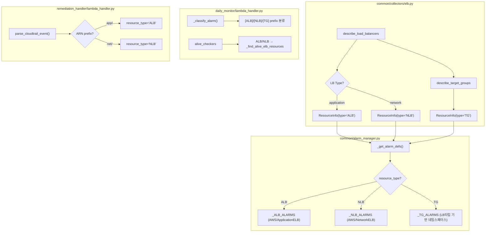

# Design Document: ELB Resource Type Split

## Overview

현재 시스템은 ALB, NLB, Target Group 모두 `resource_type="ELB"`로 통일하여 처리한다. 이로 인해 알람 이름이 `[ELB] ...`로 동일하게 표시되어 운영자가 ALB/NLB/TG를 구분할 수 없다.

이 설계는 `resource_type`을 `"ALB"`, `"NLB"`, `"TG"`로 세분화하여:
- ELB Collector가 LB 타입에 따라 `"ALB"` 또는 `"NLB"`를 반환하도록 변경
- Alarm Manager가 각 타입별 알람 정의(네임스페이스, 메트릭, 디멘션)를 분기
- Daily Monitor의 고아 알람 정리가 새 prefix를 인식
- Remediation Handler가 ARN 기반으로 ALB/NLB를 구분
- 기존 `[ELB]` 알람이 다음 Daily Monitor 실행 시 자동 마이그레이션

변경 범위는 기존 모듈 내부 로직 수정에 한정되며, 새 모듈이나 Lambda 함수 추가는 없다.

## Architecture

변경은 기존 아키텍처를 유지하면서 데이터 흐름의 `resource_type` 값만 세분화한다.



### 마이그레이션 전략

기존 `[ELB]` 알람은 별도 마이그레이션 스크립트 없이 Daily Monitor의 `sync_alarms_for_resource`를 통해 자동 교체된다:

1. `_find_alarms_for_resource()`가 `[ELB] ` prefix도 검색 대상에 포함
2. 기존 `[ELB]` 알람 발견 시 삭제 후 새 `[ALB]`/`[NLB]`/`[TG]` prefix로 재생성
3. 고아 알람 정리에서도 `[ELB]` prefix를 인식하여 정리

## Components and Interfaces

### 1. ELB Collector (`common/collectors/elb.py`)

변경 사항:
- `collect_monitored_resources()`: `ResourceInfo.type`을 LB 타입에 따라 `"ALB"` 또는 `"NLB"`로 설정 (기존 `"ELB"` 대체)
- TG는 기존과 동일하게 `"TG"` 유지
- `get_metrics()`: 변경 없음 (이미 `_lb_type` 태그 기반으로 네임스페이스 분기 중)

```python
# 변경 전
ResourceInfo(id=lb_arn, type="ELB", tags=tags, region=region)

# 변경 후
lb_type = lb.get("Type", "application")
resource_type = "ALB" if lb_type == "application" else "NLB"
ResourceInfo(id=lb_arn, type=resource_type, tags=tags, region=region)
```

### 2. Alarm Manager (`common/alarm_manager.py`)

변경 사항:

**알람 정의 분리:**
- 기존 `_ELB_ALARMS` → `_ALB_ALARMS` + `_NLB_ALARMS` + `_TG_ALARMS`
- `_get_alarm_defs()`: `"ALB"`, `"NLB"`, `"TG"` 분기 추가, `"ELB"` 제거

```python
_ALB_ALARMS = [
    {"metric": "RequestCount", "namespace": "AWS/ApplicationELB",
     "dimension_key": "LoadBalancer", ...},
]

_NLB_ALARMS = [
    {"metric": "ProcessedBytes", "namespace": "AWS/NetworkELB",
     "dimension_key": "LoadBalancer", ...},
    {"metric": "ActiveFlowCount", ...},
    {"metric": "NewFlowCount", ...},
]

_TG_ALARMS = [
    {"metric": "RequestCount", "namespace": "AWS/ApplicationELB",
     "dimension_key": "TargetGroup", ...},
    {"metric": "HealthyHostCount", ...},
]
```

**상수 매핑 업데이트:**
- `_HARDCODED_METRIC_KEYS`: `"ELB"` → `"ALB"`, `"NLB"`, `"TG"`
- `_NAMESPACE_MAP`: `"ELB"` → `"ALB"`, `"NLB"`, `"TG"`
- `_DIMENSION_KEY_MAP`: `"ELB"` → `"ALB"`, `"NLB"`, `"TG"`

**레거시 호환:**
- `_find_alarms_for_resource()`: `resource_type`이 `"ALB"` 또는 `"NLB"`일 때 `[ELB] ` prefix도 검색
- `_create_standard_alarm()`: `resource_type`이 `"ALB"`, `"NLB"`, `"TG"` 중 하나이고 `dimension_key`가 `"LoadBalancer"` 또는 `"TargetGroup"`이면 ARN suffix 추출

### 3. Common Init (`common/__init__.py`)

변경 사항:
- `SUPPORTED_RESOURCE_TYPES`: `["EC2", "RDS", "ELB"]` → `["EC2", "RDS", "ALB", "NLB", "TG"]`
- `ResourceInfo` 타입 주석 업데이트

### 4. Daily Monitor (`daily_monitor/lambda_handler.py`)

변경 사항:
- `_classify_alarm()`: `[ALB]`, `[NLB]` prefix 인식 (기존 `[ELB]`, `[TG]` 유지)
- `alive_checkers`: `"ALB"`, `"NLB"` 키 추가 → `_find_alive_elb_resources` 연결
- `_process_resource()`: `resource_type`이 `"ALB"` 또는 `"NLB"`일 때도 `get_metrics` 정상 호출

### 5. Remediation Handler (`remediation_handler/lambda_handler.py`)

변경 사항:
- `_API_MAP`: ELB 관련 항목의 resource_type을 동적으로 결정하도록 변경
- `_extract_elb_id()` 반환값의 ARN에서 `app/` → `"ALB"`, `net/` → `"NLB"` 판별
- `_execute_remediation()`: `"ALB"`, `"NLB"` 처리 추가

### 6. Tag Resolver (`common/tag_resolver.py`)

변경 사항:
- `get_resource_tags()`: `"ALB"`, `"NLB"` 타입도 `_get_elbv2_tags()` 호출하도록 분기 추가

## Data Models

### ResourceInfo 변경

```python
class ResourceInfo(TypedDict):
    id: str           # 리소스 ID (ARN for ALB/NLB/TG)
    type: str         # "EC2" | "RDS" | "ALB" | "NLB" | "TG"
    tags: dict        # {"Monitoring": "on", "_lb_type": "application", ...}
    region: str
```

### 알람 정의 구조 (변경 없음, 분기만 추가)

```python
# 기존 구조 유지
alarm_def = {
    "metric": str,           # 내부 메트릭 키
    "namespace": str,        # CloudWatch 네임스페이스
    "metric_name": str,      # CloudWatch 메트릭 이름
    "dimension_key": str,    # 디멘션 키 ("LoadBalancer" | "TargetGroup")
    "stat": str,             # "Average" | "Sum"
    "comparison": str,       # ComparisonOperator
    "period": int,
    "evaluation_periods": int,
}
```

### 상수 매핑 변경

| 상수 | 변경 전 | 변경 후 |
|------|---------|---------|
| `SUPPORTED_RESOURCE_TYPES` | `["EC2", "RDS", "ELB"]` | `["EC2", "RDS", "ALB", "NLB", "TG"]` |
| `_HARDCODED_METRIC_KEYS["ELB"]` | `{"RequestCount"}` | `"ALB": {"RequestCount"}`, `"NLB": {"ProcessedBytes", "ActiveFlowCount", "NewFlowCount"}`, `"TG": {"RequestCount", "HealthyHostCount"}` |
| `_NAMESPACE_MAP["ELB"]` | `["AWS/ApplicationELB", "AWS/NetworkELB"]` | `"ALB": ["AWS/ApplicationELB"]`, `"NLB": ["AWS/NetworkELB"]`, `"TG": ["AWS/ApplicationELB", "AWS/NetworkELB"]` |
| `_DIMENSION_KEY_MAP["ELB"]` | `"LoadBalancer"` | `"ALB": "LoadBalancer"`, `"NLB": "LoadBalancer"`, `"TG": "TargetGroup"` |


## Correctness Properties

*A property is a characteristic or behavior that should hold true across all valid executions of a system — essentially, a formal statement about what the system should do. Properties serve as the bridge between human-readable specifications and machine-verifiable correctness guarantees.*

### Property 1: Collector 리소스 타입 매핑 정확성

*For any* Load Balancer with `Type=application`, the ELB Collector shall set `ResourceInfo.type` to `"ALB"`, and *for any* Load Balancer with `Type=network`, the ELB Collector shall set `ResourceInfo.type` to `"NLB"`, and *for any* Target Group, the ELB Collector shall set `ResourceInfo.type` to `"TG"`.

**Validates: Requirements 1.1, 2.1, 3.1**

### Property 2: 알람 이름 prefix와 resource_type 일치

*For any* `resource_type` in `{"ALB", "NLB", "TG"}` and any valid resource_id, resource_name, metric, threshold 조합에 대해, `_pretty_alarm_name()`이 반환하는 알람 이름은 `[{resource_type}] `로 시작하고 `({resource_id})`로 끝나야 한다.

**Validates: Requirements 1.2, 2.2, 3.2**

### Property 3: 새 리소스 타입에 대한 알람 이름 255자 제한

*For any* `resource_type` in `{"ALB", "NLB", "TG"}` and any valid resource_id, resource_name, metric, threshold 조합에 대해, `_pretty_alarm_name()`이 반환하는 알람 이름은 항상 255자 이하여야 한다.

**Validates: Requirements 6.1, 6.2**

### Property 4: 알람 분류 정확성 (새 prefix 포함)

*For any* 알람 이름이 `[{type}] {label} {metric_info} ({resource_id})` 형식일 때 (`type` ∈ `{"ALB", "NLB", "TG", "EC2", "RDS"}`), `_classify_alarm()`은 해당 알람을 올바른 `resource_type`과 `resource_id`로 분류해야 한다.

**Validates: Requirements 8.1, 8.2, 8.3**

### Property 5: ARN 기반 resource_type 판별

*For any* ELB ARN에서 `loadbalancer/app/`을 포함하면 resource_type은 `"ALB"`이고, `loadbalancer/net/`을 포함하면 resource_type은 `"NLB"`이어야 한다.

**Validates: Requirements 9.1**

### Property 6: ARN suffix 디멘션 추출 일관성

*For any* 유효한 ALB/NLB ARN에 대해, `_extract_elb_dimension()`은 `loadbalancer/` 이후의 suffix를 반환해야 하며, 이 값은 CloudWatch Dimension `LoadBalancer`의 값으로 사용된다.

**Validates: Requirements 4.4**

## Error Handling

### ELB Collector

- `describe_load_balancers` API 실패: `ClientError` 전파 (기존 동작 유지)
- 삭제 중인 LB (`deleting`/`deleted`/`failed` 상태): skip + 로그 (기존 동작 유지)
- 태그 조회 실패: 빈 딕셔너리 반환 + 로그 (기존 동작 유지)

### Alarm Manager

- `_get_alarm_defs()`에 알 수 없는 resource_type 전달: 빈 리스트 반환 (기존 동작 유지)
- `put_metric_alarm` 실패: `ClientError` catch + 로그, 해당 알람 skip (기존 동작 유지)
- 레거시 `[ELB]` 알람 검색 실패: 로그 후 계속 진행

### Daily Monitor

- `alive_checkers`에 없는 resource_type: 경고 로그 + skip (기존 동작 유지)
- `_classify_alarm()`에서 인식 불가 알람: 무시 (기존 동작 유지)

### Remediation Handler

- ARN에서 `app/`/`net/` 판별 불가: 기존 `"ELB"` 폴백 또는 ValueError
- `_execute_remediation()`에 `"ALB"`/`"NLB"` 전달: ELBv2 `delete_load_balancer` 호출 (기존 ELB 로직 재사용)

### Tag Resolver

- `get_resource_tags()`에 `"ALB"`/`"NLB"` 전달: `_get_elbv2_tags()` 호출 (기존 `"ELB"` 분기 확장)

## Testing Strategy

### Property-Based Testing (hypothesis)

PBT 라이브러리: `hypothesis` (>=6.100, 프로젝트 기존 사용 중)

각 property test는 최소 100회 반복 실행하며, 설계 문서의 property를 참조하는 태그를 포함한다.

태그 형식: `Feature: elb-resource-type-split, Property {number}: {property_text}`

각 correctness property는 단일 property-based test로 구현한다:

| Property | 테스트 파일 | 전략 |
|----------|------------|------|
| Property 1 | `tests/test_pbt_elb_type_split.py` | LB 타입(application/network) + TG 조합 생성, collector 출력의 type 필드 검증 |
| Property 2 | `tests/test_pbt_elb_type_split.py` | resource_type ∈ {ALB, NLB, TG} × 랜덤 입력 생성, prefix/suffix 패턴 검증 |
| Property 3 | `tests/test_pbt_alarm_name_constraint.py` (기존 확장) | resource_types 전략에 ALB/NLB/TG 추가, 255자 제한 검증 |
| Property 4 | `tests/test_pbt_elb_type_split.py` | 랜덤 알람 이름 생성 (새 포맷), _classify_alarm 출력 검증 |
| Property 5 | `tests/test_pbt_elb_type_split.py` | 랜덤 ALB/NLB ARN 생성, 파싱 결과 resource_type 검증 |
| Property 6 | `tests/test_pbt_elb_type_split.py` | 랜덤 ARN 생성, _extract_elb_dimension 출력이 loadbalancer/ 이후 suffix와 일치 검증 |

### Unit Testing

단위 테스트는 구체적 예시, 엣지 케이스, 에러 조건에 집중한다:

| 모듈 | 테스트 파일 | 주요 테스트 케이스 |
|------|------------|-------------------|
| ELB Collector | `tests/test_collectors.py` | ALB→type="ALB", NLB→type="NLB", TG→type="TG" 수집 검증 |
| Alarm Manager | `tests/test_alarm_manager.py` | `_get_alarm_defs("ALB"/"NLB"/"TG")` 반환값, 상수 매핑 검증, 레거시 [ELB] 검색 호환 |
| Daily Monitor | `tests/test_daily_monitor.py` | `_classify_alarm` [ALB]/[NLB] 분류, alive_checkers 매핑, 고아 알람 정리 |
| Remediation | `tests/test_remediation_handler.py` | ARN→ALB/NLB 파싱, execute_remediation ALB/NLB 처리 |
| Tag Resolver | `tests/test_tag_resolver.py` | get_resource_tags("ALB"/"NLB") → _get_elbv2_tags 호출 |
| Common Init | `tests/test_alarm_manager.py` | SUPPORTED_RESOURCE_TYPES 값 검증 |

### 마이그레이션 테스트

- 기존 `[ELB]` 알람이 sync 시 `[ALB]`/`[NLB]` 알람으로 교체되는 시나리오
- 고아 알람 정리에서 `[ELB]` prefix 알람도 정리되는 시나리오
- 레거시 + 새 포맷 알람이 혼재할 때 중복 없이 처리되는 시나리오

### TDD 사이클

코딩 거버넌스 §8에 따라 레드-그린-리팩터링 사이클을 준수한다:
1. 실패하는 테스트 먼저 작성 (새 resource_type에 대한 기대값 설정)
2. 최소한의 코드로 테스트 통과
3. 리팩터링 (중복 제거, 상수 정리)
