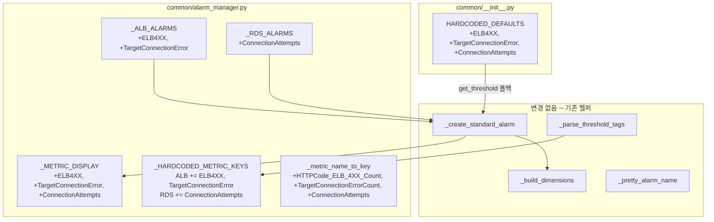

# Design Document: expand-alb-rds-metrics

## Overview

기존 ALB 및 RDS 리소스의 하드코딩 기본 알람 정의를 확장하여 세 가지 메트릭을 추가한다. 변경 범위는 `common/alarm_manager.py`의 알람 정의 리스트(`_ALB_ALARMS`, `_RDS_ALARMS`)와 관련 매핑(`_METRIC_DISPLAY`, `_HARDCODED_METRIC_KEYS`, `_metric_name_to_key`), 그리고 `common/__init__.py`의 `HARDCODED_DEFAULTS`에 한정된다.

기존 `_build_dimensions()`, `_resolve_tg_namespace()`, `_create_standard_alarm()`, `_parse_threshold_tags()` 등 핵심 헬퍼 함수는 이미 리소스 유형별 디멘션 처리와 네임스페이스 동적 결정을 지원하므로, 로직 변경 없이 데이터 정의만 추가하면 된다.

이 스펙은 `expand-default-alarms` 스펙의 패턴을 그대로 따른다.

### 추가 대상 메트릭 요약

| 리소스 유형 | 메트릭 키 | CloudWatch 메트릭 이름 | 네임스페이스 | 디멘션 | Stat | Comparison | 기본 임계치 |
|------------|----------|----------------------|------------|--------|------|------------|-----------|
| ALB | `ELB4XX` | `HTTPCode_ELB_4XX_Count` | AWS/ApplicationELB | `LoadBalancer` | Sum | GreaterThanThreshold | 100.0 |
| ALB | `TargetConnectionError` | `TargetConnectionErrorCount` | AWS/ApplicationELB | `LoadBalancer` | Sum | GreaterThanThreshold | 50.0 |
| RDS | `ConnectionAttempts` | `ConnectionAttempts` | AWS/RDS | `DBInstanceIdentifier` | Sum | GreaterThanThreshold | 500.0 |

### SRE 골든 시그널 커버리지 영향

| 리소스 | 시그널 | 기존 메트릭 | 추가 메트릭 |
|--------|--------|-----------|-----------|
| ALB | Errors | ELB5XX | **ELB4XX** (클라이언트 에러), **TargetConnectionError** (백엔드 연결 실패) |
| RDS | Saturation | CPU, FreeMemoryGB, FreeStorageGB, Connections | **ConnectionAttempts** (연결 시도 급증) |

### 설계 결정

1. **ELB4XX vs ELB5XX 키 네이밍**: `HTTPCode_ELB_4XX_Count`의 내부 키를 `ELB4XX`로 설정한다. 기존 `ELB5XX` 패턴과 일관성을 유지한다.
2. **TargetConnectionError 키 네이밍**: `TargetConnectionErrorCount`의 내부 키를 `TargetConnectionError`로 설정한다. CloudWatch 메트릭 이름에서 `Count` 접미사를 제거하여 간결하게 한다.
3. **ConnectionAttempts 키 네이밍**: CloudWatch 메트릭 이름과 내부 키가 동일하다. 별도 변환이 불필요하다.
4. **ALB 메트릭 디멘션**: `HTTPCode_ELB_4XX_Count`와 `TargetConnectionErrorCount`는 모두 AWS 공식 문서 기준 LB 레벨 메트릭이므로 `LoadBalancer` 단일 디멘션을 사용한다.
5. **RDS ConnectionAttempts 통계**: `Sum` 통계를 사용한다. 평가 기간 내 총 연결 시도 횟수를 측정하여 급증을 감지한다.

## Architecture

### 변경 영향 범위



### 핵심 설계 원칙

1. **데이터 전용 변경**: 기존 로직 함수는 수정하지 않는다. 알람 정의 딕셔너리와 매핑만 확장한다.
2. **디멘션 정합성**: 거버넌스 §6-1에 따라 AWS 공식 문서 기준 디멘션을 사용한다. LB 레벨 메트릭에 TG 디멘션을 넣지 않는다.
3. **동적 태그 호환**: `_HARDCODED_METRIC_KEYS`에 새 키를 추가하면 `_parse_threshold_tags()`가 자동으로 해당 키를 동적 알람 생성에서 제외한다.
4. **TDD 사이클**: 거버넌스 §8에 따라 테스트 먼저 작성 → 구현 → 리팩터링 순서를 따른다.

## Components and Interfaces

### 1. `common/__init__.py` — HARDCODED_DEFAULTS 확장

새 메트릭 키에 대한 시스템 기본 임계치를 추가한다.

```python
HARDCODED_DEFAULTS: dict[str, float] = {
    # ... 기존 항목 유지 ...
    "ELB4XX": 100.0,
    "TargetConnectionError": 50.0,
    "ConnectionAttempts": 500.0,
}
```

### 2. `common/alarm_manager.py` — _METRIC_DISPLAY 확장

```python
_METRIC_DISPLAY = {
    # ... 기존 항목 유지 ...
    "ELB4XX": ("HTTPCode_ELB_4XX_Count", ">", ""),
    "TargetConnectionError": ("TargetConnectionErrorCount", ">", ""),
    "ConnectionAttempts": ("ConnectionAttempts", ">", ""),
}
```

### 3. `common/alarm_manager.py` — _ALB_ALARMS 확장

기존 3개 항목(RequestCount, ELB5XX, TargetResponseTime)에 2개를 추가한다.

```python
# _ALB_ALARMS 추가 항목:
{"metric": "ELB4XX", "namespace": "AWS/ApplicationELB",
 "metric_name": "HTTPCode_ELB_4XX_Count", "dimension_key": "LoadBalancer",
 "stat": "Sum", "comparison": "GreaterThanThreshold",
 "period": 60, "evaluation_periods": 1},
{"metric": "TargetConnectionError", "namespace": "AWS/ApplicationELB",
 "metric_name": "TargetConnectionErrorCount", "dimension_key": "LoadBalancer",
 "stat": "Sum", "comparison": "GreaterThanThreshold",
 "period": 60, "evaluation_periods": 1},
```

### 4. `common/alarm_manager.py` — _RDS_ALARMS 확장

기존 6개 항목(CPU, FreeMemoryGB, FreeStorageGB, Connections, ReadLatency, WriteLatency)에 1개를 추가한다.

```python
# _RDS_ALARMS 추가 항목:
{"metric": "ConnectionAttempts", "namespace": "AWS/RDS",
 "metric_name": "ConnectionAttempts", "dimension_key": "DBInstanceIdentifier",
 "stat": "Sum", "comparison": "GreaterThanThreshold",
 "period": 300, "evaluation_periods": 1},
```

### 5. `common/alarm_manager.py` — _HARDCODED_METRIC_KEYS 확장

```python
_HARDCODED_METRIC_KEYS = {
    # ... 기존 항목 유지 ...
    "ALB": {"RequestCount", "ELB5XX", "TargetResponseTime", "ELB4XX", "TargetConnectionError"},
    "RDS": {"CPU", "FreeMemoryGB", "FreeStorageGB", "Connections", "ReadLatency", "WriteLatency", "ConnectionAttempts"},
    # EC2, NLB, TG, AuroraRDS는 변경 없음
}
```

### 6. `common/alarm_manager.py` — _metric_name_to_key 매핑 확장

```python
mapping = {
    # ... 기존 항목 유지 ...
    "HTTPCode_ELB_4XX_Count": "ELB4XX",
    "TargetConnectionErrorCount": "TargetConnectionError",
    "ConnectionAttempts": "ConnectionAttempts",
}
```

### 7. 기존 함수 — 변경 없음

다음 함수들은 알람 정의 딕셔너리의 `dimension_key`, `namespace` 필드를 읽어 동작하므로 코드 변경이 필요 없다:

- `_build_dimensions()`: `dimension_key == "LoadBalancer"`이면 단일 디멘션 생성
- `_create_standard_alarm()`: 알람 정의 딕셔너리를 그대로 사용
- `_parse_threshold_tags()`: `_HARDCODED_METRIC_KEYS`를 참조하여 동적 메트릭 필터링
- `_pretty_alarm_name()`: `_METRIC_DISPLAY`를 참조하여 알람 이름 생성

## Data Models

### 알람 정의 딕셔너리 스키마 (변경 없음)

```python
{
    "metric": str,           # 내부 메트릭 키 (예: "ELB4XX")
    "namespace": str,        # CloudWatch 네임스페이스 (예: "AWS/ApplicationELB")
    "metric_name": str,      # CloudWatch 메트릭 이름 (예: "HTTPCode_ELB_4XX_Count")
    "dimension_key": str,    # 기본 디멘션 키 (예: "LoadBalancer")
    "stat": str,             # 통계 (예: "Sum", "Average")
    "comparison": str,       # 비교 연산자 (예: "GreaterThanThreshold")
    "period": int,           # 평가 기간 (초)
    "evaluation_periods": int,
}
```

### HARDCODED_DEFAULTS 확장 후 새 키 목록

| 메트릭 키 | 기본값 | 단위 | 비고 |
|----------|-------|------|------|
| `ELB4XX` | 100.0 | 건/분 | ALB 4XX 클라이언트 에러 수 |
| `TargetConnectionError` | 50.0 | 건/분 | ALB 타겟 연결 실패 수 |
| `ConnectionAttempts` | 500.0 | 건/5분 | RDS 연결 시도 횟수 |


## Correctness Properties

*A property is a characteristic or behavior that should hold true across all valid executions of a system — essentially, a formal statement about what the system should do. Properties serve as the bridge between human-readable specifications and machine-verifiable correctness guarantees.*

### Property 1: 알람 정의 완전성 (Alarm Definition Completeness)

*For any* resource type in {ALB, RDS}, the set of metric keys returned by `_get_alarm_defs(resource_type)` should be a superset of the expected hardcoded metric keys for that type. Specifically:
- ALB: {RequestCount, ELB5XX, TargetResponseTime, ELB4XX, TargetConnectionError}
- RDS: {CPU, FreeMemoryGB, FreeStorageGB, Connections, ReadLatency, WriteLatency, ConnectionAttempts}

Additionally, each alarm definition must have valid `namespace`, `metric_name`, `dimension_key`, `stat`, and `comparison` fields.

**Validates: Requirements 1.1, 2.1, 3.1, 6.1**

### Property 2: ALB LB 레벨 메트릭 단일 디멘션 (ALB LB-Level Single Dimension)

*For any* ALB ARN, and *for any* alarm definition where `dimension_key == "LoadBalancer"` (including the newly added `ELB4XX` and `TargetConnectionError`), calling `_build_dimensions()` should produce exactly one dimension with `Name == "LoadBalancer"` and `Value` equal to the ARN suffix (e.g., `app/my-alb/hash`). The `TargetGroup` dimension must NOT be present.

**Validates: Requirements 1.2, 2.2, 6.2**

### Property 3: 태그 임계치 오버라이드 (Tag Threshold Override)

*For any* newly added hardcoded metric key (ELB4XX, TargetConnectionError, ConnectionAttempts) and *for any* valid positive float threshold value, when a `Threshold_{metric_key}` tag is present, `get_threshold()` should return the tag value instead of the hardcoded default.

**Validates: Requirements 4.1**

### Property 4: 동적 태그 하드코딩 키 제외 (Dynamic Tag Hardcoded Key Exclusion)

*For any* resource type in {ALB, RDS} and *for any* set of tags containing `Threshold_{key}` entries where `key` is in the updated `_HARDCODED_METRIC_KEYS[resource_type]`, `_parse_threshold_tags()` should exclude those keys from the returned dictionary. Only metric keys NOT in the hardcoded set should appear in the result.

**Validates: Requirements 4.2**

## Error Handling

이 기능은 데이터 정의 확장이므로 새로운 에러 처리 로직은 추가하지 않는다. 기존 에러 처리가 그대로 적용된다:

| 상황 | 기존 처리 | 변경 |
|------|----------|------|
| `put_metric_alarm` ClientError | `logger.error` + skip, 알람 이름 미반환 | 없음 |
| `get_threshold` 미등록 메트릭 | 80.0 폴백 반환 | HARDCODED_DEFAULTS에 추가하여 폴백 불필요 |
| `_metric_name_to_key` 미등록 메트릭 | 입력값 그대로 반환 | 매핑 추가하여 폴백 불필요 |

## Testing Strategy

### 단위 테스트 (Unit Tests)

`tests/test_alarm_manager.py`에 추가할 테스트:

1. **ALB 알람 정의 검증**: `_get_alarm_defs("ALB")` 반환값의 메트릭 수(5개)와 키 집합 확인 (ELB4XX, TargetConnectionError 포함)
2. **RDS 알람 정의 검증**: `_get_alarm_defs("RDS")` 반환값의 메트릭 수(7개)와 키 집합 확인 (ConnectionAttempts 포함)
3. **_METRIC_DISPLAY 검증**: 새 메트릭 키의 (metric_name, direction, unit) 매핑 확인
4. **_HARDCODED_METRIC_KEYS 검증**: ALB, RDS 키 집합 확인
5. **_metric_name_to_key 검증**: 새 CloudWatch 메트릭 이름 → 내부 키 변환 확인
6. **HARDCODED_DEFAULTS 검증**: 새 메트릭 키의 기본 임계치 존재 확인
7. **디멘션 검증**: 새 ALB 알람의 LoadBalancer 단일 디멘션 확인
8. **동적 태그 제외 검증**: 새 하드코딩 키가 `_parse_threshold_tags()` 결과에서 제외되는지 확인

### Property-Based Tests (Hypothesis)

거버넌스 §8에 따라 `hypothesis` 라이브러리를 사용한다. 각 테스트는 최소 100회 반복 실행한다.

| PBT 파일 | Property | 설명 |
|----------|----------|------|
| `tests/test_pbt_expand_alb_rds_metrics.py` | Property 1 | 알람 정의 완전성 — 랜덤 리소스 유형(ALB/RDS)에 대해 _get_alarm_defs가 기대 메트릭 키를 모두 포함하는지 검증 |
| `tests/test_pbt_expand_alb_rds_metrics.py` | Property 2 | ALB LB 레벨 단일 디멘션 — 랜덤 ALB ARN에 대해 LB 레벨 알람의 디멘션이 LoadBalancer 단일인지 검증 |
| `tests/test_pbt_expand_alb_rds_metrics.py` | Property 3 | 태그 임계치 오버라이드 — 랜덤 메트릭 키 + 랜덤 양수 임계치에 대해 태그 우선 적용 검증 |
| `tests/test_pbt_expand_alb_rds_metrics.py` | Property 4 | 동적 태그 제외 — 랜덤 태그 집합에 대해 하드코딩 키가 동적 결과에서 제외되는지 검증 |

각 PBT 테스트에는 다음 태그 주석을 포함한다:
```python
# Feature: expand-alb-rds-metrics, Property {N}: {property_text}
```

### TDD 사이클 (거버넌스 §8)

ALB와 RDS 각각에 대해 다음 순서를 반복한다:

1. **Red**: 새 메트릭에 대한 단위 테스트 작성 (예: `test_get_alarm_defs_alb` 기대 개수를 5로 변경) → 실패 확인
2. **Green**: `_ALB_ALARMS`에 새 알람 정의 추가, `_METRIC_DISPLAY`/`_HARDCODED_METRIC_KEYS`/`_metric_name_to_key`/`HARDCODED_DEFAULTS` 확장 → 테스트 통과
3. **Refactor**: 중복 제거, 코드 정리 → 전체 테스트 재실행

PBT 테스트는 모든 데이터 정의 구현 완료 후 일괄 작성한다.
