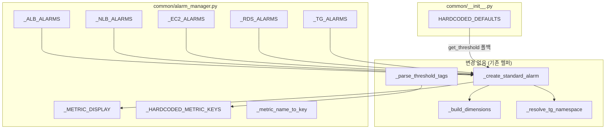

# Design Document: expand-default-alarms

## Overview

리소스 유형별 하드코딩 기본 알람 정의를 확장하여 운영에 필수적인 메트릭을 추가한다. 변경 범위는 `common/alarm_manager.py`의 알람 정의 리스트(`_*_ALARMS`)와 관련 매핑(`_METRIC_DISPLAY`, `_HARDCODED_METRIC_KEYS`, `_metric_name_to_key`), 그리고 `common/__init__.py`의 `HARDCODED_DEFAULTS`에 한정된다.

기존 `_build_dimensions()`, `_resolve_tg_namespace()`, `_create_standard_alarm()` 등 핵심 헬퍼 함수는 이미 리소스 유형별 디멘션 처리(TG 복합 디멘션 포함)와 네임스페이스 동적 결정을 지원하므로, 로직 변경 없이 데이터 정의만 추가하면 된다.

### 추가 대상 메트릭 요약

| 리소스 유형 | 메트릭 키 | CloudWatch 메트릭 이름 | 네임스페이스 | 디멘션 | Stat | Comparison |
|------------|----------|----------------------|------------|--------|------|------------|
| ALB | `ELB5XX` | `HTTPCode_ELB_5XX_Count` | AWS/ApplicationELB | `LoadBalancer` | Sum | GreaterThanThreshold |
| ALB | `TargetResponseTime` | `TargetResponseTime` | AWS/ApplicationELB | `LoadBalancer` | Average | GreaterThanThreshold |
| NLB | `TCPClientReset` | `TCP_Client_Reset_Count` | AWS/NetworkELB | `LoadBalancer` | Sum | GreaterThanThreshold |
| NLB | `TCPTargetReset` | `TCP_Target_Reset_Count` | AWS/NetworkELB | `LoadBalancer` | Sum | GreaterThanThreshold |
| EC2 | `StatusCheckFailed` | `StatusCheckFailed` | AWS/EC2 | `InstanceId` | Maximum | GreaterThanThreshold |
| RDS | `ReadLatency` | `ReadLatency` | AWS/RDS | `DBInstanceIdentifier` | Average | GreaterThanThreshold |
| RDS | `WriteLatency` | `WriteLatency` | AWS/RDS | `DBInstanceIdentifier` | Average | GreaterThanThreshold |
| TG | `RequestCountPerTarget` | `RequestCountPerTarget` | AWS/ApplicationELB | `TargetGroup`+`LoadBalancer` | Sum | GreaterThanThreshold |
| TG | `TGResponseTime` | `TargetResponseTime` | AWS/ApplicationELB | `TargetGroup`+`LoadBalancer` | Average | GreaterThanThreshold |

### 설계 결정: TG `TargetResponseTime` 내부 키

ALB 레벨 `TargetResponseTime`과 TG 레벨 `TargetResponseTime`은 동일한 CloudWatch 메트릭 이름을 공유하지만 디멘션이 다르다. 내부 메트릭 키 충돌을 방지하기 위해:
- ALB 레벨: 키 `TargetResponseTime` (기존 패턴 유지)
- TG 레벨: 키 `TGResponseTime` (접두사로 구분)

`_metric_name_to_key()`에서 `TargetResponseTime` → `TargetResponseTime` 매핑은 ALB 컨텍스트에서만 사용되며, TG 컨텍스트에서는 `_HARDCODED_METRIC_KEYS`와 `_METRIC_DISPLAY`의 `TGResponseTime` 키를 통해 구분된다.

## Architecture

### 변경 영향 범위



### 핵심 설계 원칙

1. **데이터 전용 변경**: 기존 로직 함수(`_build_dimensions`, `_resolve_tg_namespace`, `_create_standard_alarm`)는 수정하지 않는다. 알람 정의 딕셔너리와 매핑만 확장한다.
2. **디멘션 정합성**: 거버넌스 §6-1에 따라 AWS 공식 문서 기준 디멘션을 사용한다. LB 레벨 메트릭에 TG 디멘션을 넣지 않는다.
3. **동적 태그 호환**: `_HARDCODED_METRIC_KEYS`에 새 키를 추가하면 `_parse_threshold_tags()`가 자동으로 해당 키를 동적 알람 생성에서 제외한다.
4. **TDD 사이클**: 거버넌스 §8에 따라 테스트 먼저 작성 → 구현 → 리팩터링 순서를 따른다.

## Components and Interfaces

### 1. `common/__init__.py` — HARDCODED_DEFAULTS 확장

새 메트릭 키에 대한 시스템 기본 임계치를 추가한다.

```python
HARDCODED_DEFAULTS: dict[str, float] = {
    # ... 기존 항목 유지 ...
    "ELB5XX": 50.0,
    "TargetResponseTime": 5.0,
    "TCPClientReset": 100.0,
    "TCPTargetReset": 100.0,
    "StatusCheckFailed": 0.0,
    "ReadLatency": 0.02,
    "WriteLatency": 0.02,
    "RequestCountPerTarget": 1000.0,
    "TGResponseTime": 5.0,
}
```

> `StatusCheckFailed`의 기본 임계치는 `0.0`이다. `GreaterThanThreshold` 비교이므로 값이 0보다 크면(= 1 이상이면) 알람이 발생한다. 단, `get_threshold()`는 `val > 0` 검증을 하므로 태그/환경변수 오버라이드 시 양수만 허용된다. 하드코딩 기본값은 이 검증을 거치지 않으므로 0.0 사용이 가능하다.

### 2. `common/alarm_manager.py` — _METRIC_DISPLAY 확장

```python
_METRIC_DISPLAY = {
    # ... 기존 항목 유지 ...
    "ELB5XX": ("HTTPCode_ELB_5XX_Count", ">", ""),
    "TargetResponseTime": ("TargetResponseTime", ">", "s"),
    "TCPClientReset": ("TCP_Client_Reset_Count", ">", ""),
    "TCPTargetReset": ("TCP_Target_Reset_Count", ">", ""),
    "StatusCheckFailed": ("StatusCheckFailed", ">", ""),
    "ReadLatency": ("ReadLatency", ">", "s"),
    "WriteLatency": ("WriteLatency", ">", "s"),
    "RequestCountPerTarget": ("RequestCountPerTarget", ">", ""),
    "TGResponseTime": ("TargetResponseTime", ">", "s"),
}
```

### 3. `common/alarm_manager.py` — 알람 정의 리스트 확장

각 `_*_ALARMS` 리스트에 새 알람 정의 딕셔너리를 추가한다. 기존 항목은 변경하지 않는다.

**_ALB_ALARMS 추가 항목:**
```python
{"metric": "ELB5XX", "namespace": "AWS/ApplicationELB",
 "metric_name": "HTTPCode_ELB_5XX_Count", "dimension_key": "LoadBalancer",
 "stat": "Sum", "comparison": "GreaterThanThreshold",
 "period": 60, "evaluation_periods": 1},
{"metric": "TargetResponseTime", "namespace": "AWS/ApplicationELB",
 "metric_name": "TargetResponseTime", "dimension_key": "LoadBalancer",
 "stat": "Average", "comparison": "GreaterThanThreshold",
 "period": 60, "evaluation_periods": 1},
```

**_NLB_ALARMS 추가 항목:**
```python
{"metric": "TCPClientReset", "namespace": "AWS/NetworkELB",
 "metric_name": "TCP_Client_Reset_Count", "dimension_key": "LoadBalancer",
 "stat": "Sum", "comparison": "GreaterThanThreshold",
 "period": 60, "evaluation_periods": 1},
{"metric": "TCPTargetReset", "namespace": "AWS/NetworkELB",
 "metric_name": "TCP_Target_Reset_Count", "dimension_key": "LoadBalancer",
 "stat": "Sum", "comparison": "GreaterThanThreshold",
 "period": 60, "evaluation_periods": 1},
```

**_EC2_ALARMS 추가 항목:**
```python
{"metric": "StatusCheckFailed", "namespace": "AWS/EC2",
 "metric_name": "StatusCheckFailed", "dimension_key": "InstanceId",
 "stat": "Maximum", "comparison": "GreaterThanThreshold",
 "period": 300, "evaluation_periods": 1},
```

**_RDS_ALARMS 추가 항목:**
```python
{"metric": "ReadLatency", "namespace": "AWS/RDS",
 "metric_name": "ReadLatency", "dimension_key": "DBInstanceIdentifier",
 "stat": "Average", "comparison": "GreaterThanThreshold",
 "period": 300, "evaluation_periods": 1},
{"metric": "WriteLatency", "namespace": "AWS/RDS",
 "metric_name": "WriteLatency", "dimension_key": "DBInstanceIdentifier",
 "stat": "Average", "comparison": "GreaterThanThreshold",
 "period": 300, "evaluation_periods": 1},
```

**_TG_ALARMS 추가 항목:**
```python
{"metric": "RequestCountPerTarget", "namespace": "AWS/ApplicationELB",
 "metric_name": "RequestCountPerTarget", "dimension_key": "TargetGroup",
 "stat": "Sum", "comparison": "GreaterThanThreshold",
 "period": 60, "evaluation_periods": 1},
{"metric": "TGResponseTime", "namespace": "AWS/ApplicationELB",
 "metric_name": "TargetResponseTime", "dimension_key": "TargetGroup",
 "stat": "Average", "comparison": "GreaterThanThreshold",
 "period": 60, "evaluation_periods": 1},
```

### 4. `common/alarm_manager.py` — _HARDCODED_METRIC_KEYS 확장

```python
_HARDCODED_METRIC_KEYS = {
    "EC2": {"CPU", "Memory", "Disk", "StatusCheckFailed"},
    "RDS": {"CPU", "FreeMemoryGB", "FreeStorageGB", "Connections", "ReadLatency", "WriteLatency"},
    "ALB": {"RequestCount", "ELB5XX", "TargetResponseTime"},
    "NLB": {"ProcessedBytes", "ActiveFlowCount", "NewFlowCount", "TCPClientReset", "TCPTargetReset"},
    "TG": {"HealthyHostCount", "UnHealthyHostCount", "RequestCountPerTarget", "TGResponseTime"},
}
```

### 5. `common/alarm_manager.py` — _metric_name_to_key 매핑 확장

```python
mapping = {
    # ... 기존 항목 유지 ...
    "HTTPCode_ELB_5XX_Count": "ELB5XX",
    "TargetResponseTime": "TargetResponseTime",
    "TCP_Client_Reset_Count": "TCPClientReset",
    "TCP_Target_Reset_Count": "TCPTargetReset",
    "StatusCheckFailed": "StatusCheckFailed",
    "ReadLatency": "ReadLatency",
    "WriteLatency": "WriteLatency",
    "RequestCountPerTarget": "RequestCountPerTarget",
}
```

> `TargetResponseTime` → `TargetResponseTime` 매핑은 ALB 컨텍스트에서 사용된다. TG 컨텍스트에서는 메타데이터 기반 `_resolve_metric_key()`가 `TGResponseTime`을 직접 반환하므로 이 매핑을 거치지 않는다.

### 6. 기존 함수 — 변경 없음

다음 함수들은 알람 정의 딕셔너리의 `dimension_key`, `namespace` 필드를 읽어 동작하므로 코드 변경이 필요 없다:

- `_build_dimensions()`: `dimension_key == "TargetGroup"`이면 복합 디멘션, 그 외 단일 디멘션
- `_resolve_tg_namespace()`: `_lb_type == "network"`이면 `AWS/NetworkELB`
- `_create_standard_alarm()`: 알람 정의 딕셔너리를 그대로 사용
- `_parse_threshold_tags()`: `_HARDCODED_METRIC_KEYS`를 참조하여 동적 메트릭 필터링
- `_pretty_alarm_name()`: `_METRIC_DISPLAY`를 참조하여 알람 이름 생성

## Data Models

### 알람 정의 딕셔너리 스키마 (변경 없음)

```python
{
    "metric": str,           # 내부 메트릭 키 (예: "ELB5XX")
    "namespace": str,        # CloudWatch 네임스페이스 (예: "AWS/ApplicationELB")
    "metric_name": str,      # CloudWatch 메트릭 이름 (예: "HTTPCode_ELB_5XX_Count")
    "dimension_key": str,    # 기본 디멘션 키 (예: "LoadBalancer", "TargetGroup")
    "stat": str,             # 통계 (예: "Sum", "Average", "Maximum")
    "comparison": str,       # 비교 연산자 (예: "GreaterThanThreshold")
    "period": int,           # 평가 기간 (초)
    "evaluation_periods": int,
    # 선택적 필드:
    "transform_threshold": Callable | None,  # 임계치 변환 함수
    "dynamic_dimensions": bool | None,       # Disk 전용
    "extra_dimensions": list[dict] | None,   # 추가 디멘션
}
```

### HARDCODED_DEFAULTS 확장 후 전체 키 목록

| 메트릭 키 | 기본값 | 단위 | 비고 |
|----------|-------|------|------|
| `ELB5XX` | 50.0 | 건/분 | ALB 5XX 에러 수 |
| `TargetResponseTime` | 5.0 | 초 | ALB LB 레벨 응답 시간 |
| `TCPClientReset` | 100.0 | 건/분 | NLB 클라이언트 리셋 수 |
| `TCPTargetReset` | 100.0 | 건/분 | NLB 타겟 리셋 수 |
| `StatusCheckFailed` | 0.0 | - | EC2 상태 체크 실패 (>0이면 알람) |
| `ReadLatency` | 0.02 | 초 | RDS 읽기 지연 (20ms) |
| `WriteLatency` | 0.02 | 초 | RDS 쓰기 지연 (20ms) |
| `RequestCountPerTarget` | 1000.0 | 건/분 | TG 타겟당 요청 수 |
| `TGResponseTime` | 5.0 | 초 | TG 레벨 응답 시간 |

## Correctness Properties

*A property is a characteristic or behavior that should hold true across all valid executions of a system — essentially, a formal statement about what the system should do. Properties serve as the bridge between human-readable specifications and machine-verifiable correctness guarantees.*

### Property 1: 알람 정의 완전성 (Alarm Definition Completeness)

*For any* resource type in {EC2, RDS, ALB, NLB, TG}, the set of metric keys returned by `_get_alarm_defs(resource_type)` should be a superset of the expected hardcoded metric keys for that type. Specifically:
- EC2: {CPU, Memory, Disk, StatusCheckFailed}
- RDS: {CPU, FreeMemoryGB, FreeStorageGB, Connections, ReadLatency, WriteLatency}
- ALB: {RequestCount, ELB5XX, TargetResponseTime}
- NLB: {ProcessedBytes, ActiveFlowCount, NewFlowCount, TCPClientReset, TCPTargetReset}
- TG: {HealthyHostCount, UnHealthyHostCount, RequestCountPerTarget, TGResponseTime}

Additionally, each alarm definition must have valid `namespace`, `metric_name`, `dimension_key`, `stat`, and `comparison` fields.

**Validates: Requirements 1.1, 1.2, 2.1, 2.2, 3.1, 4.1, 4.2, 5.1, 5.2, 6.3**

### Property 2: LB 레벨 메트릭 단일 디멘션 (LB-Level Single Dimension)

*For any* ALB ARN or NLB ARN, and *for any* alarm definition where `dimension_key == "LoadBalancer"`, calling `_build_dimensions()` should produce exactly one dimension with `Name == "LoadBalancer"` and `Value` equal to the ARN suffix (e.g., `app/my-alb/hash` or `net/my-nlb/hash`). The `TargetGroup` dimension must NOT be present.

**Validates: Requirements 1.3, 1.4, 2.3, 8.4**

### Property 3: TG 메트릭 복합 디멘션 (TG Compound Dimension)

*For any* TG ARN and associated LB ARN, and *for any* TG alarm definition (including the newly added `RequestCountPerTarget` and `TGResponseTime`), calling `_build_dimensions()` should produce at least two dimensions: one with `Name == "TargetGroup"` and one with `Name == "LoadBalancer"`, with values matching the respective ARN suffixes.

**Validates: Requirements 5.3, 5.4, 8.2, 8.5**

### Property 4: TG 네임스페이스 동적 결정 (TG Namespace Resolution)

*For any* TG alarm definition and *for any* resource tags, if `_lb_type == "network"` then `_resolve_tg_namespace()` should return `"AWS/NetworkELB"`, otherwise it should return the alarm definition's `namespace` field (i.e., `"AWS/ApplicationELB"`). This must hold for all TG alarm definitions including the newly added `RequestCountPerTarget` and `TGResponseTime`.

**Validates: Requirements 5.5, 5.6**

### Property 5: 태그 임계치 오버라이드 (Tag Threshold Override)

*For any* newly added hardcoded metric key (ELB5XX, TargetResponseTime, TCPClientReset, TCPTargetReset, StatusCheckFailed, ReadLatency, WriteLatency, RequestCountPerTarget, TGResponseTime) and *for any* valid positive float threshold value, when a `Threshold_{metric_key}` tag is present, `get_threshold()` should return the tag value instead of the hardcoded default.

**Validates: Requirements 6.1**

### Property 6: 동적 태그 하드코딩 키 제외 (Dynamic Tag Hardcoded Key Exclusion)

*For any* resource type and *for any* set of tags containing `Threshold_{key}` entries where `key` is in the updated `_HARDCODED_METRIC_KEYS[resource_type]`, `_parse_threshold_tags()` should exclude those keys from the returned dictionary. Only metric keys NOT in the hardcoded set should appear in the result.

**Validates: Requirements 6.2**

## Error Handling

이 기능은 데이터 정의 확장이므로 새로운 에러 처리 로직은 추가하지 않는다. 기존 에러 처리가 그대로 적용된다:

| 상황 | 기존 처리 | 변경 |
|------|----------|------|
| `put_metric_alarm` ClientError | `logger.error` + skip, 알람 이름 미반환 | 없음 |
| `get_threshold` 미등록 메트릭 | 80.0 폴백 반환 | HARDCODED_DEFAULTS에 추가하여 폴백 불필요 |
| `_metric_name_to_key` 미등록 메트릭 | 입력값 그대로 반환 | 매핑 추가하여 폴백 불필요 |
| TG `_lb_arn` 태그 누락 | `_build_dimensions`에서 KeyError | 없음 (기존 동작 유지) |

### StatusCheckFailed 임계치 특이사항

`StatusCheckFailed`의 HARDCODED_DEFAULTS 값은 `0.0`이다. `get_threshold()`의 태그/환경변수 검증은 `val > 0`을 요구하므로, 태그로 `Threshold_StatusCheckFailed=0`을 설정하면 무시되고 하드코딩 기본값 `0.0`이 사용된다. 이는 의도된 동작이다 — StatusCheckFailed는 0보다 큰 값(= 실패 발생)이면 알람이 트리거되어야 하므로 임계치 0.0 + GreaterThanThreshold가 올바르다.

## Testing Strategy

### 단위 테스트 (Unit Tests)

`tests/test_alarm_manager.py`에 추가할 테스트:

1. **알람 정의 검증**: 각 리소스 유형별 `_get_alarm_defs()` 반환값의 메트릭 수와 키 집합 확인
2. **_METRIC_DISPLAY 검증**: 새 메트릭 키의 (metric_name, direction, unit) 매핑 확인
3. **_HARDCODED_METRIC_KEYS 검증**: 각 리소스 유형별 키 집합 확인
4. **_metric_name_to_key 검증**: 새 CloudWatch 메트릭 이름 → 내부 키 변환 확인
5. **HARDCODED_DEFAULTS 검증**: 새 메트릭 키의 기본 임계치 존재 확인
6. **create_alarms_for_resource 검증**: 각 리소스 유형별 생성되는 알람 수 확인
7. **디멘션 검증**: 새 ALB/NLB 알람의 LoadBalancer 단일 디멘션, 새 TG 알람의 복합 디멘션 확인
8. **TG 네임스페이스 검증**: 새 TG 알람의 NLB TG 네임스페이스 동적 결정 확인

### Property-Based Tests (Hypothesis)

거버넌스 §8에 따라 `hypothesis` 라이브러리를 사용한다. 각 테스트는 최소 100회 반복 실행한다.

| PBT 파일 | Property | 설명 |
|----------|----------|------|
| `tests/test_pbt_expand_alarm_defs.py` | Property 1 | 알람 정의 완전성 — 랜덤 리소스 유형에 대해 _get_alarm_defs가 기대 메트릭 키를 모두 포함하는지 검증 |
| `tests/test_pbt_expand_alarm_defs.py` | Property 2 | LB 레벨 단일 디멘션 — 랜덤 ALB/NLB ARN에 대해 LB 레벨 알람의 디멘션이 LoadBalancer 단일인지 검증 |
| `tests/test_pbt_expand_alarm_defs.py` | Property 3 | TG 복합 디멘션 — 랜덤 TG/LB ARN 조합에 대해 TG 알람의 복합 디멘션 검증 |
| `tests/test_pbt_expand_alarm_defs.py` | Property 4 | TG 네임스페이스 — 랜덤 _lb_type에 대해 네임스페이스 동적 결정 검증 |
| `tests/test_pbt_expand_alarm_defs.py` | Property 5 | 태그 임계치 오버라이드 — 랜덤 메트릭 키 + 랜덤 양수 임계치에 대해 태그 우선 적용 검증 |
| `tests/test_pbt_expand_alarm_defs.py` | Property 6 | 동적 태그 제외 — 랜덤 태그 집합에 대해 하드코딩 키가 동적 결과에서 제외되는지 검증 |

각 PBT 테스트에는 다음 태그 주석을 포함한다:
```python
# Feature: expand-default-alarms, Property {N}: {property_text}
```

### TDD 사이클 (거버넌스 §8)

각 리소스 유형별로 다음 순서를 반복한다:

1. **Red**: 새 메트릭에 대한 단위 테스트 작성 (예: `test_get_alarm_defs_alb` 기대 개수를 3으로 변경) → 실패 확인
2. **Green**: `_ALB_ALARMS`에 새 알람 정의 추가, `_METRIC_DISPLAY`/`_HARDCODED_METRIC_KEYS`/`_metric_name_to_key`/`HARDCODED_DEFAULTS` 확장 → 테스트 통과
3. **Refactor**: 중복 제거, 코드 정리 → 전체 테스트 재실행

PBT 테스트는 모든 리소스 유형 구현 완료 후 일괄 작성한다.

