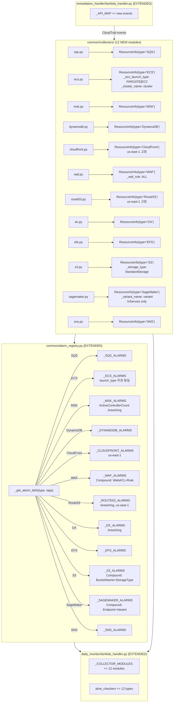

# Design Document: Extended Resource Monitoring

## Overview

AWS Monitoring Engine에 미구현 12개 리소스 타입(SQS, ECS, MSK, DynamoDB, CloudFront, WAF, Route53, DX, EFS, S3, SageMaker, SNS)을 추가한다. 기존 ElastiCache/NAT/Lambda/VPN/APIGW/OpenSearch Collector 패턴을 따르되, 각 리소스의 고유 특성을 반영한다.

주요 설계 결정:

- **12개 Collector 모듈**: 각 리소스 타입별 독립 모듈로 `common/collectors/` 하위에 생성한다. 파일명은 `sqs.py`, `ecs.py`, `msk.py`, `dynamodb.py`, `cloudfront.py`, `waf.py`, `route53.py`, `dx.py`, `efs.py`, `s3.py`, `sagemaker.py`, `sns.py`.
- **ECS 단일 모듈 + Internal_Tag 분기**: APIGW의 `_api_type` 패턴을 준용하여 `ecs.py` 단일 모듈에서 FARGATE/EC2 두 가지 launch type을 수집한다. `_ecs_launch_type` Internal_Tag로 구분하되, 알람 정의는 launch type에 관계없이 동일하다. `_cluster_name` Internal_Tag로 Compound_Dimension용 클러스터 이름을 저장한다.
- **CloudFront/Route53 us-east-1 고정**: 글로벌 서비스 메트릭은 us-east-1에서만 발행되므로, 알람 생성 시 CloudWatch 클라이언트를 us-east-1로 고정한다.
- **S3 Request_Metrics 제약**: 4xxErrors/5xxErrors는 버킷 레벨 Request Metrics 활성화가 필요하다. 데이터 미반환 시 warning 로그로 안내한다. `_storage_type` Internal_Tag로 StorageType Compound_Dimension을 처리한다.
- **SageMaker InService 전용**: 추론 엔드포인트만 모니터링하며, InService 상태만 수집한다. 학습 작업은 제외. `_variant_name` Internal_Tag로 VariantName Compound_Dimension을 처리한다.
- **WAF _waf_rule Internal_Tag**: WebACL + Rule Compound_Dimension에서 Rule 기본값은 `"ALL"`이다.
- **MSK "Cluster Name" 디멘션**: 공백이 포함된 디멘션 키 `"Cluster Name"`을 사용한다 (AWS 공식 문서 기준).
- **Route53/DX/MSK ActiveControllerCount treat_missing_data=breaching**: 기존 VPN 패턴을 재사용하여 메트릭 누락 시 경보를 발생시킨다.
- **alarm_registry.py 확장**: 12개 `_*_ALARMS` 리스트, `_get_alarm_defs()` 분기, 매핑 테이블 모두 확장.

## Architecture



## Components and Interfaces

### 1. SQS Collector (`common/collectors/sqs.py`) — NEW

**`collect_monitored_resources()`**
- `sqs` 클라이언트의 `list_queues()` paginator로 전체 큐 URL 목록 조회.
- `list_queue_tags(QueueUrl=url)`으로 태그 조회.
- `Monitoring=on` 태그 필터링 후 `ResourceInfo(type="SQS", id=queue_name)` 반환.
- `queue_name`은 URL에서 마지막 `/` 이후 부분 추출.

**`get_metrics(queue_name, resource_tags=None)`**
- 네임스페이스 `AWS/SQS`, 디멘션 `QueueName`.
- `ApproximateNumberOfMessagesVisible` (Average) → `"SQSMessagesVisible"`
- `ApproximateAgeOfOldestMessage` (Maximum) → `"SQSOldestMessage"`
- `NumberOfMessagesSent` (Sum) → `"SQSMessagesSent"`

### 2. ECS Collector (`common/collectors/ecs.py`) — NEW

APIGW의 `_api_type` 패턴을 준용하여 단일 모듈에서 FARGATE/EC2 launch type을 수집한다.

**`collect_monitored_resources()`**
- `ecs` 클라이언트의 `list_clusters()` → 각 클러스터에 대해 `list_services()` paginator.
- `describe_services(cluster=cluster_arn, services=[...])` 배치 호출로 서비스 상세 조회.
- `list_tags_for_resource(resourceArn=service_arn)`으로 태그 조회.
- `Monitoring=on` 태그 필터링 후 `ResourceInfo(type="ECS", id=service_name)` 반환.
- `tags`에 `_ecs_launch_type` Internal_Tag 설정 (서비스의 `launchType` 필드: `"FARGATE"` 또는 `"EC2"`).
- `tags`에 `_cluster_name` Internal_Tag로 클러스터 이름 저장 (Compound_Dimension용).

**`get_metrics(service_name, resource_tags=None)`**
- 네임스페이스 `AWS/ECS`, Compound_Dimension: `ClusterName` + `ServiceName`.
- `ClusterName`은 `resource_tags["_cluster_name"]`에서 조회.
- `CPUUtilization` (Average) → `"EcsCPU"`
- `MemoryUtilization` (Average) → `"EcsMemory"`
- `RunningTaskCount` (Average) → `"RunningTaskCount"`

### 3. MSK Collector (`common/collectors/msk.py`) — NEW

**`collect_monitored_resources()`**
- `kafka` 클라이언트의 `list_clusters_v2()` paginator.
- 각 클러스터의 `Tags` 필드에서 `Monitoring=on` 필터링.
- `ResourceInfo(type="MSK", id=cluster_name)` 반환.

**`get_metrics(cluster_name, resource_tags=None)`**
- 네임스페이스 `AWS/Kafka`, 디멘션 `Cluster Name` (공백 포함).
- `SumOffsetLag` (Maximum) → `"OffsetLag"`
- `BytesInPerSec` (Average) → `"BytesInPerSec"`
- `UnderReplicatedPartitions` (Maximum) → `"UnderReplicatedPartitions"`
- `ActiveControllerCount` (Average) → `"ActiveControllerCount"`

### 4. DynamoDB Collector (`common/collectors/dynamodb.py`) — NEW

**`collect_monitored_resources()`**
- `dynamodb` 클라이언트의 `list_tables()` paginator.
- `list_tags_of_resource(ResourceArn=table_arn)`으로 태그 조회.
- `Monitoring=on` 태그 필터링 후 `ResourceInfo(type="DynamoDB", id=table_name)` 반환.

**`get_metrics(table_name, resource_tags=None)`**
- 네임스페이스 `AWS/DynamoDB`, 디멘션 `TableName`.
- `ConsumedReadCapacityUnits` (Sum) → `"DDBReadCapacity"`
- `ConsumedWriteCapacityUnits` (Sum) → `"DDBWriteCapacity"`
- `ThrottledRequests` (Sum) → `"ThrottledRequests"`
- `SystemErrors` (Sum) → `"DDBSystemErrors"`

### 5. CloudFront Collector (`common/collectors/cloudfront.py`) — NEW

**`collect_monitored_resources()`**
- `cloudfront` 클라이언트의 `list_distributions()` paginator.
- `list_tags_for_resource(Resource=distribution_arn)`으로 태그 조회.
- `Monitoring=on` 태그 필터링 후 `ResourceInfo(type="CloudFront", id=distribution_id)` 반환.

**`get_metrics(distribution_id, resource_tags=None)`**
- 네임스페이스 `AWS/CloudFront`, 디멘션 `DistributionId`, Region `us-east-1` 고정.
- `5xxErrorRate` (Average) → `"CF5xxErrorRate"`
- `4xxErrorRate` (Average) → `"CF4xxErrorRate"`
- `Requests` (Sum) → `"CFRequests"`
- `BytesDownloaded` (Sum) → `"CFBytesDownloaded"`

### 6. WAF Collector (`common/collectors/waf.py`) — NEW

**`collect_monitored_resources()`**
- `wafv2` 클라이언트의 `list_web_acls(Scope="REGIONAL")` paginator.
- `list_tags_for_resource(ResourceARN=acl_arn)`으로 태그 조회.
- `Monitoring=on` 태그 필터링 후 `ResourceInfo(type="WAF", id=web_acl_name)` 반환.
- `tags`에 `_waf_rule` Internal_Tag 설정 (기본값 `"ALL"`).

**`get_metrics(web_acl_name, resource_tags=None)`**
- 네임스페이스 `AWS/WAFV2`, Compound_Dimension: `WebACL` + `Rule`.
- `Rule`은 `resource_tags["_waf_rule"]`에서 조회 (기본값 `"ALL"`).
- `BlockedRequests` (Sum) → `"WAFBlockedRequests"`
- `AllowedRequests` (Sum) → `"WAFAllowedRequests"`
- `CountedRequests` (Sum) → `"WAFCountedRequests"`

### 7. Route53 Collector (`common/collectors/route53.py`) — NEW

**`collect_monitored_resources()`**
- `route53` 클라이언트의 `list_health_checks()` paginator.
- `list_tags_for_resource(ResourceType="healthcheck", ResourceId=hc_id)`으로 태그 조회.
- `Monitoring=on` 태그 필터링 후 `ResourceInfo(type="Route53", id=health_check_id)` 반환.

**`get_metrics(health_check_id, resource_tags=None)`**
- 네임스페이스 `AWS/Route53`, 디멘션 `HealthCheckId`, Region `us-east-1` 고정.
- `HealthCheckStatus` (Minimum) → `"HealthCheckStatus"`

### 8. DX Collector (`common/collectors/dx.py`) — NEW

**`collect_monitored_resources()`**
- `directconnect` 클라이언트의 `describe_connections()`.
- `describe_tags(resourceArns=[connection_arn])`으로 태그 조회.
- `connectionState`가 `"available"`인 연결만 대상.
- `Monitoring=on` 태그 필터링 후 `ResourceInfo(type="DX", id=connection_id)` 반환.

**`get_metrics(connection_id, resource_tags=None)`**
- 네임스페이스 `AWS/DX`, 디멘션 `ConnectionId`.
- `ConnectionState` (Minimum) → `"ConnectionState"`

### 9. EFS Collector (`common/collectors/efs.py`) — NEW

**`collect_monitored_resources()`**
- `efs` 클라이언트의 `describe_file_systems()` paginator.
- `describe_file_systems()` 응답의 `Tags` 필드에서 `Monitoring=on` 필터링.
- `ResourceInfo(type="EFS", id=file_system_id)` 반환.

**`get_metrics(file_system_id, resource_tags=None)`**
- 네임스페이스 `AWS/EFS`, 디멘션 `FileSystemId`.
- `BurstCreditBalance` (Minimum) → `"BurstCreditBalance"`
- `PercentIOLimit` (Average) → `"PercentIOLimit"`
- `ClientConnections` (Sum) → `"EFSClientConnections"`

### 10. S3 Collector (`common/collectors/s3.py`) — NEW

**`collect_monitored_resources()`**
- `s3` 클라이언트의 `list_buckets()`.
- `get_bucket_tagging(Bucket=bucket_name)`으로 태그 조회.
- `Monitoring=on` 태그 필터링 후 `ResourceInfo(type="S3", id=bucket_name)` 반환.
- `tags`에 `_storage_type` Internal_Tag 설정 (기본값 `"StandardStorage"`).

**`get_metrics(bucket_name, resource_tags=None)`**
- 네임스페이스 `AWS/S3`, Compound_Dimension: `BucketName` + `StorageType`.
- `StorageType`은 `resource_tags["_storage_type"]`에서 조회.
- `4xxErrors` (Sum) → `"S34xxErrors"` (Request_Metrics 필요, 데이터 미반환 시 warning 로그)
- `5xxErrors` (Sum) → `"S35xxErrors"` (Request_Metrics 필요, 데이터 미반환 시 warning 로그)
- `BucketSizeBytes` (Average) → `"S3BucketSizeBytes"`
- `NumberOfObjects` (Average) → `"S3NumberOfObjects"`

### 11. SageMaker Collector (`common/collectors/sagemaker.py`) — NEW

**`collect_monitored_resources()`**
- `sagemaker` 클라이언트의 `list_endpoints(StatusEquals="InService")` paginator.
- `list_tags(ResourceArn=endpoint_arn)`으로 태그 조회.
- `Monitoring=on` 태그 필터링 후 `ResourceInfo(type="SageMaker", id=endpoint_name)` 반환.
- `describe_endpoint(EndpointName=name)`으로 `ProductionVariants[0].VariantName` 조회.
- `tags`에 `_variant_name` Internal_Tag로 VariantName 저장 (Compound_Dimension용).
- 학습 작업(Training Job)은 수집 대상에서 제외.

**`get_metrics(endpoint_name, resource_tags=None)`**
- 네임스페이스 `AWS/SageMaker`, Compound_Dimension: `EndpointName` + `VariantName`.
- `VariantName`은 `resource_tags["_variant_name"]`에서 조회.
- `Invocations` (Sum) → `"SMInvocations"`
- `InvocationErrors` (Sum) → `"SMInvocationErrors"`
- `ModelLatency` (Average) → `"SMModelLatency"`
- `CPUUtilization` (Average) → `"SMCPU"`

### 12. SNS Collector (`common/collectors/sns.py`) — NEW

**`collect_monitored_resources()`**
- `sns` 클라이언트의 `list_topics()` paginator.
- `list_tags_for_resource(ResourceArn=topic_arn)`으로 태그 조회.
- `Monitoring=on` 태그 필터링 후 `ResourceInfo(type="SNS", id=topic_name)` 반환.
- `topic_name`은 ARN에서 마지막 `:` 이후 부분 추출.

**`get_metrics(topic_name, resource_tags=None)`**
- 네임스페이스 `AWS/SNS`, 디멘션 `TopicName`.
- `NumberOfNotificationsFailed` (Sum) → `"SNSNotificationsFailed"`
- `NumberOfMessagesPublished` (Sum) → `"SNSMessagesPublished"`

### 13. Alarm Registry Extensions (`common/alarm_registry.py`)

#### 새 알람 정의 리스트

**`_SQS_ALARMS`**
```python
_SQS_ALARMS = [
    {"metric": "SQSMessagesVisible", "namespace": "AWS/SQS",
     "metric_name": "ApproximateNumberOfMessagesVisible",
     "dimension_key": "QueueName", "stat": "Average",
     "comparison": "GreaterThanThreshold", "period": 300, "evaluation_periods": 1},
    {"metric": "SQSOldestMessage", "namespace": "AWS/SQS",
     "metric_name": "ApproximateAgeOfOldestMessage",
     "dimension_key": "QueueName", "stat": "Maximum",
     "comparison": "GreaterThanThreshold", "period": 300, "evaluation_periods": 1},
    {"metric": "SQSMessagesSent", "namespace": "AWS/SQS",
     "metric_name": "NumberOfMessagesSent",
     "dimension_key": "QueueName", "stat": "Sum",
     "comparison": "GreaterThanThreshold", "period": 300, "evaluation_periods": 1},
]
```

**`_ECS_ALARMS`** — `_ecs_launch_type`에 관계없이 동일
```python
_ECS_ALARMS = [
    {"metric": "EcsCPU", "namespace": "AWS/ECS",
     "metric_name": "CPUUtilization",
     "dimension_key": "ServiceName", "stat": "Average",
     "comparison": "GreaterThanThreshold", "period": 300, "evaluation_periods": 1},
    {"metric": "EcsMemory", "namespace": "AWS/ECS",
     "metric_name": "MemoryUtilization",
     "dimension_key": "ServiceName", "stat": "Average",
     "comparison": "GreaterThanThreshold", "period": 300, "evaluation_periods": 1},
    {"metric": "RunningTaskCount", "namespace": "AWS/ECS",
     "metric_name": "RunningTaskCount",
     "dimension_key": "ServiceName", "stat": "Average",
     "comparison": "LessThanThreshold", "period": 300, "evaluation_periods": 1},
]
```

**`_MSK_ALARMS`** — `ActiveControllerCount`에 `treat_missing_data=breaching`
```python
_MSK_ALARMS = [
    {"metric": "OffsetLag", "namespace": "AWS/Kafka",
     "metric_name": "SumOffsetLag",
     "dimension_key": "Cluster Name", "stat": "Maximum",
     "comparison": "GreaterThanThreshold", "period": 300, "evaluation_periods": 1},
    {"metric": "BytesInPerSec", "namespace": "AWS/Kafka",
     "metric_name": "BytesInPerSec",
     "dimension_key": "Cluster Name", "stat": "Average",
     "comparison": "GreaterThanThreshold", "period": 300, "evaluation_periods": 1},
    {"metric": "UnderReplicatedPartitions", "namespace": "AWS/Kafka",
     "metric_name": "UnderReplicatedPartitions",
     "dimension_key": "Cluster Name", "stat": "Maximum",
     "comparison": "GreaterThanThreshold", "period": 300, "evaluation_periods": 1},
    {"metric": "ActiveControllerCount", "namespace": "AWS/Kafka",
     "metric_name": "ActiveControllerCount",
     "dimension_key": "Cluster Name", "stat": "Average",
     "comparison": "LessThanThreshold", "period": 300, "evaluation_periods": 1,
     "treat_missing_data": "breaching"},
]
```

**`_DYNAMODB_ALARMS`**
```python
_DYNAMODB_ALARMS = [
    {"metric": "DDBReadCapacity", "namespace": "AWS/DynamoDB",
     "metric_name": "ConsumedReadCapacityUnits",
     "dimension_key": "TableName", "stat": "Sum",
     "comparison": "GreaterThanThreshold", "period": 300, "evaluation_periods": 1},
    {"metric": "DDBWriteCapacity", "namespace": "AWS/DynamoDB",
     "metric_name": "ConsumedWriteCapacityUnits",
     "dimension_key": "TableName", "stat": "Sum",
     "comparison": "GreaterThanThreshold", "period": 300, "evaluation_periods": 1},
    {"metric": "ThrottledRequests", "namespace": "AWS/DynamoDB",
     "metric_name": "ThrottledRequests",
     "dimension_key": "TableName", "stat": "Sum",
     "comparison": "GreaterThanThreshold", "period": 300, "evaluation_periods": 1},
    {"metric": "DDBSystemErrors", "namespace": "AWS/DynamoDB",
     "metric_name": "SystemErrors",
     "dimension_key": "TableName", "stat": "Sum",
     "comparison": "GreaterThanThreshold", "period": 300, "evaluation_periods": 1},
]
```

**`_CLOUDFRONT_ALARMS`** — Region `us-east-1` 고정 (alarm_def에 `region` 필드 추가)
```python
_CLOUDFRONT_ALARMS = [
    {"metric": "CF5xxErrorRate", "namespace": "AWS/CloudFront",
     "metric_name": "5xxErrorRate",
     "dimension_key": "DistributionId", "stat": "Average",
     "comparison": "GreaterThanThreshold", "period": 300, "evaluation_periods": 1,
     "region": "us-east-1"},
    {"metric": "CF4xxErrorRate", "namespace": "AWS/CloudFront",
     "metric_name": "4xxErrorRate",
     "dimension_key": "DistributionId", "stat": "Average",
     "comparison": "GreaterThanThreshold", "period": 300, "evaluation_periods": 1,
     "region": "us-east-1"},
    {"metric": "CFRequests", "namespace": "AWS/CloudFront",
     "metric_name": "Requests",
     "dimension_key": "DistributionId", "stat": "Sum",
     "comparison": "GreaterThanThreshold", "period": 300, "evaluation_periods": 1,
     "region": "us-east-1"},
    {"metric": "CFBytesDownloaded", "namespace": "AWS/CloudFront",
     "metric_name": "BytesDownloaded",
     "dimension_key": "DistributionId", "stat": "Sum",
     "comparison": "GreaterThanThreshold", "period": 300, "evaluation_periods": 1,
     "region": "us-east-1"},
]
```

**`_WAF_ALARMS`** — Compound_Dimension: WebACL + Rule
```python
_WAF_ALARMS = [
    {"metric": "WAFBlockedRequests", "namespace": "AWS/WAFV2",
     "metric_name": "BlockedRequests",
     "dimension_key": "WebACL", "stat": "Sum",
     "comparison": "GreaterThanThreshold", "period": 300, "evaluation_periods": 1},
    {"metric": "WAFAllowedRequests", "namespace": "AWS/WAFV2",
     "metric_name": "AllowedRequests",
     "dimension_key": "WebACL", "stat": "Sum",
     "comparison": "GreaterThanThreshold", "period": 300, "evaluation_periods": 1},
    {"metric": "WAFCountedRequests", "namespace": "AWS/WAFV2",
     "metric_name": "CountedRequests",
     "dimension_key": "WebACL", "stat": "Sum",
     "comparison": "GreaterThanThreshold", "period": 300, "evaluation_periods": 1},
]
```

**`_ROUTE53_ALARMS`** — `treat_missing_data=breaching`, Region `us-east-1` 고정
```python
_ROUTE53_ALARMS = [
    {"metric": "HealthCheckStatus", "namespace": "AWS/Route53",
     "metric_name": "HealthCheckStatus",
     "dimension_key": "HealthCheckId", "stat": "Minimum",
     "comparison": "LessThanThreshold", "period": 300, "evaluation_periods": 1,
     "treat_missing_data": "breaching", "region": "us-east-1"},
]
```

**`_DX_ALARMS`** — `treat_missing_data=breaching`
```python
_DX_ALARMS = [
    {"metric": "ConnectionState", "namespace": "AWS/DX",
     "metric_name": "ConnectionState",
     "dimension_key": "ConnectionId", "stat": "Minimum",
     "comparison": "LessThanThreshold", "period": 300, "evaluation_periods": 1,
     "treat_missing_data": "breaching"},
]
```

**`_EFS_ALARMS`**
```python
_EFS_ALARMS = [
    {"metric": "BurstCreditBalance", "namespace": "AWS/EFS",
     "metric_name": "BurstCreditBalance",
     "dimension_key": "FileSystemId", "stat": "Minimum",
     "comparison": "LessThanThreshold", "period": 300, "evaluation_periods": 1},
    {"metric": "PercentIOLimit", "namespace": "AWS/EFS",
     "metric_name": "PercentIOLimit",
     "dimension_key": "FileSystemId", "stat": "Average",
     "comparison": "GreaterThanThreshold", "period": 300, "evaluation_periods": 1},
    {"metric": "EFSClientConnections", "namespace": "AWS/EFS",
     "metric_name": "ClientConnections",
     "dimension_key": "FileSystemId", "stat": "Sum",
     "comparison": "GreaterThanThreshold", "period": 300, "evaluation_periods": 1},
]
```

**`_S3_ALARMS`** — Compound_Dimension: BucketName + StorageType
```python
_S3_ALARMS = [
    {"metric": "S34xxErrors", "namespace": "AWS/S3",
     "metric_name": "4xxErrors",
     "dimension_key": "BucketName", "stat": "Sum",
     "comparison": "GreaterThanThreshold", "period": 300, "evaluation_periods": 1},
    {"metric": "S35xxErrors", "namespace": "AWS/S3",
     "metric_name": "5xxErrors",
     "dimension_key": "BucketName", "stat": "Sum",
     "comparison": "GreaterThanThreshold", "period": 300, "evaluation_periods": 1},
    {"metric": "S3BucketSizeBytes", "namespace": "AWS/S3",
     "metric_name": "BucketSizeBytes",
     "dimension_key": "BucketName", "stat": "Average",
     "comparison": "GreaterThanThreshold", "period": 86400, "evaluation_periods": 1,
     "needs_storage_type": True},
    {"metric": "S3NumberOfObjects", "namespace": "AWS/S3",
     "metric_name": "NumberOfObjects",
     "dimension_key": "BucketName", "stat": "Average",
     "comparison": "GreaterThanThreshold", "period": 86400, "evaluation_periods": 1,
     "needs_storage_type": True},
]
```

S3의 `needs_storage_type` 플래그는 `_build_dimensions()`에서 `resource_tags["_storage_type"]`을 `StorageType` 디멘션으로 추가하는 데 사용된다. `BucketSizeBytes`와 `NumberOfObjects`는 일별 메트릭이므로 `period=86400`.

**`_SAGEMAKER_ALARMS`** — Compound_Dimension: EndpointName + VariantName
```python
_SAGEMAKER_ALARMS = [
    {"metric": "SMInvocations", "namespace": "AWS/SageMaker",
     "metric_name": "Invocations",
     "dimension_key": "EndpointName", "stat": "Sum",
     "comparison": "GreaterThanThreshold", "period": 300, "evaluation_periods": 1},
    {"metric": "SMInvocationErrors", "namespace": "AWS/SageMaker",
     "metric_name": "InvocationErrors",
     "dimension_key": "EndpointName", "stat": "Sum",
     "comparison": "GreaterThanThreshold", "period": 300, "evaluation_periods": 1},
    {"metric": "SMModelLatency", "namespace": "AWS/SageMaker",
     "metric_name": "ModelLatency",
     "dimension_key": "EndpointName", "stat": "Average",
     "comparison": "GreaterThanThreshold", "period": 300, "evaluation_periods": 1},
    {"metric": "SMCPU", "namespace": "AWS/SageMaker",
     "metric_name": "CPUUtilization",
     "dimension_key": "EndpointName", "stat": "Average",
     "comparison": "GreaterThanThreshold", "period": 300, "evaluation_periods": 1},
]
```

SageMaker의 Compound_Dimension은 `_build_dimensions()`에서 `resource_tags["_variant_name"]`을 `VariantName` 디멘션으로 추가한다.

**`_SNS_ALARMS`**
```python
_SNS_ALARMS = [
    {"metric": "SNSNotificationsFailed", "namespace": "AWS/SNS",
     "metric_name": "NumberOfNotificationsFailed",
     "dimension_key": "TopicName", "stat": "Sum",
     "comparison": "GreaterThanThreshold", "period": 300, "evaluation_periods": 1},
    {"metric": "SNSMessagesPublished", "namespace": "AWS/SNS",
     "metric_name": "NumberOfMessagesPublished",
     "dimension_key": "TopicName", "stat": "Sum",
     "comparison": "GreaterThanThreshold", "period": 300, "evaluation_periods": 1},
]
```

#### `_get_alarm_defs()` 확장

```python
elif resource_type == "SQS":
    return _SQS_ALARMS
elif resource_type == "ECS":
    return _ECS_ALARMS
elif resource_type == "MSK":
    return _MSK_ALARMS
elif resource_type == "DynamoDB":
    return _DYNAMODB_ALARMS
elif resource_type == "CloudFront":
    return _CLOUDFRONT_ALARMS
elif resource_type == "WAF":
    return _WAF_ALARMS
elif resource_type == "Route53":
    return _ROUTE53_ALARMS
elif resource_type == "DX":
    return _DX_ALARMS
elif resource_type == "EFS":
    return _EFS_ALARMS
elif resource_type == "S3":
    return _S3_ALARMS
elif resource_type == "SageMaker":
    return _SAGEMAKER_ALARMS
elif resource_type == "SNS":
    return _SNS_ALARMS
```

ECS는 `_ecs_launch_type` Internal_Tag 값에 관계없이 동일한 `_ECS_ALARMS`를 반환한다 (APIGW와 달리 launch type별 메트릭 차이 없음).

#### 매핑 테이블 확장

**`_HARDCODED_METRIC_KEYS`** 추가:
```python
"SQS": {"SQSMessagesVisible", "SQSOldestMessage", "SQSMessagesSent"},
"ECS": {"EcsCPU", "EcsMemory", "RunningTaskCount"},
"MSK": {"OffsetLag", "BytesInPerSec", "UnderReplicatedPartitions", "ActiveControllerCount"},
"DynamoDB": {"DDBReadCapacity", "DDBWriteCapacity", "ThrottledRequests", "DDBSystemErrors"},
"CloudFront": {"CF5xxErrorRate", "CF4xxErrorRate", "CFRequests", "CFBytesDownloaded"},
"WAF": {"WAFBlockedRequests", "WAFAllowedRequests", "WAFCountedRequests"},
"Route53": {"HealthCheckStatus"},
"DX": {"ConnectionState"},
"EFS": {"BurstCreditBalance", "PercentIOLimit", "EFSClientConnections"},
"S3": {"S34xxErrors", "S35xxErrors", "S3BucketSizeBytes", "S3NumberOfObjects"},
"SageMaker": {"SMInvocations", "SMInvocationErrors", "SMModelLatency", "SMCPU"},
"SNS": {"SNSNotificationsFailed", "SNSMessagesPublished"},
```

**`_NAMESPACE_MAP`** 추가:
```python
"SQS": ["AWS/SQS"],
"ECS": ["AWS/ECS"],
"MSK": ["AWS/Kafka"],
"DynamoDB": ["AWS/DynamoDB"],
"CloudFront": ["AWS/CloudFront"],
"WAF": ["AWS/WAFV2"],
"Route53": ["AWS/Route53"],
"DX": ["AWS/DX"],
"EFS": ["AWS/EFS"],
"S3": ["AWS/S3"],
"SageMaker": ["AWS/SageMaker"],
"SNS": ["AWS/SNS"],
```

**`_DIMENSION_KEY_MAP`** 추가:
```python
"SQS": "QueueName",
"ECS": "ServiceName",
"MSK": "Cluster Name",
"DynamoDB": "TableName",
"CloudFront": "DistributionId",
"WAF": "WebACL",
"Route53": "HealthCheckId",
"DX": "ConnectionId",
"EFS": "FileSystemId",
"S3": "BucketName",
"SageMaker": "EndpointName",
"SNS": "TopicName",
```

주의: MSK의 디멘션 키는 `"Cluster Name"` (공백 포함)이다. AWS CloudWatch 공식 문서 기준.

**`_METRIC_DISPLAY`** 추가:
```python
"SQSMessagesVisible": ("ApproximateNumberOfMessagesVisible", ">", ""),
"SQSOldestMessage": ("ApproximateAgeOfOldestMessage", ">", "s"),
"SQSMessagesSent": ("NumberOfMessagesSent", ">", ""),
"EcsCPU": ("CPUUtilization", ">", "%"),
"EcsMemory": ("MemoryUtilization", ">", "%"),
"RunningTaskCount": ("RunningTaskCount", "<", ""),
"OffsetLag": ("SumOffsetLag", ">", ""),
"BytesInPerSec": ("BytesInPerSec", ">", "B/s"),
"UnderReplicatedPartitions": ("UnderReplicatedPartitions", ">", ""),
"ActiveControllerCount": ("ActiveControllerCount", "<", ""),
"DDBReadCapacity": ("ConsumedReadCapacityUnits", ">", ""),
"DDBWriteCapacity": ("ConsumedWriteCapacityUnits", ">", ""),
"ThrottledRequests": ("ThrottledRequests", ">", ""),
"DDBSystemErrors": ("SystemErrors", ">", ""),
"CF5xxErrorRate": ("5xxErrorRate", ">", "%"),
"CF4xxErrorRate": ("4xxErrorRate", ">", "%"),
"CFRequests": ("Requests", ">", ""),
"CFBytesDownloaded": ("BytesDownloaded", ">", "B"),
"WAFBlockedRequests": ("BlockedRequests", ">", ""),
"WAFAllowedRequests": ("AllowedRequests", ">", ""),
"WAFCountedRequests": ("CountedRequests", ">", ""),
"HealthCheckStatus": ("HealthCheckStatus", "<", ""),
"ConnectionState": ("ConnectionState", "<", ""),
"BurstCreditBalance": ("BurstCreditBalance", "<", ""),
"PercentIOLimit": ("PercentIOLimit", ">", "%"),
"EFSClientConnections": ("ClientConnections", ">", ""),
"S34xxErrors": ("4xxErrors", ">", ""),
"S35xxErrors": ("5xxErrors", ">", ""),
"S3BucketSizeBytes": ("BucketSizeBytes", ">", "B"),
"S3NumberOfObjects": ("NumberOfObjects", ">", ""),
"SMInvocations": ("Invocations", ">", ""),
"SMInvocationErrors": ("InvocationErrors", ">", ""),
"SMModelLatency": ("ModelLatency", ">", "μs"),
"SMCPU": ("CPUUtilization", ">", "%"),
"SNSNotificationsFailed": ("NumberOfNotificationsFailed", ">", ""),
"SNSMessagesPublished": ("NumberOfMessagesPublished", ">", ""),
```

**`_metric_name_to_key()`** 추가 매핑:
```python
"ApproximateNumberOfMessagesVisible": "SQSMessagesVisible",
"ApproximateAgeOfOldestMessage": "SQSOldestMessage",
"NumberOfMessagesSent": "SQSMessagesSent",
"MemoryUtilization": "EcsMemory",
"RunningTaskCount": "RunningTaskCount",
"SumOffsetLag": "OffsetLag",
"BytesInPerSec": "BytesInPerSec",
"UnderReplicatedPartitions": "UnderReplicatedPartitions",
"ActiveControllerCount": "ActiveControllerCount",
"ConsumedReadCapacityUnits": "DDBReadCapacity",
"ConsumedWriteCapacityUnits": "DDBWriteCapacity",
"ThrottledRequests": "ThrottledRequests",
"SystemErrors": "DDBSystemErrors",
"5xxErrorRate": "CF5xxErrorRate",
"4xxErrorRate": "CF4xxErrorRate",
"Requests": "CFRequests",
"BytesDownloaded": "CFBytesDownloaded",
"BlockedRequests": "WAFBlockedRequests",
"AllowedRequests": "WAFAllowedRequests",
"CountedRequests": "WAFCountedRequests",
"HealthCheckStatus": "HealthCheckStatus",
"ConnectionState": "ConnectionState",
"BurstCreditBalance": "BurstCreditBalance",
"PercentIOLimit": "PercentIOLimit",
"ClientConnections": "EFSClientConnections",
"4xxErrors": "S34xxErrors",
"5xxErrors": "S35xxErrors",
"BucketSizeBytes": "S3BucketSizeBytes",
"NumberOfObjects": "S3NumberOfObjects",
"Invocations": "SMInvocations",
"InvocationErrors": "SMInvocationErrors",
"ModelLatency": "SMModelLatency",
"NumberOfNotificationsFailed": "SNSNotificationsFailed",
"NumberOfMessagesPublished": "SNSMessagesPublished",
```

주의: ECS `CPUUtilization`은 기존 EC2/RDS/OpenSearch의 `"CPU"` / `"OsCPU"` 매핑과 충돌하므로, ECS Collector의 `get_metrics()`에서 직접 `"EcsCPU"` 키로 반환하여 `_metric_name_to_key()` 의존을 회피한다. SageMaker `CPUUtilization`도 동일하게 `"SMCPU"` 키로 직접 반환한다.

### 14. `_build_dimensions()` 확장 (`common/dimension_builder.py`)

ECS/WAF/S3/SageMaker의 Compound_Dimension 처리를 위해 `_build_dimensions()`에 분기 추가:

```python
elif resource_type == "ECS":
    dimensions = [{"Name": "ServiceName", "Value": resource_id}]
    cluster_name = resource_tags.get("_cluster_name", "")
    if cluster_name:
        dimensions.append({"Name": "ClusterName", "Value": cluster_name})
    else:
        logger.warning("ECS _cluster_name missing for %s", resource_id)

elif resource_type == "WAF":
    dimensions = [{"Name": "WebACL", "Value": resource_id}]
    waf_rule = resource_tags.get("_waf_rule", "ALL")
    dimensions.append({"Name": "Rule", "Value": waf_rule})

elif resource_type == "S3":
    dimensions = [{"Name": "BucketName", "Value": resource_id}]
    if alarm_def.get("needs_storage_type"):
        storage_type = resource_tags.get("_storage_type", "StandardStorage")
        dimensions.append({"Name": "StorageType", "Value": storage_type})

elif resource_type == "SageMaker":
    dimensions = [{"Name": "EndpointName", "Value": resource_id}]
    variant_name = resource_tags.get("_variant_name", "")
    if variant_name:
        dimensions.append({"Name": "VariantName", "Value": variant_name})
    else:
        logger.warning("SageMaker _variant_name missing for %s", resource_id)
```

기존 OpenSearch의 `_client_id` Compound_Dimension 처리도 유지한다.

### 15. `region` 필드 지원 (`common/alarm_builder.py`)

CloudFront/Route53의 us-east-1 고정을 위해 `_create_single_alarm()`에서 알람 정의의 `region` 필드를 확인하여 해당 리전의 CloudWatch 클라이언트를 사용한다:

```python
region = alarm_def.get("region")
if region:
    cw = boto3.client("cloudwatch", region_name=region)
else:
    cw = _get_cw_client()
```

### 16. Common Constants (`common/__init__.py`)

**`SUPPORTED_RESOURCE_TYPES`** 확장:
```python
SUPPORTED_RESOURCE_TYPES = [
    "EC2", "RDS", "ALB", "NLB", "TG", "AuroraRDS", "DocDB",
    "ElastiCache", "NAT",
    "Lambda", "VPN", "APIGW", "ACM", "Backup", "MQ", "CLB", "OpenSearch",
    "SQS", "ECS", "MSK", "DynamoDB", "CloudFront", "WAF",
    "Route53", "DX", "EFS", "S3", "SageMaker", "SNS",
]
```

**`HARDCODED_DEFAULTS`** 추가:
```python
"SQSMessagesVisible": 1000.0,
"SQSOldestMessage": 300.0,
"SQSMessagesSent": 10000.0,
"EcsCPU": 80.0,
"EcsMemory": 80.0,
"RunningTaskCount": 1.0,
"OffsetLag": 1000.0,
"BytesInPerSec": 100000000.0,
"UnderReplicatedPartitions": 0.0,
"ActiveControllerCount": 1.0,
"DDBReadCapacity": 80.0,
"DDBWriteCapacity": 80.0,
"ThrottledRequests": 0.0,
"DDBSystemErrors": 0.0,
"CF5xxErrorRate": 1.0,
"CF4xxErrorRate": 5.0,
"CFRequests": 1000000.0,
"CFBytesDownloaded": 10000000000.0,
"WAFBlockedRequests": 100.0,
"WAFAllowedRequests": 1000000.0,
"WAFCountedRequests": 100000.0,
"HealthCheckStatus": 1.0,
"ConnectionState": 1.0,
"BurstCreditBalance": 1000000000.0,
"PercentIOLimit": 90.0,
"EFSClientConnections": 1000.0,
"S34xxErrors": 100.0,
"S35xxErrors": 10.0,
"S3BucketSizeBytes": 1000000000000.0,
"S3NumberOfObjects": 10000000.0,
"SMInvocations": 100000.0,
"SMInvocationErrors": 0.0,
"SMModelLatency": 1000.0,
"SMCPU": 80.0,
"SNSNotificationsFailed": 0.0,
"SNSMessagesPublished": 1000000.0,
```

**`MONITORED_API_EVENTS`** 확장:
```python
"CREATE": [
    ...,  # 기존
    "CreateQueue",              # SQS
    "CreateService",            # ECS
    "CreateCluster",            # MSK (kafka)
    "CreateTable",              # DynamoDB
    "CreateDistribution",       # CloudFront
    "CreateWebACL",             # WAF
    "CreateHealthCheck",        # Route53
    "CreateConnection",         # DX
    "CreateFileSystem",         # EFS
    "CreateBucket",             # S3
    "CreateEndpoint",           # SageMaker
    "CreateTopic",              # SNS
],
"DELETE": [
    ...,  # 기존
    "DeleteQueue",              # SQS
    "DeleteService",            # ECS
    "DeleteCluster",            # MSK (kafka)
    "DeleteTable",              # DynamoDB
    "DeleteDistribution",       # CloudFront
    "DeleteWebACL",             # WAF
    "DeleteHealthCheck",        # Route53
    "DeleteConnection",         # DX
    "DeleteFileSystem",         # EFS
    "DeleteBucket",             # S3
    "DeleteEndpoint",           # SageMaker
    "DeleteTopic",              # SNS
],
"TAG_CHANGE": [
    ...,  # 기존 (TagResource/UntagResource 이미 등록됨)
    "TagQueue",                 # SQS
    "UntagQueue",               # SQS
    "TagResource",              # ECS, MSK, DynamoDB, EFS, SageMaker, SNS (이미 등록)
    "UntagResource",            # ECS, MSK, DynamoDB, EFS, SageMaker, SNS (이미 등록)
],
```

참고: CloudFront/WAF/Route53/DX/S3는 기존 `TagResource`/`UntagResource` 이벤트로 커버되거나, 서비스별 태그 API(`TagQueue`, `PutBucketTagging` 등)를 사용한다.

### 17. Daily Monitor Integration (`daily_monitor/lambda_handler.py`)

**`_COLLECTOR_MODULES`** 확장:
```python
from common.collectors import sqs as sqs_collector
from common.collectors import ecs as ecs_collector
from common.collectors import msk as msk_collector
from common.collectors import dynamodb as dynamodb_collector
from common.collectors import cloudfront as cloudfront_collector
from common.collectors import waf as waf_collector
from common.collectors import route53 as route53_collector
from common.collectors import dx as dx_collector
from common.collectors import efs as efs_collector
from common.collectors import s3 as s3_collector
from common.collectors import sagemaker as sagemaker_collector
from common.collectors import sns as sns_collector

_COLLECTOR_MODULES = [
    ...,  # 기존
    sqs_collector, ecs_collector, msk_collector, dynamodb_collector,
    cloudfront_collector, waf_collector, route53_collector, dx_collector,
    efs_collector, s3_collector, sagemaker_collector, sns_collector,
]
```

**`alive_checkers`** 확장 — 12개 신규 타입별 존재 확인 함수:
```python
"SQS": _find_alive_sqs_queues,
"ECS": _find_alive_ecs_services,
"MSK": _find_alive_msk_clusters,
"DynamoDB": _find_alive_dynamodb_tables,
"CloudFront": _find_alive_cloudfront_distributions,
"WAF": _find_alive_waf_web_acls,
"Route53": _find_alive_route53_health_checks,
"DX": _find_alive_dx_connections,
"EFS": _find_alive_efs_file_systems,
"S3": _find_alive_s3_buckets,
"SageMaker": _find_alive_sagemaker_endpoints,
"SNS": _find_alive_sns_topics,
```

**`_process_resource()` 임계치 비교** — "낮을수록 위험" 메트릭 세트에 추가:
```python
if metric_name in ("FreeMemoryGB", "FreeStorageGB", "FreeLocalStorageGB",
                    "TunnelState", "DaysToExpiry", "OSFreeStorageSpace",
                    "RunningTaskCount", "ActiveControllerCount",
                    "HealthCheckStatus", "ConnectionState",
                    "BurstCreditBalance"):
    exceeded = current_value < threshold
```

### 18. Remediation Handler (`remediation_handler/lambda_handler.py`)

**`_API_MAP`** 확장 — 12개 신규 리소스의 CloudTrail 이벤트 매핑:

```python
# SQS
"CreateQueue":             ("SQS", _extract_sqs_create_ids),
"DeleteQueue":             ("SQS", _extract_sqs_ids),
"TagQueue":                ("SQS", _extract_sqs_tag_ids),
"UntagQueue":              ("SQS", _extract_sqs_tag_ids),
# ECS
"CreateService":           ("ECS", _extract_ecs_create_ids),
"DeleteService":           ("ECS", _extract_ecs_ids),
# MSK
"CreateCluster":           ("MSK", _extract_msk_create_ids),
"DeleteCluster":           ("MSK", _extract_msk_ids),
# DynamoDB
"CreateTable":             ("DynamoDB", _extract_dynamodb_create_ids),
"DeleteTable":             ("DynamoDB", _extract_dynamodb_ids),
# CloudFront
"CreateDistribution":      ("CloudFront", _extract_cloudfront_create_ids),
"DeleteDistribution":      ("CloudFront", _extract_cloudfront_ids),
# WAF
"CreateWebACL":            ("WAF", _extract_waf_create_ids),
"DeleteWebACL":            ("WAF", _extract_waf_ids),
# Route53
"CreateHealthCheck":       ("Route53", _extract_route53_create_ids),
"DeleteHealthCheck":       ("Route53", _extract_route53_ids),
# DX
"CreateConnection":        ("DX", _extract_dx_create_ids),
"DeleteConnection":        ("DX", _extract_dx_ids),
# EFS
"CreateFileSystem":        ("EFS", _extract_efs_create_ids),
"DeleteFileSystem":        ("EFS", _extract_efs_ids),
# S3
"CreateBucket":            ("S3", _extract_s3_create_ids),
"DeleteBucket":            ("S3", _extract_s3_ids),
# SageMaker
"CreateEndpoint":          ("SageMaker", _extract_sagemaker_create_ids),
"DeleteEndpoint":          ("SageMaker", _extract_sagemaker_ids),
# SNS
"CreateTopic":             ("SNS", _extract_sns_create_ids),
"DeleteTopic":             ("SNS", _extract_sns_ids),
```

기존 `TagResource`/`UntagResource`의 `"MULTI"` 핸들러는 ARN에서 서비스를 판별하여 12개 신규 리소스 타입도 처리한다.

### 19. Tag Resolver (`common/tag_resolver.py`)

**`get_resource_tags()`** 확장 — 12개 신규 리소스 타입별 태그 조회 함수 추가:
```python
elif resource_type == "SQS":
    return _get_sqs_tags(resource_id)
elif resource_type == "ECS":
    return _get_ecs_tags(resource_id, resource_tags)
elif resource_type == "MSK":
    return _get_msk_tags(resource_id)
elif resource_type == "DynamoDB":
    return _get_dynamodb_tags(resource_id)
elif resource_type == "CloudFront":
    return _get_cloudfront_tags(resource_id)
elif resource_type == "WAF":
    return _get_waf_tags(resource_id)
elif resource_type == "Route53":
    return _get_route53_tags(resource_id)
elif resource_type == "DX":
    return _get_dx_tags(resource_id)
elif resource_type == "EFS":
    return _get_efs_tags(resource_id)
elif resource_type == "S3":
    return _get_s3_tags(resource_id)
elif resource_type == "SageMaker":
    return _get_sagemaker_tags(resource_id)
elif resource_type == "SNS":
    return _get_sns_tags(resource_id)
```

### 20. template.yaml IAM 권한

**Daily Monitor Role** 추가 권한:
```yaml
# SQS
- sqs:ListQueues
- sqs:ListQueueTags
- sqs:GetQueueAttributes
# ECS
- ecs:ListClusters
- ecs:ListServices
- ecs:DescribeServices
- ecs:ListTagsForResource
# MSK
- kafka:ListClustersV2
- kafka:ListTagsForResource
# DynamoDB
- dynamodb:ListTables
- dynamodb:ListTagsOfResource
- dynamodb:DescribeTable
# CloudFront
- cloudfront:ListDistributions
- cloudfront:ListTagsForResource
# WAF
- wafv2:ListWebACLs
- wafv2:ListTagsForResource
# Route53
- route53:ListHealthChecks
- route53:ListTagsForResource
# DX
- directconnect:DescribeConnections
- directconnect:DescribeTags
# EFS
- elasticfilesystem:DescribeFileSystems
# S3
- s3:ListAllMyBuckets
- s3:GetBucketTagging
- s3:GetBucketLocation
# SageMaker
- sagemaker:ListEndpoints
- sagemaker:DescribeEndpoint
- sagemaker:ListTags
# SNS
- sns:ListTopics
- sns:ListTagsForResource
```

**Remediation Handler Role** 추가 권한:
```yaml
# SQS
- sqs:ListQueueTags
- sqs:GetQueueUrl
# ECS
- ecs:DescribeServices
- ecs:ListTagsForResource
# MSK
- kafka:ListTagsForResource
# DynamoDB
- dynamodb:ListTagsOfResource
# CloudFront
- cloudfront:ListTagsForResource
# WAF
- wafv2:ListTagsForResource
# Route53
- route53:ListTagsForResource
# DX
- directconnect:DescribeTags
# EFS
- elasticfilesystem:DescribeFileSystems
# S3
- s3:GetBucketTagging
# SageMaker
- sagemaker:ListTags
# SNS
- sns:ListTagsForResource
```

**CloudTrailModifyRule EventPattern** 확장:
```yaml
source:
  - ...  # 기존
  - aws.sqs              # NEW
  - aws.ecs              # NEW
  - aws.kafka            # NEW
  - aws.dynamodb         # NEW
  - aws.cloudfront       # NEW
  - aws.wafv2            # NEW
  - aws.route53          # NEW
  - aws.directconnect    # NEW
  - aws.elasticfilesystem # NEW
  - aws.s3               # NEW
  - aws.sagemaker        # NEW
  - aws.sns              # NEW
detail:
  eventName:
    - ...  # 기존
    - CreateQueue               # NEW SQS
    - DeleteQueue               # NEW SQS
    - TagQueue                  # NEW SQS
    - UntagQueue                # NEW SQS
    - CreateService             # NEW ECS
    - DeleteService             # NEW ECS
    - CreateCluster             # NEW MSK
    - DeleteCluster             # NEW MSK
    - CreateTable               # NEW DynamoDB
    - DeleteTable               # NEW DynamoDB
    - CreateDistribution        # NEW CloudFront
    - DeleteDistribution        # NEW CloudFront
    - CreateWebACL              # NEW WAF
    - DeleteWebACL              # NEW WAF
    - CreateHealthCheck         # NEW Route53
    - DeleteHealthCheck         # NEW Route53
    - CreateConnection          # NEW DX
    - DeleteConnection          # NEW DX
    - CreateFileSystem          # NEW EFS
    - DeleteFileSystem          # NEW EFS
    - CreateBucket              # NEW S3
    - DeleteBucket              # NEW S3
    - CreateEndpoint            # NEW SageMaker
    - DeleteEndpoint            # NEW SageMaker
    - CreateTopic               # NEW SNS
    - DeleteTopic               # NEW SNS
```

### 21. SRE 골든 시그널 커버리지 (신규 리소스)

| 리소스 | Latency | Traffic | Errors | Saturation |
|--------|---------|---------|--------|------------|
| SQS | - | SQSMessagesSent | - | SQSMessagesVisible, SQSOldestMessage |
| ECS | - | - | RunningTaskCount(<1) | EcsCPU, EcsMemory |
| MSK | - | BytesInPerSec | UnderReplicatedPartitions, ActiveControllerCount | OffsetLag |
| DynamoDB | - | - | ThrottledRequests, DDBSystemErrors | DDBReadCapacity, DDBWriteCapacity |
| CloudFront | - | CFRequests, CFBytesDownloaded | CF5xxErrorRate, CF4xxErrorRate | - |
| WAF | - | WAFAllowedRequests, WAFCountedRequests | WAFBlockedRequests | - |
| Route53 | - | - | HealthCheckStatus | - |
| DX | - | - | ConnectionState | - |
| EFS | - | EFSClientConnections | - | BurstCreditBalance, PercentIOLimit |
| S3 | - | S3BucketSizeBytes, S3NumberOfObjects | S34xxErrors, S35xxErrors | - |
| SageMaker | SMModelLatency | SMInvocations | SMInvocationErrors | SMCPU |
| SNS | - | SNSMessagesPublished | SNSNotificationsFailed | - |

## Data Models

### 알람 정의 스키마 확장

기존 알람 정의 dict에 추가 optional 필드:

| Field | Type | Default | Description |
|-------|------|---------|-------------|
| `treat_missing_data` | `str \| None` | `"missing"` | CloudWatch `TreatMissingData` 값. Route53/DX/MSK ActiveControllerCount는 `"breaching"` |
| `needs_client_id` | `bool \| None` | `False` | OpenSearch Compound_Dimension용 (기존) |
| `needs_storage_type` | `bool \| None` | `False` | S3 Compound_Dimension용. `True`이면 `_build_dimensions()`가 `StorageType` 디멘션 추가 |
| `region` | `str \| None` | `None` | CloudFront/Route53용. 지정 시 해당 리전의 CloudWatch 클라이언트 사용 |

### 신규 태그-메트릭 매핑 테이블 (§12)

#### SQS

| 태그 키 | 내부 metric key | CW metric_name | Namespace | 기본 임계치 | 단위 |
|---------|----------------|----------------|-----------|-----------|------|
| Threshold_SQSMessagesVisible | SQSMessagesVisible | ApproximateNumberOfMessagesVisible | AWS/SQS | 1000 | Count |
| Threshold_SQSOldestMessage | SQSOldestMessage | ApproximateAgeOfOldestMessage | AWS/SQS | 300 | s |
| Threshold_SQSMessagesSent | SQSMessagesSent | NumberOfMessagesSent | AWS/SQS | 10000 | Count |

#### ECS

| 태그 키 | 내부 metric key | CW metric_name | Namespace | 기본 임계치 | 단위 | 비고 |
|---------|----------------|----------------|-----------|-----------|------|------|
| Threshold_EcsCPU | EcsCPU | CPUUtilization | AWS/ECS | 80 | % | - |
| Threshold_EcsMemory | EcsMemory | MemoryUtilization | AWS/ECS | 80 | % | - |
| Threshold_RunningTaskCount | RunningTaskCount | RunningTaskCount | AWS/ECS | 1 | Count | LessThan |

#### MSK

| 태그 키 | 내부 metric key | CW metric_name | Namespace | 기본 임계치 | 단위 | 비고 |
|---------|----------------|----------------|-----------|-----------|------|------|
| Threshold_OffsetLag | OffsetLag | SumOffsetLag | AWS/Kafka | 1000 | - | - |
| Threshold_BytesInPerSec | BytesInPerSec | BytesInPerSec | AWS/Kafka | 100000000 | B/s | - |
| Threshold_UnderReplicatedPartitions | UnderReplicatedPartitions | UnderReplicatedPartitions | AWS/Kafka | 0 | - | - |
| Threshold_ActiveControllerCount | ActiveControllerCount | ActiveControllerCount | AWS/Kafka | 1 | - | LessThan, breaching |

#### DynamoDB

| 태그 키 | 내부 metric key | CW metric_name | Namespace | 기본 임계치 | 단위 |
|---------|----------------|----------------|-----------|-----------|------|
| Threshold_DDBReadCapacity | DDBReadCapacity | ConsumedReadCapacityUnits | AWS/DynamoDB | 80 | - |
| Threshold_DDBWriteCapacity | DDBWriteCapacity | ConsumedWriteCapacityUnits | AWS/DynamoDB | 80 | - |
| Threshold_ThrottledRequests | ThrottledRequests | ThrottledRequests | AWS/DynamoDB | 0 | Count |
| Threshold_DDBSystemErrors | DDBSystemErrors | SystemErrors | AWS/DynamoDB | 0 | Count |

#### CloudFront

| 태그 키 | 내부 metric key | CW metric_name | Namespace | 기본 임계치 | 단위 |
|---------|----------------|----------------|-----------|-----------|------|
| Threshold_CF5xxErrorRate | CF5xxErrorRate | 5xxErrorRate | AWS/CloudFront | 1 | % |
| Threshold_CF4xxErrorRate | CF4xxErrorRate | 4xxErrorRate | AWS/CloudFront | 5 | % |
| Threshold_CFRequests | CFRequests | Requests | AWS/CloudFront | 1000000 | Count |
| Threshold_CFBytesDownloaded | CFBytesDownloaded | BytesDownloaded | AWS/CloudFront | 10000000000 | B |

#### WAF

| 태그 키 | 내부 metric key | CW metric_name | Namespace | 기본 임계치 | 단위 |
|---------|----------------|----------------|-----------|-----------|------|
| Threshold_WAFBlockedRequests | WAFBlockedRequests | BlockedRequests | AWS/WAFV2 | 100 | Count |
| Threshold_WAFAllowedRequests | WAFAllowedRequests | AllowedRequests | AWS/WAFV2 | 1000000 | Count |
| Threshold_WAFCountedRequests | WAFCountedRequests | CountedRequests | AWS/WAFV2 | 100000 | Count |

#### Route53

| 태그 키 | 내부 metric key | CW metric_name | Namespace | 기본 임계치 | 단위 | 비고 |
|---------|----------------|----------------|-----------|-----------|------|------|
| Threshold_HealthCheckStatus | HealthCheckStatus | HealthCheckStatus | AWS/Route53 | 1 | - | LessThan, breaching |

#### DX

| 태그 키 | 내부 metric key | CW metric_name | Namespace | 기본 임계치 | 단위 | 비고 |
|---------|----------------|----------------|-----------|-----------|------|------|
| Threshold_ConnectionState | ConnectionState | ConnectionState | AWS/DX | 1 | - | LessThan, breaching |

#### EFS

| 태그 키 | 내부 metric key | CW metric_name | Namespace | 기본 임계치 | 단위 | 비고 |
|---------|----------------|----------------|-----------|-----------|------|------|
| Threshold_BurstCreditBalance | BurstCreditBalance | BurstCreditBalance | AWS/EFS | 1000000000 | - | LessThan |
| Threshold_PercentIOLimit | PercentIOLimit | PercentIOLimit | AWS/EFS | 90 | % | - |
| Threshold_EFSClientConnections | EFSClientConnections | ClientConnections | AWS/EFS | 1000 | Count | - |

#### S3

| 태그 키 | 내부 metric key | CW metric_name | Namespace | 기본 임계치 | 단위 | 비고 |
|---------|----------------|----------------|-----------|-----------|------|------|
| Threshold_S34xxErrors | S34xxErrors | 4xxErrors | AWS/S3 | 100 | Count | Request_Metrics 필요 |
| Threshold_S35xxErrors | S35xxErrors | 5xxErrors | AWS/S3 | 10 | Count | Request_Metrics 필요 |
| Threshold_S3BucketSizeBytes | S3BucketSizeBytes | BucketSizeBytes | AWS/S3 | 1000000000000 | B | period=86400 |
| Threshold_S3NumberOfObjects | S3NumberOfObjects | NumberOfObjects | AWS/S3 | 10000000 | Count | period=86400 |

#### SageMaker

| 태그 키 | 내부 metric key | CW metric_name | Namespace | 기본 임계치 | 단위 |
|---------|----------------|----------------|-----------|-----------|------|
| Threshold_SMInvocations | SMInvocations | Invocations | AWS/SageMaker | 100000 | Count |
| Threshold_SMInvocationErrors | SMInvocationErrors | InvocationErrors | AWS/SageMaker | 0 | Count |
| Threshold_SMModelLatency | SMModelLatency | ModelLatency | AWS/SageMaker | 1000 | μs |
| Threshold_SMCPU | SMCPU | CPUUtilization | AWS/SageMaker | 80 | % |

#### SNS

| 태그 키 | 내부 metric key | CW metric_name | Namespace | 기본 임계치 | 단위 |
|---------|----------------|----------------|-----------|-----------|------|
| Threshold_SNSNotificationsFailed | SNSNotificationsFailed | NumberOfNotificationsFailed | AWS/SNS | 0 | Count |
| Threshold_SNSMessagesPublished | SNSMessagesPublished | NumberOfMessagesPublished | AWS/SNS | 1000000 | Count |


## Correctness Properties

*A property is a characteristic or behavior that should hold true across all valid executions of a system — essentially, a formal statement about what the system should do. Properties serve as the bridge between human-readable specifications and machine-verifiable correctness guarantees.*

### Property 1: Alarm Definition Structural Correctness

*For any* of the 12 new resource types (SQS, ECS, MSK, DynamoDB, CloudFront, WAF, Route53, DX, EFS, S3, SageMaker, SNS) and any valid `resource_tags`, `_get_alarm_defs(resource_type, resource_tags)` SHALL return a non-empty list where every alarm definition has: (a) `namespace` matching the expected CloudWatch namespace for that resource type, (b) `dimension_key` matching the expected dimension key, (c) `metric` key belonging to the expected metric set for that type, and (d) `comparison` direction consistent with the metric semantics (LessThan for "low is bad" metrics like RunningTaskCount, ActiveControllerCount, HealthCheckStatus, ConnectionState, BurstCreditBalance; GreaterThan for all others).

**Validates: Requirements 1.1, 1.2, 2-B.5, 2-B.6, 2-B.7, 3.1, 3.2, 4.1, 4.2, 5.1, 5.2, 6.1, 6.2, 7.1, 7.2, 8.1, 8.2, 9.1, 9.2, 9.3, 10-A.1, 10-A.2, 11-A.1, 11-A.2, 12.1, 12.2, 13.1, 13.2**

### Property 2: Registry Mapping Table Completeness

*For any* alarm definition returned by `_get_alarm_defs()` for any of the 12 new resource types, the following mapping tables SHALL contain corresponding entries: (a) `_HARDCODED_METRIC_KEYS[resource_type]` contains the `metric` key, (b) `_NAMESPACE_MAP[resource_type]` contains the `namespace`, (c) `_DIMENSION_KEY_MAP[resource_type]` exists, (d) `_METRIC_DISPLAY[metric]` exists with a valid (display_name, direction, unit) tuple, (e) `HARDCODED_DEFAULTS[metric]` exists with a non-negative default value.

**Validates: Requirements 1.6, 1.7, 2-A.1, 2-D.13, 3.7, 3.8, 4.6, 4.7, 5.7, 5.8, 6.7, 6.8, 7.8, 7.9, 8.7, 8.8, 9.7, 9.8, 10-D.10, 10-D.11, 11-C.9, 11-C.10, 12.6, 12.7, 13.4, 13.5, 13.6, 13.7**

### Property 3: Tag-Based Collector Filtering (Monitoring=on)

*For any* set of AWS resources with randomly assigned tags, the corresponding collector's `collect_monitored_resources()` SHALL return exactly those resources whose `Monitoring` tag value equals `"on"` (case-insensitive), excluding resources in terminal states (deleted, deleting, etc.). Applies to all 12 new resource types.

**Validates: Requirements 1.3, 2-C.8, 3.4, 4.3, 5.4, 6.3, 7.5, 8.4, 9.4, 10-B.4, 11-B.3, 12.3**

### Property 4: ECS _ecs_launch_type Alarm Invariance

*For any* `_ecs_launch_type` value in `{"FARGATE", "EC2"}` and any other valid resource_tags, `_get_alarm_defs("ECS", resource_tags)` SHALL return identical alarm definitions. The alarm set SHALL always be `{EcsCPU, EcsMemory, RunningTaskCount}` regardless of launch type.

**Validates: Requirements 2-A.2, 2-A.3, 13.3**

### Property 5: Compound Dimension Construction (ECS, WAF, S3, SageMaker)

*For any* resource_id and valid Internal_Tag values, `_build_dimensions()` SHALL produce correct compound dimensions: (a) ECS: `ServiceName` + `ClusterName` from `_cluster_name`, (b) WAF: `WebACL` + `Rule` from `_waf_rule` (default `"ALL"`), (c) S3: `BucketName` + `StorageType` from `_storage_type` (only when `needs_storage_type=True`), (d) SageMaker: `EndpointName` + `VariantName` from `_variant_name`. When the secondary dimension Internal_Tag is missing, the function SHALL return only the primary dimension and emit a warning log.

**Validates: Requirements 2-B.6, 2-C.10, 6.2, 6.4, 10-A.2, 10-A.3, 10-B.5, 11-A.2, 11-B.5, 17.1, 17.2, 17.3, 17.4, 17.5**

### Property 6: treat_missing_data=breaching for Route53/DX/MSK

*For any* alarm definition in `_ROUTE53_ALARMS` and `_DX_ALARMS`, the `treat_missing_data` field SHALL equal `"breaching"`. For `_MSK_ALARMS`, only the `ActiveControllerCount` alarm definition SHALL have `treat_missing_data="breaching"`. For all other new resource types' alarm definitions, `treat_missing_data` SHALL either be absent or equal `"missing"`.

**Validates: Requirements 7.3, 8.3, 3.3, 18.1, 18.2, 18.3, 18.4**

### Property 7: metric_name_to_key Round Trip

*For any* alarm definition in any of the 12 new resource types, `_metric_name_to_key(alarm_def["metric_name"])` SHALL return the same value as `alarm_def["metric"]`. This ensures the CloudWatch metric name to internal key mapping is consistent with the alarm definitions. Exception: ECS `CPUUtilization` and SageMaker `CPUUtilization` are handled directly by their collectors and bypass `_metric_name_to_key()`.

**Validates: Requirements 13.8**

### Property 8: Alive Checker Coverage

*For any* of the 12 new resource types, the `alive_checkers` dict in `_cleanup_orphan_alarms()` SHALL contain a mapping from that resource type to a callable function.

**Validates: Requirements 16.1, 16.3**

### Property 9: CloudFront/Route53 us-east-1 Region

*For any* alarm definition in `_CLOUDFRONT_ALARMS` and `_ROUTE53_ALARMS`, the `region` field SHALL equal `"us-east-1"`. For all other new resource types' alarm definitions, the `region` field SHALL be absent.

**Validates: Requirements 5.3, 7.4**

### Property 10: Lower-is-Dangerous Threshold Direction Consistency

*For any* new metric key that uses `LessThanThreshold` comparison (RunningTaskCount, ActiveControllerCount, HealthCheckStatus, ConnectionState, BurstCreditBalance), the `HARDCODED_DEFAULTS` value SHALL represent the "minimum safe" value. The daily monitor's `_process_resource()` SHALL use `current_value < threshold` for these metrics and `current_value > threshold` for all others.

**Validates: Requirements 2-B.7, 3.3, 7.1, 8.1, 9.3**


## Error Handling

| Scenario | Handling | Log Level |
|----------|----------|-----------|
| Collector API 실패 (list_queues, list_clusters, describe_connections 등) | `ClientError` raise (호출자가 처리) | `error` |
| 개별 리소스 메트릭에 CloudWatch 데이터 없음 | 해당 메트릭 skip, 나머지 계속 | `info` |
| 모든 메트릭에 데이터 없음 | `get_metrics()`에서 `None` 반환 | `info` |
| 태그 조회 API 실패 (list_queue_tags, list_tags_for_resource 등) | 빈 dict 반환 | `error` |
| ECS describe_services 배치 호출 실패 | 해당 배치 skip, 나머지 계속 | `error` |
| ECS _cluster_name 누락 | ClusterName 디멘션 없이 조회 시도 (INSUFFICIENT_DATA 가능) | `warning` |
| MSK list_clusters_v2 실패 | `ClientError` raise | `error` |
| CloudFront us-east-1 CloudWatch 클라이언트 생성 실패 | `ClientError` raise | `error` |
| WAF _waf_rule 누락 | 기본값 `"ALL"` 사용 | `info` |
| Route53 us-east-1 CloudWatch 클라이언트 생성 실패 | `ClientError` raise | `error` |
| DX connectionState가 available이 아닌 연결 | skip + info 로그 | `info` |
| S3 4xxErrors/5xxErrors 데이터 미반환 (Request_Metrics 미활성화) | warning 로그, 해당 메트릭 skip | `warning` |
| S3 _storage_type 누락 | 기본값 `"StandardStorage"` 사용 | `info` |
| SageMaker InService가 아닌 엔드포인트 | skip | `info` |
| SageMaker _variant_name 누락 | VariantName 디멘션 없이 조회 시도 (INSUFFICIENT_DATA 가능) | `warning` |
| Remediation Handler에서 리소스 ID 추출 실패 | 에러 로깅, 해당 이벤트 skip | `error` |
| TagResource/UntagResource ARN에서 서비스 판별 실패 | 에러 로깅, 이벤트 skip | `warning` |
| 유효하지 않은 Threshold_* 태그 값 | 태그 skip, 폴백 임계치 사용 | `warning` |
| put_metric_alarm 실패 (breaching 포함) | 에러 로그, 해당 알람 skip | `error` |
| 고아 알람 삭제 실패 | 에러 로그, 나머지 알람 계속 처리 | `error` |

에러 처리는 기존 패턴을 따른다 (거버넌스 §4): AWS API 경계에서 `ClientError`만 catch, `logger.error()` + `%s` 포맷 사용.

## Testing Strategy

### Unit Tests

Unit tests는 `moto`로 AWS 서비스를 모킹하고 구체적 예시를 검증한다. 테스트 파일: `tests/test_collectors.py` (확장), `tests/test_alarm_manager.py` (확장), `tests/test_remediation_handler.py` (확장).

각 Collector별:
- **수집 테스트**: mock 리소스 생성 (Monitoring=on/off 혼합) → collector가 올바른 리소스만 반환하는지 검증
- **메트릭 테스트**: CloudWatch에 알려진 데이터포인트 mock → get_metrics()가 올바른 키와 값을 반환하는지 검증
- **상태 필터링**: deleting/deleted/non-InService 상태 리소스가 제외되는지 검증
- **에러 처리**: API 실패 시 올바른 예외/로그 동작 검증

ECS 특수 테스트:
- FARGATE/EC2 launch type 혼합 수집 → _ecs_launch_type 태그 올바르게 설정되는지 검증
- _cluster_name Internal_Tag 설정 검증
- Compound_Dimension (ClusterName + ServiceName) 구성 검증

S3 특수 테스트:
- Request_Metrics 미활성화 시 4xxErrors/5xxErrors 데이터 미반환 → warning 로그 검증
- _storage_type Internal_Tag 기본값 "StandardStorage" 검증
- Compound_Dimension (BucketName + StorageType) 구성 검증

SageMaker 특수 테스트:
- InService 상태만 수집되는지 검증
- 학습 작업 제외 검증
- _variant_name Internal_Tag 설정 검증
- Compound_Dimension (EndpointName + VariantName) 구성 검증

WAF 특수 테스트:
- _waf_rule Internal_Tag 기본값 "ALL" 검증
- Compound_Dimension (WebACL + Rule) 구성 검증

CloudFront/Route53 특수 테스트:
- us-east-1 리전 고정 검증 (alarm_def의 region 필드)

Route53/DX/MSK 특수 테스트:
- treat_missing_data=breaching가 put_metric_alarm에 전달되는지 검증

Alarm Registry 테스트:
- 12개 신규 타입의 _get_alarm_defs() 반환값 구조 검증
- _HARDCODED_METRIC_KEYS, _NAMESPACE_MAP, _DIMENSION_KEY_MAP 완전성 검증
- _METRIC_DISPLAY, _metric_name_to_key() 매핑 완전성 검증

Daily Monitor 테스트:
- _COLLECTOR_MODULES에 12개 신규 모듈 포함 검증
- alive_checkers에 12개 신규 타입 등록 검증
- "낮을수록 위험" 메트릭 임계치 비교 방향 검증

Remediation Handler 테스트:
- _API_MAP에 신규 이벤트 매핑 검증
- TagResource/UntagResource ARN 기반 서비스 판별 검증

### Property-Based Tests

Property-based tests는 `hypothesis` (최소 100 iterations)로 보편적 속성을 검증한다.

테스트 파일: `tests/test_pbt_extended_resource_alarm_defs.py`

각 테스트는 다음 태그를 포함한다: **Feature: extended-resource-monitoring, Property {N}: {title}**

- **Property 1 test**: 12개 신규 resource_type 중 랜덤 선택 + 랜덤 resource_tags 생성. `_get_alarm_defs()`가 올바른 namespace, dimension_key, metric set, comparison direction을 반환하는지 검증.
- **Property 2 test**: 12개 신규 resource_type의 모든 alarm_def에 대해 `_HARDCODED_METRIC_KEYS`, `_NAMESPACE_MAP`, `_DIMENSION_KEY_MAP`, `_METRIC_DISPLAY`, `HARDCODED_DEFAULTS` 매핑 존재 여부 검증.
- **Property 3 test**: 랜덤 리소스 집합 (Monitoring=on/off 혼합) 생성 → moto mock → collector가 정확히 Monitoring=on 리소스만 반환하는지 검증. 12개 tag-based collector 대상.
- **Property 4 test**: `_ecs_launch_type` 값 `{"FARGATE", "EC2"}` 중 랜덤 선택 + 랜덤 resource_tags → `_get_alarm_defs("ECS", tags)`가 항상 동일한 알람 정의를 반환하는지 검증.
- **Property 5 test**: 랜덤 resource_id와 랜덤 Internal_Tag 값 생성 → `_build_dimensions()`가 ECS/WAF/S3/SageMaker 각각에 대해 올바른 compound dimension을 생성하는지 검증. 보조 디멘션 누락 시 primary dimension만 반환하는지 검증.
- **Property 6 test**: `_ROUTE53_ALARMS`, `_DX_ALARMS`의 모든 정의에 `treat_missing_data="breaching"` 존재 검증. `_MSK_ALARMS`에서 `ActiveControllerCount`만 `treat_missing_data="breaching"` 검증. 다른 9개 타입의 알람 정의에는 `treat_missing_data`가 없거나 `"missing"`인지 검증.
- **Property 7 test**: 12개 신규 타입의 모든 alarm_def에 대해 `_metric_name_to_key(alarm_def["metric_name"]) == alarm_def["metric"]` round-trip 검증. ECS/SageMaker CPUUtilization은 collector 직접 반환이므로 제외.
- **Property 8 test**: 12개 신규 resource_type에 대해 alive_checkers dict에 해당 키가 존재하고 callable인지 검증.
- **Property 9 test**: `_CLOUDFRONT_ALARMS`, `_ROUTE53_ALARMS`의 모든 정의에 `region="us-east-1"` 존재 검증. 다른 10개 타입의 알람 정의에는 `region` 필드가 없는지 검증.
- **Property 10 test**: LessThanThreshold 메트릭 (RunningTaskCount, ActiveControllerCount, HealthCheckStatus, ConnectionState, BurstCreditBalance)에 대해 랜덤 current_value와 threshold 생성 → `_process_resource()`의 비교 방향이 올바른지 검증.

### Test Configuration

- PBT 라이브러리: `hypothesis` (>=6.100)
- 최소 iterations: 100 per property (`@settings(max_examples=100)`)
- 테스트 파일 네이밍: `tests/test_pbt_extended_resource_alarm_defs.py` (거버넌스 §8)
- AWS 모킹: `moto` 데코레이터 (통합 레벨 property tests)
- 각 property test는 설계 문서의 property 번호를 주석 태그로 참조
