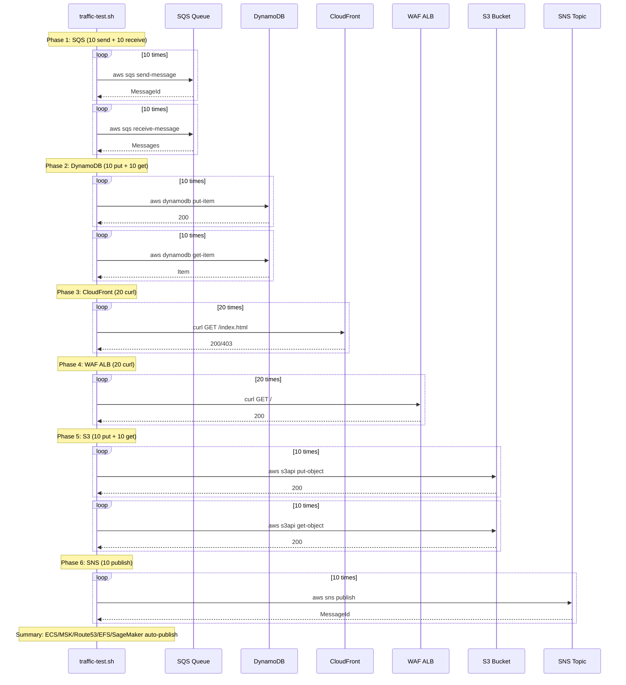

# Design Document: Extended Resources E2E Test

## Overview

11개 확장 리소스 타입(SQS, ECS, MSK, DynamoDB, CloudFront, WAF, Route53, EFS, S3, SageMaker, SNS)의 알람 자동 생성을 검증하기 위한 독립 CloudFormation 스택과 트래픽 테스트 스크립트를 설계한다. DX(Direct Connect)는 물리 연결이 필요하므로 제외한다.

이 스펙은 인프라 코드(CloudFormation 템플릿 + bash 스크립트)이며, Python 애플리케이션이 아니다.

주요 설계 결정:

- **독립 스택**: 기존 `infra-test/remaining-resources-test/` 스택과 분리하여 `infra-test/extended-resources-test/`에 배치. 기존 스택의 Lambda/APIGW/VPN/ACM/Backup/MQ/CLB/OpenSearch 리소스와 충돌 없이 독립 배포/삭제 가능.
- **SQS**: 표준 큐, 별도 설정 불필요. 트래픽 스크립트에서 `aws sqs send-message`/`receive-message`로 메트릭 발생.
- **ECS Fargate**: nginx 컨테이너, 256 CPU/512 MB 최소 사양, desiredCount=1. 퍼블릭 서브넷에 배치하고 퍼블릭 IP 할당하여 ECR 이미지 풀 가능. TaskExecutionRole에 `AmazonECSTaskExecutionRolePolicy` 부여.
- **MSK**: kafka.t3.small x 2 브로커, 10GB EBS. 2개 AZ 서브넷에 배치. 비용 주의 (~$0.08/hr).
- **DynamoDB**: PAY_PER_REQUEST, 단순 파티션 키. 트래픽 스크립트에서 PutItem/GetItem으로 메트릭 발생.
- **CloudFront + S3 Origin**: OAC(Origin Access Control)로 S3 접근. CloudFront 메트릭은 us-east-1에서만 발행. 트래픽 스크립트에서 CloudFront DomainName에 curl 요청.
- **WAF WebACL + ALB**: REGIONAL 스코프 WebACL, 기본 Allow + Rate-based 규칙. 전용 ALB에 연동, HTTP:80 리스너 + 고정 응답(200). 트래픽 스크립트에서 ALB DNS에 curl 요청.
- **Route53 Health Check**: WAF ALB DNS를 대상으로 HTTP Health Check. Route53 메트릭은 us-east-1에서만 발행.
- **EFS**: Bursting 처리량 모드, 1개 Mount Target. 메트릭은 파일시스템 존재만으로 자동 발행.
- **S3 Bucket**: MetricsConfiguration으로 Request Metrics 활성화. 활성화 후 15분 대기 필요. 스택 삭제 시 객체 정리 CustomResource Lambda 포함.
- **SageMaker**: ml.t2.medium 최소 사양. scikit-learn 사전 빌드 컨테이너 이미지 사용, 더미 모델(S3에 빈 tar.gz 업로드). 비용 주의 (~$0.065/hr). Model + EndpointConfig + Endpoint 3개 리소스.
- **SNS**: 표준 토픽, 별도 설정 불필요. 트래픽 스크립트에서 `aws sns publish`로 메트릭 발생.
- **S3 버킷 정리 CustomResource**: S3 버킷(CloudFront 오리진 + SageMaker 모델)과 SageMaker 엔드포인트 삭제 전 객체 정리.

## Architecture

### CloudFormation 리소스 의존성 그래프

```mermaid
flowchart TD
    subgraph Parameters
        ENV[Environment]
        VPC[VpcId]
        SUB1[SubnetId1]
        SUB2[SubnetId2]
    end

    subgraph IAM["IAM Resources"]
        ECSEXEC[EcsTaskExecutionRole]
        SMROLE[SageMakerRole]
        S3CLEAN[S3CleanupRole]
    end

    subgraph SQS_Section["SQS"]
        SQS[SqsQueue]
    end

    subgraph ECS_Section["ECS Fargate"]
        CLUSTER[EcsCluster]
        ECSTD[EcsTaskDefinition]
        ECSSG[EcsSecurityGroup]
        ECSSVC[EcsService]
        ECSEXEC --> ECSTD
        CLUSTER --> ECSSVC
        ECSTD --> ECSSVC
        ECSSG --> ECSSVC
    end

    subgraph MSK_Section["MSK"]
        MSKSG[MskSecurityGroup]
        MSK[MskCluster]
        MSKSG --> MSK
    end

    subgraph DDB_Section["DynamoDB"]
        DDB[DynamoDBTable]
    end

    subgraph CF_Section["CloudFront + S3 Origin"]
        CFS3[CloudFrontOriginBucket]
        OAC[CloudFrontOAC]
        CF[CloudFrontDistribution]
        CFS3POLICY[CloudFrontBucketPolicy]
        CFS3 --> CF
        OAC --> CF
        CF --> CFS3POLICY
    end

    subgraph WAF_Section["WAF + ALB"]
        WAFACL[WafWebAcl]
        WAFSG[WafAlbSecurityGroup]
        WAFALB[WafAlb]
        WAFTG[WafAlbTargetGroup]
        WAFLISTENER[WafAlbListener]
        WAFASSOC[WafWebAclAssociation]
        WAFSG --> WAFALB
        WAFALB --> WAFTG
        WAFALB --> WAFLISTENER
        WAFTG --> WAFLISTENER
        WAFALB --> WAFASSOC
        WAFACL --> WAFASSOC
    end

    subgraph R53_Section["Route53"]
        R53HC[Route53HealthCheck]
        WAFALB --> R53HC
    end

    subgraph EFS_Section["EFS"]
        EFSSG[EfsMountTargetSecurityGroup]
        EFS[EfsFileSystem]
        EFSMT[EfsMountTarget]
        EFS --> EFSMT
        EFSSG --> EFSMT
    end

    subgraph S3_Section["S3 (Request Metrics)"]
        S3BKT[S3Bucket]
        S3CLEANUP[S3CleanupFunction]
        S3CR[S3CleanupCustomResource]
        S3CLEAN --> S3CLEANUP
        S3CLEANUP --> S3CR
        S3BKT --> S3CR
    end

    subgraph SM_Section["SageMaker"]
        SMBKT[SageMakerModelBucket]
        SMMODEL[SageMakerModel]
        SMEC[SageMakerEndpointConfig]
        SMEP[SageMakerEndpoint]
        SMROLE --> SMMODEL
        SMBKT --> SMMODEL
        SMMODEL --> SMEC
        SMEC --> SMEP
    end

    subgraph SNS_Section["SNS"]
        SNS[SnsTopic]
    end
```




### 트래픽 테스트 스크립트 실행 흐름



## Components and Interfaces

### 1. CloudFormation 템플릿 (`infra-test/extended-resources-test/template.yaml`)

#### Parameters

| 파라미터 | 타입 | 기본값 | 설명 |
|----------|------|--------|------|
| Environment | String | dev | 리소스 네이밍 접두사 |
| VpcId | AWS::EC2::VPC::Id | - | 리소스 배치 대상 VPC |
| SubnetId1 | AWS::EC2::Subnet::Id | - | AZ-a 퍼블릭 서브넷 (ECS/MSK/WAF ALB/EFS) |
| SubnetId2 | AWS::EC2::Subnet::Id | - | AZ-b 퍼블릭 서브넷 (MSK/WAF ALB) |

#### 리소스 구성 (총 ~40개 리소스)

**SQS (1)**
- `SqsQueue`: 표준 큐, `${Environment}-e2e-extended-sqs`

**ECS Fargate (5)**
- `EcsCluster`: ECS 클러스터
- `EcsTaskExecutionRole`: IAM 역할 (`AmazonECSTaskExecutionRolePolicy`)
- `EcsTaskDefinition`: Fargate, 256 CPU/512 MB, nginx:latest 컨테이너
- `EcsSecurityGroup`: 아웃바운드 전체 허용
- `EcsService`: FARGATE, desiredCount=1, 퍼블릭 IP 할당

ECS TaskDefinition 컨테이너 정의:
```yaml
ContainerDefinitions:
  - Name: nginx
    Image: public.ecr.aws/nginx/nginx:latest
    PortMappings:
      - ContainerPort: 80
    Essential: true
```

**MSK (2)**
- `MskSecurityGroup`: Kafka 포트(9092/9094) 인바운드 허용
- `MskCluster`: kafka.t3.small x 2 브로커, 10GB EBS, 2 AZ 배치

MSK 최소 구성:
```yaml
BrokerNodeGroupInfo:
  InstanceType: kafka.t3.small
  ClientSubnets:
    - !Ref SubnetId1
    - !Ref SubnetId2
  StorageInfo:
    EBSStorageInfo:
      VolumeSize: 10
  SecurityGroups:
    - !Ref MskSecurityGroup
NumberOfBrokerNodes: 2
```

**DynamoDB (1)**
- `DynamoDBTable`: PAY_PER_REQUEST, 파티션 키 `id` (String)

**CloudFront + S3 Origin (4)**
- `CloudFrontOriginBucket`: S3 버킷 (CloudFront 오리진용)
- `CloudFrontOAC`: Origin Access Control
- `CloudFrontDistribution`: S3 오리진, OAC 연동, DefaultRootObject=index.html
- `CloudFrontBucketPolicy`: OAC를 통한 CloudFront 접근 허용 S3 버킷 정책

CloudFront OAC 구성:
```yaml
CloudFrontOAC:
  Type: AWS::CloudFront::OriginAccessControl
  Properties:
    OriginAccessControlConfig:
      Name: !Sub '${Environment}-e2e-extended-cf-oac'
      OriginAccessControlOriginType: s3
      SigningBehavior: always
      SigningProtocol: sigv4
```

**WAF + ALB (6)**
- `WafWebAcl`: REGIONAL 스코프, 기본 Allow, Rate-based 규칙 (limit=2000)
- `WafAlbSecurityGroup`: HTTP:80 인바운드 (0.0.0.0/0)
- `WafAlb`: internet-facing ALB, 2 AZ 서브넷
- `WafAlbTargetGroup`: 고정 응답용 (사용하지 않지만 리스너에 필요)
- `WafAlbListener`: HTTP:80, 고정 응답 200 (body: `{"status":"ok"}`)
- `WafWebAclAssociation`: WebACL-ALB 연동

WAF ALB 리스너 고정 응답:
```yaml
DefaultActions:
  - Type: fixed-response
    FixedResponseConfig:
      StatusCode: '200'
      ContentType: application/json
      MessageBody: '{"status":"ok"}'
```

**Route53 (1)**
- `Route53HealthCheck`: HTTP 타입, WAF ALB DNS 대상, Port 80

Route53 Health Check 구성:
```yaml
HealthCheckConfig:
  Type: HTTP
  FullyQualifiedDomainName: !GetAtt WafAlb.DNSName
  Port: 80
  ResourcePath: /
  RequestInterval: 30
  FailureThreshold: 3
```

**EFS (3)**
- `EfsFileSystem`: Bursting 처리량 모드
- `EfsMountTargetSecurityGroup`: NFS:2049 인바운드 허용
- `EfsMountTarget`: SubnetId1에 1개 Mount Target

**S3 (4)**
- `S3Bucket`: Request Metrics 활성화 (MetricsConfiguration)
- `S3CleanupRole`: Lambda IAM 역할 (s3:DeleteObject, s3:ListBucket)
- `S3CleanupFunction`: 스택 삭제 시 S3 객체 정리 Lambda
- `S3CleanupCustomResource`: Custom::S3Cleanup

S3 Request Metrics 구성:
```yaml
MetricsConfigurations:
  - Id: EntireBucket
```

**SageMaker (6)**
- `SageMakerRole`: IAM 역할 (`AmazonSageMakerFullAccess` + S3 접근)
- `SageMakerModelBucket`: 더미 모델 아티팩트 저장 S3 버킷
- `SageMakerModelUpload`: CustomResource Lambda (빈 tar.gz를 S3에 업로드)
- `SageMakerModel`: scikit-learn 사전 빌드 컨테이너, S3 모델 아티팩트
- `SageMakerEndpointConfig`: ml.t2.medium, InitialInstanceCount=1
- `SageMakerEndpoint`: 추론 엔드포인트

SageMaker scikit-learn 컨테이너 이미지 (ap-northeast-2):
```
366743142698.dkr.ecr.ap-northeast-2.amazonaws.com/sagemaker-scikit-learn:1.2-1-cpu-py3
```

**SNS (1)**
- `SnsTopic`: 표준 토픽

**S3 Cleanup 공유**: CloudFront 오리진 버킷, S3 Request Metrics 버킷, SageMaker 모델 버킷 모두 동일한 S3CleanupFunction을 공유하되, 각각 별도 CustomResource로 호출.

#### Outputs

| Output | 값 | 용도 |
|--------|---|------|
| SqsQueueName | !GetAtt SqsQueue.QueueName | 트래픽 스크립트 인자 |
| SqsQueueUrl | !Ref SqsQueue | 트래픽 스크립트 인자 |
| EcsClusterName | !Ref EcsCluster | 알람 검증 |
| EcsServiceName | !GetAtt EcsService.Name | 알람 검증 |
| MskClusterName | !Ref MskCluster | 알람 검증 |
| MskClusterArn | !GetAtt MskCluster.Arn | 알람 검증 |
| DynamoDBTableName | !Ref DynamoDBTable | 트래픽 스크립트 인자 |
| CloudFrontDistributionId | !Ref CloudFrontDistribution | 알람 검증 |
| CloudFrontDomainName | !GetAtt CloudFrontDistribution.DomainName | 트래픽 스크립트 인자 |
| WafWebAclName | !Ref WafWebAcl | 알람 검증 |
| WafAlbDns | !GetAtt WafAlb.DNSName | 트래픽 스크립트 인자 |
| Route53HealthCheckId | !Ref Route53HealthCheck | 알람 검증 |
| EfsFileSystemId | !Ref EfsFileSystem | 알람 검증 |
| S3BucketName | !Ref S3Bucket | 트래픽 스크립트 인자 |
| SageMakerEndpointName | !GetAtt SageMakerEndpoint.EndpointName | 알람 검증 |
| SnsTopicName | !GetAtt SnsTopic.TopicName | 트래픽 스크립트 인자 |
| SnsTopicArn | !Ref SnsTopic | 트래픽 스크립트 인자 |
| ExpectedAlarms | 리소스별 예상 알람 수 (~35개) | 검증 기준 |

### 2. 트래픽 테스트 스크립트 (`infra-test/extended-resources-test/traffic-test.sh`)

#### 인터페이스

```bash
Usage: ./traffic-test.sh <SQS_QUEUE_URL> <DDB_TABLE_NAME> <CF_DOMAIN> <WAF_ALB_DNS> <S3_BUCKET> <SNS_TOPIC_ARN>
```

6개 인자 모두 필수. 누락 시 usage 출력 후 종료.

#### 실행 단계

| Phase | 대상 | 요청 수 | 방식 | 발생 메트릭 |
|-------|------|---------|------|-------------|
| 1 | SQS | 10 send + 10 receive | aws cli | MessagesVisible, OldestMessage, MessagesSent |
| 2 | DynamoDB | 10 put + 10 get | aws cli | ReadCapacity, WriteCapacity |
| 3 | CloudFront | 20 | curl | CF5xxErrorRate, CF4xxErrorRate, CFRequests, CFBytesDownloaded |
| 4 | WAF ALB | 20 | curl | WAFBlockedRequests, WAFAllowedRequests |
| 5 | S3 | 10 put + 10 get | aws cli | S34xxErrors, S35xxErrors |
| 6 | SNS | 10 | aws cli | NotificationsFailed, MessagesPublished |
| Summary | - | - | - | 완료 메시지 |

#### 트래픽 미전송 리소스

ECS, MSK, Route53, EFS, SageMaker는 트래픽 스크립트에서 제외:
- **ECS**: Fargate 서비스 실행 중 CPUUtilization/MemoryUtilization/RunningTaskCount 자동 발행
- **MSK**: 클러스터 실행 중 ActiveControllerCount/UnderReplicatedPartitions 등 자동 발행
- **Route53**: Health Check 생성 시 HealthCheckStatus 자동 발행 (us-east-1)
- **EFS**: 파일시스템 존재 시 BurstCreditBalance 등 자동 발행
- **SageMaker**: 엔드포인트 InService 상태에서 CPUUtilization 등 자동 발행. Invocations 메트릭은 실제 호출 필요하지만, 알람 정의 등록 검증 목적이므로 생략 가능.


## Data Models

### CloudFormation 리소스 태그 구조

모든 모니터링 대상 리소스에 공통 적용:

```yaml
Tags:
  - Key: Monitoring
    Value: 'on'
  - Key: Name
    Value: !Sub '${Environment}-e2e-extended-<resource-suffix>'
```

ECS Service 태그 (CloudFormation에서 ECS Service 태그는 `PropagateTags` + `Tags` 사용):
```yaml
Tags:
  - Key: Monitoring
    Value: 'on'
EnableECSManagedTags: true
PropagateTags: SERVICE
```

### 예상 알람 매핑 (Daily Monitor 실행 후)

| 리소스 타입 | 리소스 수 | 알람/리소스 | 총 알람 | 알람 메트릭 |
|-------------|-----------|-------------|---------|-------------|
| SQS | 1 | 3 | 3 | SQSMessagesVisible, SQSOldestMessage, SQSMessagesSent |
| ECS | 1 | 3 | 3 | EcsCPU, EcsMemory, RunningTaskCount |
| MSK | 1 | 4 | 4 | OffsetLag, BytesInPerSec, UnderReplicatedPartitions, ActiveControllerCount |
| DynamoDB | 1 | 4 | 4 | DDBReadCapacity, DDBWriteCapacity, ThrottledRequests, DDBSystemErrors |
| CloudFront | 1 | 4 | 4 | CF5xxErrorRate, CF4xxErrorRate, CFRequests, CFBytesDownloaded |
| WAF | 1 | 3 | 3 | WAFBlockedRequests, WAFAllowedRequests, WAFCountedRequests |
| Route53 | 1 | 1 | 1 | HealthCheckStatus |
| EFS | 1 | 3 | 3 | BurstCreditBalance, PercentIOLimit, EFSClientConnections |
| S3 | 1 | 4 | 4 | S34xxErrors, S35xxErrors, S3BucketSizeBytes, S3NumberOfObjects |
| SageMaker | 1 | 4 | 4 | SMInvocations, SMInvocationErrors, SMModelLatency, SMCPU |
| SNS | 1 | 2 | 2 | SNSNotificationsFailed, SNSMessagesPublished |
| **합계** | **11** | - | **~35** | - |

### 비용 모델

| 리소스 | 시간당 비용 (ap-northeast-2) | 비고 |
|--------|------------------------------|------|
| MSK kafka.t3.small x 2 | ~$0.082 | 가장 비싼 리소스 중 하나 |
| SageMaker ml.t2.medium | ~$0.065 | 테스트 후 즉시 삭제 필수 |
| ECS Fargate (256/512) | ~$0.012 | |
| WAF ALB | ~$0.028 | |
| CloudFront | ~$0.00 | 요청 기반 과금, 무시 가능 |
| SQS/DynamoDB/S3/SNS/EFS/Route53 | ~$0.00 | 프리티어 또는 무시 가능 |
| WAF WebACL | ~$0.007 | 시간당 $5/month 기준 |
| **합계** | **~$0.20/hr** | 테스트 직후 즉시 삭제 |

### SageMaker 더미 모델 아티팩트

SageMaker Model은 S3에 모델 아티팩트(tar.gz)가 필요하다. CustomResource Lambda로 빈 더미 모델을 생성하여 업로드한다:

```python
import tarfile, io, os
# Create minimal model.tar.gz with empty model file
buf = io.BytesIO()
with tarfile.open(fileobj=buf, mode='w:gz') as tar:
    # Add empty file as placeholder
    info = tarfile.TarInfo(name='model.pkl')
    info.size = 0
    tar.addfile(info, io.BytesIO(b''))
buf.seek(0)
s3.put_object(Bucket=bucket, Key='model/model.tar.gz', Body=buf.read())
```

### CloudFront/Route53 메트릭 리전 주의사항

- CloudFront 메트릭: `AWS/CloudFront` 네임스페이스, **us-east-1에서만 발행**
- Route53 Health Check 메트릭: `AWS/Route53` 네임스페이스, **us-east-1에서만 발행**
- Daily Monitor는 이 두 리소스 타입에 대해 us-east-1 리전의 CloudWatch 클라이언트를 사용하여 알람을 생성해야 한다
- alarm_registry.py에 이미 `"region": "us-east-1"` 필드가 정의되어 있음

### S3 Request Metrics 활성화 지연

- S3 버킷에 `MetricsConfiguration`을 설정하면 Request Metrics(4xxErrors, 5xxErrors 등)가 활성화된다
- 활성화 후 CloudWatch에 메트릭이 나타나기까지 **약 15분** 소요
- `S3BucketSizeBytes`와 `S3NumberOfObjects`는 일일 메트릭(period=86400)으로, 버킷 생성 후 24시간 이내에 첫 데이터포인트 발행
- 트래픽 스크립트에서 S3 트래픽 전송 전 안내 메시지 출력


## Correctness Properties

*A property is a characteristic or behavior that should hold true across all valid executions of a system — essentially, a formal statement about what the system should do. Properties serve as the bridge between human-readable specifications and machine-verifiable correctness guarantees.*

이 스펙은 인프라 코드(CloudFormation 템플릿 + bash 스크립트)로 구성되며, 모든 acceptance criteria가 다음 범주에 해당한다:

1. **CloudFormation 템플릿 정적 구조** (Requirements 1-13, 15-18): 리소스 속성, 태그, 파라미터, Outputs 등 YAML 파일의 정적 내용
2. **bash 스크립트 실행 동작** (Requirement 14): 실제 AWS 인프라에 대한 CLI 명령 실행
3. **Daily Monitor 연동 동작** (Requirements 6.6, 8.5, 9.3, 16.3): 별도 시스템의 동작으로, 이미 독립적으로 테스트됨

따라서 property-based testing으로 검증 가능한 correctness property가 없다.

검증은 다음 방식으로 수행한다:
1. **CloudFormation 배포 성공**: 스택 배포가 `CREATE_COMPLETE` 상태에 도달하면 모든 리소스 생성 요구사항이 충족된 것으로 간주
2. **트래픽 스크립트 실행**: SQS/DynamoDB/CloudFront/WAF/S3/SNS에 대한 요청 성공 확인
3. **Daily Monitor 실행 후 알람 수 확인**: 예상 ~35개 알람이 생성되었는지 수동 검증

No testable properties.

## Error Handling

### CloudFormation 배포 실패 시나리오

| 실패 원인 | 증상 | 대응 |
|-----------|------|------|
| VPC/서브넷 파라미터 오류 | ROLLBACK_COMPLETE | 올바른 VPC/서브넷 ID 확인 (퍼블릭 서브넷 필수) |
| MSK 서브넷 AZ 불일치 | MskCluster CREATE_FAILED | SubnetId1/SubnetId2가 서로 다른 AZ에 있는지 확인 |
| MSK 브로커 수 < AZ 수 | MskCluster CREATE_FAILED | NumberOfBrokerNodes >= AZ 수 확인 (2 브로커, 2 AZ) |
| ECS ECR 이미지 풀 실패 | EcsService CREATE_FAILED | 퍼블릭 서브넷 + 퍼블릭 IP 할당 확인, 또는 NAT Gateway 필요 |
| SageMaker 컨테이너 이미지 오류 | SageMakerModel CREATE_FAILED | 리전별 SageMaker 컨테이너 이미지 URI 확인 |
| SageMaker 모델 아티팩트 누락 | SageMakerModel CREATE_FAILED | CustomResource Lambda가 S3에 model.tar.gz 업로드 성공 확인 |
| CloudFront OAC 설정 오류 | CloudFrontDistribution CREATE_FAILED | OAC ID와 S3 버킷 정책 일치 확인 |
| WAF WebACL 연동 실패 | WafWebAclAssociation CREATE_FAILED | ALB ARN과 WebACL 스코프(REGIONAL) 확인 |
| Route53 Health Check 대상 미응답 | Health Check UNHEALTHY | WAF ALB 배포 완료 후 Health Check 생성 (DependsOn) |
| 서비스 한도 초과 | 해당 리소스 CREATE_FAILED | AWS Support에 한도 증가 요청 |
| S3 버킷명 중복 | S3Bucket CREATE_FAILED | 글로벌 유니크 버킷명 사용 (Environment + AccountId 조합) |

### 트래픽 스크립트 에러 처리

| 상황 | 처리 |
|------|------|
| 인자 누락 (6개 미만) | usage 출력 후 exit 1 |
| SQS send-message 실패 | 에러 메시지 출력, 스크립트 계속 진행 |
| DynamoDB put-item/get-item 실패 | 에러 메시지 출력, 스크립트 계속 진행 |
| CloudFront curl 403/404 | HTTP 상태 코드 출력 (OAC 설정 문제 가능), 스크립트 계속 진행 |
| WAF ALB curl 실패 | HTTP 상태 코드 출력, 스크립트 계속 진행 |
| S3 put-object/get-object 실패 | 에러 메시지 출력, 스크립트 계속 진행 |
| SNS publish 실패 | 에러 메시지 출력, 스크립트 계속 진행 |

### 리소스별 주의사항

- **MSK**: 클러스터 생성에 15~25분 소요. 스택 배포 시간이 가장 길다. 삭제에도 10~15분 소요.
- **SageMaker**: 엔드포인트 생성에 5~10분 소요. ml.t2.medium 비용 ~$0.065/hr이므로 테스트 후 즉시 삭제.
- **CloudFront**: 배포 생성에 5~15분 소요. 삭제에도 5~10분 소요. Disable 후 삭제해야 하지만 CloudFormation이 자동 처리.
- **ECS Fargate**: 퍼블릭 서브넷에 배치하고 `AssignPublicIp: ENABLED`로 설정해야 ECR에서 nginx 이미지를 풀 수 있다. 프라이빗 서브넷 사용 시 NAT Gateway 또는 VPC 엔드포인트 필요.
- **S3 Request Metrics**: 활성화 후 15분 대기 필요. 4xxErrors/5xxErrors 메트릭은 Request Metrics 활성화 후에만 발행.
- **Route53 Health Check**: WAF ALB가 먼저 배포되어야 DNS가 확정됨. `DependsOn: WafAlb` 또는 `!GetAtt WafAlb.DNSName` 참조로 의존성 자동 해결.
- **CloudFront/Route53 알람**: us-east-1에서만 메트릭 발행. Daily Monitor가 alarm_registry.py의 `"region": "us-east-1"` 필드를 참조하여 올바른 리전에 알람 생성.

## Testing Strategy

### 검증 방법

이 스펙은 인프라 코드이므로 단위 테스트나 property-based testing 대신 수동 통합 테스트로 검증한다.

#### 1단계: CloudFormation 배포

```bash
aws cloudformation create-stack \
  --stack-name dev-e2e-extended \
  --template-body file://infra-test/extended-resources-test/template.yaml \
  --parameters \
    ParameterKey=VpcId,ParameterValue=vpc-xxx \
    ParameterKey=SubnetId1,ParameterValue=subnet-xxx \
    ParameterKey=SubnetId2,ParameterValue=subnet-yyy \
  --capabilities CAPABILITY_NAMED_IAM \
  --region ap-northeast-2 \
  --profile jordy_poc

# 배포 완료 대기 (25~35분, MSK/SageMaker/CloudFront 생성 시간)
aws cloudformation wait stack-create-complete \
  --stack-name dev-e2e-extended \
  --region ap-northeast-2 \
  --profile jordy_poc
```

#### 2단계: 트래픽 생성

```bash
# Outputs에서 리소스 식별자 추출
STACK=dev-e2e-extended
REGION=ap-northeast-2
PROFILE=jordy_poc

SQS_URL=$(aws cloudformation describe-stacks --stack-name $STACK --region $REGION --profile $PROFILE \
  --query 'Stacks[0].Outputs[?OutputKey==`SqsQueueUrl`].OutputValue' --output text)
DDB_TABLE=$(aws cloudformation describe-stacks --stack-name $STACK --region $REGION --profile $PROFILE \
  --query 'Stacks[0].Outputs[?OutputKey==`DynamoDBTableName`].OutputValue' --output text)
CF_DOMAIN=$(aws cloudformation describe-stacks --stack-name $STACK --region $REGION --profile $PROFILE \
  --query 'Stacks[0].Outputs[?OutputKey==`CloudFrontDomainName`].OutputValue' --output text)
WAF_DNS=$(aws cloudformation describe-stacks --stack-name $STACK --region $REGION --profile $PROFILE \
  --query 'Stacks[0].Outputs[?OutputKey==`WafAlbDns`].OutputValue' --output text)
S3_BUCKET=$(aws cloudformation describe-stacks --stack-name $STACK --region $REGION --profile $PROFILE \
  --query 'Stacks[0].Outputs[?OutputKey==`S3BucketName`].OutputValue' --output text)
SNS_ARN=$(aws cloudformation describe-stacks --stack-name $STACK --region $REGION --profile $PROFILE \
  --query 'Stacks[0].Outputs[?OutputKey==`SnsTopicArn`].OutputValue' --output text)

./infra-test/extended-resources-test/traffic-test.sh \
  "$SQS_URL" "$DDB_TABLE" "$CF_DOMAIN" "$WAF_DNS" "$S3_BUCKET" "$SNS_ARN"
```

#### 3단계: Daily Monitor 실행 및 알람 검증

```bash
# Daily Monitor Lambda 수동 실행
aws lambda invoke --function-name dev-daily-monitor \
  --payload '{}' /dev/null --region ap-northeast-2 --profile jordy_poc

# 생성된 알람 수 확인 (e2e-extended 관련)
aws cloudwatch describe-alarms \
  --alarm-name-prefix "dev-" \
  --region ap-northeast-2 --profile jordy_poc \
  --query 'MetricAlarms[?contains(AlarmName, `e2e-extended`)] | length(@)' \
  --output text

# us-east-1 알람 확인 (CloudFront + Route53)
aws cloudwatch describe-alarms \
  --alarm-name-prefix "dev-" \
  --region us-east-1 --profile jordy_poc \
  --query 'MetricAlarms[?contains(AlarmName, `e2e-extended`)] | length(@)' \
  --output text
```

#### 4단계: 스택 삭제

```bash
aws cloudformation delete-stack \
  --stack-name dev-e2e-extended \
  --region ap-northeast-2 \
  --profile jordy_poc

# 삭제 완료 대기 (15~25분, MSK/SageMaker/CloudFront 삭제 시간)
aws cloudformation wait stack-delete-complete \
  --stack-name dev-e2e-extended \
  --region ap-northeast-2 \
  --profile jordy_poc
```

### 검증 체크리스트

- [ ] 스택 배포 `CREATE_COMPLETE` 도달
- [ ] SQS: send-message/receive-message 성공
- [ ] ECS: 서비스 RUNNING 상태, 태스크 1개 실행 중
- [ ] MSK: 클러스터 ACTIVE 상태
- [ ] DynamoDB: put-item/get-item 성공
- [ ] CloudFront: DomainName에 curl 요청 시 응답 수신
- [ ] WAF ALB: DNS에 curl 요청 시 200 응답
- [ ] Route53: Health Check HEALTHY 상태
- [ ] EFS: 파일시스템 AVAILABLE 상태
- [ ] S3: put-object/get-object 성공
- [ ] SageMaker: 엔드포인트 InService 상태
- [ ] SNS: publish 성공
- [ ] Daily Monitor 실행 후 ap-northeast-2에서 ~30개 알람 생성 확인
- [ ] Daily Monitor 실행 후 us-east-1에서 ~5개 알람 생성 확인 (CloudFront 4 + Route53 1)
- [ ] 각 리소스 타입별 예상 알람 메트릭 일치 확인
- [ ] 스택 삭제 `DELETE_COMPLETE` 도달 (S3 CustomResource 정리 포함)
