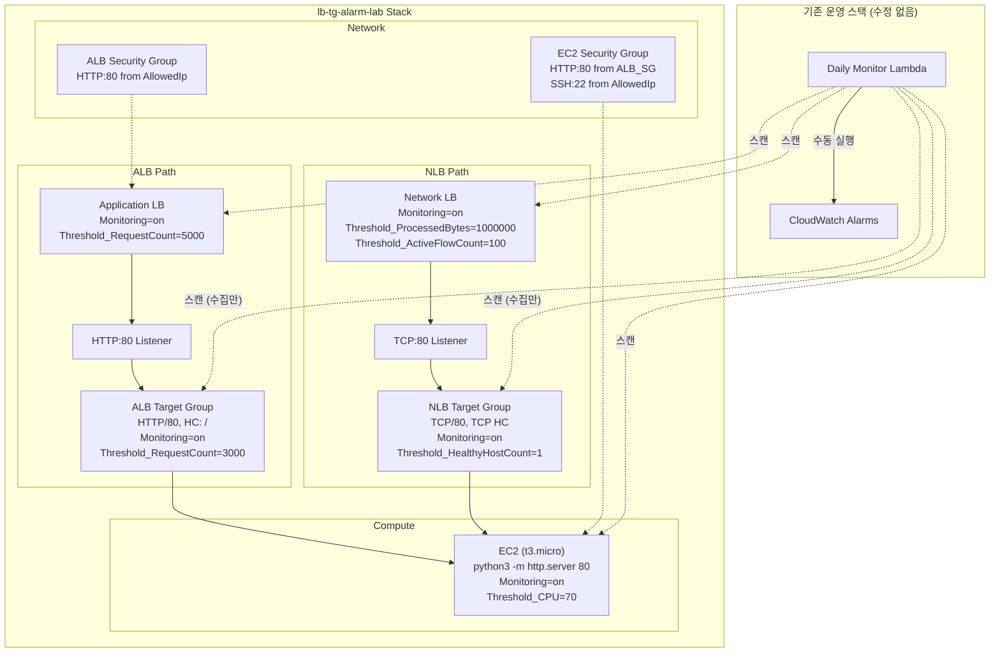
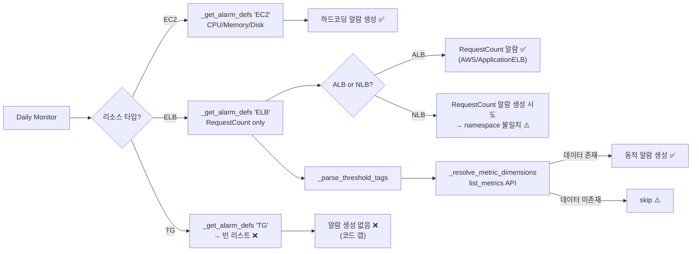
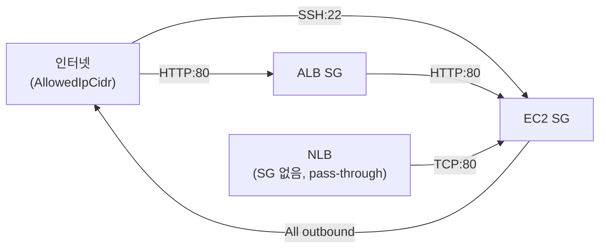

# 설계 문서: LB/TG 알람 테스트 인프라

## 개요

aws-alert-manager의 ALB/NLB/Target Group 알람 엔진 동작을 실제 AWS 환경에서 검증하기 위한 독립형 CloudFormation 테스트 스택 설계.

기존 운영 코드를 일절 수정하지 않고, `infra-test/lb-tg-alarm-lab/` 디렉터리에 격리된 CFN 템플릿과 스크립트를 배치한다. 배포 후 Daily Monitor Lambda를 수동 실행하여 다음을 검증한다:

1. EC2 하드코딩 알람(CPU/Memory/Disk) 정상 생성
2. ALB 하드코딩 알람(RequestCount) 정상 생성
3. NLB 동적 알람(ProcessedBytes/ActiveFlowCount) 조건부 생성
4. TG 메트릭 존재 확인 및 알람 자동 생성 미지원(갭) 명시적 확인

### 설계 원칙

- **정직성**: "동작함"과 "미구현"을 코드 근거와 함께 명확히 분리
- **격리**: 운영 스택과 완전 독립, 스택 삭제 시 모든 리소스 제거
- **최소 비용**: t3.micro 1대, LB 2개로 최소 구성
- **재현성**: 파라미터화된 템플릿 + 원클릭 배포/삭제 스크립트

## 아키텍처

### 전체 구성도



### 알람 엔진 처리 흐름



## 컴포넌트 및 인터페이스

### 산출물 파일 구조

```
infra-test/lb-tg-alarm-lab/
├── template.yaml           # CloudFormation 템플릿 (순수 CFN)
├── parameters.example.json # 파라미터 예시 파일
├── deploy.sh               # 배포 스크립트 (SSO profile: bjs)
├── delete.sh               # 삭제 스크립트
├── verify.md               # 검증 절차서 (AWS CLI 명령 포함)
└── README.md               # 개요 및 사용법
```

### CloudFormation 템플릿 리소스 구성

| 논리 ID | 타입 | 설명 |
|---------|------|------|
| `AlbSecurityGroup` | `AWS::EC2::SecurityGroup` | ALB용 SG (HTTP:80 from AllowedIp) |
| `Ec2SecurityGroup` | `AWS::EC2::SecurityGroup` | EC2용 SG (HTTP:80 from ALB SG, SSH:22 from AllowedIp) |
| `TestEc2Instance` | `AWS::EC2::Instance` | HTTP 백엔드 (t3.micro, UserData) |
| `TestAlb` | `AWS::ElasticLoadBalancingV2::LoadBalancer` | Application Load Balancer |
| `TestAlbTargetGroup` | `AWS::ElasticLoadBalancingV2::TargetGroup` | ALB TG (HTTP/80) |
| `TestAlbListener` | `AWS::ElasticLoadBalancingV2::Listener` | ALB HTTP:80 Listener |
| `TestNlb` | `AWS::ElasticLoadBalancingV2::LoadBalancer` | Network Load Balancer |
| `TestNlbTargetGroup` | `AWS::ElasticLoadBalancingV2::TargetGroup` | NLB TG (TCP/80) |
| `TestNlbListener` | `AWS::ElasticLoadBalancingV2::Listener` | NLB TCP:80 Listener |

### Parameters 설계

| 파라미터 | 타입 | 설명 | 기본값 |
|---------|------|------|--------|
| `VpcId` | `AWS::EC2::VPC::Id` | 배포 대상 VPC | (필수) |
| `SubnetId` | `AWS::EC2::Subnet::Id` | EC2/ALB/NLB 서브넷 | (필수) |
| `SubnetId2` | `AWS::EC2::Subnet::Id` | ALB 두 번째 서브넷 (ALB는 2개 AZ 필수) | (필수) |
| `KeyPairName` | `AWS::EC2::KeyPair::KeyName` | EC2 SSH 키페어 | (필수) |
| `AmiId` | `AWS::EC2::Image::Id` | EC2 AMI ID (Amazon Linux 2023 권장) | (필수) |
| `AllowedIpCidr` | `String` | SSH/HTTP 허용 IP CIDR | (필수) |

> ALB는 최소 2개 AZ의 서브넷이 필요하므로 `SubnetId2` 파라미터를 추가한다. NLB는 1개 서브넷으로도 동작하지만, 동일 서브넷 목록을 사용한다.

### 스크립트 인터페이스

**deploy.sh**:
```bash
./deploy.sh <parameters-file>
# 예: ./deploy.sh parameters.json
```
- `aws cloudformation deploy` 사용
- `--profile bjs --region ap-northeast-2`
- `--stack-name lb-tg-alarm-lab`
- `--capabilities CAPABILITY_IAM` (필요 시)
- 실패 시 exit 1 + 에러 메시지

**delete.sh**:
```bash
./delete.sh
```
- `aws cloudformation delete-stack` + `wait stack-delete-complete`
- 실패 시 exit 1 + 에러 메시지


## 데이터 모델

### 태그 설계 테이블

| 리소스 | 태그 키 | 태그 값 | 검증 목적 |
|--------|---------|---------|-----------|
| **모든 리소스** | `Monitoring` | `on` | Alarm Engine 수집 대상 |
| **모든 리소스** | `Project` | `lb-tg-alarm-lab` | 테스트 리소스 식별 |
| **모든 리소스** | `Environment` | `test` | 환경 구분 |
| EC2 | `Name` | `lb-tg-alarm-lab-ec2` | 리소스 식별 |
| EC2 | `Threshold_CPU` | `70` | 기본값(80) 오버라이드 검증 |
| ALB | `Name` | `lb-tg-alarm-lab-alb` | 리소스 식별 |
| ALB | `Threshold_RequestCount` | `5000` | 하드코딩 메트릭 태그 임계치 오버라이드 |
| NLB | `Name` | `lb-tg-alarm-lab-nlb` | 리소스 식별 |
| NLB | `Threshold_ProcessedBytes` | `1000000` | 동적 메트릭 알람 생성 검증 |
| NLB | `Threshold_ActiveFlowCount` | `100` | 복수 동적 메트릭 알람 검증 |
| ALB TG | `Name` | `lb-tg-alarm-lab-alb-tg` | 리소스 식별 |
| ALB TG | `Threshold_RequestCount` | `3000` | TG 알람 미생성 갭 확인 |
| NLB TG | `Name` | `lb-tg-alarm-lab-nlb-tg` | 리소스 식별 |
| NLB TG | `Threshold_HealthyHostCount` | `1` | TG 알람 미생성 갭 확인 |

### 예상 알람 결과 테이블

| 리소스 | 리소스 타입 | 메트릭 | 알람 생성 | 알람 유형 | 사유 |
|--------|-----------|--------|:---------:|----------|------|
| EC2 | EC2 | CPUUtilization | ✅ | 하드코딩 | `_EC2_ALARMS`에 정의, Threshold_CPU=70 적용 |
| EC2 | EC2 | mem_used_percent | ✅ | 하드코딩 | `_EC2_ALARMS`에 정의 (CWAgent 미설치 시 INSUFFICIENT_DATA) |
| EC2 | EC2 | disk_used_percent | ✅ | 하드코딩 | `_EC2_ALARMS`에 정의 (CWAgent 미설치 시 INSUFFICIENT_DATA) |
| ALB | ELB | RequestCount | ✅ | 하드코딩 | `_ELB_ALARMS`에 `AWS/ApplicationELB` RequestCount 정의 |
| NLB | ELB | RequestCount | ⚠️ | 하드코딩 | `_ELB_ALARMS`가 `AWS/ApplicationELB` namespace만 사용 → NLB에 적용 시 INSUFFICIENT_DATA 또는 무의미 |
| NLB | ELB | ProcessedBytes | ⭕/❌ | 동적 | `_parse_threshold_tags()` → `_resolve_metric_dimensions()` → CloudWatch에 메트릭 데이터 존재 시 생성 |
| NLB | ELB | ActiveFlowCount | ⭕/❌ | 동적 | 위와 동일. 트래픽 발생 후 15분 대기 필요 |
| ALB TG | TG | RequestCount | ❌ | - | `_get_alarm_defs("TG")` → 빈 리스트, `_DIMENSION_KEY_MAP`에 TG 없음 |
| ALB TG | TG | HealthyHostCount | ❌ | - | 동일 사유 |
| NLB TG | TG | HealthyHostCount | ❌ | - | 동일 사유 + 복합 디멘션(TargetGroup+LoadBalancer) 미지원 |

### NLB 하드코딩 알람 부재 상세 분석

`_ELB_ALARMS` 리스트에는 `AWS/ApplicationELB` namespace의 `RequestCount`만 정의되어 있다:

```python
_ELB_ALARMS = [
    {
        "metric": "RequestCount",
        "namespace": "AWS/ApplicationELB",  # ← ALB 전용
        "metric_name": "RequestCount",
        "dimension_key": "LoadBalancer",
        ...
    },
]
```

NLB(type=`network`)도 resource_type=`"ELB"`로 분류되므로 동일한 `_ELB_ALARMS`가 적용된다. 그러나 NLB의 CloudWatch namespace는 `AWS/NetworkELB`이므로, `AWS/ApplicationELB` namespace로 생성된 알람은 NLB 메트릭과 매칭되지 않아 INSUFFICIENT_DATA 상태가 된다.

### TG 알람 미지원 상세 분석

TG 알람이 생성되지 않는 3가지 코드 레벨 원인:

1. **`_get_alarm_defs("TG")` → 빈 리스트**: EC2/RDS/ELB만 정의, TG 분기 없음
2. **`_DIMENSION_KEY_MAP`에 TG 없음**: `"ELB": "LoadBalancer"`만 존재, TG용 `"TargetGroup"` 매핑 없음
3. **`_resolve_metric_dimensions()` 단일 디멘션 검색**: TG 메트릭은 `TargetGroup` + `LoadBalancer` 2개 디멘션이 필요하지만, 현재 코드는 `LoadBalancer` 단일 디멘션으로만 `list_metrics` 호출

### 네트워크 보안 설계



- ALB SG: Inbound HTTP:80 from `AllowedIpCidr`, Outbound all
- EC2 SG: Inbound HTTP:80 from ALB SG, SSH:22 from `AllowedIpCidr`, Outbound all
- NLB: Security Group 미사용 (L4 pass-through). EC2 SG에서 NLB 서브넷 CIDR 또는 `0.0.0.0/0` HTTP:80 허용 필요

> NLB는 클라이언트 IP를 보존하므로, EC2 SG에서 NLB 트래픽을 허용하려면 AllowedIpCidr에서의 HTTP:80도 EC2 SG에 추가해야 한다.

### EC2 UserData 설계

```bash
#!/bin/bash
yum update -y
python3 -m http.server 80 &
```

`python3 -m http.server`는 Amazon Linux 2023에 기본 포함. 포트 80에서 HTTP 200 응답을 반환하여 ALB/NLB 헬스체크를 통과한다.


## 정합성 속성 (Correctness Properties)

*정합성 속성(property)은 시스템의 모든 유효한 실행에서 참이어야 하는 특성 또는 동작이다. 사람이 읽을 수 있는 명세와 기계가 검증할 수 있는 정확성 보장 사이의 다리 역할을 한다.*

이 테스트 인프라는 CloudFormation 템플릿과 셸 스크립트로 구성되므로, 정합성 속성은 템플릿 YAML 파싱 기반으로 검증한다.

### Property 1: 공통 태그 완전성

*For any* taggable resource defined in the CloudFormation template, that resource SHALL have all three common tags: `Monitoring=on`, `Project=lb-tg-alarm-lab`, `Environment=test`.

**Validates: Requirements 1.4, 9.2**

### Property 2: DeletionPolicy 안전성

*For any* resource defined in the CloudFormation template, the `DeletionPolicy` attribute SHALL be either absent or set to `Delete`, ensuring complete cleanup on stack deletion.

**Validates: Requirements 2.4**

### Property 3: Security Group 아웃바운드 개방

*For any* Security Group resource defined in the CloudFormation template, the `SecurityGroupEgress` rules SHALL include a rule allowing all outbound traffic to `0.0.0.0/0`.

**Validates: Requirements 6.3**

## 에러 처리

### CloudFormation 배포 에러

| 에러 상황 | 처리 방식 |
|----------|----------|
| 필수 파라미터 누락 | CFN 검증 단계에서 `Parameter must be specified` 에러 반환 |
| 잘못된 VPC/Subnet ID | CFN 생성 단계에서 `Resource not found` 에러 → 스택 ROLLBACK |
| AMI ID 불일치 (리전/아키텍처) | EC2 생성 실패 → 스택 ROLLBACK |
| ALB 서브넷 AZ 부족 | `At least two subnets in two different AZs` 에러 → 스택 ROLLBACK |
| 키페어 미존재 | EC2 생성 실패 → 스택 ROLLBACK |

### 스크립트 에러 처리

- `deploy.sh`: `set -euo pipefail` 적용. `aws cloudformation deploy` 실패 시 exit 1 + 에러 출력
- `delete.sh`: `set -euo pipefail` 적용. `delete-stack` 또는 `wait` 실패 시 exit 1 + 에러 출력
- 두 스크립트 모두 AWS CLI SSO 세션 만료 시 `aws sso login --profile bjs` 안내 메시지 출력

### 알람 엔진 에러 시나리오

| 시나리오 | 예상 동작 |
|---------|----------|
| CWAgent 미설치 EC2 | Memory/Disk 알람 생성되나 INSUFFICIENT_DATA 상태 |
| NLB 트래픽 미발생 | 동적 알람용 `list_metrics` 결과 없음 → 알람 미생성 (정상) |
| TG 알람 생성 시도 | `_get_alarm_defs("TG")` → 빈 리스트 → 하드코딩 알람 없음 (코드 갭) |

## 테스트 전략

### 이중 테스트 접근법

이 인프라 스펙은 CloudFormation 템플릿과 셸 스크립트가 주요 산출물이므로, 테스트는 두 가지 레벨로 수행한다:

#### 1. 정적 검증 (자동화 가능)

CloudFormation 템플릿 YAML을 파싱하여 정합성 속성을 검증하는 Python 테스트.

- **단위 테스트**: 특정 리소스의 구체적 설정값 확인 (예: EC2 인스턴스 타입이 t3.micro인지)
- **속성 테스트 (PBT)**: 모든 리소스에 대해 보편적 속성 검증 (예: 모든 taggable 리소스에 공통 태그 존재)

PBT 라이브러리: `hypothesis` (기존 프로젝트 의존성)
각 속성 테스트는 최소 100회 반복 실행.

테스트 파일: `tests/test_pbt_cfn_template_tags.py`

각 테스트에 다음 형식의 태그 주석 포함:
```python
# Feature: lb-tg-alarm-test-infra, Property 1: 공통 태그 완전성
```

#### 2. 수동 검증 (AWS 환경)

배포 후 `verify.md`의 AWS CLI 명령을 실행하여 실제 알람 생성 결과를 확인.

| 검증 시나리오 | 검증 방법 | 자동화 |
|-------------|----------|:------:|
| 템플릿 태그 완전성 | YAML 파싱 + PBT | ✅ |
| 템플릿 DeletionPolicy | YAML 파싱 + PBT | ✅ |
| 템플릿 SG 아웃바운드 | YAML 파싱 + PBT | ✅ |
| EC2 알람 생성 | AWS CLI `describe-alarms` | ❌ (수동) |
| ALB 알람 생성 | AWS CLI `describe-alarms` | ❌ (수동) |
| NLB 동적 알람 | AWS CLI `list-metrics` + `describe-alarms` | ❌ (수동) |
| TG 알람 미생성 확인 | AWS CLI `describe-alarms` (결과 없음 확인) | ❌ (수동) |

### 속성 테스트 구현 방향

템플릿 YAML을 `yaml.safe_load()`로 파싱한 후, `Resources` 섹션의 모든 리소스를 순회하며 속성을 검증한다. `hypothesis`의 `@given` 데코레이터 대신, 템플릿 내 리소스 집합이 고정되어 있으므로 `@example` 또는 `pytest.mark.parametrize`로 각 리소스를 개별 검증하는 방식이 적합하다.

단, Property 1(공통 태그)의 경우 태그 값의 다양한 조합을 생성하여 파싱 로직의 견고성을 검증하는 PBT가 유효하다.

### 단위 테스트 범위

- 템플릿 파라미터 존재 확인 (VpcId, SubnetId, SubnetId2, KeyPairName, AmiId, AllowedIpCidr)
- EC2 인스턴스 타입 확인 (t3.micro)
- EC2 UserData에 http.server 포함 확인
- ALB/NLB 리소스 타입 및 Scheme 확인
- TG 프로토콜/포트/헬스체크 설정 확인
- Listener 포트 및 DefaultActions 확인
- deploy.sh에 `--profile bjs`, `--region ap-northeast-2` 포함 확인
- delete.sh에 `delete-stack`, `wait stack-delete-complete` 포함 확인
