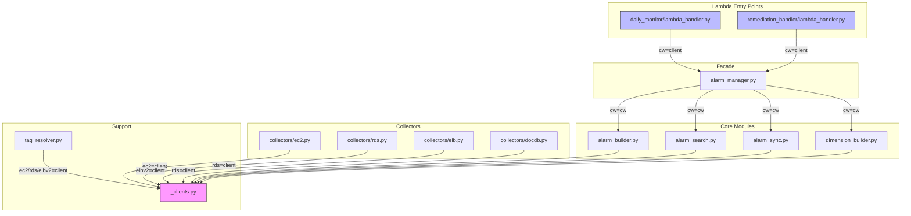
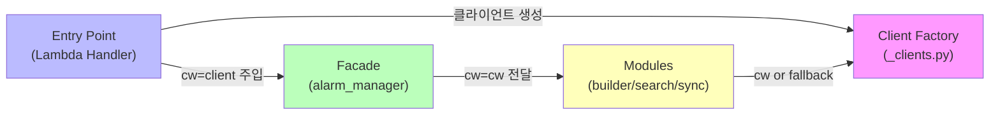
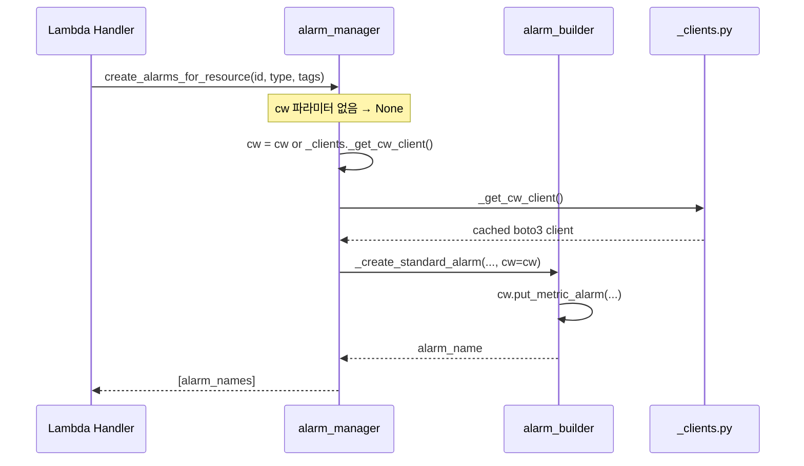
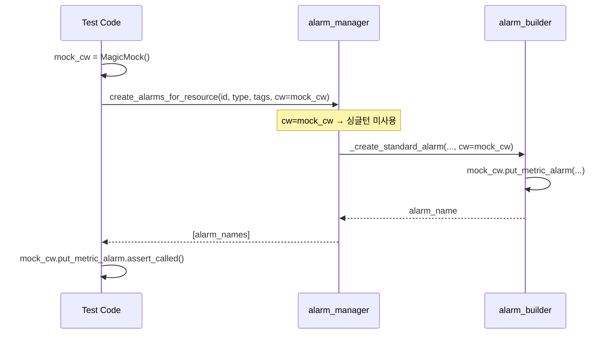
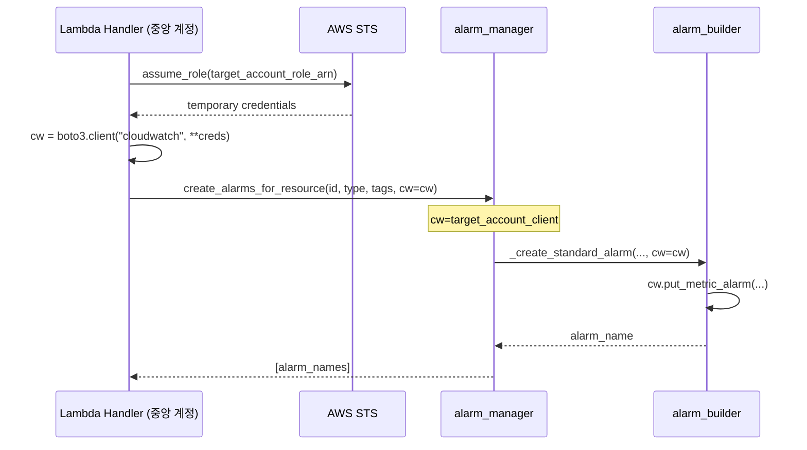

# Design Document: Manual Dependency Injection

## Overview

현재 AWS Monitoring Engine의 모든 모듈은 `functools.lru_cache` 기반 싱글턴으로 boto3 클라이언트를 생성하고, 각 모듈이 직접 `import`하여 사용한다. 이 패턴은 단일 계정 환경에서는 동작하지만, 테스트 시 `patch("common._clients._get_cw_client")` 같은 정확한 경로 매칭이 필요하고, 멀티 어카운트 구조에서는 계정별 클라이언트를 구분할 수 없다.

이 설계는 Python 기본 문법만으로 수동 DI 패턴을 도입한다. 함수 시그니처에 keyword-only 파라미터(`*, cw=None`)를 추가하고, `None`이면 기존 싱글턴을 사용하여 하위 호환성을 유지한다. 테스트에서는 mock 객체를 직접 주입하고, 멀티 어카운트에서는 STS AssumeRole로 생성한 클라이언트를 주입한다.

프로덕션 의존성 추가 없음 (거버넌스 §0 준수). 점진적 전환 전략으로 새 코드부터 DI를 적용하고, 기존 코드는 단계적으로 전환한다.

## Architecture



### 의존성 흐름 (DI 적용 후)




## Sequence Diagrams

### 시나리오 1: 프로덕션 (단일 계정, 기존 동작 유지)



### 시나리오 2: 테스트 (mock 직접 주입)



### 시나리오 3: 멀티 어카운트 (STS AssumeRole)



## Components and Interfaces

### Component 1: _clients.py (Client Factory)

**목적**: boto3 클라이언트 싱글턴 생성 + 멀티 어카운트용 팩토리 함수 제공

**현재 인터페이스**:
```python
@functools.lru_cache(maxsize=None)
def _get_cw_client():
    return boto3.client("cloudwatch")
```

**DI 적용 후 인터페이스** (확장):
```python
@functools.lru_cache(maxsize=None)
def _get_cw_client():
    """기본 CloudWatch 클라이언트 싱글턴 (기존 동작 유지)."""
    return boto3.client("cloudwatch")

def create_clients_for_account(
    role_arn: str,
    session_name: str = "MonitoringEngine",
) -> dict[str, object]:
    """STS AssumeRole로 대상 계정의 boto3 클라이언트 세트 생성.

    Returns:
        {"cw": cloudwatch_client, "ec2": ec2_client, "rds": rds_client, "elbv2": elbv2_client}
    """
    sts = boto3.client("sts")
    creds = sts.assume_role(
        RoleArn=role_arn,
        RoleSessionName=session_name,
    )["Credentials"]
    session_kwargs = {
        "aws_access_key_id": creds["AccessKeyId"],
        "aws_secret_access_key": creds["SecretAccessKey"],
        "aws_session_token": creds["SessionToken"],
    }
    return {
        "cw": boto3.client("cloudwatch", **session_kwargs),
        "ec2": boto3.client("ec2", **session_kwargs),
        "rds": boto3.client("rds", **session_kwargs),
        "elbv2": boto3.client("elbv2", **session_kwargs),
    }
```

**책임**:
- 기존 lru_cache 싱글턴 유지 (하위 호환)
- 멀티 어카운트용 클라이언트 팩토리 제공 (Phase 2)

### Component 2: alarm_manager.py (Facade)

**목적**: Public API에 `*, cw=None` 파라미터 추가, 내부 모듈에 전달

**DI 적용 후 인터페이스**:
```python
def create_alarms_for_resource(
    resource_id: str,
    resource_type: str,
    resource_tags: dict,
    *,
    cw=None,
) -> list[str]:
    """리소스에 대한 CloudWatch Alarm을 생성한다.

    Args:
        cw: CloudWatch 클라이언트. None이면 기존 싱글턴 사용.
    """
    cw = cw or _clients._get_cw_client()
    # ... 이하 cw를 내부 함수에 전달
```

**책임**:
- `cw=None` → 싱글턴 폴백 (프로덕션 하위 호환)
- `cw=mock` → 테스트 직접 주입
- `cw=cross_account_client` → 멀티 어카운트 주입
- 내부 모듈 호출 시 `cw=cw` 전달

### Component 3: alarm_builder.py / alarm_search.py / alarm_sync.py

**목적**: 내부 함수에 `cw` 파라미터 추가

**DI 적용 패턴**:
```python
def _create_standard_alarm(
    alarm_def: dict,
    resource_id: str,
    resource_type: str,
    resource_tags: dict,
    cw,                          # 기존: 5번째 positional → 유지
) -> str | None:
    # cw는 이미 alarm_manager에서 resolve된 상태
    # 내부에서 _clients import 불필요
```

**참고**: `alarm_builder.py`의 `_create_standard_alarm`은 이미 `cw`를 5번째 positional 파라미터로 받고 있다. `_create_disk_alarms`도 `cw`를 받는다. 이 모듈들은 이미 부분적으로 DI가 적용된 상태이며, `_create_single_alarm`과 `_recreate_alarm_by_name` 등 내부에서 `_clients._get_cw_client()`를 직접 호출하는 함수만 전환하면 된다.

### Component 4: dimension_builder.py

**목적**: `_resolve_metric_dimensions`, `_get_disk_dimensions`에 `cw` 파라미터 추가

**DI 적용 후**:
```python
def _resolve_metric_dimensions(
    resource_id: str,
    metric_name: str,
    resource_type: str,
    *,
    cw=None,
) -> tuple[str, list[dict]] | None:
    cw = cw or _clients._get_cw_client()
    # ...
```

### Component 5: Collectors (ec2.py, rds.py, elb.py, docdb.py)

**목적**: `collect_monitored_resources`, `get_metrics`에 서비스별 클라이언트 파라미터 추가

**DI 적용 패턴 (예: rds.py)**:
```python
def collect_monitored_resources(*, rds=None) -> list[ResourceInfo]:
    rds = rds or _get_rds_client()
    # ...

def get_metrics(
    db_instance_id: str,
    resource_tags: dict | None = None,
    *,
    cw=None,
) -> dict[str, float] | None:
    # cw는 collectors/base.py의 query_metric에 전달
```

### Component 6: tag_resolver.py

**목적**: `get_resource_tags` 및 내부 `_get_ec2_tags` 등에 클라이언트 파라미터 추가

**DI 적용 후**:
```python
def get_resource_tags(
    resource_id: str,
    resource_type: str,
    *,
    ec2=None,
    rds=None,
    elbv2=None,
) -> dict:
    # 리소스 타입에 따라 해당 클라이언트 사용
```

### Component 7: Lambda Handlers (Entry Points)

**목적**: 진입점에서 클라이언트를 생성하고 하위 모듈에 주입

**단일 계정 (Phase 1 — 변경 없음)**:
```python
# daily_monitor/lambda_handler.py
def lambda_handler(event, context):
    # cw 파라미터 없이 호출 → 기존 싱글턴 사용
    sync_alarms_for_resource(resource_id, resource_type, resource_tags)
```

**멀티 어카운트 (Phase 2)**:
```python
# daily_monitor/lambda_handler.py
def lambda_handler(event, context):
    target_accounts = get_target_accounts()  # 환경변수 또는 DynamoDB
    for account in target_accounts:
        clients = create_clients_for_account(account["role_arn"])
        cw = clients["cw"]
        # 대상 계정의 리소스 수집 + 알람 생성
        resources = collect_monitored_resources(rds=clients["rds"])
        for resource in resources:
            sync_alarms_for_resource(
                resource["id"], resource["type"], resource["tags"],
                cw=cw,
            )
```


## Data Models

### DI 파라미터 컨벤션

```python
# keyword-only 파라미터 컨벤션
# 모든 DI 파라미터는 * 뒤에 위치하며, 기본값 None
# None이면 기존 lru_cache 싱글턴 폴백

# 클라이언트 파라미터 이름 규칙:
#   cw     → boto3.client("cloudwatch")
#   ec2    → boto3.client("ec2")
#   rds    → boto3.client("rds")
#   elbv2  → boto3.client("elbv2")
```

### 모듈별 DI 파라미터 매핑

| 모듈 | 함수 | DI 파라미터 | 현재 클라이언트 소스 |
|------|------|------------|-------------------|
| alarm_manager.py | `create_alarms_for_resource` | `*, cw=None` | `_clients._get_cw_client()` |
| alarm_manager.py | `delete_alarms_for_resource` | `*, cw=None` | (alarm_search 경유) |
| alarm_manager.py | `sync_alarms_for_resource` | `*, cw=None` | (alarm_search/builder/sync 경유) |
| alarm_builder.py | `_create_standard_alarm` | `cw` (기존 positional) | 이미 DI 적용됨 |
| alarm_builder.py | `_create_disk_alarms` | `cw` (기존 positional) | 이미 DI 적용됨 |
| alarm_builder.py | `_create_single_alarm` | `*, cw=None` 추가 | `_clients._get_cw_client()` |
| alarm_builder.py | `_recreate_alarm_by_name` | `*, cw=None` 추가 | `_clients._get_cw_client()` |
| alarm_builder.py | `_create_dynamic_alarm` | `cw` (기존 positional) | 이미 DI 적용됨 |
| alarm_search.py | `_find_alarms_for_resource` | `*, cw=None` 추가 | `_clients._get_cw_client()` |
| alarm_search.py | `_delete_all_alarms_for_resource` | `*, cw=None` 추가 | `_clients._get_cw_client()` |
| alarm_search.py | `_describe_alarms_batch` | `*, cw=None` 추가 | `_clients._get_cw_client()` |
| alarm_sync.py | `_sync_off_hardcoded` | `*, cw=None` 추가 | `_clients._get_cw_client()` |
| alarm_sync.py | `_sync_dynamic_alarms` | `*, cw=None` 추가 | `_clients._get_cw_client()` |
| alarm_sync.py | `_apply_sync_changes` | `*, cw=None` 추가 | (alarm_manager 경유) |
| dimension_builder.py | `_resolve_metric_dimensions` | `*, cw=None` 추가 | `_clients._get_cw_client()` |
| dimension_builder.py | `_get_disk_dimensions` | `*, cw=None` 추가 | `_clients._get_cw_client()` |
| collectors/ec2.py | `collect_monitored_resources` | `*, ec2=None` 추가 | `_get_ec2_client()` |
| collectors/ec2.py | `get_metrics` | `*, cw=None` 추가 | `_get_cw_client()` |
| collectors/rds.py | `collect_monitored_resources` | `*, rds=None` 추가 | `_get_rds_client()` |
| collectors/rds.py | `get_metrics` | `*, cw=None` 추가 | (base.query_metric 경유) |
| collectors/elb.py | `collect_monitored_resources` | `*, elbv2=None` 추가 | `_get_elbv2_client()` |
| collectors/elb.py | `get_metrics` | `*, cw=None` 추가 | (base.query_metric 경유) |
| collectors/docdb.py | `collect_monitored_resources` | `*, rds=None` 추가 | `_get_rds_client()` |
| collectors/docdb.py | `get_metrics` | `*, cw=None` 추가 | (base.query_metric 경유) |
| collectors/base.py | `query_metric` | `*, cw=None` 추가 | `_get_cw_client()` |
| tag_resolver.py | `get_resource_tags` | `*, ec2=None, rds=None, elbv2=None` 추가 | 각 `_get_*_client()` |

### 거버넌스 §3 함수 인자 제한 대응

거버넌스 §3은 함수 인자를 5개로 제한한다. DI 파라미터 추가 시 이 제한을 초과하는 함수가 발생할 수 있다.

**대응 전략**:
- keyword-only 파라미터(`*` 뒤)는 호출자 관점에서 선택적이므로, 실질적 복잡도 증가가 제한적
- 이미 5개를 초과하는 함수(`_create_disk_alarms` 등)는 기존 `cw` positional을 유지
- 새로 추가하는 DI 파라미터는 반드시 keyword-only로 하여 호출 시 명시성 확보
- 인자가 6개 이상이 되는 경우, 기존 파라미터를 dataclass/dict로 묶는 리팩터링은 별도 스펙으로 분리

## Key Functions with Formal Specifications

### Function 1: create_alarms_for_resource (Facade)

```python
def create_alarms_for_resource(
    resource_id: str,
    resource_type: str,
    resource_tags: dict,
    *,
    cw=None,
) -> list[str]:
```

**Preconditions:**
- `resource_id`는 비어있지 않은 문자열
- `resource_type`은 `SUPPORTED_RESOURCE_TYPES` 중 하나
- `resource_tags`는 dict (빈 dict 허용)
- `cw`는 None 또는 CloudWatch 클라이언트 인터페이스를 만족하는 객체

**Postconditions:**
- `cw is None` → 내부에서 `_clients._get_cw_client()` 싱글턴 사용 (기존 동작 동일)
- `cw is not None` → 전달받은 클라이언트를 모든 내부 호출에 사용
- 반환값은 생성된 알람 이름 리스트
- 입력 파라미터에 대한 side effect 없음

### Function 2: _find_alarms_for_resource (Search)

```python
def _find_alarms_for_resource(
    resource_id: str,
    resource_type: str = "",
    *,
    cw=None,
) -> list[str]:
```

**Preconditions:**
- `resource_id`는 비어있지 않은 문자열
- `cw`는 None 또는 `describe_alarms` 메서드를 가진 객체

**Postconditions:**
- `cw is None` → `_clients._get_cw_client()` 폴백
- 반환값은 알람 이름 문자열 리스트
- 동일 입력에 대해 동일 결과 (멱등성)

### Function 3: query_metric (Collector Base)

```python
def query_metric(
    namespace: str,
    metric_name: str,
    dimensions: list[dict],
    start_time: datetime,
    end_time: datetime,
    stat: str = CW_STAT_AVG,
    *,
    cw=None,
) -> float | None:
```

**Preconditions:**
- `namespace`, `metric_name`은 비어있지 않은 문자열
- `dimensions`는 `[{"Name": str, "Value": str}]` 형태
- `start_time < end_time`
- `cw`는 None 또는 `get_metric_statistics` 메서드를 가진 객체

**Postconditions:**
- `cw is None` → `_get_cw_client()` 폴백
- 데이터 있으면 최근 데이터포인트 값 반환, 없으면 None
- ClientError 발생 시 None 반환 + error 로그

### Function 4: create_clients_for_account (Multi-Account Factory)

```python
def create_clients_for_account(
    role_arn: str,
    session_name: str = "MonitoringEngine",
) -> dict[str, object]:
```

**Preconditions:**
- `role_arn`은 유효한 IAM Role ARN 형식 (`arn:aws:iam::\d{12}:role/.*`)
- 호출자에게 `sts:AssumeRole` 권한이 있어야 함

**Postconditions:**
- 반환값은 `{"cw": client, "ec2": client, "rds": client, "elbv2": client}` 딕셔너리
- 각 클라이언트는 대상 계정의 임시 자격증명으로 생성됨
- STS 호출 실패 시 ClientError 발생 (호출자가 처리)

## Algorithmic Pseudocode

### Algorithm 1: DI 파라미터 resolve 패턴

```python
# 모든 DI 적용 함수에서 공통으로 사용하는 패턴
# 함수 본문 첫 줄에서 resolve

def some_function(..., *, cw=None):
    cw = cw or _clients._get_cw_client()  # None이면 싱글턴 폴백
    # 이후 cw만 사용, _clients 직접 호출 금지
```

### Algorithm 2: Facade → 내부 모듈 전달 체인

```python
# alarm_manager.py (Facade)
def create_alarms_for_resource(
    resource_id, resource_type, resource_tags, *, cw=None,
):
    cw = cw or _clients._get_cw_client()
    sns_arn = _get_sns_alert_arn()
    alarm_defs = _get_alarm_defs(resource_type, resource_tags)
    created = []
    resource_name = resource_tags.get("Name", "")

    # cw를 내부 함수에 전달
    _delete_all_alarms_for_resource(resource_id, resource_type, cw=cw)

    for alarm_def in alarm_defs:
        if alarm_def.get("dynamic_dimensions") and alarm_def["metric"] == "Disk":
            disk_names = _create_disk_alarms(
                resource_id, resource_type, resource_name,
                resource_tags, alarm_def, cw, sns_arn,
            )
            created.extend(disk_names)
        else:
            if is_threshold_off(resource_tags, alarm_def["metric"]):
                continue
            name = _create_standard_alarm(
                alarm_def, resource_id, resource_type, resource_tags, cw,
            )
            if name:
                created.append(name)

    # 동적 알람도 cw 전달
    dynamic_metrics = _parse_threshold_tags(resource_tags, resource_type)
    for metric_name, (threshold, comparison) in dynamic_metrics.items():
        _create_dynamic_alarm(
            resource_id, resource_type, resource_name,
            metric_name, threshold, cw, sns_arn, created,
            comparison=comparison,
        )

    return created
```

### Algorithm 3: 멀티 어카운트 진입점 패턴

```python
# Phase 2: daily_monitor/lambda_handler.py 멀티 어카운트 확장
def lambda_handler(event, context):
    # 환경변수에서 대상 계정 목록 조회
    target_role_arns = os.environ.get("TARGET_ROLE_ARNS", "").split(",")

    if not target_role_arns or target_role_arns == [""]:
        # 단일 계정 모드 (기존 동작)
        _process_single_account()
        return {"status": "ok"}

    # 멀티 어카운트 모드
    for role_arn in target_role_arns:
        role_arn = role_arn.strip()
        if not role_arn:
            continue
        try:
            clients = create_clients_for_account(role_arn)
            _process_account(clients)
        except ClientError as e:
            logger.error("Failed to assume role %s: %s", role_arn, e)
            send_error_alert(context=f"assume_role {role_arn}", error=e)

def _process_account(clients: dict):
    """대상 계정의 리소스 수집 + 알람 동기화."""
    cw = clients["cw"]
    # Collector에 서비스 클라이언트 주입
    resources = rds_collector.collect_monitored_resources(rds=clients["rds"])
    for resource in resources:
        sync_alarms_for_resource(
            resource["id"], resource["type"], resource["tags"],
            cw=cw,
        )
```

### Algorithm 4: Collector DI 패턴 (예: rds.py)

```python
def collect_monitored_resources(*, rds=None) -> list[ResourceInfo]:
    rds = rds or _get_rds_client()
    try:
        paginator = rds.get_paginator("describe_db_instances")
        pages = paginator.paginate()
    except ClientError as e:
        logger.error("RDS describe_db_instances failed: %s", e)
        raise

    resources = []
    cluster_cache = {}
    for page in pages:
        for db in page.get("DBInstances", []):
            # ... 기존 로직 동일, rds 변수 사용
            tags = _get_tags(rds, db_arn)  # rds 클라이언트 전달
            # ...
    return resources
```

## Example Usage

### 프로덕션 (변경 없음 — 하위 호환)

```python
# 기존 코드 그대로 동작 (cw 파라미터 생략 → None → 싱글턴)
from common.alarm_manager import create_alarms_for_resource

created = create_alarms_for_resource("i-1234", "EC2", {"Monitoring": "on"})
```

### 테스트 (mock 직접 주입)

```python
from unittest.mock import MagicMock
from common.alarm_manager import create_alarms_for_resource

def test_create_alarms():
    mock_cw = MagicMock()
    mock_cw.put_metric_alarm.return_value = {}
    mock_cw.get_paginator.return_value.paginate.return_value = [
        {"MetricAlarms": []}
    ]

    created = create_alarms_for_resource(
        "i-1234", "EC2", {"Monitoring": "on"},
        cw=mock_cw,
    )

    # patch 불필요 — mock이 직접 주입됨
    assert mock_cw.put_metric_alarm.called
```

### 멀티 어카운트 (STS AssumeRole)

```python
from common._clients import create_clients_for_account
from common.alarm_manager import create_alarms_for_resource

# 대상 계정 클라이언트 생성
clients = create_clients_for_account(
    role_arn="arn:aws:iam::123456789012:role/MonitoringRole",
)

# 대상 계정에 알람 생성
created = create_alarms_for_resource(
    "db-instance-1", "RDS", tags,
    cw=clients["cw"],
)
```

### Collector 테스트 (서비스 클라이언트 주입)

```python
from unittest.mock import MagicMock
from common.collectors.rds import collect_monitored_resources

def test_collect_rds():
    mock_rds = MagicMock()
    mock_rds.get_paginator.return_value.paginate.return_value = [
        {"DBInstances": [{"DBInstanceIdentifier": "test-db", ...}]}
    ]
    mock_rds.list_tags_for_resource.return_value = {
        "TagList": [{"Key": "Monitoring", "Value": "on"}]
    }

    resources = collect_monitored_resources(rds=mock_rds)

    # patch("common.collectors.rds._get_rds_client") 불필요
    assert len(resources) == 1
```


## Correctness Properties

### CP-1: 하위 호환성 (Backward Compatibility)

```python
# ∀ function f with DI parameter:
#   f(...) == f(..., cw=None)
# cw=None일 때 기존 lru_cache 싱글턴을 사용하므로 동작이 동일해야 한다.

# Property: 기존 테스트가 DI 파라미터 없이 호출해도 모두 통과
def property_backward_compatible(func, args):
    result_without_di = func(*args)
    result_with_none = func(*args, cw=None)
    assert result_without_di == result_with_none
```

### CP-2: 클라이언트 격리 (Client Isolation)

```python
# ∀ function f, ∀ mock_client m:
#   f(..., cw=m) 호출 시 _clients._get_cw_client()가 호출되지 않아야 한다.

def property_client_isolation(func, args, mock_client):
    with patch("common._clients._get_cw_client") as patched:
        func(*args, cw=mock_client)
        patched.assert_not_called()  # 싱글턴 미사용 확인
```

### CP-3: 클라이언트 전파 (Client Propagation)

```python
# ∀ facade function F that calls internal function G:
#   F(..., cw=m) → G(..., cw=m)
# Facade에 주입된 클라이언트가 내부 함수까지 전달되어야 한다.

def property_client_propagation(mock_cw):
    create_alarms_for_resource("i-1234", "EC2", tags, cw=mock_cw)
    # mock_cw가 put_metric_alarm, describe_alarms 등에 사용됨
    assert mock_cw.put_metric_alarm.called or mock_cw.delete_alarms.called
```

### CP-4: 멀티 어카운트 격리 (Multi-Account Isolation)

```python
# ∀ account_a, account_b:
#   clients_a = create_clients_for_account(role_arn_a)
#   clients_b = create_clients_for_account(role_arn_b)
#   clients_a["cw"] is not clients_b["cw"]
# 서로 다른 계정의 클라이언트는 독립적이어야 한다.

def property_multi_account_isolation(role_arn_a, role_arn_b):
    clients_a = create_clients_for_account(role_arn_a)
    clients_b = create_clients_for_account(role_arn_b)
    assert clients_a["cw"] is not clients_b["cw"]
    assert clients_a["rds"] is not clients_b["rds"]
```

### CP-5: None 폴백 일관성 (None Fallback Consistency)

```python
# ∀ function f with *, cw=None:
#   cw=None일 때 사용되는 클라이언트는 항상 동일한 싱글턴 인스턴스
# lru_cache 특성상 동일 객체 반환 보장

def property_none_fallback_consistency():
    client_1 = _clients._get_cw_client()
    client_2 = _clients._get_cw_client()
    assert client_1 is client_2  # 동일 인스턴스
```

## Error Handling

### Error Scenario 1: STS AssumeRole 실패

**Condition**: 대상 계정의 IAM Role이 존재하지 않거나 권한 부족
**Response**: `ClientError` 발생, 호출자(Lambda Handler)에서 catch
**Recovery**: 해당 계정 skip, 다음 계정 처리 계속, SNS 오류 알림 발송

### Error Scenario 2: 주입된 클라이언트의 API 호출 실패

**Condition**: 주입된 클라이언트의 임시 자격증명 만료 또는 권한 부족
**Response**: 기존 `ClientError` 처리 로직 그대로 동작 (거버넌스 §4)
**Recovery**: 개별 리소스 처리 실패 → 다음 리소스 계속 (기존 격리 패턴)

### Error Scenario 3: 잘못된 객체 주입

**Condition**: `cw` 파라미터에 CloudWatch 인터페이스를 만족하지 않는 객체 전달
**Response**: `AttributeError` 발생 (예: `cw.put_metric_alarm` 미존재)
**Recovery**: Python duck typing 특성상 런타임 에러. 타입 힌트로 IDE 수준 검증 제공.

## Testing Strategy

### Unit Testing Approach

**DI 적용 전후 회귀 테스트**:
- 기존 테스트 스위트가 DI 파라미터 없이 호출해도 모두 통과해야 함
- 각 모듈의 기존 `patch` 기반 테스트를 DI 기반으로 점진적 전환

**DI 직접 주입 테스트**:
```python
def test_create_alarms_with_injected_client():
    mock_cw = MagicMock()
    # ... mock 설정
    result = create_alarms_for_resource("i-1234", "EC2", tags, cw=mock_cw)
    mock_cw.put_metric_alarm.assert_called()
```

### Property-Based Testing Approach

**Property Test Library**: hypothesis

**테스트 대상 속성**:
1. 하위 호환성: `f(args)` == `f(args, cw=None)`
2. 클라이언트 격리: `cw=mock` 시 싱글턴 미호출
3. 클라이언트 전파: Facade → 내부 함수 전달 체인 검증

### Integration Testing Approach

**moto 기반 통합 테스트**:
- `@mock_aws` 데코레이터 환경에서 DI 파라미터 없이 호출 → 기존 동작 검증
- DI 파라미터로 moto 클라이언트 직접 주입 → 동일 결과 검증

**멀티 어카운트 테스트** (Phase 2):
- `create_clients_for_account` 함수의 STS 호출을 moto로 모킹
- 반환된 클라이언트로 알람 생성/삭제 검증

## Performance Considerations

- **lru_cache 싱글턴 유지**: `cw=None`일 때 기존 캐시된 클라이언트 사용. 성능 변화 없음.
- **멀티 어카운트 클라이언트 생성**: `create_clients_for_account`는 STS API 호출 1회 + boto3.client 4회. Lambda 실행당 계정 수만큼 호출되므로, 계정이 많으면 Lambda timeout 고려 필요.
- **임시 자격증명 만료**: STS 기본 1시간. Lambda 실행 시간(최대 15분) 내에서는 문제 없음.

## Security Considerations

- **STS AssumeRole 최소 권한**: 대상 계정 Role에는 CloudWatch/EC2/RDS/ELBv2 읽기 + CloudWatch 알람 쓰기 권한만 부여
- **임시 자격증명**: `create_clients_for_account`가 반환하는 클라이언트는 임시 자격증명 기반. 영구 키 노출 위험 없음.
- **Session Name**: `MonitoringEngine` 고정 → CloudTrail에서 중앙 계정의 모니터링 활동 추적 가능
- **기존 보안 모델 유지**: 단일 계정 모드에서는 Lambda 실행 역할의 기존 권한 그대로 사용

## Dependencies

- **boto3** (기존): CloudWatch, EC2, RDS, ELBv2 클라이언트
- **boto3 STS** (Phase 2): `sts:AssumeRole` — boto3에 포함, 추가 패키지 불필요
- **프로덕션 의존성 추가 없음** (거버넌스 §0 준수)

## 점진적 전환 전략

### Phase 1: Core DI 인프라 (이번 스펙)

1. `_clients.py`에 `create_clients_for_account` 팩토리 추가
2. `alarm_manager.py` Facade 함수에 `*, cw=None` 추가
3. `alarm_search.py` 함수에 `*, cw=None` 추가
4. `alarm_builder.py`의 `_create_single_alarm`, `_recreate_alarm_by_name`에 `*, cw=None` 추가
5. `alarm_sync.py` 함수에 `*, cw=None` 추가
6. `dimension_builder.py`의 `_resolve_metric_dimensions`, `_get_disk_dimensions`에 `*, cw=None` 추가
7. 기존 테스트 통과 확인 (하위 호환)

### Phase 2: Collector DI 적용

1. `collectors/base.py`의 `query_metric`에 `*, cw=None` 추가
2. 각 Collector의 `collect_monitored_resources`에 서비스 클라이언트 파라미터 추가
3. 각 Collector의 `get_metrics`에 `*, cw=None` 추가
4. `tag_resolver.py`의 `get_resource_tags`에 클라이언트 파라미터 추가

### Phase 3: Lambda Handler 멀티 어카운트 확장

1. `daily_monitor/lambda_handler.py`에 멀티 어카운트 루프 추가
2. `remediation_handler/lambda_handler.py`에 계정별 클라이언트 주입
3. 환경변수 `TARGET_ROLE_ARNS`로 대상 계정 설정
4. CloudFormation template에 STS 권한 추가

### Phase 4: tag_resolver DI 확장

1. `tag_resolver.py`를 DI 기반으로 전환
2. 향후 DB 기반 태그 조회로 교체 시 인터페이스 변경 없이 구현체만 교체 가능

## 현재 코드 분석: 이미 DI가 적용된 부분

코드 분석 결과, 일부 함수는 이미 `cw`를 positional 파라미터로 받고 있다:

| 함수 | 현재 상태 | 비고 |
|------|----------|------|
| `_create_standard_alarm(..., cw)` | ✅ 이미 DI | 5번째 positional |
| `_create_disk_alarms(..., cw, sns_arn)` | ✅ 이미 DI | 6번째 positional |
| `_create_dynamic_alarm(..., cw, sns_arn, ...)` | ✅ 이미 DI | 6번째 positional |
| `_delete_alarm_names(cw, alarm_names)` | ✅ 이미 DI | 1번째 positional |
| `_recreate_disk_alarm(..., cw, sns_arn)` | ✅ 이미 DI | 7번째 positional |
| `_recreate_standard_alarm(..., cw, sns_arn)` | ✅ 이미 DI | 7번째 positional |

이 함수들은 호출자(`alarm_manager.py`)에서 `_clients._get_cw_client()`로 resolve한 후 전달하는 구조이다. 따라서 `alarm_manager.py`의 Facade 함수에만 `*, cw=None`을 추가하면 체인 전체에 DI가 적용된다.

**전환이 필요한 함수** (내부에서 `_clients._get_cw_client()` 직접 호출):

| 함수 | 모듈 | 변경 내용 |
|------|------|----------|
| `_create_single_alarm` | alarm_builder.py | `*, cw=None` 추가, 내부 `_clients` 호출 제거 |
| `_recreate_alarm_by_name` | alarm_builder.py | `*, cw=None` 추가, 내부 `_clients` 호출 제거 |
| `_find_alarms_for_resource` | alarm_search.py | `*, cw=None` 추가 |
| `_delete_all_alarms_for_resource` | alarm_search.py | `*, cw=None` 추가 |
| `_describe_alarms_batch` | alarm_search.py | `*, cw=None` 추가 |
| `_sync_off_hardcoded` | alarm_sync.py | `*, cw=None` 추가 |
| `_sync_dynamic_alarms` | alarm_sync.py | `*, cw=None` 추가 |
| `_apply_sync_changes` | alarm_sync.py | `*, cw=None` 추가 |
| `_resolve_metric_dimensions` | dimension_builder.py | `*, cw=None` 추가 |
| `_get_disk_dimensions` | dimension_builder.py | `*, cw=None` 추가 |
| `query_metric` | collectors/base.py | `*, cw=None` 추가 |
| `collect_monitored_resources` | collectors/*.py | 서비스별 `*, ec2/rds/elbv2=None` 추가 |
| `get_metrics` | collectors/*.py | `*, cw=None` 추가 |
| `get_resource_tags` | tag_resolver.py | `*, ec2=None, rds=None, elbv2=None` 추가 |
