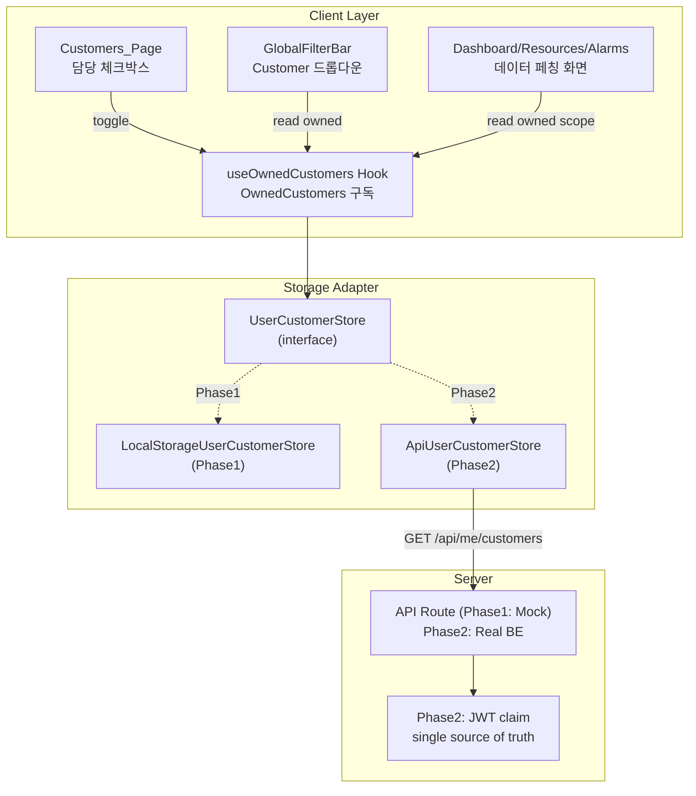
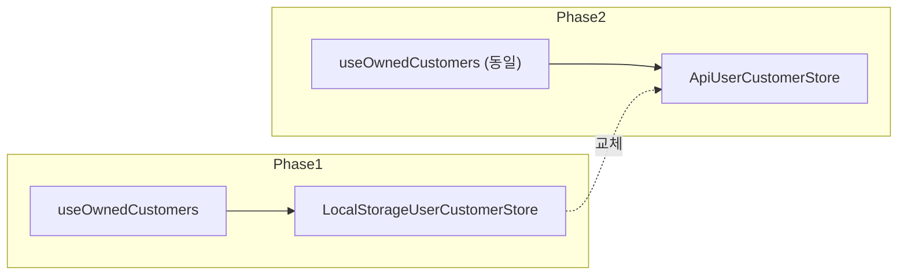

# 설계 문서: 내 담당 고객사 필터 (My Customers Filter)

## 개요

Alarm Manager가 멀티 엔지니어 환경으로 확장되기 위해, 각 사용자가 담당하는 고객사만 UI에 표시되도록 한다. 본 설계는 **Phase1(localStorage UX 필터)**과 **Phase2(DB + BE 검증)**를 단일 인터페이스 위에서 전환 가능하도록 만드는 것이 핵심이다.

핵심 설계 원칙:
- **저장소 추상화**: `UserCustomerStore` 인터페이스 하나로 Phase1/Phase2 호환 — 호출측 UI/훅 수정 불요
- **보안 경계 분리**: Phase1 FE 필터는 UX 편의, Phase2 BE 필터가 실제 접근 제어. 코드 주석/문서에 명시적으로 구분
- **기존 GlobalFilterBar 재사용**: Customer 드롭다운의 옵션 소스만 전체 목록 → OwnedCustomers 교집합으로 변경
- **Customers_Page에 담당 토글 통합**: 별도 Settings 메뉴를 만들지 않고 기존 페이지에 "담당" 컬럼 추가
- **URL 파라미터 방어**: 비담당 customer_id가 URL에 들어오면 조용히 제거

## 아키텍처

### 전체 데이터 흐름



### Phase 전환 시 교체 지점



호출측(`useOwnedCustomers`, `Customers_Page`, `GlobalFilterBar`, 데이터 페이지)은 수정 없이 동작. 팩토리 함수 `createUserCustomerStore()`가 환경에 따라 구현체를 반환한다.

## 컴포넌트 계층

```
frontend/
├── app/
│   ├── customers/page.tsx            (Server Component — 변경 없음)
│   ├── dashboard/page.tsx            (Server Component — owned scope 쿼리 추가)
│   ├── resources/page.tsx            (Server Component — owned scope 쿼리 추가)
│   └── alarms/page.tsx               (Server Component — owned scope 쿼리 추가)
│
├── components/
│   ├── settings/
│   │   └── CustomerSection.tsx       (담당 체크박스 컬럼 추가)
│   ├── layout/
│   │   └── GlobalFilterBar.tsx       (Customer 드롭다운 옵션 필터 적용)
│   └── shared/
│       └── OwnedEmptyState.tsx       (신규: 담당 없음 안내 컴포넌트)
│
├── lib/
│   └── ownedCustomers/
│       ├── store.ts                  (신규: UserCustomerStore 인터페이스 + 팩토리)
│       ├── localStorageStore.ts      (신규: Phase1 구현체)
│       ├── apiStore.ts               (신규 예약: Phase2 stub — 지금은 미구현)
│       └── constants.ts              (신규: key prefix, guest userId 상수)
│
└── hooks/
    └── useOwnedCustomers.ts          (신규: 구독/변경 훅, storage 이벤트 리스너)
```

### 재사용 공통 컴포넌트 vs 도메인 컴포넌트

| 구분 | 컴포넌트 |
|------|---------|
| 공통 (재사용) | `OwnedEmptyState`, 기존 Checkbox, Badge |
| 도메인 | `CustomerSection`의 담당 컬럼, `GlobalFilterBar`의 필터 적용 로직 |

## 핵심 타입

```typescript
// lib/ownedCustomers/store.ts
export interface UserCustomerStore {
  getOwnedCustomerIds(): Promise<string[]>;
  setOwnedCustomerIds(ids: string[]): Promise<void>;
  toggleOwnedCustomerId(id: string): Promise<string[]>;
  subscribe(listener: (ids: string[]) => void): () => void;
}

export function createUserCustomerStore(): UserCustomerStore;
```

```typescript
// hooks/useOwnedCustomers.ts
export interface OwnedCustomersState {
  ownedCustomerIds: string[];
  isLoading: boolean;
  toggleOwned: (customerId: string) => Promise<void>;
  isOwned: (customerId: string) => boolean;
}

export function useOwnedCustomers(): OwnedCustomersState;
```

## 상태 관리 전략

- **전역 상태**: OwnedCustomers는 전역이지만, Context/Redux 없이 **store subscribe 패턴**으로 가볍게 해결한다. `useOwnedCustomers` 훅이 내부적으로 `store.subscribe()` 호출 + `useSyncExternalStore` 사용.
- **서버 상태**: Customer/Account 목록은 기존과 동일하게 Server Component에서 페치.
- **URL 상태**: Global_Filter의 `customer_id`는 그대로 URL searchParams에 저장되지만, 읽는 순간 OwnedCustomers와 교집합 검사 후 UI에 반영.

## 저장소 어댑터 상세

### Phase1: LocalStorageUserCustomerStore

```typescript
const STORAGE_KEY_PREFIX = "userCustomers:";
const GUEST_USER_ID = "guest";

class LocalStorageUserCustomerStore implements UserCustomerStore {
  private key = `${STORAGE_KEY_PREFIX}${GUEST_USER_ID}`;
  // getItem 실패 / JSON parse 실패 → 빈 배열 반환
  // setItem 시 window.dispatchEvent(new StorageEvent(...)) 로 같은 탭에도 전파
  // subscribe는 window.addEventListener("storage", ...) + 내부 이벤트 버스
}
```

주의:
- `localStorage`는 SSR에서 접근 불가 → store 메서드는 모두 async, 구현체 내부에서 `typeof window === "undefined"` 가드
- Server Component에서는 store를 사용하지 않고, Client Component/훅 레벨에서만 사용

### Phase2: ApiUserCustomerStore (예약)

```typescript
class ApiUserCustomerStore implements UserCustomerStore {
  async getOwnedCustomerIds() {
    const res = await fetch("/api/me/customers");
    return (await res.json()).customer_ids;
  }
  // setOwned는 Phase2에서 관리자 전용 — 사용자 self-service 불가할 수 있음
}
```

팩토리 분기:

```typescript
export function createUserCustomerStore(): UserCustomerStore {
  // 환경 변수 또는 feature flag로 분기
  // Phase2에서: if (process.env.NEXT_PUBLIC_AUTH_ENABLED === "true") return new ApiUserCustomerStore();
  return new LocalStorageUserCustomerStore();
}
```

## UI 변경 상세

### CustomerSection — 담당 체크박스

```
┌─────────────────────────────────────────────────────────┐
│ Customer Management                                     │
├──────┬──────────────┬────────┬──────────┬───────────────┤
│ 담당 │ Name         │ ID     │ Accounts │ Actions       │
├──────┼──────────────┼────────┼──────────┼───────────────┤
│ ☑    │ 가상 고객사 A │ cust-a │ 3        │ [Edit][Del]   │
│ ☐    │ 가상 고객사 B │ cust-b │ 2        │ [Edit][Del]   │
└──────┴──────────────┴────────┴──────────┴───────────────┘
```

- 체크 토글 → `store.toggleOwnedCustomerId(cust.customer_id)`
- 구독자(GlobalFilterBar, 데이터 페이지) 자동 갱신

### GlobalFilterBar — Customer 옵션 축소

- 옵션 소스: 기존 `customers.filter(c => ownedCustomerIds.includes(c.customer_id))`
- 빈 상태 처리: 옵션 0개 → placeholder = "담당 고객사 없음", disabled
- URL 검증: mount 시 `searchParams.get("customer_id")`가 OwnedCustomers에 없으면 `router.replace()` 로 파라미터 제거

### 데이터 페이지의 Owned_Scope 전파

각 데이터 페이지의 Client 컴포넌트에서:

```typescript
const { ownedCustomerIds } = useOwnedCustomers();
// 기존: customer_id 쿼리 파라미터만 전달
// 신규: customer_id가 비어있으면 owned_customer_ids=cust-a,cust-b,cust-c 로 전달
const query = buildFilterParams({
  customer_id: urlCustomerId || undefined,
  owned_customer_ids: urlCustomerId ? undefined : ownedCustomerIds,
});
```

Route Handler (Phase1 Mock API):
```
GET /api/resources?owned_customer_ids=cust-a,cust-b
→ 응답: customer_id이 owned에 포함된 리소스만 반환
```

Phase2 BE는 쿼리 파라미터를 신뢰하지 않고 JWT claim을 사용.

## 테스트 전략

### 단위 테스트

- `LocalStorageUserCustomerStore`:
  - 빈 localStorage → 빈 배열 반환
  - 잘못된 JSON 저장 → 빈 배열 반환
  - toggle 후 getOwned 호출 시 반영
  - storage 이벤트 발생 시 subscribe 콜백 호출
- `useOwnedCustomers` 훅:
  - store 초기 로드 후 ownedCustomerIds 반환
  - toggle 후 listener 자동 갱신
  - 마운트/언마운트 시 subscribe/unsubscribe 정확히 동작

### 통합 테스트

- `CustomerSection` 체크박스 토글 → `GlobalFilterBar` 옵션 즉시 갱신
- `GlobalFilterBar` — URL에 비담당 customer_id가 있으면 파라미터 자동 제거
- 데이터 페이지 — OwnedCustomers 비어있으면 `OwnedEmptyState` 렌더

### E2E (Playwright)

- 사용자가 고객사 A, B를 담당 선택 → 리소스 페이지에서 C/D/E 리소스 안 보임
- 담당 해제 → 즉시 옵션/데이터 사라짐

## 보안 주의사항 (Phase1 한정)

아래 내용을 코드 주석과 README에 명시한다:

> **⚠️ Phase1 한계**
> localStorage 기반 "담당 고객사 필터"는 UX 편의 기능이며 보안 경계가 아니다.
> 브라우저 DevTools로 localStorage를 수정하면 비담당 고객사를 볼 수 있다.
> 실질적 접근 제어는 Phase2의 BE JWT claim 기반 필터링에서 처리된다.

## Phase2 전환 체크리스트 (향후)

1. `/api/me/customers` 엔드포인트 구현 (Lambda + DB)
2. `user_customer_assignments` DB 테이블 설계 (user_id, customer_id, assigned_at, assigned_by)
3. 관리자용 할당 UI 추가 (본 스펙 범위 외)
4. `createUserCustomerStore()` 팩토리에서 `ApiUserCustomerStore` 반환하도록 전환
5. 모든 BE API에 JWT claim 검증 미들웨어 장착
6. Audit 로그 기록 (권한 위반 요청 기록)
7. localStorage 키 정리 코드는 작성하지 않음 (브라우저에 남아도 무해 — 새 Store가 무시)
