# Design Document: RDS Aurora Alarm Optimization

## Overview

This feature refines the existing `AuroraRDS` alarm system along four axes: (1) skip `FreeLocalStorage` for Serverless v2, (2) conditional `ReplicaLag` alarms based on writer/reader role and reader presence, (3) percentage-based `FreeableMemory` thresholds with instance memory capacity lookup, and (4) Serverless v2-specific `ACUUtilization` / `ServerlessDatabaseCapacity` alarms. The design extends the existing `common/collectors/rds.py` collector and `common/alarm_manager.py` alarm definitions without introducing new modules.

Key design decisions:
- **Metadata-in-tags pattern**: The collector enriches `resource_tags` with underscore-prefixed internal keys (`_is_serverless_v2`, `_is_cluster_writer`, `_has_readers`, `_total_memory_bytes`, `_max_acu`, `_min_acu`, `_db_instance_class`). These flow through the existing `ResourceInfo` pipeline unchanged — no schema changes needed.
- **Alarm definition filtering in `_get_alarm_defs()`**: Rather than creating separate alarm lists per variant, the `AuroraRDS` branch inspects `resource_tags` to filter the base `_AURORA_RDS_ALARMS` list plus conditionally append Serverless v2 or reader-specific definitions. This keeps the alarm definition DRY.
- **`describe_db_clusters` call for cluster metadata**: The collector calls `describe_db_clusters` once per Aurora instance to get `DBClusterMembers` (for `IsClusterWriter` and reader count) and `ServerlessV2ScalingConfiguration` (for ACU limits). This is cached per cluster to avoid redundant API calls.
- **Instance memory lookup table**: A static dict maps common `DBInstanceClass` values to memory bytes. Unknown classes fall back to absolute GB thresholds with a warning log.
- **Percentage threshold precedence**: `Threshold_FreeMemoryPct` tag takes precedence over `Threshold_FreeMemoryGB`. The percentage is resolved to absolute bytes at alarm creation time using `_total_memory_bytes`.

## Architecture

```mermaid
flowchart TD
    subgraph Collector["common/collectors/rds.py"]
        A[describe_db_instances paginator] --> B{Engine contains 'aurora'?}
        B -- Yes --> C["ResourceInfo(type='AuroraRDS')"]
        B -- No --> D["ResourceInfo(type='RDS')"]
        C --> E[describe_db_clusters]
        E --> F["Enrich tags: _db_instance_class, _is_cluster_writer,\n_is_serverless_v2, _has_readers, _max_acu, _min_acu,\n_total_memory_bytes"]
    end

    subgraph AlarmManager["common/alarm_manager.py"]
        G["_get_alarm_defs('AuroraRDS', resource_tags)"] --> H{Inspect resource_tags}
        H --> I["Base: CPU, FreeMemoryGB, Connections"]
        H -- "_is_serverless_v2=false" --> J["+FreeLocalStorageGB"]
        H -- "_is_serverless_v2=true" --> K["+ACUUtilization, ServerlessDatabaseCapacity"]
        H -- "_is_cluster_writer=true & _has_readers=true" --> L["+ReplicaLag"]
        H -- "_is_cluster_writer=false" --> M["+ReaderReplicaLag"]
        I --> N["Filtered alarm list"]
        J --> N
        K --> N
        L --> N
        M --> N
    end

    subgraph MemoryThreshold["FreeMemoryGB Threshold Resolution"]
        O["Threshold_FreeMemoryPct tag?"] --> P{Present & valid?}
        P -- Yes --> Q["bytes = (pct/100) * _total_memory_bytes"]
        P -- No --> R["Fallback: Threshold_FreeMemoryGB or HARDCODED_DEFAULTS"]
    end

    subgraph MetricCollection["get_aurora_metrics()"]
        S{resource_tags} --> T["Always: CPU, FreeMemoryGB, Connections"]
        S -- "_is_serverless_v2=false" --> U["+FreeLocalStorageGB"]
        S -- "_is_serverless_v2=true" --> V["+ACUUtilization, ServerlessDatabaseCapacity"]
        S -- "_is_cluster_writer=true & _has_readers=true" --> W["+ReplicaLag (AuroraReplicaLagMaximum)"]
        S -- "_is_cluster_writer=false" --> X["+ReaderReplicaLag (AuroraReplicaLag)"]
    end
```



## Components and Interfaces

### 1. RDS Collector Enrichment (`common/collectors/rds.py`)

**Modified function: `collect_monitored_resources()`**

After classifying an instance as `AuroraRDS`, the collector enriches `resource_tags` with metadata from `describe_db_instances` and `describe_db_clusters`:

1. `_db_instance_class` — raw `DBInstanceClass` string (e.g., `"db.r6g.large"`, `"db.serverless"`)
2. `_is_serverless_v2` — `"true"` if `DBInstanceClass == "db.serverless"`, else `"false"`
3. `_is_cluster_writer` — `"true"` / `"false"` from `DBClusterMembers[].IsClusterWriter`
4. `_has_readers` — `"true"` if cluster has >1 member, `"false"` if writer-only
5. `_max_acu` / `_min_acu` — from `ServerlessV2ScalingConfiguration` (Serverless v2 only)
6. `_total_memory_bytes` — from instance class lookup table or ACU calculation
7. `_db_cluster_id` — the `DBClusterIdentifier` for cluster API calls

For regular RDS instances, none of these internal tags are added (Requirement 1.5).

**New helper: `_enrich_aurora_metadata(db_instance, tags)`**

Calls `describe_db_clusters(DBClusterIdentifier=...)` once per cluster (cached via a local dict keyed by cluster ID within the collection loop) and populates the internal tags.

**New helper: `_get_cluster_info(cluster_id) -> dict`**

Wraps `describe_db_clusters` with error handling. Returns the cluster dict or `None` on failure.

**New constant: `_INSTANCE_CLASS_MEMORY_MAP`**

Static dict mapping common DB instance classes to memory in bytes:

```python
_INSTANCE_CLASS_MEMORY_MAP: dict[str, int] = {
    "db.t3.micro": 1 * _BYTES_PER_GB,
    "db.t3.small": 2 * _BYTES_PER_GB,
    "db.t3.medium": 4 * _BYTES_PER_GB,
    "db.t3.large": 8 * _BYTES_PER_GB,
    "db.t4g.micro": 1 * _BYTES_PER_GB,
    "db.t4g.small": 2 * _BYTES_PER_GB,
    "db.t4g.medium": 4 * _BYTES_PER_GB,
    "db.t4g.large": 8 * _BYTES_PER_GB,
    "db.r6g.large": 16 * _BYTES_PER_GB,
    "db.r6g.xlarge": 32 * _BYTES_PER_GB,
    "db.r6g.2xlarge": 64 * _BYTES_PER_GB,
    "db.r6g.4xlarge": 128 * _BYTES_PER_GB,
    "db.r6g.8xlarge": 256 * _BYTES_PER_GB,
    "db.r6g.12xlarge": 384 * _BYTES_PER_GB,
    "db.r6g.16xlarge": 512 * _BYTES_PER_GB,
    "db.r7g.large": 16 * _BYTES_PER_GB,
    "db.r7g.xlarge": 32 * _BYTES_PER_GB,
    "db.r7g.2xlarge": 64 * _BYTES_PER_GB,
    "db.r7g.4xlarge": 128 * _BYTES_PER_GB,
    "db.r7g.8xlarge": 256 * _BYTES_PER_GB,
    "db.r7g.12xlarge": 384 * _BYTES_PER_GB,
    "db.r7g.16xlarge": 512 * _BYTES_PER_GB,
    # Add more as needed
}
```

For Serverless v2: `total_memory_bytes = max_acu * 2 * 1073741824` (2 GiB per ACU).

**Modified function: `get_aurora_metrics()`**

Conditionally queries metrics based on `resource_tags`:
- Always: `CPUUtilization`, `FreeableMemory`, `DatabaseConnections`
- If `_is_serverless_v2 != "true"`: `FreeLocalStorage`
- If `_is_serverless_v2 == "true"`: `ACUUtilization`, `ServerlessDatabaseCapacity`
- If `_is_cluster_writer == "true"` and `_has_readers == "true"`: `AuroraReplicaLagMaximum` → `ReplicaLag`
- If `_is_cluster_writer == "false"`: `AuroraReplicaLag` → `ReaderReplicaLag`
- If `_is_cluster_writer == "true"` and `_has_readers == "false"`: skip all replica lag metrics

### 2. Alarm Manager Extension (`common/alarm_manager.py`)

**Modified: `_get_alarm_defs(resource_type, resource_tags)`**

The `AuroraRDS` branch changes from returning the static `_AURORA_RDS_ALARMS` to dynamically building the alarm list:

```python
elif resource_type == "AuroraRDS":
    return _get_aurora_alarm_defs(resource_tags or {})
```

**New helper: `_get_aurora_alarm_defs(resource_tags) -> list[dict]`**

Builds the alarm list from a base set plus conditional additions:

1. Base alarms (always): `CPU`, `FreeMemoryGB`, `Connections`
2. If `_is_serverless_v2 != "true"`: add `FreeLocalStorageGB`
3. If `_is_serverless_v2 == "true"`: add `ACUUtilization`, `ServerlessDatabaseCapacity`
4. If `_is_cluster_writer == "true"` and `_has_readers == "true"`: add `ReplicaLag`
5. If `_is_cluster_writer == "false"`: add `ReaderReplicaLag`
6. If `_is_cluster_writer == "true"` and `_has_readers == "false"`: no lag alarm

Each alarm definition follows the existing dict schema. New definitions:

```python
_AURORA_READER_REPLICA_LAG = {
    "metric": "ReaderReplicaLag",
    "namespace": "AWS/RDS",
    "metric_name": "AuroraReplicaLag",
    "dimension_key": "DBInstanceIdentifier",
    "stat": "Maximum",
    "comparison": "GreaterThanThreshold",
    "period": 300,
    "evaluation_periods": 1,
}

_AURORA_ACU_UTILIZATION = {
    "metric": "ACUUtilization",
    "namespace": "AWS/RDS",
    "metric_name": "ACUUtilization",
    "dimension_key": "DBInstanceIdentifier",
    "stat": "Average",
    "comparison": "GreaterThanThreshold",
    "period": 300,
    "evaluation_periods": 1,
}

_AURORA_SERVERLESS_CAPACITY = {
    "metric": "ServerlessDatabaseCapacity",
    "namespace": "AWS/RDS",
    "metric_name": "ServerlessDatabaseCapacity",
    "dimension_key": "DBInstanceIdentifier",
    "stat": "Average",
    "comparison": "GreaterThanThreshold",
    "period": 300,
    "evaluation_periods": 1,
}
```

**Modified: `_METRIC_DISPLAY`** — add entries:
- `"ReaderReplicaLag": ("AuroraReplicaLag", ">", "μs")`
- `"ACUUtilization": ("ACUUtilization", ">", "%")`
- `"ServerlessDatabaseCapacity": ("ServerlessDatabaseCapacity", ">", "ACU")`

**Modified: `_HARDCODED_METRIC_KEYS["AuroraRDS"]`** — expand to include all possible keys: `{"CPU", "FreeMemoryGB", "Connections", "FreeLocalStorageGB", "ReplicaLag", "ReaderReplicaLag", "ACUUtilization", "ServerlessDatabaseCapacity"}`

**Modified: `_metric_name_to_key()`** — add mappings:
- `"AuroraReplicaLag": "ReaderReplicaLag"`
- `"ACUUtilization": "ACUUtilization"`
- `"ServerlessDatabaseCapacity": "ServerlessDatabaseCapacity"`

**New: Percentage-based FreeMemoryGB threshold resolution**

In `_create_standard_alarm()` and `_recreate_standard_alarm()`, when the metric is `FreeMemoryGB` and the resource type is `AuroraRDS` or `RDS`:

1. Check for `Threshold_FreeMemoryPct` tag
2. If present and valid (0 < pct < 100) and `_total_memory_bytes` is available:
   - `threshold_bytes = (pct / 100) * total_memory_bytes`
   - Use this as the CW threshold directly (skip `transform_threshold`)
3. If `Threshold_FreeMemoryPct` is invalid: log warning, fall back to GB threshold
4. If `_total_memory_bytes` is missing: log warning, fall back to GB threshold

This logic is encapsulated in a new helper: `_resolve_free_memory_threshold(resource_tags) -> tuple[float, float]` returning `(display_threshold_gb, cw_threshold_bytes)`.

**ServerlessDatabaseCapacity default threshold**: The default is resolved dynamically from `_max_acu` tag at alarm creation time. If `_max_acu` is not available, falls back to `HARDCODED_DEFAULTS["ServerlessDatabaseCapacity"]`.

### 3. Common Constants (`common/__init__.py`)

Add to `HARDCODED_DEFAULTS`:
- `"ReaderReplicaLag": 2000000.0` (same as `ReplicaLag`)
- `"ACUUtilization": 80.0` (percent)
- `"ServerlessDatabaseCapacity": 128.0` (ACU, conservative default)
- `"FreeMemoryPct": 20.0` (percent)

### 4. Daily Monitor Integration (`daily_monitor/lambda_handler.py`)

**Modified: `_process_resource()`** — the existing `AuroraRDS` branch already calls `get_aurora_metrics()`. The metric collection changes are internal to the collector. No lambda handler changes needed for metric routing.

The threshold comparison in `_process_resource()` needs to handle `FreeMemoryPct` resolution for the daily metric check (not just alarm creation). This is handled by `get_threshold()` which already reads tags.

### 5. Remediation Handler Delete Event Fix (`remediation_handler/lambda_handler.py`) — KI-008

**Modified: `_handle_delete()`**

When `_resolve_rds_aurora_type()` fails for a `DeleteDBInstance` event (instance already deleted → `ClientError` → `"RDS"` fallback), the handler must search for alarms across all possible RDS-family prefixes.

Current behavior: `delete_alarms_for_resource(resource_id, "RDS")` → only searches `[RDS]` prefix.

New behavior: When the original `_API_MAP` resource type is `"RDS"` and `_resolve_rds_aurora_type()` returned a fallback (i.e., the API call failed), call `delete_alarms_for_resource(resource_id, "")` with empty `resource_type`. This triggers `_find_alarms_for_resource()`'s fallback path that searches all prefixes including `[AuroraRDS]`.

Implementation: `_resolve_rds_aurora_type()` returns a tuple `(resource_type, is_fallback)` instead of just a string. When `is_fallback=True` and `event_category == "DELETE"`, `_handle_delete()` uses `resource_type=""` for alarm deletion.

### 6. Steering & Documentation Updates

**`alarm-rules.md`** — add new metric rows to the AuroraRDS table:
- `ReaderReplicaLag`, `ACUUtilization`, `ServerlessDatabaseCapacity`, `FreeMemoryPct`

**`KNOWN-ISSUES.md`** — update KI-006, KI-007 to reference active engine mitigation, update KI-008 to reference the fix.

## Data Models

### Aurora Instance Variant Classification

| Variant | `_is_serverless_v2` | `_is_cluster_writer` | `_has_readers` | Alarm Set |
|---------|:---:|:---:|:---:|-----------|
| Provisioned Writer (w/ readers) | `"false"` | `"true"` | `"true"` | CPU, FreeMemoryGB, Connections, FreeLocalStorageGB, ReplicaLag |
| Provisioned Writer (no readers) | `"false"` | `"true"` | `"false"` | CPU, FreeMemoryGB, Connections, FreeLocalStorageGB |
| Provisioned Reader | `"false"` | `"false"` | N/A | CPU, FreeMemoryGB, Connections, FreeLocalStorageGB, ReaderReplicaLag |
| Serverless v2 Writer (w/ readers) | `"true"` | `"true"` | `"true"` | CPU, FreeMemoryGB, Connections, ACUUtilization, ServerlessDatabaseCapacity, ReplicaLag |
| Serverless v2 Writer (no readers) | `"true"` | `"true"` | `"false"` | CPU, FreeMemoryGB, Connections, ACUUtilization, ServerlessDatabaseCapacity |
| Serverless v2 Reader | `"true"` | `"false"` | N/A | CPU, FreeMemoryGB, Connections, ACUUtilization, ServerlessDatabaseCapacity, ReaderReplicaLag |

### Internal Tag Schema (underscore-prefixed, not persisted to AWS)

| Tag Key | Type | Source | Description |
|---------|------|--------|-------------|
| `_db_instance_class` | `str` | `describe_db_instances` | Raw instance class (e.g., `"db.r6g.large"`) |
| `_is_serverless_v2` | `"true"` \| `"false"` | Derived from `_db_instance_class` | Whether instance is Serverless v2 |
| `_is_cluster_writer` | `"true"` \| `"false"` | `describe_db_clusters` `DBClusterMembers` | Writer/reader role |
| `_has_readers` | `"true"` \| `"false"` | `describe_db_clusters` `DBClusterMembers` count | Whether cluster has reader instances |
| `_max_acu` | `str` (numeric) | `ServerlessV2ScalingConfiguration.MaxCapacity` | Max ACU for Serverless v2 |
| `_min_acu` | `str` (numeric) | `ServerlessV2ScalingConfiguration.MinCapacity` | Min ACU for Serverless v2 |
| `_total_memory_bytes` | `str` (numeric) | Lookup table or ACU calculation | Total instance memory in bytes |

### HARDCODED_DEFAULTS Additions

| Key | Value | Unit | Description |
|-----|-------|------|-------------|
| `ReaderReplicaLag` | `2000000.0` | μs | Aurora reader replica lag (2 seconds) |
| `ACUUtilization` | `80.0` | % | Serverless v2 ACU utilization |
| `ServerlessDatabaseCapacity` | `128.0` | ACU | Serverless v2 capacity (conservative default) |
| `FreeMemoryPct` | `20.0` | % | Percentage-based free memory threshold |


## Correctness Properties

*A property is a characteristic or behavior that should hold true across all valid executions of a system — essentially, a formal statement about what the system should do. Properties serve as the bridge between human-readable specifications and machine-verifiable correctness guarantees.*

### Property 1: Aurora Collector Enrichment Completeness

*For any* Aurora DB instance collected by the RDS collector, the resulting `resource_tags` SHALL contain:
- `_db_instance_class` equal to the instance's `DBInstanceClass`
- `_is_serverless_v2` equal to `"true"` if and only if `DBInstanceClass == "db.serverless"`, otherwise `"false"`
- `_is_cluster_writer` equal to `"true"` or `"false"` matching the `IsClusterWriter` field from `DBClusterMembers`
- `_has_readers` equal to `"true"` if the cluster has more than one member, `"false"` otherwise
- For Serverless v2 instances: `_max_acu` and `_min_acu` matching the cluster's `ServerlessV2ScalingConfiguration`

**Validates: Requirements 1.1, 1.2, 1.3, 1.4, 4.2, 4.3, 8.1, 8.2**

### Property 2: Non-Aurora RDS Tag Exclusion

*For any* regular RDS instance (non-Aurora) collected by the RDS collector, the resulting `resource_tags` SHALL NOT contain `_is_cluster_writer`, `_is_serverless_v2`, or `_has_readers` keys.

**Validates: Requirements 1.5**

### Property 3: Alarm Variant Routing

*For any* combination of AuroraRDS `resource_tags` representing one of the six instance variants (Provisioned Writer w/ readers, Provisioned Writer w/o readers, Provisioned Reader, Serverless v2 Writer w/ readers, Serverless v2 Writer w/o readers, Serverless v2 Reader), `_get_alarm_defs("AuroraRDS", resource_tags)` SHALL return exactly the alarm metric keys specified in the Variant Classification table:
- Provisioned Writer (w/ readers): `{CPU, FreeMemoryGB, Connections, FreeLocalStorageGB, ReplicaLag}`
- Provisioned Writer (no readers): `{CPU, FreeMemoryGB, Connections, FreeLocalStorageGB}`
- Provisioned Reader: `{CPU, FreeMemoryGB, Connections, FreeLocalStorageGB, ReaderReplicaLag}`
- Serverless v2 Writer (w/ readers): `{CPU, FreeMemoryGB, Connections, ACUUtilization, ServerlessDatabaseCapacity, ReplicaLag}`
- Serverless v2 Writer (no readers): `{CPU, FreeMemoryGB, Connections, ACUUtilization, ServerlessDatabaseCapacity}`
- Serverless v2 Reader: `{CPU, FreeMemoryGB, Connections, ACUUtilization, ServerlessDatabaseCapacity, ReaderReplicaLag}`

**Validates: Requirements 2.1, 2.2, 3.1, 3.2, 4.4, 7.1, 7.2, 7.3, 11.1, 11.2**

### Property 4: Metric Collection Matches Alarm Variant

*For any* Aurora instance variant, the set of metric keys returned by `get_aurora_metrics()` SHALL be a subset of the alarm metric keys returned by `_get_alarm_defs()` for the same variant. Specifically:
- Serverless v2 instances SHALL NOT query `FreeLocalStorage`
- Non-Serverless v2 instances SHALL NOT query `ACUUtilization` or `ServerlessDatabaseCapacity`
- Writer instances with `_has_readers="false"` SHALL NOT query any replica lag metric
- Reader instances SHALL query `AuroraReplicaLag` (not `AuroraReplicaLagMaximum`)

**Validates: Requirements 9.1, 9.2, 9.3, 10.1, 10.2, 10.3**

### Property 5: Percentage-Based Memory Threshold Calculation

*For any* valid percentage value (0 < pct < 100) and any positive `_total_memory_bytes` value, the resolved FreeableMemory alarm threshold in bytes SHALL equal `(pct / 100) * total_memory_bytes`. When both `Threshold_FreeMemoryPct` and `Threshold_FreeMemoryGB` tags are present, the percentage-based threshold SHALL take precedence.

**Validates: Requirements 5.1, 5.2, 5.3**

### Property 6: Instance Memory Capacity Lookup

*For any* known DB instance class in the `_INSTANCE_CLASS_MEMORY_MAP`, the lookup SHALL return the documented memory capacity in bytes. *For any* Serverless v2 instance with `max_acu` > 0, the calculated memory SHALL equal `max_acu * 2 * 1073741824`.

**Validates: Requirements 6.1, 6.2**

### Property 7: Delete Event Alarm Cleanup Across Prefixes (KI-008)

*For any* `DeleteDBInstance` CloudTrail event where `_resolve_rds_aurora_type()` fails (instance already deleted), the remediation handler SHALL search for alarms across all RDS-family prefixes (`[RDS]`, `[AuroraRDS]`) by using empty `resource_type` in `delete_alarms_for_resource()`, ensuring no orphan alarms remain regardless of the original resource type prefix.

**Validates: Requirements 13.1, 13.2, 13.3**

## Error Handling

| Scenario | Handling | Log Level |
|----------|----------|-----------|
| `describe_db_clusters` API failure during enrichment | Log error, omit cluster-derived tags (`_is_cluster_writer`, `_has_readers`, `_max_acu`, `_min_acu`). Alarm manager falls back to base alarm set (CPU, FreeMemoryGB, Connections). | `error` |
| Unknown `DBInstanceClass` not in memory map | Log warning, omit `_total_memory_bytes`. Percentage threshold falls back to absolute GB. | `warning` |
| `Threshold_FreeMemoryPct` tag value invalid (non-numeric, ≤0, ≥100) | Log warning, fall back to `Threshold_FreeMemoryGB` or `HARDCODED_DEFAULTS["FreeMemoryGB"]` | `warning` |
| `_total_memory_bytes` missing when `Threshold_FreeMemoryPct` is set | Log warning, fall back to absolute GB threshold | `warning` |
| `ServerlessV2ScalingConfiguration` missing from cluster | Log warning, omit `_max_acu`/`_min_acu`. `ServerlessDatabaseCapacity` alarm uses `HARDCODED_DEFAULTS` fallback. | `warning` |
| Individual Aurora metric has no CloudWatch data | Skip metric, continue with others | `info` |
| All Aurora metrics have no data | Return `None` from `get_aurora_metrics()` | `info` |
| `put_metric_alarm` failure for any alarm | Log error, skip that alarm, continue with remaining | `error` |
| FreeLocalStorageGB alarm skipped for Serverless v2 | Log skip reason with instance identifier | `info` |
| ReplicaLag alarm skipped for writer-only cluster | Log skip reason with instance identifier | `info` |
| `_resolve_rds_aurora_type()` failure on delete event (KI-008) | Use empty `resource_type` for alarm deletion to search all prefixes. Log warning. | `warning` |

Error handling follows existing patterns (governance §4): catch `ClientError` only at AWS API boundaries, use `logger.error()` with `%s` formatting.

## Testing Strategy

### Unit Tests

Unit tests use `moto` for AWS service mocking and verify specific examples and edge cases:

- **Collector enrichment**: Create mock Aurora instances (provisioned writer, provisioned reader, serverless v2) via moto `describe_db_instances` / `describe_db_clusters`. Verify all internal tags are correctly populated.
- **Non-Aurora exclusion**: Create mock regular RDS instances. Verify no Aurora-specific internal tags are added.
- **Alarm variant routing**: Call `_get_alarm_defs("AuroraRDS", tags)` with each of the 6 variant tag combinations. Verify exact alarm metric key sets.
- **Metric collection**: Mock CloudWatch with known datapoints. Call `get_aurora_metrics()` with each variant's tags. Verify correct metrics are queried and returned.
- **Percentage threshold**: Set `Threshold_FreeMemoryPct=20` and `_total_memory_bytes=17179869184` (16 GiB). Verify alarm threshold = 3435973836.8 bytes.
- **Percentage precedence**: Set both `Threshold_FreeMemoryPct=20` and `Threshold_FreeMemoryGB=4`. Verify percentage is used.
- **Invalid percentage fallback**: Set `Threshold_FreeMemoryPct=150` (invalid). Verify fallback to GB threshold.
- **Missing memory fallback**: Set `Threshold_FreeMemoryPct=20` without `_total_memory_bytes`. Verify fallback to GB threshold.
- **Memory lookup**: Verify `_INSTANCE_CLASS_MEMORY_MAP` entries for known classes. Verify Serverless v2 ACU calculation.
- **Unknown instance class**: Verify warning log and `_total_memory_bytes` omission.
- **HARDCODED_DEFAULTS**: Verify `ReaderReplicaLag`, `ACUUtilization`, `ServerlessDatabaseCapacity`, `FreeMemoryPct` entries.
- **_METRIC_DISPLAY**: Verify new entries for `ReaderReplicaLag`, `ACUUtilization`, `ServerlessDatabaseCapacity`.
- **_metric_name_to_key()**: Verify `AuroraReplicaLag` → `ReaderReplicaLag`, `ACUUtilization` → `ACUUtilization`, `ServerlessDatabaseCapacity` → `ServerlessDatabaseCapacity`.
- **describe_db_clusters failure**: Mock API error. Verify graceful degradation.

### Property-Based Tests (`tests/test_pbt_aurora_alarm_optimization.py`)

Property-based tests use `hypothesis` (minimum 100 iterations per test) to verify universal properties. Each test is tagged with: **Feature: rds-aurora-alarm-optimization, Property {N}: {title}**

- **Property 1 test**: Generate random Aurora instance metadata (random instance classes including `"db.serverless"`, random writer/reader booleans, random cluster member counts, random ACU values). Run the enrichment logic. Verify all internal tags match the input metadata.

- **Property 2 test**: Generate random non-Aurora engine strings (excluding any containing `"aurora"`). Run the collector. Verify no Aurora-specific internal tags are present.

- **Property 3 test**: Generate random `resource_tags` dicts representing all 6 Aurora variants (random combinations of `_is_serverless_v2`, `_is_cluster_writer`, `_has_readers`). Call `_get_alarm_defs("AuroraRDS", tags)`. Verify the returned metric key set exactly matches the expected set from the variant classification table.

- **Property 4 test**: Generate random Aurora variant tags. Call both `get_aurora_metrics()` (with mocked CloudWatch returning data for all metrics) and `_get_alarm_defs()`. Verify the metric keys from `get_aurora_metrics()` are a subset of the alarm metric keys.

- **Property 5 test**: Generate random valid percentages (0 < pct < 100) and random positive `_total_memory_bytes` values. Verify the resolved threshold equals `(pct / 100) * total_memory_bytes`. Also generate cases with both `Threshold_FreeMemoryPct` and `Threshold_FreeMemoryGB` present and verify percentage takes precedence.

- **Property 6 test**: Generate random instance classes from `_INSTANCE_CLASS_MEMORY_MAP` keys. Verify lookup returns the correct value. Generate random positive `max_acu` floats. Verify Serverless v2 memory calculation equals `max_acu * 2 * 1073741824`.

### Test Configuration

- PBT library: `hypothesis` (>=6.100)
- Minimum iterations: 100 per property (`@settings(max_examples=100)`)
- Test file naming: `tests/test_pbt_aurora_alarm_optimization.py` (governance §8)
- AWS mocking: `moto` decorators for integration-level property tests
- Each property test references its design document property number in a comment tag
- Each correctness property is implemented by a single property-based test
