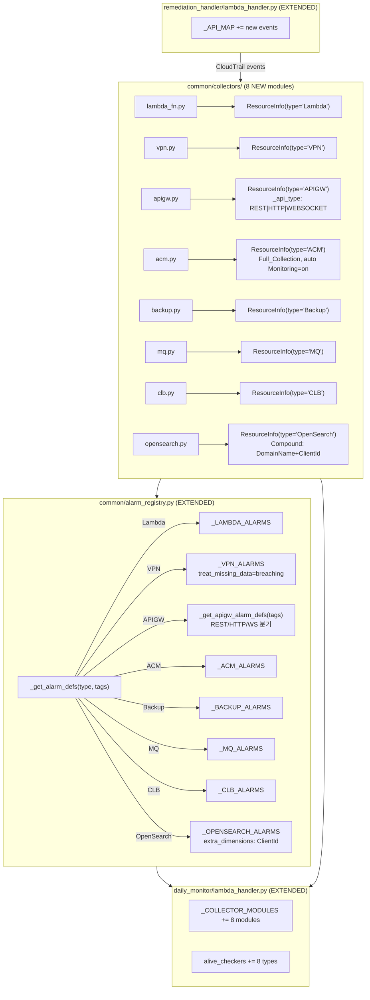

# Design Document: Remaining Resource Monitoring

## Overview

AWS Monitoring Engine에 미구현 8개 리소스 타입(Lambda, VPN, API Gateway, ACM, AWS Backup, Amazon MQ, CLB, OpenSearch)을 추가한다. 기존 ElastiCache/NAT/DocDB Collector 패턴을 따르되, 각 리소스의 고유 특성을 반영한다.

주요 설계 결정:

- **8개 Collector 모듈**: 각 리소스 타입별 독립 모듈로 `common/collectors/` 하위에 생성한다. 파일명은 `lambda_fn.py`(Python 예약어 회피), `vpn.py`, `apigw.py`, `acm.py`, `backup.py`, `mq.py`, `clb.py`, `opensearch.py`.
- **API Gateway 단일 모듈 + 내부 태그 분기**: ELB Collector의 ALB/NLB 패턴을 준용하여 `apigw.py` 단일 모듈에서 REST/HTTP/WebSocket 3가지 타입을 수집한다. `_api_type` Internal_Tag로 알람 정의를 분기한다.
- **ACM Full_Collection**: 유일하게 `Monitoring=on` 태그 필터 없이 전체 ISSUED 인증서를 수집한다. 파이프라인 호환성을 위해 `Monitoring=on`을 ResourceInfo tags에 자동 삽입한다.
- **VPN Miss_Data_Alarm**: `treat_missing_data` 필드를 알람 정의에 추가하여 `breaching` 설정을 지원한다. 기존 알람 정의 스키마에 optional 필드로 확장.
- **OpenSearch Compound_Dimension**: `DomainName` + `ClientId` 복합 디멘션을 `extra_dimensions` 필드로 처리한다. `_build_dimensions()`의 기존 `extra_dimensions` 지원을 활용.
- **alarm_registry.py 확장**: 8개 `_*_ALARMS` 리스트, `_get_alarm_defs()` 분기, `_HARDCODED_METRIC_KEYS`, `_NAMESPACE_MAP`, `_DIMENSION_KEY_MAP`, `_METRIC_DISPLAY`, `_metric_name_to_key()` 매핑 모두 확장.
- **APIGW 알람 정의 동적 빌드**: `_get_apigw_alarm_defs(resource_tags)` 함수로 `_api_type`에 따라 REST/HTTP/WebSocket 알람 정의를 반환한다 (Aurora의 `_get_aurora_alarm_defs()` 패턴).

## Architecture



## Components and Interfaces

### 1. Lambda Collector (`common/collectors/lambda_fn.py`) — NEW

파일명을 `lambda_fn.py`로 지정하여 Python 예약어 `lambda`와의 충돌을 회피한다.

**`collect_monitored_resources()`**
- `lambda` 클라이언트의 `list_functions()` paginator로 전체 함수 목록 조회.
- `list_tags(Resource=function_arn)`으로 태그 조회.
- `Monitoring=on` 태그 필터링 후 `ResourceInfo(type="Lambda", id=function_name)` 반환.

**`get_metrics(function_name, resource_tags=None)`**
- 네임스페이스 `AWS/Lambda`, 디멘션 `FunctionName`.
- `Duration` (Average, ms) → `"Duration"`
- `Errors` (Sum) → `"Errors"`

### 2. VPN Collector (`common/collectors/vpn.py`) — NEW

**`collect_monitored_resources()`**
- `ec2` 클라이언트의 `describe_vpn_connections()` paginator.
- `Filter=[{"Name": "tag:Monitoring", "Values": ["on"]}]` 사용.
- `State`가 `"deleted"` 또는 `"deleting"`이면 skip.
- `ResourceInfo(type="VPN", id=vpn_connection_id)` 반환.

**`get_metrics(vpn_id, resource_tags=None)`**
- 네임스페이스 `AWS/VPN`, 디멘션 `VpnId`.
- `TunnelState` (Maximum) → `"TunnelState"`

### 3. API Gateway Collector (`common/collectors/apigw.py`) — NEW

ELB Collector의 ALB/NLB 패턴을 준용하여 단일 모듈에서 3가지 API 타입을 수집한다.

**`collect_monitored_resources()`**
- REST API: `apigateway` 클라이언트 `get_rest_apis()` paginator → `get_tags(resourceArn)` → `Monitoring=on` 필터 → `_api_type="REST"` Internal_Tag 설정, `id=api_name`.
- HTTP/WebSocket API: `apigatewayv2` 클라이언트 `get_apis()` paginator → `Tags` 필드에서 `Monitoring=on` 필터 → `ProtocolType`에 따라 `_api_type="HTTP"` 또는 `"WEBSOCKET"` 설정, `id=api_id`.

**`get_metrics(resource_id, resource_tags=None)`**
- `_api_type`에 따라 디멘션 키와 메트릭 이름 분기:
  - REST: 디멘션 `ApiName`, 메트릭 `Latency`, `4XXError`, `5XXError`
  - HTTP: 디멘션 `ApiId`, 메트릭 `Latency`, `4xx`, `5xx`
  - WebSocket: 디멘션 `ApiId`, 메트릭 `ConnectCount`, `MessageCount`, `IntegrationError`, `ExecutionError`
- 네임스페이스는 모두 `AWS/ApiGateway`.

### 4. ACM Collector (`common/collectors/acm.py`) — NEW

**`collect_monitored_resources()`**
- `acm` 클라이언트의 `list_certificates(CertificateStatuses=["ISSUED"])` paginator.
- 태그 필터 없이 전체 ISSUED 인증서 수집 (Full_Collection).
- `ResourceInfo(type="ACM", id=certificate_arn)` 반환.
- `tags`에 `Monitoring=on`을 자동 삽입하여 하위 파이프라인(alarm_manager) 호환성 유지.

**`get_metrics(certificate_arn, resource_tags=None)`**
- 네임스페이스 `AWS/CertificateManager`, 디멘션 `CertificateArn`.
- `DaysToExpiry` (Minimum) → `"DaysToExpiry"`

### 5. Backup Collector (`common/collectors/backup.py`) — NEW

**`collect_monitored_resources()`**
- `backup` 클라이언트의 `list_backup_vaults()` paginator.
- `list_tags(ResourceArn=vault_arn)`으로 태그 조회.
- `Monitoring=on` 필터 후 `ResourceInfo(type="Backup", id=vault_name)` 반환.

**`get_metrics(vault_name, resource_tags=None)`**
- 네임스페이스 `AWS/Backup`, 디멘션 `BackupVaultName`.
- `NumberOfBackupJobsFailed` (Sum) → `"BackupJobsFailed"`
- `NumberOfBackupJobsAborted` (Sum) → `"BackupJobsAborted"`

### 6. MQ Collector (`common/collectors/mq.py`) — NEW

**`collect_monitored_resources()`**
- `mq` 클라이언트의 `list_brokers()` paginator.
- `describe_broker(BrokerId=broker_id)`로 태그 조회.
- `Monitoring=on` 필터 후 `ResourceInfo(type="MQ", id=broker_name)` 반환.

**`get_metrics(broker_name, resource_tags=None)`**
- 네임스페이스 `AWS/AmazonMQ`, 디멘션 `Broker`.
- `CpuUtilization` (Average) → `"MqCPU"`
- `HeapUsage` (Average) → `"HeapUsage"`
- `JobSchedulerStorePercentUsage` (Average) → `"JobSchedulerStoreUsage"`
- `StorePercentUsage` (Average) → `"StoreUsage"`

### 7. CLB Collector (`common/collectors/clb.py`) — NEW

**`collect_monitored_resources()`**
- `elb` (Classic) 클라이언트의 `describe_load_balancers()` paginator.
- `describe_tags(LoadBalancerNames=[name])`으로 태그 조회.
- `Monitoring=on` 필터 후 `ResourceInfo(type="CLB", id=lb_name)` 반환.

**`get_metrics(lb_name, resource_tags=None)`**
- 네임스페이스 `AWS/ELB`, 디멘션 `LoadBalancerName`.
- `UnHealthyHostCount` (Average) → `"CLBUnHealthyHost"`
- `HTTPCode_ELB_5XX` (Sum) → `"CLB5XX"`
- `HTTPCode_ELB_4XX` (Sum) → `"CLB4XX"`
- `HTTPCode_Backend_5XX` (Sum) → `"CLBBackend5XX"`
- `HTTPCode_Backend_4XX` (Sum) → `"CLBBackend4XX"`
- `SurgeQueueLength` (Maximum) → `"SurgeQueueLength"`
- `SpilloverCount` (Sum) → `"SpilloverCount"`

### 8. OpenSearch Collector (`common/collectors/opensearch.py`) — NEW

**`collect_monitored_resources()`**
- `opensearch` 클라이언트의 `list_domain_names()` → `describe_domains(DomainNames=[...])`.
- `list_tags(ARN=domain_arn)`으로 태그 조회.
- `Monitoring=on` 필터 후 `ResourceInfo(type="OpenSearch", id=domain_name)` 반환.
- `tags`에 `_client_id` Internal_Tag로 AWS 계정 ID를 저장 (Compound_Dimension용).

**`get_metrics(domain_name, resource_tags=None)`**
- 네임스페이스 `AWS/ES`, Compound_Dimension: `DomainName` + `ClientId`.
- `ClientId`는 `resource_tags["_client_id"]`에서 조회 (STS `get_caller_identity` 또는 ARN 파싱).
- 8개 메트릭:
  - `ClusterStatus.red` (Maximum) → `"ClusterStatusRed"`
  - `ClusterStatus.yellow` (Maximum) → `"ClusterStatusYellow"`
  - `FreeStorageSpace` (Minimum) → `"OSFreeStorageSpace"`
  - `ClusterIndexWritesBlocked` (Maximum) → `"ClusterIndexWritesBlocked"`
  - `CPUUtilization` (Average) → `"OsCPU"`
  - `JVMMemoryPressure` (Maximum) → `"JVMMemoryPressure"`
  - `MasterCPUUtilization` (Average) → `"MasterCPU"`
  - `MasterJVMMemoryPressure` (Maximum) → `"MasterJVMMemoryPressure"`

### 9. Alarm Registry Extensions (`common/alarm_registry.py`)

#### 새 알람 정의 리스트

**`_LAMBDA_ALARMS`**
```python
_LAMBDA_ALARMS = [
    {"metric": "Duration", "namespace": "AWS/Lambda", "metric_name": "Duration",
     "dimension_key": "FunctionName", "stat": "Average",
     "comparison": "GreaterThanThreshold", "period": 300, "evaluation_periods": 1},
    {"metric": "Errors", "namespace": "AWS/Lambda", "metric_name": "Errors",
     "dimension_key": "FunctionName", "stat": "Sum",
     "comparison": "GreaterThanThreshold", "period": 300, "evaluation_periods": 1},
]
```

**`_VPN_ALARMS`** — `treat_missing_data` 필드 추가 (Miss_Data_Alarm)
```python
_VPN_ALARMS = [
    {"metric": "TunnelState", "namespace": "AWS/VPN", "metric_name": "TunnelState",
     "dimension_key": "VpnId", "stat": "Maximum",
     "comparison": "LessThanThreshold", "period": 300, "evaluation_periods": 1,
     "treat_missing_data": "breaching"},
]
```

**`_APIGW_REST_ALARMS`**
```python
_APIGW_REST_ALARMS = [
    {"metric": "ApiLatency", "namespace": "AWS/ApiGateway", "metric_name": "Latency",
     "dimension_key": "ApiName", "stat": "Average",
     "comparison": "GreaterThanThreshold", "period": 300, "evaluation_periods": 1},
    {"metric": "Api4XXError", "namespace": "AWS/ApiGateway", "metric_name": "4XXError",
     "dimension_key": "ApiName", "stat": "Sum",
     "comparison": "GreaterThanThreshold", "period": 300, "evaluation_periods": 1},
    {"metric": "Api5XXError", "namespace": "AWS/ApiGateway", "metric_name": "5XXError",
     "dimension_key": "ApiName", "stat": "Sum",
     "comparison": "GreaterThanThreshold", "period": 300, "evaluation_periods": 1},
]
```

**`_APIGW_HTTP_ALARMS`**
```python
_APIGW_HTTP_ALARMS = [
    {"metric": "ApiLatency", "namespace": "AWS/ApiGateway", "metric_name": "Latency",
     "dimension_key": "ApiId", "stat": "Average",
     "comparison": "GreaterThanThreshold", "period": 300, "evaluation_periods": 1},
    {"metric": "Api4xx", "namespace": "AWS/ApiGateway", "metric_name": "4xx",
     "dimension_key": "ApiId", "stat": "Sum",
     "comparison": "GreaterThanThreshold", "period": 300, "evaluation_periods": 1},
    {"metric": "Api5xx", "namespace": "AWS/ApiGateway", "metric_name": "5xx",
     "dimension_key": "ApiId", "stat": "Sum",
     "comparison": "GreaterThanThreshold", "period": 300, "evaluation_periods": 1},
]
```

**`_APIGW_WEBSOCKET_ALARMS`**
```python
_APIGW_WEBSOCKET_ALARMS = [
    {"metric": "WsConnectCount", "namespace": "AWS/ApiGateway", "metric_name": "ConnectCount",
     "dimension_key": "ApiId", "stat": "Sum",
     "comparison": "GreaterThanThreshold", "period": 300, "evaluation_periods": 1},
    {"metric": "WsMessageCount", "namespace": "AWS/ApiGateway", "metric_name": "MessageCount",
     "dimension_key": "ApiId", "stat": "Sum",
     "comparison": "GreaterThanThreshold", "period": 300, "evaluation_periods": 1},
    {"metric": "WsIntegrationError", "namespace": "AWS/ApiGateway", "metric_name": "IntegrationError",
     "dimension_key": "ApiId", "stat": "Sum",
     "comparison": "GreaterThanThreshold", "period": 300, "evaluation_periods": 1},
    {"metric": "WsExecutionError", "namespace": "AWS/ApiGateway", "metric_name": "ExecutionError",
     "dimension_key": "ApiId", "stat": "Sum",
     "comparison": "GreaterThanThreshold", "period": 300, "evaluation_periods": 1},
]
```

**`_ACM_ALARMS`**
```python
_ACM_ALARMS = [
    {"metric": "DaysToExpiry", "namespace": "AWS/CertificateManager",
     "metric_name": "DaysToExpiry", "dimension_key": "CertificateArn",
     "stat": "Minimum", "comparison": "LessThanThreshold",
     "period": 86400, "evaluation_periods": 1},
]
```

**`_BACKUP_ALARMS`**
```python
_BACKUP_ALARMS = [
    {"metric": "BackupJobsFailed", "namespace": "AWS/Backup",
     "metric_name": "NumberOfBackupJobsFailed", "dimension_key": "BackupVaultName",
     "stat": "Sum", "comparison": "GreaterThanThreshold",
     "period": 300, "evaluation_periods": 1},
    {"metric": "BackupJobsAborted", "namespace": "AWS/Backup",
     "metric_name": "NumberOfBackupJobsAborted", "dimension_key": "BackupVaultName",
     "stat": "Sum", "comparison": "GreaterThanThreshold",
     "period": 300, "evaluation_periods": 1},
]
```

**`_MQ_ALARMS`**
```python
_MQ_ALARMS = [
    {"metric": "MqCPU", "namespace": "AWS/AmazonMQ", "metric_name": "CpuUtilization",
     "dimension_key": "Broker", "stat": "Average",
     "comparison": "GreaterThanThreshold", "period": 300, "evaluation_periods": 1},
    {"metric": "HeapUsage", "namespace": "AWS/AmazonMQ", "metric_name": "HeapUsage",
     "dimension_key": "Broker", "stat": "Average",
     "comparison": "GreaterThanThreshold", "period": 300, "evaluation_periods": 1},
    {"metric": "JobSchedulerStoreUsage", "namespace": "AWS/AmazonMQ",
     "metric_name": "JobSchedulerStorePercentUsage", "dimension_key": "Broker",
     "stat": "Average", "comparison": "GreaterThanThreshold",
     "period": 300, "evaluation_periods": 1},
    {"metric": "StoreUsage", "namespace": "AWS/AmazonMQ",
     "metric_name": "StorePercentUsage", "dimension_key": "Broker",
     "stat": "Average", "comparison": "GreaterThanThreshold",
     "period": 300, "evaluation_periods": 1},
]
```

**`_CLB_ALARMS`**
```python
_CLB_ALARMS = [
    {"metric": "CLBUnHealthyHost", "namespace": "AWS/ELB",
     "metric_name": "UnHealthyHostCount", "dimension_key": "LoadBalancerName",
     "stat": "Average", "comparison": "GreaterThanThreshold",
     "period": 60, "evaluation_periods": 1},
    {"metric": "CLB5XX", "namespace": "AWS/ELB",
     "metric_name": "HTTPCode_ELB_5XX", "dimension_key": "LoadBalancerName",
     "stat": "Sum", "comparison": "GreaterThanThreshold",
     "period": 60, "evaluation_periods": 1},
    {"metric": "CLB4XX", "namespace": "AWS/ELB",
     "metric_name": "HTTPCode_ELB_4XX", "dimension_key": "LoadBalancerName",
     "stat": "Sum", "comparison": "GreaterThanThreshold",
     "period": 60, "evaluation_periods": 1},
    {"metric": "CLBBackend5XX", "namespace": "AWS/ELB",
     "metric_name": "HTTPCode_Backend_5XX", "dimension_key": "LoadBalancerName",
     "stat": "Sum", "comparison": "GreaterThanThreshold",
     "period": 60, "evaluation_periods": 1},
    {"metric": "CLBBackend4XX", "namespace": "AWS/ELB",
     "metric_name": "HTTPCode_Backend_4XX", "dimension_key": "LoadBalancerName",
     "stat": "Sum", "comparison": "GreaterThanThreshold",
     "period": 60, "evaluation_periods": 1},
    {"metric": "SurgeQueueLength", "namespace": "AWS/ELB",
     "metric_name": "SurgeQueueLength", "dimension_key": "LoadBalancerName",
     "stat": "Maximum", "comparison": "GreaterThanThreshold",
     "period": 60, "evaluation_periods": 1},
    {"metric": "SpilloverCount", "namespace": "AWS/ELB",
     "metric_name": "SpilloverCount", "dimension_key": "LoadBalancerName",
     "stat": "Sum", "comparison": "GreaterThanThreshold",
     "period": 60, "evaluation_periods": 1},
]
```

**`_OPENSEARCH_ALARMS`** — `extra_dimensions`로 ClientId Compound_Dimension 처리
```python
_OPENSEARCH_ALARMS = [
    {"metric": "ClusterStatusRed", "namespace": "AWS/ES",
     "metric_name": "ClusterStatus.red", "dimension_key": "DomainName",
     "stat": "Maximum", "comparison": "GreaterThanThreshold",
     "period": 300, "evaluation_periods": 1,
     "needs_client_id": True},
    {"metric": "ClusterStatusYellow", "namespace": "AWS/ES",
     "metric_name": "ClusterStatus.yellow", "dimension_key": "DomainName",
     "stat": "Maximum", "comparison": "GreaterThanThreshold",
     "period": 300, "evaluation_periods": 1,
     "needs_client_id": True},
    {"metric": "OSFreeStorageSpace", "namespace": "AWS/ES",
     "metric_name": "FreeStorageSpace", "dimension_key": "DomainName",
     "stat": "Minimum", "comparison": "LessThanThreshold",
     "period": 300, "evaluation_periods": 1,
     "needs_client_id": True},
    {"metric": "ClusterIndexWritesBlocked", "namespace": "AWS/ES",
     "metric_name": "ClusterIndexWritesBlocked", "dimension_key": "DomainName",
     "stat": "Maximum", "comparison": "GreaterThanThreshold",
     "period": 300, "evaluation_periods": 1,
     "needs_client_id": True},
    {"metric": "OsCPU", "namespace": "AWS/ES",
     "metric_name": "CPUUtilization", "dimension_key": "DomainName",
     "stat": "Average", "comparison": "GreaterThanThreshold",
     "period": 300, "evaluation_periods": 1,
     "needs_client_id": True},
    {"metric": "JVMMemoryPressure", "namespace": "AWS/ES",
     "metric_name": "JVMMemoryPressure", "dimension_key": "DomainName",
     "stat": "Maximum", "comparison": "GreaterThanThreshold",
     "period": 300, "evaluation_periods": 1,
     "needs_client_id": True},
    {"metric": "MasterCPU", "namespace": "AWS/ES",
     "metric_name": "MasterCPUUtilization", "dimension_key": "DomainName",
     "stat": "Average", "comparison": "GreaterThanThreshold",
     "period": 300, "evaluation_periods": 1,
     "needs_client_id": True},
    {"metric": "MasterJVMMemoryPressure", "namespace": "AWS/ES",
     "metric_name": "MasterJVMMemoryPressure", "dimension_key": "DomainName",
     "stat": "Maximum", "comparison": "GreaterThanThreshold",
     "period": 300, "evaluation_periods": 1,
     "needs_client_id": True},
]
```

OpenSearch의 `needs_client_id` 플래그는 `_build_dimensions()`에서 `resource_tags["_client_id"]`를 `ClientId` 디멘션으로 추가하는 데 사용된다.

#### `_get_apigw_alarm_defs(resource_tags)` — NEW

Aurora의 `_get_aurora_alarm_defs()` 패턴을 준용:
```python
def _get_apigw_alarm_defs(resource_tags: dict) -> list[dict]:
    api_type = resource_tags.get("_api_type", "REST")
    if api_type == "HTTP":
        return _APIGW_HTTP_ALARMS
    if api_type == "WEBSOCKET":
        return _APIGW_WEBSOCKET_ALARMS
    return _APIGW_REST_ALARMS
```

#### `_get_alarm_defs()` 확장

```python
elif resource_type == "Lambda":
    return _LAMBDA_ALARMS
elif resource_type == "VPN":
    return _VPN_ALARMS
elif resource_type == "APIGW":
    return _get_apigw_alarm_defs(resource_tags or {})
elif resource_type == "ACM":
    return _ACM_ALARMS
elif resource_type == "Backup":
    return _BACKUP_ALARMS
elif resource_type == "MQ":
    return _MQ_ALARMS
elif resource_type == "CLB":
    return _CLB_ALARMS
elif resource_type == "OpenSearch":
    return _OPENSEARCH_ALARMS
```

#### 매핑 테이블 확장

**`_HARDCODED_METRIC_KEYS`** 추가:
```python
"Lambda": {"Duration", "Errors"},
"VPN": {"TunnelState"},
"APIGW": {"ApiLatency", "Api4XXError", "Api5XXError", "Api4xx", "Api5xx",
           "WsConnectCount", "WsMessageCount", "WsIntegrationError", "WsExecutionError"},
"ACM": {"DaysToExpiry"},
"Backup": {"BackupJobsFailed", "BackupJobsAborted"},
"MQ": {"MqCPU", "HeapUsage", "JobSchedulerStoreUsage", "StoreUsage"},
"CLB": {"CLBUnHealthyHost", "CLB5XX", "CLB4XX", "CLBBackend5XX", "CLBBackend4XX",
         "SurgeQueueLength", "SpilloverCount"},
"OpenSearch": {"ClusterStatusRed", "ClusterStatusYellow", "OSFreeStorageSpace",
               "ClusterIndexWritesBlocked", "OsCPU", "JVMMemoryPressure",
               "MasterCPU", "MasterJVMMemoryPressure"},
```

**`_NAMESPACE_MAP`** 추가:
```python
"Lambda": ["AWS/Lambda"],
"VPN": ["AWS/VPN"],
"APIGW": ["AWS/ApiGateway"],
"ACM": ["AWS/CertificateManager"],
"Backup": ["AWS/Backup"],
"MQ": ["AWS/AmazonMQ"],
"CLB": ["AWS/ELB"],
"OpenSearch": ["AWS/ES"],
```

**`_DIMENSION_KEY_MAP`** 추가:
```python
"Lambda": "FunctionName",
"VPN": "VpnId",
"APIGW": "ApiName",  # REST 기본값, HTTP/WS는 _api_type에 따라 ApiId로 분기
"ACM": "CertificateArn",
"Backup": "BackupVaultName",
"MQ": "Broker",
"CLB": "LoadBalancerName",
"OpenSearch": "DomainName",
```

APIGW의 디멘션 키 분기: `_build_dimensions()`에서 `resource_type == "APIGW"`일 때 `resource_tags["_api_type"]`이 `"HTTP"` 또는 `"WEBSOCKET"`이면 `ApiId`를 사용하도록 처리한다. 알람 정의의 `dimension_key` 필드가 이미 올바른 값을 포함하므로 `_build_dimensions()`는 `alarm_def["dimension_key"]`를 그대로 사용하면 된다.

**`_METRIC_DISPLAY`** 추가:
```python
"Duration": ("Duration", ">", "ms"),
"Errors": ("Errors", ">", ""),
"TunnelState": ("TunnelState", "<", ""),
"ApiLatency": ("Latency", ">", "ms"),
"Api4XXError": ("4XXError", ">", ""),
"Api5XXError": ("5XXError", ">", ""),
"Api4xx": ("4xx", ">", ""),
"Api5xx": ("5xx", ">", ""),
"WsConnectCount": ("ConnectCount", ">", ""),
"WsMessageCount": ("MessageCount", ">", ""),
"WsIntegrationError": ("IntegrationError", ">", ""),
"WsExecutionError": ("ExecutionError", ">", ""),
"DaysToExpiry": ("DaysToExpiry", "<", "days"),
"BackupJobsFailed": ("NumberOfBackupJobsFailed", ">", ""),
"BackupJobsAborted": ("NumberOfBackupJobsAborted", ">", ""),
"MqCPU": ("CpuUtilization", ">", "%"),
"HeapUsage": ("HeapUsage", ">", "%"),
"JobSchedulerStoreUsage": ("JobSchedulerStorePercentUsage", ">", "%"),
"StoreUsage": ("StorePercentUsage", ">", "%"),
"CLBUnHealthyHost": ("UnHealthyHostCount", ">", ""),
"CLB5XX": ("HTTPCode_ELB_5XX", ">", ""),
"CLB4XX": ("HTTPCode_ELB_4XX", ">", ""),
"CLBBackend5XX": ("HTTPCode_Backend_5XX", ">", ""),
"CLBBackend4XX": ("HTTPCode_Backend_4XX", ">", ""),
"SurgeQueueLength": ("SurgeQueueLength", ">", ""),
"SpilloverCount": ("SpilloverCount", ">", ""),
"ClusterStatusRed": ("ClusterStatus.red", ">", ""),
"ClusterStatusYellow": ("ClusterStatus.yellow", ">", ""),
"OSFreeStorageSpace": ("FreeStorageSpace", "<", "MB"),
"ClusterIndexWritesBlocked": ("ClusterIndexWritesBlocked", ">", ""),
"OsCPU": ("CPUUtilization", ">", "%"),
"JVMMemoryPressure": ("JVMMemoryPressure", ">", "%"),
"MasterCPU": ("MasterCPUUtilization", ">", "%"),
"MasterJVMMemoryPressure": ("MasterJVMMemoryPressure", ">", "%"),
```

**`_metric_name_to_key()`** 추가 매핑:
```python
"Duration": "Duration",
"Errors": "Errors",
"TunnelState": "TunnelState",
"Latency": "ApiLatency",          # APIGW 공통
"4XXError": "Api4XXError",         # REST
"5XXError": "Api5XXError",         # REST
"4xx": "Api4xx",                   # HTTP
"5xx": "Api5xx",                   # HTTP
"ConnectCount": "WsConnectCount",
"MessageCount": "WsMessageCount",
"IntegrationError": "WsIntegrationError",
"ExecutionError": "WsExecutionError",
"DaysToExpiry": "DaysToExpiry",
"NumberOfBackupJobsFailed": "BackupJobsFailed",
"NumberOfBackupJobsAborted": "BackupJobsAborted",
"CpuUtilization": "MqCPU",        # MQ 전용 (EC2의 CPUUtilization과 구분)
"HeapUsage": "HeapUsage",
"JobSchedulerStorePercentUsage": "JobSchedulerStoreUsage",
"StorePercentUsage": "StoreUsage",
"HTTPCode_ELB_5XX": "CLB5XX",     # CLB (ALB의 HTTPCode_ELB_5XX_Count와 구분)
"HTTPCode_ELB_4XX": "CLB4XX",
"HTTPCode_Backend_5XX": "CLBBackend5XX",
"HTTPCode_Backend_4XX": "CLBBackend4XX",
"SurgeQueueLength": "SurgeQueueLength",
"SpilloverCount": "SpilloverCount",
"ClusterStatus.red": "ClusterStatusRed",
"ClusterStatus.yellow": "ClusterStatusYellow",
"ClusterIndexWritesBlocked": "ClusterIndexWritesBlocked",
"MasterCPUUtilization": "MasterCPU",
"MasterJVMMemoryPressure": "MasterJVMMemoryPressure",
```

주의: `CpuUtilization`(MQ)과 `CPUUtilization`(EC2/RDS/OpenSearch)은 대소문자가 다르므로 별도 매핑이 필요하다. `_metric_name_to_key()`는 대소문자 구분 매핑이므로 충돌 없음. OpenSearch의 `CPUUtilization`은 기존 `"CPU"` 매핑과 충돌하므로, OpenSearch Collector의 `get_metrics()`에서 직접 `"OsCPU"` 키로 반환하여 `_metric_name_to_key()` 의존을 회피한다.

### 10. `_build_dimensions()` 확장 (`common/dimension_builder.py`)

OpenSearch의 Compound_Dimension 처리를 위해 `_build_dimensions()`에 분기 추가:

```python
elif resource_type == "OpenSearch":
    dimensions = [{"Name": dim_key, "Value": resource_id}]
    client_id = resource_tags.get("_client_id", "")
    if client_id:
        dimensions.append({"Name": "ClientId", "Value": client_id})
```

기존 `else` 분기의 `extra_dimensions` 지원도 유지한다.

### 11. `treat_missing_data` 지원 (`common/alarm_builder.py`)

VPN의 Miss_Data_Alarm을 위해 `_create_single_alarm()`에서 알람 정의의 `treat_missing_data` 필드를 `put_metric_alarm`의 `TreatMissingData` 파라미터로 전달한다:

```python
treat_missing = alarm_def.get("treat_missing_data", "missing")
cw.put_metric_alarm(
    ...
    TreatMissingData=treat_missing,
)
```

기존 알람은 `treat_missing_data` 필드가 없으므로 기본값 `"missing"`이 적용되어 동작 변경 없음.

### 12. Common Constants (`common/__init__.py`)

**`SUPPORTED_RESOURCE_TYPES`** 확장:
```python
SUPPORTED_RESOURCE_TYPES = [
    "EC2", "RDS", "ALB", "NLB", "TG", "AuroraRDS", "DocDB",
    "ElastiCache", "NAT",
    "Lambda", "VPN", "APIGW", "ACM", "Backup", "MQ", "CLB", "OpenSearch",
]
```

**`HARDCODED_DEFAULTS`** 추가:
```python
"Duration": 2500.0,
"Errors": 0.0,
"TunnelState": 1.0,
"ApiLatency": 3000.0,
"Api4XXError": 1.0,
"Api5XXError": 1.0,
"Api4xx": 1.0,
"Api5xx": 1.0,
"WsConnectCount": 1000.0,
"WsMessageCount": 10000.0,
"WsIntegrationError": 0.0,
"WsExecutionError": 0.0,
"DaysToExpiry": 14.0,
"BackupJobsFailed": 0.0,
"BackupJobsAborted": 0.0,
"MqCPU": 90.0,
"HeapUsage": 80.0,
"JobSchedulerStoreUsage": 80.0,
"StoreUsage": 80.0,
"CLBUnHealthyHost": 0.0,
"CLB5XX": 300.0,
"CLB4XX": 300.0,
"CLBBackend5XX": 300.0,
"CLBBackend4XX": 300.0,
"SurgeQueueLength": 300.0,
"SpilloverCount": 300.0,
"ClusterStatusRed": 0.0,
"ClusterStatusYellow": 0.0,
"OSFreeStorageSpace": 20480.0,
"ClusterIndexWritesBlocked": 0.0,
"OsCPU": 80.0,
"JVMMemoryPressure": 80.0,
"MasterCPU": 50.0,
"MasterJVMMemoryPressure": 80.0,
```

**`MONITORED_API_EVENTS`** 확장:
```python
"CREATE": [
    ...,  # 기존
    "CreateFunction20150331",   # Lambda
    "CreateRestApi",            # APIGW REST
    "CreateApi",                # APIGW v2
    "CreateBackupVault",        # Backup
    "CreateBroker",             # MQ
    "CreateLoadBalancer",       # CLB (기존 ELBv2와 동일 이벤트명, source로 구분)
    "CreateDomain",             # OpenSearch
],
"DELETE": [
    ...,  # 기존
    "DeleteFunction20150331",   # Lambda
    "DeleteVpnConnection",      # VPN
    "DeleteRestApi",            # APIGW REST
    "DeleteApi",                # APIGW v2
    "DeleteCertificate",        # ACM
    "DeleteBackupVault",        # Backup
    "DeleteBroker",             # MQ
    "DeleteDomain",             # OpenSearch
],
"TAG_CHANGE": [
    ...,  # 기존
    "TagResource",              # Lambda, APIGW, ACM, Backup, MQ, OpenSearch 공통
    "UntagResource",            # Lambda, APIGW, ACM, Backup, MQ, OpenSearch 공통
],
```

참고: VPN은 EC2 태그 API(`CreateTags`/`DeleteTags`)를 사용하므로 기존 TAG_CHANGE 이벤트로 커버됨. CLB는 ELB Classic 태그 API(`AddTags`/`RemoveTags`)를 사용하며, 이벤트명이 ELBv2와 동일하므로 기존 등록으로 커버됨.

### 13. Daily Monitor Integration (`daily_monitor/lambda_handler.py`)

**`_COLLECTOR_MODULES`** 확장:
```python
from common.collectors import lambda_fn as lambda_collector
from common.collectors import vpn as vpn_collector
from common.collectors import apigw as apigw_collector
from common.collectors import acm as acm_collector
from common.collectors import backup as backup_collector
from common.collectors import mq as mq_collector
from common.collectors import clb as clb_collector
from common.collectors import opensearch as opensearch_collector

_COLLECTOR_MODULES = [
    ec2_collector, rds_collector, elb_collector, docdb_collector,
    elasticache_collector, natgw_collector,
    lambda_collector, vpn_collector, apigw_collector, acm_collector,
    backup_collector, mq_collector, clb_collector, opensearch_collector,
]
```

**`alive_checkers`** 확장 — 8개 신규 타입별 존재 확인 함수:
```python
"Lambda": _find_alive_lambda_functions,
"VPN": _find_alive_vpn_connections,
"APIGW": _find_alive_apigw_apis,
"ACM": _find_alive_acm_certificates,
"Backup": _find_alive_backup_vaults,
"MQ": _find_alive_mq_brokers,
"CLB": _find_alive_clb_load_balancers,
"OpenSearch": _find_alive_opensearch_domains,
```

**`_process_resource()` 임계치 비교** — "낮을수록 위험" 메트릭 세트에 추가:
```python
if metric_name in ("FreeMemoryGB", "FreeStorageGB", "FreeLocalStorageGB",
                    "TunnelState", "DaysToExpiry", "OSFreeStorageSpace"):
    exceeded = current_value < threshold
```

### 14. Remediation Handler (`remediation_handler/lambda_handler.py`)

**`_API_MAP`** 확장 — 8개 신규 리소스의 CloudTrail 이벤트 매핑:

```python
# Lambda
"CreateFunction20150331":  ("Lambda", _extract_lambda_create_ids),
"DeleteFunction20150331":  ("Lambda", _extract_lambda_ids),
# VPN
"DeleteVpnConnection":     ("VPN", _extract_vpn_ids),
# APIGW
"CreateRestApi":           ("APIGW", _extract_apigw_rest_create_ids),
"DeleteRestApi":           ("APIGW", _extract_apigw_rest_ids),
"CreateApi":               ("APIGW", _extract_apigw_v2_create_ids),
"DeleteApi":               ("APIGW", _extract_apigw_v2_ids),
# ACM
"DeleteCertificate":       ("ACM", _extract_acm_ids),
# Backup
"CreateBackupVault":       ("Backup", _extract_backup_vault_ids),
"DeleteBackupVault":       ("Backup", _extract_backup_vault_ids),
# MQ
"CreateBroker":            ("MQ", _extract_mq_create_ids),
"DeleteBroker":            ("MQ", _extract_mq_ids),
# OpenSearch
"CreateDomain":            ("OpenSearch", _extract_opensearch_ids),
"DeleteDomain":            ("OpenSearch", _extract_opensearch_ids),
# TAG_CHANGE (공통)
"TagResource":             ("MULTI", _extract_tag_resource_arn),
"UntagResource":           ("MULTI", _extract_tag_resource_arn),
```

`TagResource`/`UntagResource`는 여러 서비스가 공유하는 이벤트명이므로, `resource_type`을 `"MULTI"`로 설정하고 ARN에서 서비스를 판별하는 로직을 추가한다.

### 15. Tag Resolver (`common/tag_resolver.py`)

**`get_resource_tags()`** 확장 — 8개 신규 리소스 타입별 태그 조회 함수 추가:
```python
elif resource_type == "Lambda":
    return _get_lambda_tags(resource_id)
elif resource_type == "VPN":
    return _get_ec2_tags_by_resource(resource_id)
elif resource_type == "APIGW":
    return _get_apigw_tags(resource_id, resource_tags)
elif resource_type == "ACM":
    return _get_acm_tags(resource_id)
elif resource_type == "Backup":
    return _get_backup_tags(resource_id)
elif resource_type == "MQ":
    return _get_mq_tags(resource_id)
elif resource_type == "CLB":
    return _get_clb_tags(resource_id)
elif resource_type == "OpenSearch":
    return _get_opensearch_tags(resource_id)
```

### 16. template.yaml IAM 권한

**Daily Monitor Role** 추가 권한:
```yaml
# Lambda
- lambda:ListFunctions
- lambda:ListTags
# VPN
- ec2:DescribeVpnConnections
# API Gateway
- apigateway:GET
- apigateway:GetRestApis
- apigateway:GetTags
- apigatewayv2:GetApis
- apigatewayv2:GetTags
# ACM
- acm:ListCertificates
- acm:ListTagsForCertificate
# Backup
- backup:ListBackupVaults
- backup:ListTags
# MQ
- mq:ListBrokers
- mq:DescribeBroker
# CLB (Classic ELB)
- elasticloadbalancing:DescribeLoadBalancers  # 이미 존재 (ELBv2와 공유)
- elasticloadbalancing:DescribeTags           # 이미 존재
# OpenSearch
- es:ListDomainNames
- es:DescribeDomains
- es:ListTags
# STS (OpenSearch ClientId)
- sts:GetCallerIdentity
```

**Remediation Handler Role** 추가 권한:
```yaml
# Lambda
- lambda:ListTags
- lambda:GetFunction
# VPN
- ec2:DescribeVpnConnections
# API Gateway
- apigateway:GET
- apigatewayv2:GetApis
# ACM
- acm:ListTagsForCertificate
# Backup
- backup:ListTags
# MQ
- mq:DescribeBroker
# OpenSearch
- es:DescribeDomains
- es:ListTags
```

**CloudTrailModifyRule EventPattern** 확장:
```yaml
source:
  - aws.ec2
  - aws.rds
  - aws.elasticloadbalancing
  - aws.elasticache
  - aws.lambda          # NEW
  - aws.apigateway      # NEW
  - aws.acm             # NEW
  - aws.backup          # NEW
  - aws.amazonmq        # NEW
  - aws.es              # NEW
detail:
  eventName:
    - ...  # 기존
    - CreateFunction20150331    # NEW
    - DeleteFunction20150331    # NEW
    - DeleteVpnConnection       # NEW
    - CreateRestApi             # NEW
    - DeleteRestApi             # NEW
    - CreateApi                 # NEW
    - DeleteApi                 # NEW
    - DeleteCertificate         # NEW
    - CreateBackupVault         # NEW
    - DeleteBackupVault         # NEW
    - CreateBroker              # NEW
    - DeleteBroker              # NEW
    - CreateDomain              # NEW
    - DeleteDomain              # NEW
    - TagResource               # NEW
    - UntagResource             # NEW
```

### 17. SRE 골든 시그널 커버리지 (신규 리소스)

| 리소스 | Latency | Traffic | Errors | Saturation |
|--------|---------|---------|--------|------------|
| Lambda | Duration | - | Errors | - |
| VPN | - | - | - | TunnelState |
| APIGW REST | ApiLatency | - | Api4XXError, Api5XXError | - |
| APIGW HTTP | ApiLatency | - | Api4xx, Api5xx | - |
| APIGW WS | - | WsConnectCount, WsMessageCount | WsIntegrationError, WsExecutionError | - |
| ACM | - | - | DaysToExpiry (만료 예방) | - |
| Backup | - | - | BackupJobsFailed, BackupJobsAborted | - |
| MQ | - | - | - | MqCPU, HeapUsage, JobSchedulerStoreUsage, StoreUsage |
| CLB | - | - | CLB5XX, CLB4XX, CLBBackend5XX, CLBBackend4XX | CLBUnHealthyHost, SurgeQueueLength, SpilloverCount |
| OpenSearch | - | - | ClusterStatusRed, ClusterIndexWritesBlocked | OsCPU, JVMMemoryPressure, MasterCPU, MasterJVMMemoryPressure, OSFreeStorageSpace |

## Data Models

### 알람 정의 스키마 확장

기존 알람 정의 dict에 2개 optional 필드 추가:

| Field | Type | Default | Description |
|-------|------|---------|-------------|
| `treat_missing_data` | `str \| None` | `"missing"` | CloudWatch `TreatMissingData` 값. VPN은 `"breaching"` |
| `needs_client_id` | `bool \| None` | `False` | OpenSearch Compound_Dimension용. `True`이면 `_build_dimensions()`가 `ClientId` 디멘션 추가 |

### 신규 태그-메트릭 매핑 테이블 (§12)

#### Lambda

| 태그 키 | 내부 metric key | CW metric_name | Namespace | 기본 임계치 | 단위 |
|---------|----------------|----------------|-----------|-----------|------|
| Threshold_Duration | Duration | Duration | AWS/Lambda | 2500 | ms |
| Threshold_Errors | Errors | Errors | AWS/Lambda | 0 | Count |

#### VPN

| 태그 키 | 내부 metric key | CW metric_name | Namespace | 기본 임계치 | 단위 | 비고 |
|---------|----------------|----------------|-----------|-----------|------|------|
| Threshold_TunnelState | TunnelState | TunnelState | AWS/VPN | 1 | - | LessThan, breaching |

#### APIGW REST

| 태그 키 | 내부 metric key | CW metric_name | Namespace | 기본 임계치 | 단위 |
|---------|----------------|----------------|-----------|-----------|------|
| Threshold_ApiLatency | ApiLatency | Latency | AWS/ApiGateway | 3000 | ms |
| Threshold_Api4XXError | Api4XXError | 4XXError | AWS/ApiGateway | 1 | Count |
| Threshold_Api5XXError | Api5XXError | 5XXError | AWS/ApiGateway | 1 | Count |

#### APIGW HTTP

| 태그 키 | 내부 metric key | CW metric_name | Namespace | 기본 임계치 | 단위 |
|---------|----------------|----------------|-----------|-----------|------|
| Threshold_ApiLatency | ApiLatency | Latency | AWS/ApiGateway | 3000 | ms |
| Threshold_Api4xx | Api4xx | 4xx | AWS/ApiGateway | 1 | Count |
| Threshold_Api5xx | Api5xx | 5xx | AWS/ApiGateway | 1 | Count |

#### APIGW WebSocket

| 태그 키 | 내부 metric key | CW metric_name | Namespace | 기본 임계치 | 단위 |
|---------|----------------|----------------|-----------|-----------|------|
| Threshold_WsConnectCount | WsConnectCount | ConnectCount | AWS/ApiGateway | 1000 | Count |
| Threshold_WsMessageCount | WsMessageCount | MessageCount | AWS/ApiGateway | 10000 | Count |
| Threshold_WsIntegrationError | WsIntegrationError | IntegrationError | AWS/ApiGateway | 0 | Count |
| Threshold_WsExecutionError | WsExecutionError | ExecutionError | AWS/ApiGateway | 0 | Count |

#### ACM

| 태그 키 | 내부 metric key | CW metric_name | Namespace | 기본 임계치 | 단위 |
|---------|----------------|----------------|-----------|-----------|------|
| Threshold_DaysToExpiry | DaysToExpiry | DaysToExpiry | AWS/CertificateManager | 14 | days |

#### Backup

| 태그 키 | 내부 metric key | CW metric_name | Namespace | 기본 임계치 | 단위 |
|---------|----------------|----------------|-----------|-----------|------|
| Threshold_BackupJobsFailed | BackupJobsFailed | NumberOfBackupJobsFailed | AWS/Backup | 0 | Count |
| Threshold_BackupJobsAborted | BackupJobsAborted | NumberOfBackupJobsAborted | AWS/Backup | 0 | Count |

#### MQ

| 태그 키 | 내부 metric key | CW metric_name | Namespace | 기본 임계치 | 단위 |
|---------|----------------|----------------|-----------|-----------|------|
| Threshold_MqCPU | MqCPU | CpuUtilization | AWS/AmazonMQ | 90 | % |
| Threshold_HeapUsage | HeapUsage | HeapUsage | AWS/AmazonMQ | 80 | % |
| Threshold_JobSchedulerStoreUsage | JobSchedulerStoreUsage | JobSchedulerStorePercentUsage | AWS/AmazonMQ | 80 | % |
| Threshold_StoreUsage | StoreUsage | StorePercentUsage | AWS/AmazonMQ | 80 | % |

#### CLB

| 태그 키 | 내부 metric key | CW metric_name | Namespace | 기본 임계치 | 단위 |
|---------|----------------|----------------|-----------|-----------|------|
| Threshold_CLBUnHealthyHost | CLBUnHealthyHost | UnHealthyHostCount | AWS/ELB | 0 | Count |
| Threshold_CLB5XX | CLB5XX | HTTPCode_ELB_5XX | AWS/ELB | 300 | Count |
| Threshold_CLB4XX | CLB4XX | HTTPCode_ELB_4XX | AWS/ELB | 300 | Count |
| Threshold_CLBBackend5XX | CLBBackend5XX | HTTPCode_Backend_5XX | AWS/ELB | 300 | Count |
| Threshold_CLBBackend4XX | CLBBackend4XX | HTTPCode_Backend_4XX | AWS/ELB | 300 | Count |
| Threshold_SurgeQueueLength | SurgeQueueLength | SurgeQueueLength | AWS/ELB | 300 | Count |
| Threshold_SpilloverCount | SpilloverCount | SpilloverCount | AWS/ELB | 300 | Count |

#### OpenSearch

| 태그 키 | 내부 metric key | CW metric_name | Namespace | 기본 임계치 | 단위 |
|---------|----------------|----------------|-----------|-----------|------|
| Threshold_ClusterStatusRed | ClusterStatusRed | ClusterStatus.red | AWS/ES | 0 | - |
| Threshold_ClusterStatusYellow | ClusterStatusYellow | ClusterStatus.yellow | AWS/ES | 0 | - |
| Threshold_OSFreeStorageSpace | OSFreeStorageSpace | FreeStorageSpace | AWS/ES | 20480 | MB |
| Threshold_ClusterIndexWritesBlocked | ClusterIndexWritesBlocked | ClusterIndexWritesBlocked | AWS/ES | 0 | - |
| Threshold_OsCPU | OsCPU | CPUUtilization | AWS/ES | 80 | % |
| Threshold_JVMMemoryPressure | JVMMemoryPressure | JVMMemoryPressure | AWS/ES | 80 | % |
| Threshold_MasterCPU | MasterCPU | MasterCPUUtilization | AWS/ES | 50 | % |
| Threshold_MasterJVMMemoryPressure | MasterJVMMemoryPressure | MasterJVMMemoryPressure | AWS/ES | 80 | % |


## Correctness Properties

*A property is a characteristic or behavior that should hold true across all valid executions of a system — essentially, a formal statement about what the system should do. Properties serve as the bridge between human-readable specifications and machine-verifiable correctness guarantees.*

### Property 1: Alarm Definition Structural Correctness

*For any* of the 8 new resource types (Lambda, VPN, APIGW, ACM, Backup, MQ, CLB, OpenSearch) and any valid `resource_tags`, `_get_alarm_defs(resource_type, resource_tags)` SHALL return a non-empty list where every alarm definition has: (a) `namespace` matching the expected CloudWatch namespace for that resource type, (b) `dimension_key` matching the expected dimension key, (c) `metric` key belonging to the expected metric set for that type, and (d) `comparison` direction consistent with the metric semantics (LessThan for "low is bad" metrics like TunnelState, DaysToExpiry, OSFreeStorageSpace; GreaterThan for all others).

**Validates: Requirements 1.1, 1.2, 2.1, 2.2, 3-B.5, 3-B.6, 3-C.10, 3-C.11, 3-D.15, 3-D.16, 4.1, 4.2, 5.1, 5.2, 6.1, 6.2, 7.1, 7.2, 8.1, 8.2, 9.1, 9.2, 14.1, 14.2, 14.3, 14.4, 14.5, 14.6, 14.7**

### Property 2: Registry Mapping Table Completeness

*For any* alarm definition returned by `_get_alarm_defs()` for any of the 8 new resource types, the following mapping tables SHALL contain corresponding entries: (a) `_HARDCODED_METRIC_KEYS[resource_type]` contains the `metric` key, (b) `_NAMESPACE_MAP[resource_type]` contains the `namespace`, (c) `_DIMENSION_KEY_MAP[resource_type]` exists, (d) `_METRIC_DISPLAY[metric]` exists with a valid (display_name, direction, unit) tuple, (e) `HARDCODED_DEFAULTS[metric]` exists with a non-negative default value.

**Validates: Requirements 9.4, 9.5, 9.6, 9.7, 9.8, 1.7, 2.8, 3-F.23, 4.8, 5.7, 6.7, 7.7, 8.8**

### Property 3: Tag-Based Collector Filtering (Monitoring=on)

*For any* set of AWS resources (Lambda functions, VPN connections, Backup vaults, MQ brokers, CLBs, OpenSearch domains) with randomly assigned tags, the corresponding collector's `collect_monitored_resources()` SHALL return exactly those resources whose `Monitoring` tag value equals `"on"` (case-insensitive), excluding resources in terminal states (deleted, deleting, etc.).

**Validates: Requirements 1.3, 2.4, 5.3, 6.3, 7.3, 8.3**

### Property 4: ACM Full_Collection with Auto-Injected Tag

*For any* set of ACM certificates with mixed statuses (ISSUED, PENDING_VALIDATION, EXPIRED, REVOKED, etc.) and mixed tags (some with Monitoring=on, some without, some with no tags), the ACM Collector SHALL return exactly those certificates with status `ISSUED`, regardless of their tags. Every returned `ResourceInfo` SHALL have `Monitoring=on` in its `tags` dict.

**Validates: Requirements 4.3, 4.4, 4.9, 13.1, 13.2, 13.3**

### Property 5: APIGW _api_type Routing Correctness

*For any* `_api_type` value in `{"REST", "HTTP", "WEBSOCKET"}`, `_get_apigw_alarm_defs({"_api_type": api_type})` SHALL return alarm definitions where: (a) REST uses `dimension_key="ApiName"` and metrics `{ApiLatency, Api4XXError, Api5XXError}`, (b) HTTP uses `dimension_key="ApiId"` and metrics `{ApiLatency, Api4xx, Api5xx}`, (c) WEBSOCKET uses `dimension_key="ApiId"` and metrics `{WsConnectCount, WsMessageCount, WsIntegrationError, WsExecutionError}`. The metric sets for different _api_type values SHALL be disjoint except for shared keys like ApiLatency.

**Validates: Requirements 3-A.2, 3-A.3, 3-B.5, 3-B.6, 3-B.8, 3-C.10, 3-C.11, 3-C.13, 3-D.15, 3-D.16, 3-D.18, 3-E.22, 9.3**

### Property 6: OpenSearch Compound Dimension Construction

*For any* OpenSearch domain name and any valid AWS account ID stored as `_client_id` in resource_tags, `_build_dimensions()` SHALL produce a dimensions list containing both `{"Name": "DomainName", "Value": domain_name}` and `{"Name": "ClientId", "Value": account_id}`. The dimensions list SHALL have exactly 2 elements.

**Validates: Requirements 8.2, 8.5**

### Property 7: VPN treat_missing_data=breaching

*For any* alarm definition in `_VPN_ALARMS`, the `treat_missing_data` field SHALL equal `"breaching"`. For all other new resource types' alarm definitions, `treat_missing_data` SHALL either be absent or equal `"missing"`.

**Validates: Requirements 2.3**

### Property 8: Alive Checker Coverage

*For any* of the 8 new resource types (Lambda, VPN, APIGW, ACM, Backup, MQ, CLB, OpenSearch), the `alive_checkers` dict in `_cleanup_orphan_alarms()` SHALL contain a mapping from that resource type to a callable function.

**Validates: Requirements 12.1**

### Property 9: metric_name_to_key Round Trip

*For any* alarm definition in any of the 8 new resource types, `_metric_name_to_key(alarm_def["metric_name"])` SHALL return the same value as `alarm_def["metric"]`. This ensures the CloudWatch metric name to internal key mapping is consistent with the alarm definitions.

**Validates: Requirements 9.8**

### Property 10: HARDCODED_DEFAULTS Threshold Direction Consistency

*For any* new metric key that uses `LessThanThreshold` comparison (TunnelState, DaysToExpiry, OSFreeStorageSpace), the `HARDCODED_DEFAULTS` value SHALL represent the "minimum safe" value (threshold below which an alarm fires). For metrics using `GreaterThanThreshold`, the default SHALL represent the "maximum safe" value. The daily monitor's `_process_resource()` SHALL use `current_value < threshold` for these "low is bad" metrics and `current_value > threshold` for all others.

**Validates: Requirements 1.7, 2.8, 4.8, 8.8**


## Error Handling

| Scenario | Handling | Log Level |
|----------|----------|-----------|
| Collector API 실패 (list_functions, describe_vpn_connections 등) | `ClientError` raise (호출자가 처리) | `error` |
| 개별 리소스 메트릭에 CloudWatch 데이터 없음 | 해당 메트릭 skip, 나머지 계속 | `info` |
| 모든 메트릭에 데이터 없음 | `get_metrics()`에서 `None` 반환 | `info` |
| 태그 조회 API 실패 (list_tags, describe_tags 등) | 빈 dict 반환 | `error` |
| ACM list_certificates 실패 | `ClientError` raise (Full_Collection이므로 부분 수집 불가) | `error` |
| OpenSearch _client_id 누락 | ClientId 디멘션 없이 조회 시도 (INSUFFICIENT_DATA 가능) | `warning` |
| APIGW REST get_rest_apis 실패 | REST API skip, HTTP/WS 수집 계속 | `error` |
| APIGW v2 get_apis 실패 | HTTP/WS API skip, REST 수집 계속 | `error` |
| Remediation Handler에서 리소스 ID 추출 실패 | 에러 로깅, 해당 이벤트 skip | `error` |
| TagResource/UntagResource ARN에서 서비스 판별 실패 | 에러 로깅, 이벤트 skip | `warning` |
| 유효하지 않은 Threshold_* 태그 값 | 태그 skip, 폴백 임계치 사용 | `warning` |
| put_metric_alarm 실패 (VPN breaching 포함) | 에러 로그, 해당 알람 skip | `error` |
| 고아 알람 삭제 실패 | 에러 로그, 나머지 알람 계속 처리 | `error` |
| 삭제 중/삭제된 리소스 (deleting/deleted 상태) | skip + info 로그 | `info` |

에러 처리는 기존 패턴을 따른다 (거버넌스 §4): AWS API 경계에서 `ClientError`만 catch, `logger.error()` + `%s` 포맷 사용.

## Testing Strategy

### Unit Tests

Unit tests는 `moto`로 AWS 서비스를 모킹하고 구체적 예시를 검증한다. 테스트 파일: `tests/test_collectors.py` (확장), `tests/test_alarm_manager.py` (확장), `tests/test_remediation_handler.py` (확장).

각 Collector별:
- **수집 테스트**: mock 리소스 생성 (Monitoring=on/off 혼합) → collector가 올바른 리소스만 반환하는지 검증
- **메트릭 테스트**: CloudWatch에 알려진 데이터포인트 mock → get_metrics()가 올바른 키와 값을 반환하는지 검증
- **상태 필터링**: deleting/deleted 상태 리소스가 제외되는지 검증
- **에러 처리**: API 실패 시 올바른 예외/로그 동작 검증

APIGW 특수 테스트:
- REST/HTTP/WebSocket 3가지 타입 혼합 수집 → _api_type 태그 올바르게 설정되는지 검증
- _api_type별 get_metrics() 디멘션 키/메트릭 이름 분기 검증

ACM 특수 테스트:
- ISSUED/PENDING/EXPIRED 혼합 → ISSUED만 수집되는지 검증
- Monitoring=on 자동 삽입 검증
- 태그 없는 인증서도 수집되는지 검증

VPN 특수 테스트:
- treat_missing_data=breaching가 put_metric_alarm에 전달되는지 검증

OpenSearch 특수 테스트:
- Compound_Dimension (DomainName + ClientId) 구성 검증

Alarm Registry 테스트:
- 8개 신규 타입의 _get_alarm_defs() 반환값 구조 검증
- _HARDCODED_METRIC_KEYS, _NAMESPACE_MAP, _DIMENSION_KEY_MAP 완전성 검증
- _METRIC_DISPLAY, _metric_name_to_key() 매핑 완전성 검증

Daily Monitor 테스트:
- _COLLECTOR_MODULES에 8개 신규 모듈 포함 검증
- alive_checkers에 8개 신규 타입 등록 검증
- "낮을수록 위험" 메트릭 (TunnelState, DaysToExpiry, OSFreeStorageSpace) 임계치 비교 방향 검증

Remediation Handler 테스트:
- _API_MAP에 신규 이벤트 매핑 검증
- TagResource/UntagResource ARN 기반 서비스 판별 검증

### Property-Based Tests

Property-based tests는 `hypothesis` (최소 100 iterations)로 보편적 속성을 검증한다.

테스트 파일: `tests/test_pbt_remaining_resource_alarm_defs.py`

각 테스트는 다음 태그를 포함한다: **Feature: remaining-resource-monitoring, Property {N}: {title}**

- **Property 1 test**: 8개 신규 resource_type 중 랜덤 선택 + 랜덤 resource_tags 생성. `_get_alarm_defs()`가 올바른 namespace, dimension_key, metric set, comparison direction을 반환하는지 검증.
- **Property 2 test**: 8개 신규 resource_type의 모든 alarm_def에 대해 `_HARDCODED_METRIC_KEYS`, `_NAMESPACE_MAP`, `_DIMENSION_KEY_MAP`, `_METRIC_DISPLAY`, `HARDCODED_DEFAULTS` 매핑 존재 여부 검증.
- **Property 3 test**: 랜덤 리소스 집합 (Monitoring=on/off 혼합) 생성 → moto mock → collector가 정확히 Monitoring=on 리소스만 반환하는지 검증. 6개 tag-based collector (Lambda, VPN, Backup, MQ, CLB, OpenSearch) 대상.
- **Property 4 test**: 랜덤 ACM 인증서 집합 (ISSUED/PENDING/EXPIRED 혼합, 태그 유무 혼합) 생성 → ACM collector가 ISSUED만 반환하고 모두 Monitoring=on 태그를 포함하는지 검증.
- **Property 5 test**: `_api_type` 값 `{"REST", "HTTP", "WEBSOCKET"}` 중 랜덤 선택 → `_get_apigw_alarm_defs()`가 올바른 dimension_key와 metric set을 반환하는지 검증.
- **Property 6 test**: 랜덤 domain_name과 랜덤 12자리 account_id 생성 → `_build_dimensions()`가 DomainName + ClientId 2개 디멘션을 포함하는지 검증.
- **Property 7 test**: `_VPN_ALARMS`의 모든 정의에 `treat_missing_data="breaching"` 존재 검증. 다른 7개 타입의 알람 정의에는 `treat_missing_data`가 없거나 `"missing"`인지 검증.
- **Property 8 test**: 8개 신규 resource_type에 대해 alive_checkers dict에 해당 키가 존재하고 callable인지 검증.
- **Property 9 test**: 8개 신규 타입의 모든 alarm_def에 대해 `_metric_name_to_key(alarm_def["metric_name"]) == alarm_def["metric"]` round-trip 검증.
- **Property 10 test**: LessThanThreshold 메트릭 (TunnelState, DaysToExpiry, OSFreeStorageSpace)에 대해 랜덤 current_value와 threshold 생성 → `_process_resource()`의 비교 방향이 올바른지 검증.

### Test Configuration

- PBT 라이브러리: `hypothesis` (>=6.100)
- 최소 iterations: 100 per property (`@settings(max_examples=100)`)
- 테스트 파일 네이밍: `tests/test_pbt_remaining_resource_alarm_defs.py` (거버넌스 §8)
- AWS 모킹: `moto` 데코레이터 (통합 레벨 property tests)
- 각 property test는 설계 문서의 property 번호를 주석 태그로 참조
