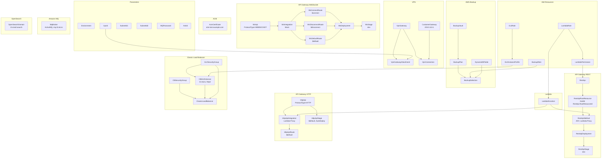
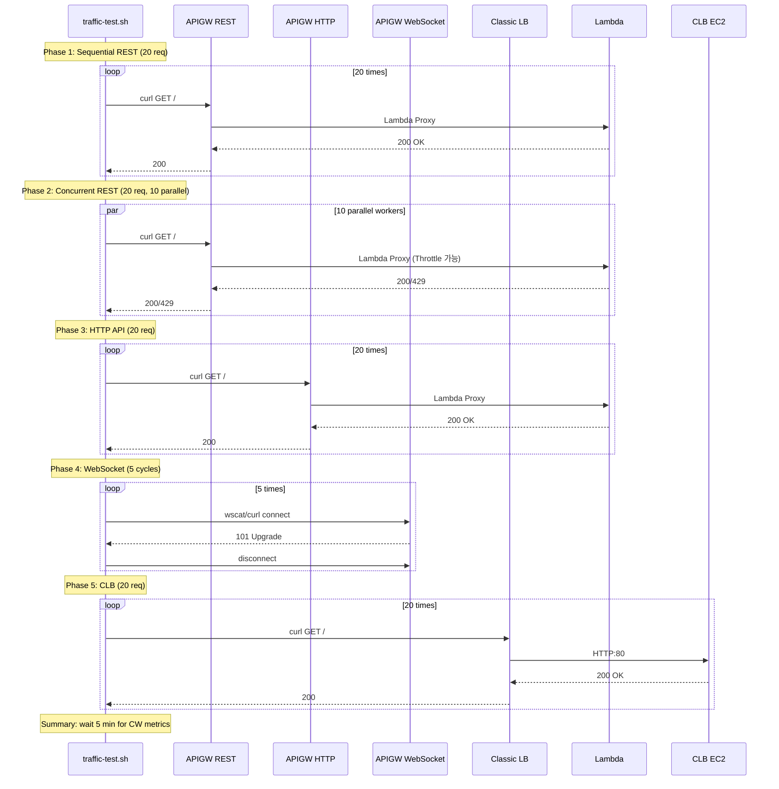

# Design Document: Remaining Resources E2E Test

## Overview

8개 신규 리소스 타입(Lambda, VPN, API Gateway REST/HTTP/WebSocket, ACM, AWS Backup, Amazon MQ, CLB, OpenSearch)의 알람 자동 생성을 검증하기 위한 독립 CloudFormation 스택과 트래픽 테스트 스크립트를 설계한다.

이 스펙은 인프라 코드(CloudFormation 템플릿 + bash 스크립트)이며, Python 애플리케이션이 아니다.

주요 설계 결정:

- **독립 스택**: 기존 `infra-test/e2e-all-resources/` 스택과 분리하여 `infra-test/remaining-resources-test/`에 배치. 기존 스택의 RDS/Aurora/DocDB/ALB/NLB/ElastiCache/NAT/EC2 리소스와 충돌 없이 독립 배포·삭제 가능.
- **Lambda 인라인 코드**: APIGW REST/HTTP 통합 백엔드로 사용되는 Lambda 함수는 `ZipFile` 인라인 코드로 작성. 별도 S3 패키징 불필요. 단순 HTTP 200 JSON 응답 핸들러.
- **APIGW REST**: Lambda 프록시 통합, ANY 메서드, root 리소스(`/`). `AWS::ApiGateway::Deployment` + `AWS::ApiGateway::Stage`(dev)로 배포.
- **APIGW HTTP**: Lambda 프록시 통합, `$default` 스테이지 auto-deploy. `AWS::ApiGatewayV2::Api` + `Integration` + `Route` + `Stage`.
- **APIGW WebSocket**: Mock 통합, `$connect`/`$disconnect`/`$default` 라우트. `AWS::ApiGatewayV2::Api`(ProtocolType=WEBSOCKET) + `Integration` + `Route` + `Deployment` + `Stage`.
- **VPN**: 더미 Customer Gateway IP `203.0.113.1` (RFC 5737 TEST-NET-3). `ipsec.1` 타입. 실제 터널 연결 불필요 — TunnelState 메트릭은 자동 발행.
- **ACM**: DNS 검증, 테스트 도메인 `e2e-test.example.com`. PENDING_VALIDATION 상태 유지 — DaysToExpiry 메트릭은 ISSUED 상태에서만 발행되므로 알람 정의 등록 검증 목적.
- **Backup**: DynamoDB 테이블을 백업 대상으로 사용 (가장 단순한 리소스). 일일 백업 스케줄.
- **MQ**: ActiveMQ SINGLE_INSTANCE, mq.t3.micro. PubliclyAccessible=true (테스트 편의).
- **CLB**: 신규 t3.micro EC2 인스턴스에 httpd 설치, internet-facing CLB. 기존 스택의 EC2와 독립.
- **OpenSearch**: t3.small.search 단일 노드, 전용 마스터 없음, EBS gp3 10GB. 오픈 접근 정책 (테스트용).

## Architecture

### CloudFormation 리소스 의존성 그래프



### 트래픽 테스트 스크립트 실행 흐름



## Components and Interfaces

### 1. CloudFormation 템플릿 (`infra-test/remaining-resources-test/template.yaml`)

#### Parameters

| 파라미터 | 타입 | 기본값 | 설명 |
|----------|------|--------|------|
| Environment | String | dev | 리소스 네이밍 접두사 |
| VpcId | AWS::EC2::VPC::Id | - | VPN Gateway 연결 대상 VPC |
| SubnetId1 | AWS::EC2::Subnet::Id | - | CLB/EC2 배치 서브넷 (AZ-a, public) |
| SubnetId2 | AWS::EC2::Subnet::Id | - | CLB 배치 서브넷 (AZ-b, public) |
| MQPassword | String (NoEcho) | - | MQ 브로커 관리자 비밀번호 |
| AmiId | AWS::EC2::Image::Id | - | Amazon Linux 2023 AMI ID |

#### 리소스 구성 (총 ~30개 리소스)

**IAM Resources (3)**
- `LambdaRole`: Lambda 기본 실행 역할 (`AWSLambdaBasicExecutionRole`)
- `BackupRole`: AWS Backup 서비스 역할 (`AWSBackupServiceRolePolicyForBackup`)
- `Ec2Role` + `Ec2InstanceProfile`: CLB 타겟 EC2용 역할 (SSM 접근)

**Lambda (2)**
- `LambdaFunction`: Python 3.12, 인라인 핸들러, `ReservedConcurrentExecutions=2`
- `LambdaPermission`: APIGW → Lambda 호출 허용

Lambda 인라인 코드:
```python
def handler(event, context):
    return {"statusCode": 200, "body": '{"status":"ok"}'}
```

**API Gateway REST (5)**
- `RestApi`: REST API 리소스
- `RestApiMethod`: ANY 메서드, Lambda 프록시 통합 (root 리소스)
- `RestApiDeployment`: API 배포 (DependsOn: RestApiMethod)
- `RestApiStage`: dev 스테이지
- (LambdaPermission은 IAM에서 공유)

**API Gateway HTTP (4)**
- `HttpApi`: HTTP API (ProtocolType=HTTP)
- `HttpApiIntegration`: Lambda 프록시 통합 (AWS_PROXY, payloadFormatVersion=2.0)
- `HttpApiRoute`: `$default` 라우트
- `HttpApiStage`: `$default` 스테이지 (AutoDeploy=true)

**API Gateway WebSocket (6)**
- `WsApi`: WebSocket API (ProtocolType=WEBSOCKET, RouteSelectionExpression=$request.body.action)
- `WsIntegration`: Mock 통합 (Type=MOCK, RequestTemplates: {"statusCode":200})
- `WsConnectRoute`: `$connect` 라우트
- `WsDisconnectRoute`: `$disconnect` 라우트
- `WsDefaultRoute`: `$default` 라우트
- `WsDeployment` + `WsStage`: dev 스테이지

**VPN (4)**
- `VpnGateway`: Virtual Private Gateway (Type=ipsec.1)
- `VpnGatewayAttachment`: VPC 연결
- `CustomerGateway`: 더미 IP 203.0.113.1 (TEST-NET-3), Type=ipsec.1, BgpAsn=65000
- `VpnConnection`: Site-to-Site VPN (StaticRoutesOnly=true)

**ACM (1)**
- `AcmCertificate`: DNS 검증, DomainName=e2e-test.example.com

**AWS Backup (5)**
- `BackupVault`: 백업 볼트
- `BackupPlan`: 일일 백업 규칙 (cron(0 5 ? * * *), DeleteAfterDays=1)
- `BackupSelection`: DynamoDB 테이블 선택
- `DynamoDBTable`: PAY_PER_REQUEST, 단순 파티션 키
- `BackupRole`: IAM 역할

**Amazon MQ (1)**
- `MqBroker`: ActiveMQ, SINGLE_INSTANCE, mq.t3.micro, PubliclyAccessible=true

**CLB (4)**
- `ClbSecurityGroup`: HTTP:80 인바운드 (0.0.0.0/0)
- `Ec2SecurityGroup`: CLB SG로부터 HTTP:80 인바운드 + 전체 아웃바운드
- `ClbEc2Instance`: t3.micro, httpd UserData
- `ClassicLoadBalancer`: internet-facing, HTTP:80 리스너, Health Check HTTP:80:/

**OpenSearch (1)**
- `OpenSearchDomain`: t3.small.search, 단일 노드, EBS gp3 10GB, 오픈 접근 정책

#### Outputs

| Output | 값 | 용도 |
|--------|---|------|
| LambdaFunctionName | !Ref LambdaFunction | 알람 검증 |
| RestApiUrl | `https://${RestApi}.execute-api.${AWS::Region}.amazonaws.com/dev` | 트래픽 스크립트 인자 |
| HttpApiUrl | !GetAtt HttpApi.ApiEndpoint | 트래픽 스크립트 인자 |
| WsApiUrl | `wss://${WsApi}.execute-api.${AWS::Region}.amazonaws.com/dev` | 트래픽 스크립트 인자 |
| VpnConnectionId | !Ref VpnConnection | 알람 검증 |
| AcmCertificateArn | !Ref AcmCertificate | 알람 검증 |
| BackupVaultName | !Ref BackupVault | 알람 검증 |
| MqBrokerId | !Ref MqBroker | 알람 검증 |
| MqBrokerName | !GetAtt MqBroker.BrokerName | 알람 검증 |
| ClbDnsName | !GetAtt ClassicLoadBalancer.DNSName | 트래픽 스크립트 인자 |
| ClbName | !Ref ClassicLoadBalancer | 알람 검증 |
| OpenSearchDomainName | !Ref OpenSearchDomain | 알람 검증 |
| OpenSearchEndpoint | !GetAtt OpenSearchDomain.DomainEndpoint | 알람 검증 |
| ExpectedAlarms | 리소스별 예상 알람 수 (~35개) | 검증 기준 |

### 2. 트래픽 테스트 스크립트 (`infra-test/remaining-resources-test/traffic-test.sh`)

#### 인터페이스

```bash
Usage: ./traffic-test.sh <REST_API_URL> <HTTP_API_URL> <WS_API_URL> <CLB_DNS>
```

4개 인자 모두 필수. 누락 시 usage 출력 후 종료.

#### 실행 단계

| Phase | 대상 | 요청 수 | 방식 | 발생 메트릭 |
|-------|------|---------|------|-------------|
| 1 | REST API | 20 | 순차 curl | Lambda Duration, APIGW Latency/4XX/5XX |
| 2 | REST API | 20 | 동시 (xargs -P 10) | Lambda Throttles, ConcurrentExecutions |
| 3 | HTTP API | 20 | 순차 curl | HTTP API Latency/4xx/5xx |
| 4 | WebSocket | 5 cycles | curl upgrade 또는 wscat | ConnectCount, MessageCount |
| 5 | CLB | 20 | 순차 curl | CLB RequestCount, HealthyHost |
| Summary | - | - | sleep 300 | CloudWatch 메트릭 수집 대기 |

#### WebSocket 연결 방식

wscat이 설치되어 있으면 wscat 사용, 없으면 curl로 WebSocket upgrade 시도:

```bash
if command -v wscat &>/dev/null; then
    wscat -c "$WS_URL" -x '{"action":"test"}' --wait 1
else
    curl -s -o /dev/null -w "%{http_code}" \
        -H "Connection: Upgrade" -H "Upgrade: websocket" \
        -H "Sec-WebSocket-Version: 13" \
        -H "Sec-WebSocket-Key: $(openssl rand -base64 16)" \
        "$WS_URL_HTTP"
fi
```

#### 트래픽 미전송 리소스

VPN, ACM, MQ, OpenSearch, Backup은 AWS가 자동으로 메트릭을 발행하므로 트래픽 스크립트에서 제외:
- VPN: TunnelState는 VPN 연결 존재만으로 자동 발행
- ACM: DaysToExpiry는 ISSUED 인증서에 대해 자동 발행
- MQ: CpuUtilization/HeapUsage 등은 브로커 실행 중 자동 발행
- OpenSearch: ClusterStatus/CPU 등은 도메인 활성 상태에서 자동 발행
- Backup: BackupJobsFailed/Aborted는 백업 실행 시 자동 발행

## Data Models

### CloudFormation 리소스 태그 구조

모든 모니터링 대상 리소스에 공통 적용:

```yaml
Tags:
  - Key: Monitoring
    Value: 'on'
  - Key: Name
    Value: !Sub '${Environment}-e2e-<resource-suffix>'
```

### 예상 알람 매핑 (Daily Monitor 실행 후)

| 리소스 타입 | 리소스 수 | 알람/리소스 | 총 알람 | 알람 메트릭 |
|-------------|-----------|-------------|---------|-------------|
| Lambda | 1 | 2 | 2 | Duration, Errors |
| VPN | 1 | 1 | 1 | TunnelState |
| APIGW REST | 1 | 3 | 3 | ApiLatency, Api4XXError, Api5XXError |
| APIGW HTTP | 1 | 3 | 3 | ApiLatency, Api4xx, Api5xx |
| APIGW WebSocket | 1 | 4 | 4 | WsConnectCount, WsMessageCount, WsIntegrationError, WsExecutionError |
| ACM | 1 | 1 | 1 | DaysToExpiry |
| Backup | 1 | 2 | 2 | BackupJobsFailed, BackupJobsAborted |
| MQ | 1 | 4 | 4 | MqCPU, HeapUsage, JobSchedulerStoreUsage, StoreUsage |
| CLB | 1 | 7 | 7 | CLBUnHealthyHost, CLB5XX, CLB4XX, CLBBackend5XX, CLBBackend4XX, SurgeQueueLength, SpilloverCount |
| OpenSearch | 1 | 8 | 8 | ClusterStatusRed, ClusterStatusYellow, OSFreeStorageSpace, ClusterIndexWritesBlocked, OsCPU, JVMMemoryPressure, MasterCPU, MasterJVMMemoryPressure |
| **합계** | **10** | - | **~35** | - |


### 비용 모델

| 리소스 | 시간당 비용 (ap-northeast-2) | 비고 |
|--------|------------------------------|------|
| MQ mq.t3.micro | ~$0.034 | 가장 비싼 리소스 |
| OpenSearch t3.small.search | ~$0.043 | EBS gp3 10GB 포함 |
| EC2 t3.micro (CLB 타겟) | ~$0.013 | |
| VPN Connection | ~$0.05 | 시간당 고정 |
| CLB | ~$0.028 | |
| Lambda/APIGW/ACM/Backup/DDB | ~$0.00 | 프리티어 또는 무시 가능 |
| **합계** | **~$0.17/hr** | 테스트 직후 즉시 삭제 |

## Correctness Properties

*A property is a characteristic or behavior that should hold true across all valid executions of a system — essentially, a formal statement about what the system should do. Properties serve as the bridge between human-readable specifications and machine-verifiable correctness guarantees.*

이 스펙은 인프라 코드(CloudFormation 템플릿 + bash 스크립트)로 구성되며, 모든 acceptance criteria가 CloudFormation 리소스 속성 검증 또는 실제 AWS 인프라에 대한 통합 테스트에 해당한다. 따라서 property-based testing으로 검증 가능한 correctness property가 없다.

검증은 다음 방식으로 수행한다:
1. **CloudFormation 배포 성공**: 스택 배포가 `CREATE_COMPLETE` 상태에 도달하면 모든 리소스 생성 요구사항이 충족된 것으로 간주
2. **트래픽 스크립트 실행**: HTTP 200 응답 확인으로 엔드포인트 정상 동작 검증
3. **Daily Monitor 실행 후 알람 수 확인**: 예상 ~35개 알람이 생성되었는지 수동 검증

No testable properties.

## Error Handling

### CloudFormation 배포 실패 시나리오

| 실패 원인 | 증상 | 대응 |
|-----------|------|------|
| VPC/서브넷 파라미터 오류 | ROLLBACK_COMPLETE | 올바른 VPC/서브넷 ID 확인 |
| MQ 비밀번호 정책 미충족 | MqBroker CREATE_FAILED | 8자 이상, 영문+숫자+특수문자 포함 |
| OpenSearch 도메인명 중복 | OpenSearchDomain CREATE_FAILED | 기존 도메인 삭제 후 재배포 |
| Lambda 함수명 중복 | LambdaFunction CREATE_FAILED | Environment 파라미터 변경 |
| VPN Gateway 연결 실패 | VpnGatewayAttachment CREATE_FAILED | VPC에 기존 VGW 연결 확인 |
| 서비스 한도 초과 | 해당 리소스 CREATE_FAILED | AWS Support에 한도 증가 요청 |

### 트래픽 스크립트 에러 처리

| 상황 | 처리 |
|------|------|
| 인자 누락 | usage 출력 후 exit 1 |
| curl 요청 실패 (비정상 HTTP 코드) | HTTP 상태 코드 출력, 스크립트 계속 진행 |
| wscat 미설치 | curl fallback으로 WebSocket upgrade 시도 |
| WebSocket curl fallback 실패 | 경고 메시지 출력, 스크립트 계속 진행 |

### 리소스별 주의사항

- **ACM**: PENDING_VALIDATION 상태는 정상. DNS 검증 레코드를 생성하지 않으므로 ISSUED로 전환되지 않음. DaysToExpiry 메트릭은 ISSUED 상태에서만 발행되므로, 이 E2E 테스트에서는 알람 정의 등록만 검증.
- **VPN**: 실제 터널이 연결되지 않으므로 TunnelState=0 (down). `treat_missing_data=breaching` 설정으로 알람이 ALARM 상태로 전환될 수 있음 — 이는 정상 동작.
- **OpenSearch**: 도메인 생성에 10~15분 소요. 스택 배포 시간이 길어질 수 있음.
- **MQ**: 브로커 생성에 5~10분 소요.

## Testing Strategy

### 검증 방법

이 스펙은 인프라 코드이므로 단위 테스트나 property-based testing 대신 수동 통합 테스트로 검증한다.

#### 1단계: CloudFormation 배포

```bash
aws cloudformation create-stack \
  --stack-name dev-e2e-remaining \
  --template-body file://infra-test/remaining-resources-test/template.yaml \
  --parameters \
    ParameterKey=VpcId,ParameterValue=vpc-xxx \
    ParameterKey=SubnetId1,ParameterValue=subnet-xxx \
    ParameterKey=SubnetId2,ParameterValue=subnet-yyy \
    ParameterKey=MQPassword,ParameterValue='TestPass123!' \
    ParameterKey=AmiId,ParameterValue=ami-xxx \
  --capabilities CAPABILITY_NAMED_IAM \
  --region ap-northeast-2

# 배포 완료 대기 (15~20분)
aws cloudformation wait stack-create-complete --stack-name dev-e2e-remaining
```

#### 2단계: 트래픽 생성

```bash
# Outputs에서 URL 추출
REST_URL=$(aws cloudformation describe-stacks --stack-name dev-e2e-remaining \
  --query 'Stacks[0].Outputs[?OutputKey==`RestApiUrl`].OutputValue' --output text)
HTTP_URL=$(aws cloudformation describe-stacks --stack-name dev-e2e-remaining \
  --query 'Stacks[0].Outputs[?OutputKey==`HttpApiUrl`].OutputValue' --output text)
WS_URL=$(aws cloudformation describe-stacks --stack-name dev-e2e-remaining \
  --query 'Stacks[0].Outputs[?OutputKey==`WsApiUrl`].OutputValue' --output text)
CLB_DNS=$(aws cloudformation describe-stacks --stack-name dev-e2e-remaining \
  --query 'Stacks[0].Outputs[?OutputKey==`ClbDnsName`].OutputValue' --output text)

./infra-test/remaining-resources-test/traffic-test.sh "$REST_URL" "$HTTP_URL" "$WS_URL" "$CLB_DNS"
```

#### 3단계: Daily Monitor 실행 및 알람 검증

```bash
# Daily Monitor Lambda 수동 실행
aws lambda invoke --function-name dev-daily-monitor \
  --payload '{}' /dev/null --region ap-northeast-2

# 생성된 알람 수 확인
aws cloudwatch describe-alarms \
  --alarm-name-prefix "dev-" \
  --query 'MetricAlarms[?contains(AlarmName, `e2e-remaining`)] | length(@)' \
  --output text
```

#### 4단계: 스택 삭제

```bash
aws cloudformation delete-stack --stack-name dev-e2e-remaining
aws cloudformation wait stack-delete-complete --stack-name dev-e2e-remaining
```

### 검증 체크리스트

- [ ] 스택 배포 `CREATE_COMPLETE` 도달
- [ ] REST API URL에 curl 요청 시 200 응답
- [ ] HTTP API URL에 curl 요청 시 200 응답
- [ ] WebSocket URL에 연결 시도 성공
- [ ] CLB DNS에 curl 요청 시 200 응답
- [ ] Daily Monitor 실행 후 ~35개 알람 생성 확인
- [ ] 각 리소스 타입별 예상 알람 메트릭 일치 확인
- [ ] 스택 삭제 `DELETE_COMPLETE` 도달
