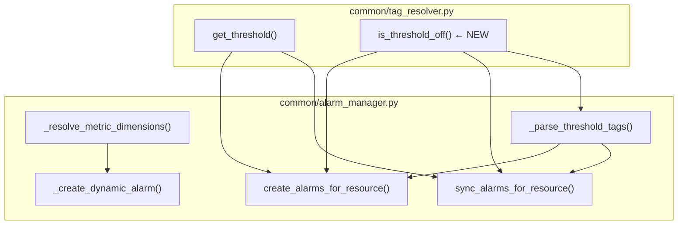

# Design Document: Tag-Driven Alarm Engine

## Overview

이 설계는 AWS Monitoring Engine의 태그 기반 알람 엔진에 대한 3가지 핵심 개선사항을 다룬다:

1. **디멘션 필터링 개선**: `_resolve_metric_dimensions()`에서 `list_metrics` API가 여러 디멘션 조합을 반환할 때, Primary_Dimension_Key만 포함된 조합을 우선 선택하고 AvailabilityZone 디멘션을 기본 제외하여 불필요한 AZ별 알람 생성을 방지한다.

2. **Threshold_*=off 지원**: `Threshold_{MetricName}=off` 태그로 하드코딩/동적 알람 모두 비활성화할 수 있게 하고, 기존 알람을 자동 삭제한다. `tag_resolver.py`에 `is_threshold_off()` 함수를 추가하여 off 상태를 명확히 판별한다.

3. **Sync 경로 동적 알람 지원**: `sync_alarms_for_resource()`에서 동적 태그 알람의 생성/삭제/업데이트를 지원하여, Daily Monitor 실행 시 동적 알람이 누락되거나 잔존하지 않도록 한다.

### 설계 원칙

- 기존 코드 구조(`alarm_manager.py`, `tag_resolver.py`)를 최대한 유지하며 최소 변경으로 구현
- 하위 호환성 보장: 태그 없는 리소스는 기존 동작(하드코딩 기본값 생성) 유지
- `off`는 명시적 비활성화 의도를 표현하는 값으로, 태그 미설정과 구분

## Architecture

### 변경 대상 모듈



### 변경 흐름 요약

1. **tag_resolver.py**
   - `is_threshold_off(resource_tags, metric_name)` 추가: 대소문자 무관 `off` 판별
   - `get_threshold()` 수정: off 값일 때 폴백하지 않고 sentinel 반환 또는 호출자가 `is_threshold_off()`로 사전 체크

2. **alarm_manager.py — 디멘션 필터링**
   - `_resolve_metric_dimensions()` 수정: `list_metrics` 결과에서 최적 디멘션 조합 선택 로직 추가

3. **alarm_manager.py — off 지원**
   - `_parse_threshold_tags()` 수정: `off` 값 메트릭 제외
   - `create_alarms_for_resource()` 수정: 하드코딩 알람 생성 전 off 체크
   - `_create_disk_alarms()` 수정: Disk 경로별 off 체크

4. **alarm_manager.py — sync 동적 알람**
   - `sync_alarms_for_resource()` 수정: 동적 알람 생성/삭제/업데이트 로직 추가

## Components and Interfaces

### 1. `is_threshold_off()` — 신규 함수 (tag_resolver.py)

```python
def is_threshold_off(resource_tags: dict, metric_name: str) -> bool:
    """Threshold_{metric_name} 태그 값이 'off'(대소문자 무관)인지 판별."""
```

- 입력: `resource_tags` (리소스 태그 딕셔너리), `metric_name` (메트릭 이름)
- 출력: `bool` — off이면 `True`
- 동작: `resource_tags.get(f"Threshold_{metric_name}", "").strip().lower() == "off"`

### 2. `get_threshold()` 수정 (tag_resolver.py)

현재 `get_threshold()`는 태그 값이 숫자가 아니면 환경변수/하드코딩으로 폴백한다. `off` 문자열도 `float()` 변환 실패로 폴백되는 구조.

설계 결정: `get_threshold()` 자체는 변경하지 않는다. 호출자가 `is_threshold_off()`로 사전 체크하는 패턴을 사용한다.

이유:
- `get_threshold()`의 계약은 "항상 양의 숫자를 반환"이며, 이를 깨면 모든 호출 지점에 영향
- `is_threshold_off()` 사전 체크 패턴이 명시적이고 안전

### 3. `_resolve_metric_dimensions()` 수정 (alarm_manager.py)

현재: `list_metrics` 결과의 첫 번째 메트릭(`metrics[0]`)의 디멘션을 그대로 사용.

변경: 최적 디멘션 조합 선택 로직 추가.

```python
def _select_best_dimensions(
    metrics: list[dict],
    primary_dim_key: str,
) -> list[dict]:
    """list_metrics 결과에서 최적 디멘션 조합 선택.

    우선순위:
    1. Primary_Dimension_Key만 포함된 조합
    2. AZ 미포함 + 디멘션 수 최소
    3. 디멘션 수 최소 (AZ 포함 허용)
    """
```

### 4. `_parse_threshold_tags()` 수정 (alarm_manager.py)

현재: 하드코딩 목록에 없는 `Threshold_*` 태그만 추출, 값은 양의 숫자만 허용.

변경: `off` 값(대소문자 무관)인 태그를 결과에서 제외 (기존 `float()` 변환 실패로 이미 스킵되지만, 명시적 처리 추가).

### 5. `create_alarms_for_resource()` 수정 (alarm_manager.py)

하드코딩 알람 생성 루프에서 각 메트릭에 대해 `is_threshold_off()` 체크 추가:
- off이면 해당 메트릭 알람 생성 스킵
- Disk 계열: 경로별 `Threshold_Disk_{suffix}=off` 체크

### 6. `sync_alarms_for_resource()` 수정 (alarm_manager.py)

동적 알람 동기화 로직 추가:

```
기존 동적 알람 (메타데이터에서 metric_key가 하드코딩 목록에 없는 것)
  ∩ 현재 Threshold_* 태그 → 임계치 비교 → updated / ok
  - 현재 Threshold_* 태그 → 삭제 (deleted)
현재 Threshold_* 태그 - 기존 동적 알람 → 신규 생성 (created)
```

하드코딩 알람 off 처리:
- `is_threshold_off()` 체크 → 기존 알람 삭제, `deleted` 목록에 추가

sync 결과에 `deleted` 키 추가: `{"created": [], "updated": [], "ok": [], "deleted": []}`

## Data Models

### 기존 데이터 모델 (변경 없음)

| 모델 | 위치 | 설명 |
|------|------|------|
| `ResourceInfo` | `common/__init__.py` | 수집된 리소스 정보 (id, type, tags, region) |
| `HARDCODED_DEFAULTS` | `common/__init__.py` | 메트릭별 기본 임계치 |
| `_DIMENSION_KEY_MAP` | `alarm_manager.py` | 리소스 유형별 Primary Dimension Key |
| `_HARDCODED_METRIC_KEYS` | `alarm_manager.py` | 리소스 유형별 하드코딩 메트릭 키 집합 |

### sync 결과 딕셔너리 확장

```python
# 기존
{"created": list[str], "updated": list[str], "ok": list[str]}

# 변경 후
{"created": list[str], "updated": list[str], "ok": list[str], "deleted": list[str]}
```

### 디멘션 선택 우선순위 (신규 로직)

| 우선순위 | 조건 | 예시 |
|---------|------|------|
| 1 | Primary_Dimension_Key만 포함 | `[{InstanceId: i-xxx}]` |
| 2 | AZ 미포함 + 디멘션 수 최소 | `[{InstanceId: i-xxx}, {device: xvda}]` |
| 3 | 디멘션 수 최소 (AZ 포함 허용) | `[{InstanceId: i-xxx}, {AvailabilityZone: us-east-1a}]` |


## Correctness Properties

*A property is a characteristic or behavior that should hold true across all valid executions of a system — essentially, a formal statement about what the system should do. Properties serve as the bridge between human-readable specifications and machine-verifiable correctness guarantees.*

### Property 1: 디멘션 선택 우선순위

*For any* `list_metrics` 결과 리스트와 primary_dim_key에 대해, `_select_best_dimensions()`는 다음 우선순위를 만족하는 디멘션 조합을 반환해야 한다:
- primary_dim_key만 포함된 조합이 존재하면 반드시 그것을 선택
- 그렇지 않으면 AvailabilityZone 미포함 조합 중 디멘션 수가 최소인 것을 선택
- AZ 미포함 조합이 없으면 디멘션 수가 최소인 것을 선택 (AZ 포함 허용)

**Validates: Requirements 1.1, 1.2, 1.3, 1.4, 1.5**

### Property 2: off 태그 파싱 제외

*For any* 리소스 태그 딕셔너리와 리소스 타입에 대해, `_parse_threshold_tags()` 결과에는 값이 `off`(대소문자 무관)인 `Threshold_*` 태그의 메트릭이 포함되지 않아야 한다.

**Validates: Requirements 2.1, 2.2**

### Property 3: Create_Path off 메트릭 스킵

*For any* 리소스 타입과 태그 조합에 대해, `Threshold_{MetricName}=off`(대소문자 무관)로 설정된 하드코딩 메트릭은 `create_alarms_for_resource()` 결과에 해당 메트릭의 알람 이름이 포함되지 않아야 한다.

**Validates: Requirements 3.1, 3.3, 4.1**

### Property 4: Sync_Path off 메트릭 삭제

*For any* 리소스에 기존 하드코딩 알람이 존재하고 해당 메트릭의 `Threshold_*=off` 태그가 설정된 경우, `sync_alarms_for_resource()` 결과의 `deleted` 목록에 해당 알람이 포함되어야 한다.

**Validates: Requirements 3.2, 4.2**

### Property 5: Sync_Path 동적 알람 신규 생성

*For any* 리소스에 새로운 동적 `Threshold_*` 태그가 추가되고 해당 메트릭의 기존 알람이 없는 경우, `sync_alarms_for_resource()` 결과의 `created` 목록에 해당 동적 알람 이름이 포함되어야 한다.

**Validates: Requirements 5.1, 5.2**

### Property 6: Sync_Path 동적 알람 삭제

*For any* 리소스에 기존 동적 알람이 존재하고 해당 메트릭의 `Threshold_*` 태그가 제거된 경우, `sync_alarms_for_resource()` 결과의 `deleted` 목록에 해당 동적 알람이 포함되어야 한다.

**Validates: Requirements 6.1, 6.2**

### Property 7: Sync_Path 동적 알람 임계치 동기화

*For any* 리소스에 기존 동적 알람이 존재할 때, 현재 `Threshold_*` 태그 값과 기존 알람 임계치가 다르면 `updated` 목록에, 같으면 `ok` 목록에 해당 알람이 포함되어야 한다.

**Validates: Requirements 7.1, 7.2, 7.3**

### Property 8: is_threshold_off() 정확성

*For any* `off` 문자열의 대소문자 변형(예: `OFF`, `Off`, `oFf`, `off`)에 대해, `is_threshold_off()`는 `True`를 반환해야 하며, 양의 숫자 문자열이나 빈 문자열에 대해서는 `False`를 반환해야 한다.

**Validates: Requirements 8.1, 8.3**

## Error Handling

### 디멘션 필터링

| 상황 | 처리 |
|------|------|
| `list_metrics` API 호출 실패 (`ClientError`) | 기존 동작 유지: `logger.error()` 후 `None` 반환 → 동적 알람 생성 스킵 |
| `list_metrics` 결과가 빈 리스트 | 기존 동작 유지: `logger.warning()` 후 `None` 반환 |
| 모든 디멘션 조합에 AZ 포함 | AZ 포함 조합 중 디멘션 수 최소인 것 선택 (Req 1.5) |

### Threshold_*=off 처리

| 상황 | 처리 |
|------|------|
| `Threshold_CPU=off` (하드코딩 메트릭) | `is_threshold_off()` → `True` → 알람 생성 스킵 |
| `Threshold_CustomMetric=off` (동적 메트릭) | `_parse_threshold_tags()` 결과에서 제외 |
| `Threshold_Disk_root=off` | 해당 경로 Disk 알람 생성 스킵 |
| off 태그 + 기존 알람 존재 (sync 경로) | 기존 알람 삭제 + `deleted` 목록에 추가 |

### Sync 경로 동적 알람

| 상황 | 처리 |
|------|------|
| 동적 알람 생성 시 `_resolve_metric_dimensions()` 실패 | `None` 반환 → 해당 메트릭 스킵, `logger.warning()` |
| 동적 알람 생성 시 `put_metric_alarm` 실패 | `ClientError` catch → `logger.error()`, 다른 알람 처리 계속 |
| 동적 알람 삭제 시 `delete_alarms` 실패 | `ClientError` catch → `logger.error()` |
| 메타데이터 파싱 실패 (레거시 알람) | `_parse_alarm_metadata()` → `None` → `_metric_name_to_key()` 폴백 |

## Testing Strategy

### 테스트 프레임워크

- **단위 테스트**: `pytest` + `moto` (AWS 서비스 모킹)
- **Property-Based Testing**: `hypothesis` (Python PBT 라이브러리)
- 각 property 테스트는 최소 100회 반복 (`@settings(max_examples=100)`)

### 단위 테스트 (tests/test_alarm_manager.py, tests/test_tag_resolver.py)

| 테스트 | 대상 | 유형 |
|--------|------|------|
| `test_select_best_dimensions_primary_only` | `_select_best_dimensions()` | example |
| `test_select_best_dimensions_no_primary_prefers_no_az` | `_select_best_dimensions()` | example |
| `test_select_best_dimensions_all_have_az` | `_select_best_dimensions()` | edge case |
| `test_is_threshold_off_basic` | `is_threshold_off()` | example |
| `test_parse_threshold_tags_off_excluded` | `_parse_threshold_tags()` | example |
| `test_create_alarms_skips_off_metric` | `create_alarms_for_resource()` | integration |
| `test_sync_creates_dynamic_alarm` | `sync_alarms_for_resource()` | integration |
| `test_sync_deletes_orphan_dynamic_alarm` | `sync_alarms_for_resource()` | integration |
| `test_sync_updates_dynamic_alarm_threshold` | `sync_alarms_for_resource()` | integration |
| `test_sync_deletes_off_hardcoded_alarm` | `sync_alarms_for_resource()` | integration |
| `test_off_alarm_deletion_logged` | 알람 삭제 로깅 | example (Req 4.3) |

### Property-Based 테스트

각 correctness property는 단일 PBT 테스트로 구현한다. 테스트 파일: `tests/test_pbt_tag_driven_alarm.py`

| PBT 테스트 | Property | 태그 |
|-----------|----------|------|
| `test_pbt_dimension_selection_priority` | Property 1 | Feature: tag-driven-alarm-engine, Property 1: 디멘션 선택 우선순위 |
| `test_pbt_off_tag_excluded_from_parse` | Property 2 | Feature: tag-driven-alarm-engine, Property 2: off 태그 파싱 제외 |
| `test_pbt_create_path_skips_off_metric` | Property 3 | Feature: tag-driven-alarm-engine, Property 3: Create_Path off 스킵 |
| `test_pbt_sync_deletes_off_hardcoded` | Property 4 | Feature: tag-driven-alarm-engine, Property 4: Sync_Path off 삭제 |
| `test_pbt_sync_creates_dynamic_alarm` | Property 5 | Feature: tag-driven-alarm-engine, Property 5: Sync_Path 동적 알람 생성 |
| `test_pbt_sync_deletes_orphan_dynamic` | Property 6 | Feature: tag-driven-alarm-engine, Property 6: Sync_Path 동적 알람 삭제 |
| `test_pbt_sync_dynamic_threshold_sync` | Property 7 | Feature: tag-driven-alarm-engine, Property 7: Sync_Path 동적 알람 임계치 동기화 |
| `test_pbt_is_threshold_off_accuracy` | Property 8 | Feature: tag-driven-alarm-engine, Property 8: is_threshold_off() 정확성 |

### Hypothesis 전략 (Generators)

- **디멘션 조합 생성기**: `st.lists(st.fixed_dictionaries({"Name": st.text(), "Value": st.text()}))` 기반, primary_dim_key 포함/미포함, AZ 포함/미포함 조합 생성
- **태그 딕셔너리 생성기**: `Threshold_*` 태그를 포함하는 딕셔너리 생성, 값은 양의 숫자 / `off` 변형 / 무효값 혼합
- **리소스 타입 생성기**: `st.sampled_from(["EC2", "RDS", "ALB", "NLB", "TG"])`
- **off 변형 생성기**: `off` 문자열의 모든 대소문자 조합 (`st.text(alphabet="oOfF", min_size=3, max_size=3).filter(lambda s: s.lower() == "off")`)

### 테스트 설정

```python
from hypothesis import given, settings, strategies as st

@settings(max_examples=100)
@given(...)
def test_pbt_xxx(...):
    # Feature: tag-driven-alarm-engine, Property N: ...
    ...
```
